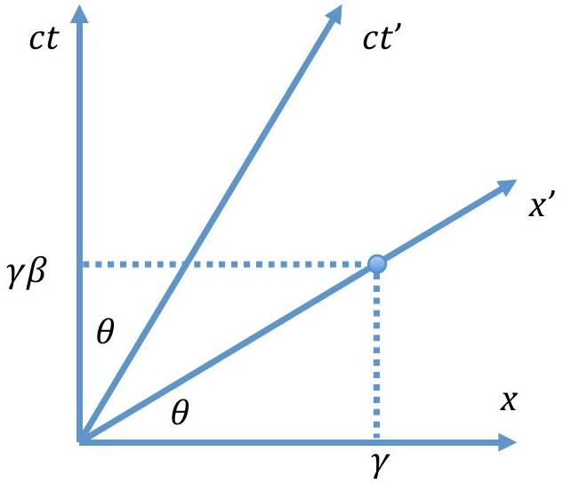
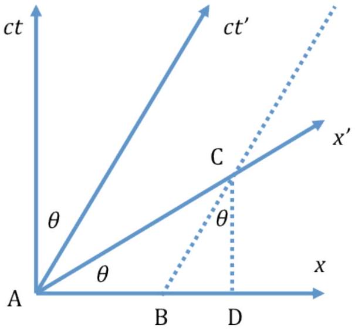

Global Positioning System (GPS) is a navigation technology which uses signal from satellites to determine the position of an object (for example an airplane). However, due to the satellites high speed movement in orbit, there should be a special relativistic correction, and due to their high altitude, there should be a general relativistic correction. Both corrections seem to be small but are very important for precise measurement of position. We will explore both corrections in this problem.

First we will investigate the special relativistic effect on an accelerated particle. We consider two types of frame, the first one is the rest frame (called $S$ or Earth's frame), where the particle is at rest initially. The other is the proper frame (called $S^{\prime}$ ), a frame that instantaneously moves together with the accelerated particle. Note that this is not an accelerated frame, it is a constant velocity frame that at a particular moment has the same velocity with the accelerated particle. At that short moment, the time rate experienced by the particle is the same as the proper frame's time rate. Of course this proper frame is only good for an infinitesimally short time, and then we need to define a new proper frame afterward. At the beginning we synchronize the particle's clock with the clock in the rest frame by setting them to zero, $t=\tau=0$ ( $t$ is the time in the rest frame, and $\tau$ is the time shown by particle's clock).

By applying equivalence principle, we can obtain general relativistic effects from special relavistic results which does not involve complicated metric tensor calculations. By combining the special and general relativistic effects, we can calculate the corrections needed for a GPS (global positioning system) satellite to provide accurate positioning.

Some mathematics formulas that might be useful

- $\sinh x=\frac{e^{x}-e^{-x}}{2}$
- $\cosh x=\frac{e^{x}+e^{-x}}{2}$
- $\tanh x=\frac{\sinh x}{\cosh x}$
- $1+\sinh ^{2} x=\cosh ^{2} x$
- $\sinh (x-y)=\sinh x \cosh y-\cosh x \sinh y$

- $\int \frac{d x}{\left(1-x^{2}\right)^{\frac{3}{2}}}=\frac{x}{\sqrt{1-x^{2}}}+C$
- $\int \frac{d x}{1-x^{2}}=\ln \sqrt{\frac{1+x}{1-x}}+C$

## Part A. Single Accelerated Particle (2.8 points)

Consider a particle with a rest mass $m$ under a constant and uniform force field $F$ (defined in the rest frame) pointing in the positive $x$ direction. Initially ( $t=\tau=0$ ) the particle is at rest at the origin ( $x=0$ ).

1. (0.5 pts) When the velocity of the particle is $v$, calculate the acceleration of the particle, $a$ (with respect to the rest frame).
2. (0.5 pts) Calculate the velocity of the particle $\beta(t)=\frac{v(t)}{c}$ at time $t$ (in rest frame), in terms of $F, m, t$ and $c$.
3. ( $\mathbf{0 . 3 ~ p t s \text { ) Calculate the position of the particle } x ( t ) \text { at time } t \text { , in term of } F , m , t}$ and $c$.
4. (0.7 pts) Show that the proper acceleration of the particle, $a^{\prime} \equiv g=F / m$, is a constant. The proper acceleration is the acceleration of the particle measured in the instantaneous proper frame.
5. (0.4 pts) Calculate the velocity of the particle $\beta(\tau)$, when the time as experienced by the particle is $\tau$. Express the answer in $g, \tau$, and $c$.
6. ( $\mathbf{0 . 4}$ pts) Also calculate the time $t$ in the rest frame in terms of $g, \tau$, and $c$.

## Part B. Flight Time (2.0 points)

The first part has not taken into account the flight time of the information to arrive to the observer. This part is the only part in the whole problem where the flight time is considered. The particle moves as in part A.

1. (1.2 pts) At a certain moment, the time experienced by the particle is $\tau$. What reading $t_{0}$ on a stationary clock located at $x=0$ will be observed by the particle? After a long period of time, does the observed reading $t_{0}$ approach a certain value? If so, what is the value?
2. (0.8 pts) Now consider the opposite point of view. If an observer at the initial point $(x=0)$ is observing the particle's clock when the observer's time

is $t$, what is the reading of the particle's clock $\tau_{0}$ ? After a long period of time, will this reading approach a certain value? If so, what is the value?

## Part C. Minkowski Diagram (1.0 points)

In many occasion, it is very useful to illustrate relativistic events using a diagram, called as Minkowski Diagram. To make the diagram, we just need to use Lorentz transformation between the rest frame S and the moving frame S' that move with velocity $v=\beta c$ with respect to the rest frame.

$$
\begin{aligned}
& x=\gamma\left(x^{\prime}+\beta c t^{\prime}\right) \\
& c t=\gamma\left(c t^{\prime}+\beta x^{\prime}\right) \\
& x^{\prime}=\gamma(x-\beta c t) \\
& c t^{\prime}=\gamma(c t-\beta x) \\
& \gamma=\frac{1}{\sqrt{1-\frac{v^{2}}{c^{2}}}}
\end{aligned}
$$

Let's choose $x$ and $c t$ as the orthogonal axes. A point $\left(x^{\prime}, c t^{\prime}\right)=(1,0)$ in the moving frame S' has a coordinate $(x, c t)=(\gamma, \gamma \beta)$ in the rest frame S. The line connecting this point and the origin defines the $x^{\prime}$ axis. Another point $\left(x^{\prime}, c t^{\prime}\right)=(0,1)$ in the moving frame S' has a coordinate ( $x, c t$ ) $=(\gamma \beta, \gamma$ ) in the rest frame S. The line connecting this point and the origin defines the $c t^{\prime}$ axis. The angle between the $x$ and $\mathrm{x}^{\prime}$ axis is $\theta$, where $\tan \theta=\beta$. A unit length in the moving frame $\mathrm{S}^{\prime}$ is equal to $\gamma \sqrt{1+\beta^{2}}=\sqrt{\frac{1+\beta^{2}}{1-\beta^{2}}}$ in the rest frame S.

To get a better understanding of Minkowski diagram, let us take a look at this example. Consider a stick of proper length $L$ in a moving frame S'. We would like to find the length of the stick in the rest frame S. Consider the figure below.

The stick is represented by the segment AC. The length AC is equal to $\sqrt{\frac{1+\beta^{2}}{1-\beta^{2}}} L$ in the S frame. The stick length in the S frame is represented by the line AB.

$$
\begin{aligned}
\mathrm{AB} & =\mathrm{AD}-\mathrm{BD} \\
& =A C \cos \theta-A C \sin \theta \tan \theta \\
& =L \sqrt{1-\beta^{2}}
\end{aligned}
$$

1. (0.5 pts) Using a Minkowski diagram, calculate the length of a stick with proper length $L$ in the rest frame, as measured in the moving frame.
2. (0.5 pts) Now consider the case in part A. Plot the time $c t$ versus the position $x$ of the particle. Draw the $x^{\prime}$ axis and $c t^{\prime}$ axis when $\frac{g t}{c}=1$ in the same graph using length scale $x\left(c^{2} / g\right)$ and $c t\left(c^{2} / g\right)$.

## Part D. Two Accelerated Particles (2.3 points)

For this part, we will consider two accelerated particles, both of them have the same proper acceleration $g$ in the positive $x$ direction, but the first particle starts from $x=0$, while the second particle starts from $x=L$. Remember, DO NOT consider the flight time in this part.

1. (0.3 pts) After a while, an observer in the rest frame make an observation. The first particle's clock shows time at $\tau_{A}$. What is the reading of the second clock $\tau_{B}$, according to the observer in the rest frame.
2. (1.0 pts) Now consider the observation from the first particle's frame. At a certain moment, an observer that move together with the first particle

observed that the reading of his own clock is $\tau_{1}$. At the same time, he observed the second particle's clock, and the reading is $\tau_{2}$. Show that

$$
\sinh \frac{g}{c}\left(\tau_{2}-\tau_{1}\right)=C_{1} \sinh \frac{g \tau_{1}}{c},
$$

where $C_{1}$ is a constant. Determine $C_{1}$.

3. (1.0 pts) The first particle will see the second particle move away from him. Show that the rate of change of the distance between the two particles according to the first particle is
$$
\frac{d L^{\prime}}{d \tau_{1}}=C_{2} \frac{\sinh \frac{g \tau_{2}}{c}}{\cosh \frac{g}{c}\left(\tau_{2}-\tau_{1}\right)},
$$
where $C_{2}$ is a constant. Determine $C_{2}$.

## Part E. Uniformly Accelerated Frame (2.7 points)

In this part we will arrange the proper acceleration of the particles, so that the distance between both particles are constant according to each particle. Initially both particles are at rest, the first particle is at $x=0$, while the second particle is at $x=L$.

1. (0.8 pts) The first particle has a proper acceleration $g_{1}$ in the positive $x$ direction. When it is being accelerated, there exists a fixed point in the rest frame at $x=x_{\mathrm{p}}$ that has a constant distance from the first particle, according to the first particle thoughout the motion. Determine $x_{\mathrm{p}}$.
2. (1.3 pts) Given the proper acceleration of the first particle is $g_{1}$, determine the proper acceleration of the second particle $g_{2}$, so that the distance between the two particles are constant according to the first particle.
3. (0.6 pts) What is the ratio of time rate of the second particle to the first particle $\frac{d \tau_{2}}{d \tau_{1}}$, according to the first particle.

## Part F. Correction for GPS (2.2 points)

Part E indicates that the time rate of clocks at different altitude will not be the same, even though there is no relative movement between those clocks.

According to the equivalence principle in general relativity, an observer in a small closed room could not tell the difference between a gravity pull $g$ and the fictitious force from accelerated frame with acceleration $g$. So we can conclude that two clocks at different gravitational potential will have different rate.

Now let consider a GPS satellite that orbiting the Earth with a period of 12 hours.

1. (0.6 pts) If the gravitational acceleration on the Earth's surface is $9.78 \mathrm{~m} . \mathrm{s}^{-2}$, and the Earth's radius is 6380 km, what is the radius of the GPS satellite orbit? What is the velocity of the satellite? Calculate the numerical values of the radius and the velocity.
2. (1.2 pts) After one day, the clock reading on the Earth surface and the satellite will differ due to both special and general relativistic effects. Calculate the difference due to each effect for one day. Calculate the total difference for one day. Which clock is faster, a clock on the Earth's surface or the satellite's clock?
3. (0.4 pts) After one day, estimate the error in position due to this effect?
