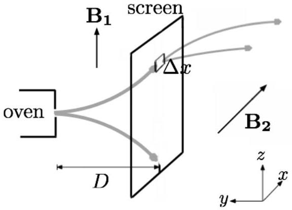

All matters in the universe have fundamental properties called spin, besides their mass and charge. Spin is an intrinsic form of angular momentum carried by particles. Despite the fact that quantum mechanics is needed for a full treatment of spin, we can still study the physics of spin using the usual classical formalism. In this problem, we are investigating the influence of magnetic field on spin using its classical analogue.

The classical torque equation of spin is given by

$$
\boldsymbol{\tau}=\frac{d \boldsymbol{L}}{d t}=\boldsymbol{\mu} \times \boldsymbol{B} .
$$

In this case, the angular momentum $\boldsymbol{L}$ represents the "intrinsic" spin of the particles, $\boldsymbol{\mu}$ is the magnetic moment of the particles, and $\boldsymbol{B}$ is magnetic field. The spin of a particle is associated with a magnetic moment via the equation

$$
\boldsymbol{\mu}=-\gamma \boldsymbol{L}
$$

where $\gamma$ is the gyromagnetic ratio.
In this problem, the term "frequency" means angular frequency (rad/s), which is a scalar quantity. All bold letters represent vectors; otherwise they represent scalars.

## Part A. Larmor precession (1.6 points)

1. (0.8 pts) Prove that the magnitude of magnetic moment $\mu$ is always constant under the influence of a magnetic field $\boldsymbol{B}$. For a special case of stationary (constant) magnetic field, also show that the angle between $\boldsymbol{\mu}$ and $\boldsymbol{B}$ is constant.
(Hint: You can use properties of vector products.)
2. (0.8 pts) A uniform magnetic field $\boldsymbol{B}$ exists and it makes an angle $\phi$ with a particle's magnetic moment $\boldsymbol{\mu}$. Due to the torque by the magnetic field, the magnetic moment $\boldsymbol{\mu}$ rotates around the field $\boldsymbol{B}$, which is also known as Larmor precession. Determine the Larmor precession frequency $\omega_{0}$ of the magnetic moment with respect to $\boldsymbol{B}=B_{0} \boldsymbol{k}$.

## Part B. Rotating frame (3.4 points)

In this section, we choose a rotating frame $S^{\prime}$ as our frame of reference. The rotating frame $S^{\prime}=\left(x^{\prime}, y^{\prime}, z^{\prime}\right)$ rotates with an angular velocity $\omega \boldsymbol{k}$ as seen by an observer in the laboratory frame $S=(x, y, z)$, where the axes $x^{\prime}, y^{\prime}, z^{\prime}$ intersect with $x, y, z$ at time $t=0$. Any vector $\boldsymbol{A}=A_{x} \boldsymbol{i}+A_{y} \boldsymbol{j}+A_{z} \boldsymbol{k}$ in a lab frame can be written as $\boldsymbol{A}=A_{x}{ }^{\prime} \boldsymbol{i}^{\prime}+A_{y}{ }^{\prime} \boldsymbol{j}^{\prime}+A_{z}{ }^{\prime} \boldsymbol{k}^{\prime}$ in the rotating frame $S^{\prime}$. The time derivative of the vector becomes

$$
\frac{d \boldsymbol{A}}{d t}=\left(\frac{d A_{x}^{\prime}}{d t} \boldsymbol{i}^{\prime}+\frac{d A_{y}^{\prime}}{d t} \boldsymbol{j}^{\prime}+\frac{d A_{z}^{\prime}}{d t} \boldsymbol{k}^{\prime}\right)+\left(A_{x}^{\prime} \frac{d \boldsymbol{i}^{\prime}}{d t}+A_{y}^{\prime} \frac{d \boldsymbol{j}^{\prime}}{d t}+A_{z}^{\prime} \frac{d \boldsymbol{k}^{\prime}}{d t}\right)
$$

$$
\left(\frac{d \boldsymbol{A}}{d t}\right)_{l a b}=\left(\frac{d \boldsymbol{A}}{d t}\right)_{r o t}+(\omega \mathbf{k} \times \boldsymbol{A}),
$$

where $\left(\frac{d \boldsymbol{A}}{d t}\right)_{\text {lab }}$ is the time derivative of vector $\boldsymbol{A}$ seen by an observer in the lab frame, and $\left(\frac{d \boldsymbol{A}}{d t}\right)_{\text {rot }}$ is the time derivative seen by an observer in the rotating frame. For all the following problems in this part, the answers are referred to the rotating frame $S^{\prime}$.

1. (0.8 pts) Show that the time evolution of the magnetic moment follows the equation
$$
\left(\frac{d \boldsymbol{\mu}}{d t}\right)_{r o t}=-\gamma \boldsymbol{\mu} \times \boldsymbol{B}_{e f f},
$$
where $\boldsymbol{B}_{\text {eff }}=\boldsymbol{B}-\frac{\omega}{\gamma} \boldsymbol{k}^{\prime}$ is the effective magnetic field.
2. (0.4 pts) For $\boldsymbol{B}=B_{0} \boldsymbol{k}$, what is the new precession frequency $\Delta$ in terms of $\omega_{0}$ and $\omega$ ?
3. (1.2 pts) Now, let us consider the case of a time-varying magnetic field. Besides a constant magnetic field, we also apply a rotating magnetic field $\boldsymbol{b}(t)=b(\cos \omega t \boldsymbol{i}+\sin \omega t \boldsymbol{j})$, so $\boldsymbol{B}=B_{0} \boldsymbol{k}+\boldsymbol{b}(t)$. Show that the new Larmor precession frequency of the magnetic moment is
$$
\Omega=\gamma \sqrt{\left(B_{0}-\frac{\omega}{\gamma}\right)^{2}+b^{2}} .
$$
4. (1.0 pts) Instead of applying the field $\boldsymbol{b}(t)=b(\cos \omega t \boldsymbol{i}+\sin \omega t \boldsymbol{j})$, now we apply $\boldsymbol{b}(t)=b(\cos \omega t \boldsymbol{i}-\sin \omega t \boldsymbol{j})$, which rotates in the opposite direction and hence $\boldsymbol{B}=B_{0} \boldsymbol{k}+b(\cos \omega t \boldsymbol{i}-\sin \omega t \boldsymbol{j})$. What is the effective magnetic field $\boldsymbol{B}_{\text {eff }}$ for this case (in terms of the unit vectors $\boldsymbol{i}^{\prime}, \boldsymbol{j}^{\prime}, \boldsymbol{k}^{\prime}$ )? What is its time average, $\overline{\boldsymbol{B}_{\text {eff }}}$ (recall that $\overline{\cos 2 \pi t / T}=\overline{\sin 2 \pi t / T}=0$ )?

## Part C. Rabi oscillation (3.0 points)

For an ensemble of $N$ particles under the influence of a large magnetic field, the spin can have two quantum states: "up" and "down". Consequently, the total population of spin up $N_{\uparrow}$ and down $N_{\downarrow}$ obeys the equation

$$
N_{\uparrow}+N_{\downarrow}=N .
$$

The difference of spin up population and spin down population yields the macroscopic magnetization along the $z$ axis:

$$
M=\left(N_{\uparrow}-N_{\downarrow}\right) \mu=N \mu_{z} .
$$

In a real experiment, two magnetic fields are usually applied, a large bias field $B_{0} \boldsymbol{k}$ and an oscillating field with amplitude $2 b$ perpendicular to the bias field $\left(b \ll B_{0}\right)$. Initially, only the large bias is applied, causing all the particles lie in the spin up states ( $\boldsymbol{\mu}$ is oriented in the $z$-direction at $t=0$ ). Then, the oscillating field
is turned on, where its frequency $\omega$ is chosen to be in resonance with the Larmor precession frequency $\omega_{0}$, i.e. $\omega=\omega_{0}$. In other words, the total field after time $t=0$ is given by

$$
\boldsymbol{B}(t)=B_{0} \boldsymbol{k}+2 b \cos \omega_{0} t \boldsymbol{i} .
$$

1. (1.2 pts) In the rotating frame $S^{\prime}$, show that the effective field can be approximated by
$$
\boldsymbol{B}_{e f f} \approx b \boldsymbol{i}^{\prime},
$$
which is commonly known as rotating wave approximation. What is the precession frequency $\Omega$ in frame $S^{\prime}$ ?
2. (0.6 pts) Determine the angle $\alpha$ that $\boldsymbol{\mu}$ makes with $\boldsymbol{B}_{\text {eff }}$. Also, prove that the magnetization varies with time as
$$
M(t)=N \mu(\cos \Omega t) .
$$
3. (1.2 pts) Under the application of magnetic field described above, determine the fractional population of each spin up $P_{\uparrow}=N_{\uparrow} / N$ and spin down $P_{\downarrow}=N_{\downarrow} / N$ as a function of time. Plot $P_{\uparrow}(t)$ and $P_{\downarrow}(t)$ on the same graph vs. time $t$. The alternating spin up and spin down population as a function of time is called Rabi oscillation.

## Part D. Measurement incompatibility ( 2.0 points)

Spin is in fact a vector quantity; but due to its quantum properties, we cannot measure each of its components simultaneously (i.e. we can know both $|\boldsymbol{\mu}|$ and $\mu_{z}$ as in above problems; but not all $|\boldsymbol{\mu}|, \mu_{x}, \mu_{y}$, and $\mu_{z}$ simultaneously). In this problem, we will do a calculation based on the Heisenberg uncertainty principle (using the relation $\Delta p_{q} \Delta q \geq \hbar$ ) to show how these measurements are incompatible with each other.

1. (1.0 pts) Let us consider an oven source of silver atoms, which has a small opening. The atoms stream out of the opening along $-y$ direction (see Figure below) and experience a spatial varying field $\boldsymbol{B}_{1}$. The field $\boldsymbol{B}_{1}$ has strong bias field component in the $z$ direction, where the atoms with different magnetic moment $\mu_{z}= \pm \gamma \hbar$ are split in the $z$ direction. At a distance $D$ from the oven source, a screen $S C_{1}$ is put to allow only spin up atoms to pass (blocking spin down atoms). Thus, at the instant after passing the screen, the atoms are prepared in spin up states. After the screen, the atoms enter a region of nonhomogenous field $\boldsymbol{B}_{2}$ where the atoms feel a force
$$
F_{x}=\mu_{x} C .
$$
The field $\boldsymbol{B}_{2}$ has strong bias field component in the $x$ direction, where the atoms have magnetic moment $\mu_{x}= \pm \gamma \hbar$.

In order to determine $\mu_{x}$ by observing the splitting in $x$ direction, show that the following condition must be fulfilled:

$$
\frac{1}{\hbar}\left|\mu_{x}\right| \Delta x C t \gg 1,
$$

where $t$ is the duration after leaving the screen $S C_{1}$ and $\Delta x$ is the opening width on $S C_{1}$.

2. (1.0 pts) The atoms are initially prepared in the spin up states right after leaving the screen, where $\mu_{z}=\gamma \hbar=\left|\mu_{x}\right|$. This means the atoms will precess at rates covering a range of values $\Delta \omega$ with respect to the $x$ component of $\boldsymbol{B}_{2}$, specifically $B_{2 x}=B_{0}+C x$. Prove that the spread in the precession angle $\Delta \omega t$ is so large and hence we cannot measure both $\mu_{x}$ and $\mu_{z}$ simultaneously. In other words, the measurement of $\mu_{x}$ destroys the information on $\mu_{z}$.
