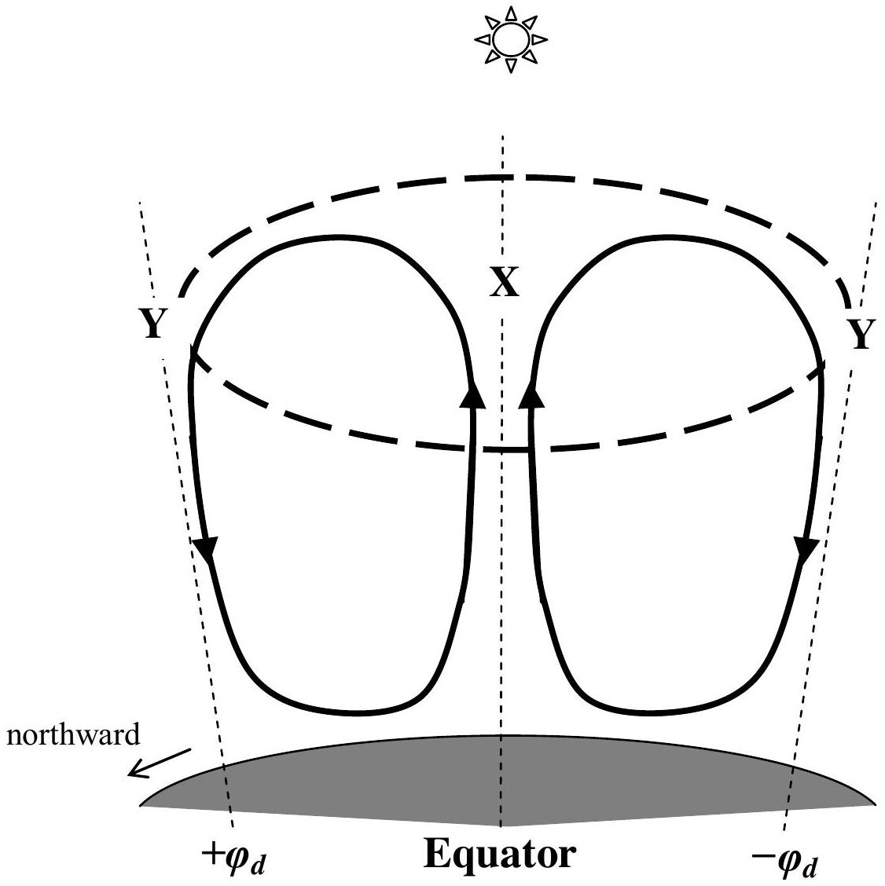
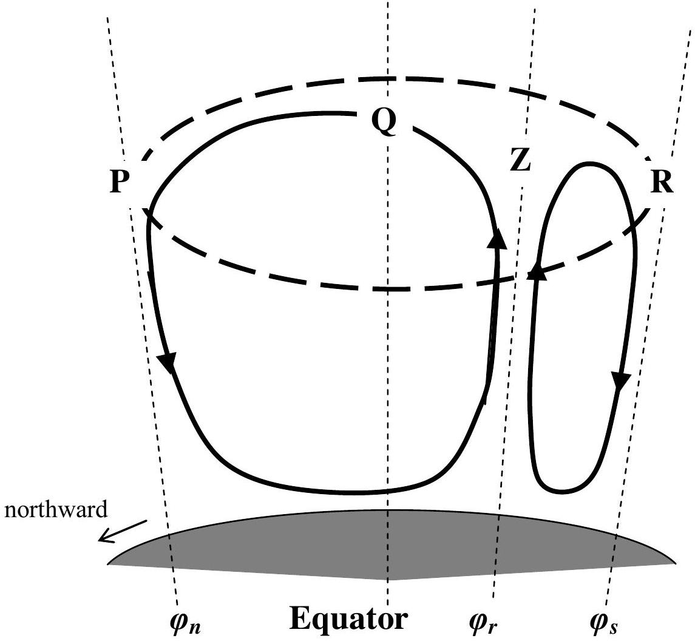
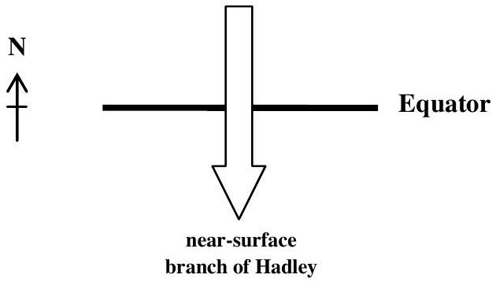
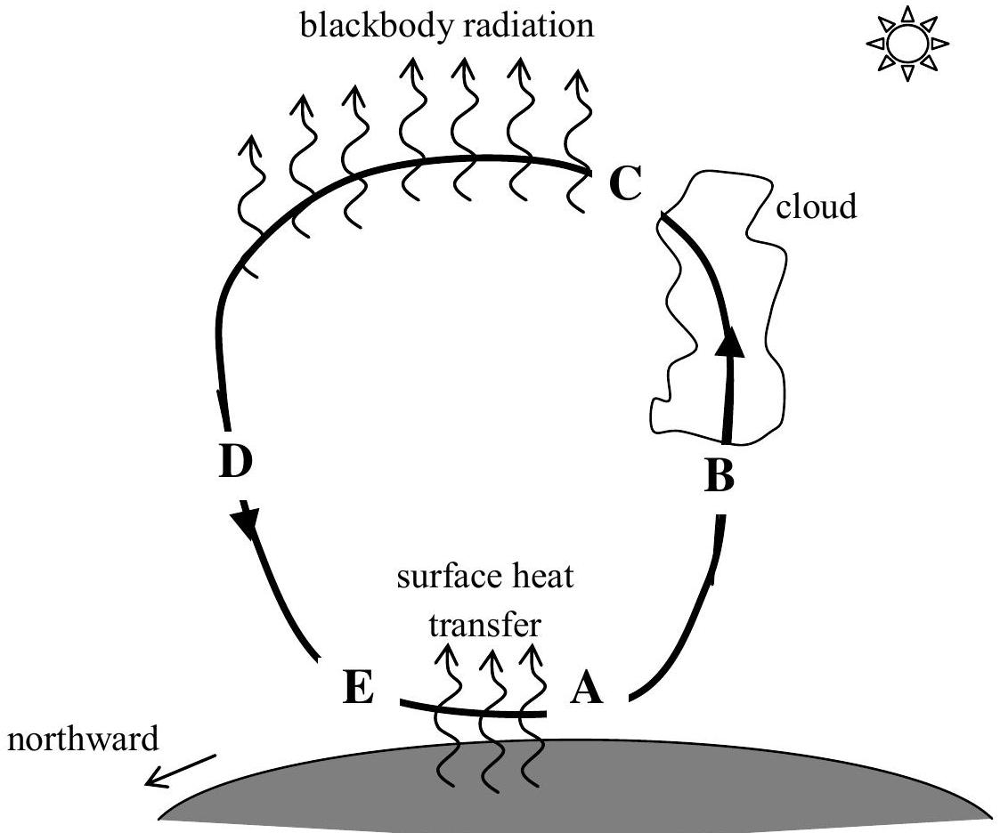

Question 1

The schematic below shows the Hadley circulation in the Earth's tropical atmosphere around the spring equinox. Air rises from the equator and moves poleward in both hemispheres before descending in the subtropics at latitudes $\pm \varphi_{d}$ (where positive and negative latitudes refer to the northern and southern hemisphere respectively). The angular momentum about the Earth's spin axis is conserved for the upper branches of the circulation (enclosed by the dashed oval). Note that the schematic is not drawn to scale.

(a) (2 points) Assume that there is no wind velocity in the east-west direction around the point X. What is the expression for the east-west wind velocity $u_{Y}$ at the points Y? Convention: positive velocities point from west to east.
(The angular velocity of the Earth about its spin axis is $\Omega$, the radius of the Earth is $a$, and the thickness of the atmosphere is much smaller than $a$.)

(b) (1 point) Which of the following explains ultimately why angular momentum is not conserved along the lower branches of the Hadley circulation?
Tick the correct answer(s). There can be more than one correct answer.
    (I) There is friction from the Earth's surface.
    (II) There is turbulence in the lower atmosphere, where different layers of air are mixed
    (III) The air is denser lower down and so inertia slows down the motion around the spin axis of the Earth.
    (IV) The air is moist at the lower levels causing retardation to the wind velocity.

Around the northern winter solstice, the rising branch of the Hadley circulation is located at the latitude $\varphi_{r}$ and the descending branches are located at $\varphi_{n}$ and $\varphi_{s}$ as shown in the schematic below. Refer to this diagram for parts (c), (d) and (e).

(c) (2 points) Assume that there is no east-west wind velocity around the point Z. Given that $\varphi_{r}=-8^{\circ}, \varphi_{n}=28^{\circ}$ and $\varphi_{s}=-20^{\circ}$, what are the east-west wind velocities $u_{P}, u_{Q}$ and $u_{R}$ respectively at the points $\mathrm{P}, \mathrm{Q}$ and R ?
(The radius of the Earth is $\mathrm{a}=6370 \mathrm{~km}$.)
Hence, which hemisphere below has a stronger atmospheric jet stream?
    (I) Winter Hemisphere
    (II) Summer Hemisphere
    (III) Both hemispheres have equally strong jet streams.

(d) (1 point) The near-surface branch of the Hadley circulation blows southward across the equator. Mark by arrows on the figure below the direction of the eastwest component of the Coriolis force acting on the tropical air mass
    (A) north of the equator;
    (B) south of the equator.

(e) (1 point) From your answer to part (d) and the fact that surface friction nearly balances the Coriolis forces in the east-west direction, sketch the near-surface wind pattern in the tropics near the equator during northern winter solstice.

Suppose the Hadley circulation can be simplified as a heat engine shown in the schematic below. Focusing on the Hadley circulation reaching into the winter hemisphere as shown below, the physical transformation of the air mass from A to B and from D to E are adiabatic, while that from B to C, C to D and from E to A are isothermal. Air gains heat by contact with the Earth's surface and by condensation of water from the atmosphere, while air loses heat by radiation into space.

(f) (2 points) Given that atmospheric pressure at a vertical level owes its origin to the weight of the air above that level, order the pressures $p_{A}, p_{B}, p_{C}, p_{D}, p_{E}$, respectively at the points $\mathrm{A}, \mathrm{B}, \mathrm{C}, \mathrm{D}, \mathrm{E}$ by a series of inequalities. (Given that $p_{A}=1000 \mathrm{hPa}$ and $p_{D}=225 \mathrm{hPa}$. Note that 1 hPa is 100 Pa.)
(g) (2 points) Let the temperature next to the surface and at the top of the atmosphere be $T_{H}$ and $T_{C}$ respectively. Given that the pressure difference between points A and E is 20 hPa , calculate $T_{C}$ for $T_{H}=300 \mathrm{~K}$.
Note that the ratio of molar gas constant $(R)$ to molar heat capacity at constant pressure ( $c_{p}$ ) for air, $\kappa$, is 2/7.
(h) ( 2 points) Calculate the pressure $p_{B}$.

(i) For an air mass moving once around the winter Hadley circulation, using the molar gas constant, $R$, and the quantities defined above, obtain expressions for

(A) ( 2 points) the net work done per unit mole $W_{\text {net }}$ ignoring surface friction;
(B) (1 point) the heat loss per unit mole $Q_{\text {loss }}$ at the top of the atmosphere.
(j) (1 point) What is the value of the ideal thermodynamic efficiency $\varepsilon_{i}$ for the winter Hadley circulation?
(k) (2 points) Prove that the actual thermodynamic efficiency $\varepsilon$ for the winter Hadley circulation is always smaller than $\varepsilon_{i}$, showing all mathematical steps.
(l) (1 point) Which of the following statements best explains why $\varepsilon$ is less than the ideal value? Tick the correct answer(s). There can be more than one correct answer.
    (I) We have ignored work done against surface friction.
    (II) Condensation occurs at a temperature lower than the temperature of the heat source.
    (III) There is irreversible evaporation of water at the surface.
    (IV) The ideal efficiency is applicable only when there is no phase change of water.
