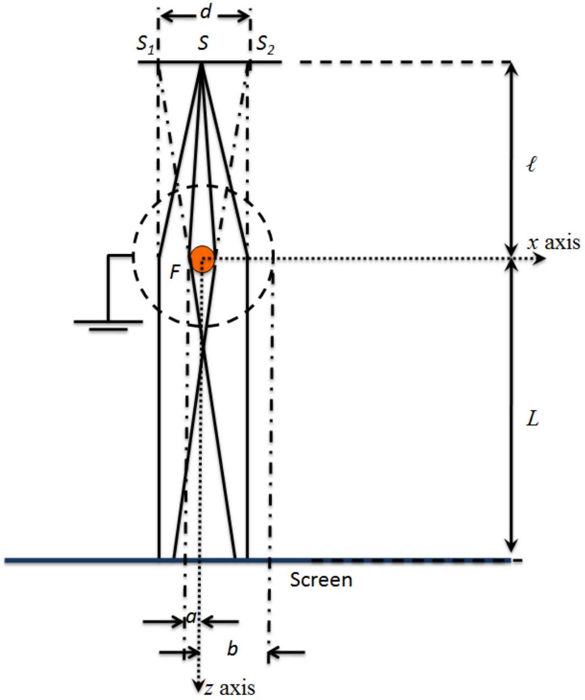

Question 2

The two-slit electron interference experiment was first performed by Möllenstedt et al, MerliMissiroli and Pozzi in 1974 and Tonomura et al in 1989. In the two-slit electron interference experiment, a monochromatic electron point source emits particles at $S$ that first passes through an electron "biprism" before impinging on an observational plane; $S_{1}$ and $S_{2}$ are virtual sources at distance $d$. In the diagram, the filament is pointing into the page. Note that it is a very thin filament (not drawn to scale in the diagram).

The electron "biprism" consists of a grounded cylindrical wire mesh with a fine filament $F$ at the center. The distance between the source and the "biprism" is $\ell$, and the distance between the distance between the "biprism" and the screen is $L$.

(a) (2 points) Taking the center of the circular cross section of the filament as the origin $O$, find the electric potential at any point $(x, z)$ very near the filament in terms of $V_{a}, a$ and $b$ where $V_{a}$ is the electric potential of the surface of the filament, $a$ is the radius of the filament and $b$ is the distance between the center of the filament and the cylindrical wire mesh. (Ignore mirror charges.)
(b) ( $\mathbf{4}$ points) An incoming electron plane wave with wave vector $k_{z}$ is deflected by the "biprism" due to the $x$-component of the force exerted on the electron. Determine $k_{x}$ the $x$-component of the wave vector due to the "biprism" in terms of the electron charge, $e, v_{z}, V_{a}, k_{z}, a$ and $b$, where $e$ and $v_{z}$ are the charge and the $z$-component of the velocity of the electrons $\left(k_{x} \ll k_{z}\right)$. Note that $\vec{k}=\frac{2 \pi \vec{p}}{h}$ where $h$ is the Planck constant.
(c) Before the point $S$, electrons are emitted from a field emission tip and accelerated through a potential $V_{0}$. Determine the wavelength of the electron in terms of the (rest) mass $m$, charge $e$ and $V_{0}$,
    (i) (2 points) assuming relativistic effects can be ignored, and
    (ii) (3 points) taking relativistic effects into consideration.
(d) In Tonomura et al experiment,
$$
\begin{aligned}
& v_{z}=c / 2, \\
& V_{a}=10 \mathrm{~V}, \\
& V_{0}=50 \mathrm{kV}, \\
& a=0.5 \mu \mathrm{~m}, \\
& b=5 \mathrm{~mm}, \\
& \ell=25 \mathrm{~cm}, \\
& L=1.5 \mathrm{~m}, \\
& h=6.6 \times 10^{-34} \mathrm{Js}, \\
& \text { electron charge, } e=1.6 \times 10^{-19} \mathrm{C}, \\
& \text { mass of electron, } \mathrm{m}_{0}=9.1 \times 10^{-31} \mathrm{~kg}, \\
& \text { and the speed of light in vacuo, } c=3 \times 10^{8} \mathrm{~ms}^{-1}
\end{aligned}
$$
    (i) (2 points) calculate the value of $k_{x}$,
    (ii) (2 points) determine the fringe separation of the interference pattern on the screen,
    (iii) (1 point) If the electron wave is a spherical wave instead of a plane wave, is the fringe spacing larger, the same or smaller than the fringe spacing calculated in (ii)?
    (iv) (2 points) In part (c), determine the percentage error in the wavelength of the electron using non-relativistic approximation.
    (v) (2 points) the distance $d$ between the apparent double slits.
