Experimental Competition
May 7, 2015
08:30-13:30 hours

Experiment Problem

There are 22 pages including the cover page.

## Please first read the following instructions carefully:

1. The time available is 5 hours for the experimental problem.
2. Use only the pen and equipment provided.
3. There is a set of Answer Sheets in which you have to enter your data and results.
4. Write down your Student Code in the boxes at the top of each Answer Sheets and additional sheets which you submit.
5. Additional Writing Sheets are provided.
6. If you use any additional Writing Sheets, please write down your Student Code, the Question Number and the Page Number on these additional Writing Sheets.
7. If you use additional Writing Sheets that you do not wish to be marked, put a large 'X' across the entire sheet.
8. You should use mainly equations, numbers, symbols, graphs, figures and as little text as possible in your answers. Use the symbols defined in the question.
9. At the end of the experiment arrange all sheets in the following order:
    a. Main Answer Sheets
    b. Used Writing Sheets
    c. Writing sheets which are marked with 'X'
    d. Unused Writing Sheets
    e. The question paper
10. Put all the papers inside the envelope and leave the envelope on your desk.
11. You are not allowed to take any sheet of paper or any material used in the experiment out of the room.

## The Piezoelectric Effect And Its Applications

## 1. Introduction

The piezoelectric effect refers to the process that the electric charge accumulates in solid materials in response to applied mechanical stress (see Figure 1(a)). It is reversible, which means that materials exhibiting the piezoelectric effect also exhibit the converse piezoelectric effect, i.e., the internal generation of a mechanical strain resulting from an applied electrical field (see Figure 1(b)).

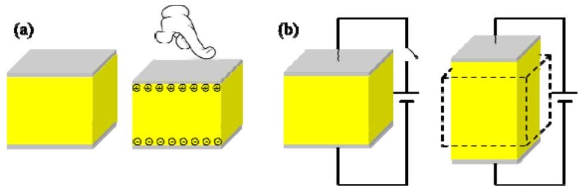
Figure 1. (a) The piezoelectric effect. Left: a yellow piezoelectric cube under no mechanical stress. Right: the electric charge accumulates on opposite surfaces of the cube in response to applied mechanical stress. (b) The converse piezoelectric effect. Left: without applying an electric field, the cube is un-stressed and remains in its natural shape. Right: the cube is stressed and deformed resulting from an applied electric field.

The piezoelectric materials are used in various applications covering a wide range from industrial and manufacturing to daily life, such as the production and detection of sound, generation of high voltages, microbalances, ultra-fine focusing of optical assemblies, ignition source for cigarette lighters, push-start propane barbecues, and quartz watches.

In addition to applications mentioned above, the piezoelectric materials are also actively used in scientific research. As very high electric fields correspond to only tiny changes in the dimensions of the piezoelectric materials, the piezoelectric materials become the most important tool for positioning objects with extreme accuracy. They are the basis of some commonly used tools in surface science, the scanning tunneling microscope (STM) and its variants. The 1986 Nobel Prize in physics was awarded to Gerd Binnig and Heinrich Rohrer for their design of STM.

Another merit of the piezoelectric materials is that they could enable conversion of signals between different modes such as mechanical, electrical and optical. With the help of ultra-low temperatures and state-of-the-art electronics, researchers are able to cool down the mechanical mode to its ground state and observe the quantization of motion. The experiment of creating such a quantum machine, a mechanical resonator made by piezoelectric aluminum nitride, was titled "Breakthrough of the Year 2010" by Science magazine.

There are many piezoelectric materials, both natural and synthetic. Some naturally occurring materials include quartz, bone and silk. Synthetic materials include ceramics, semiconductors and polymers. Lead zirconate titanate $\left(\mathrm{Pb}\left[\mathrm{Zr}_{\mathrm{x}} \mathrm{Ti}_{1-\mathrm{x}}\right] \mathrm{O}_{3}\right)$, known as PZT, is the most common piezoelectric ceramic in use
today, which exhibits strong piezoelectricity.
In this APhO2015 experiment, we will explore properties of PZT and its applications. For a given PZT plate, we will measure its piezoelectric coefficient via the resonant method and will estimate its Curie temperature by linear extrapolation. We will make a transducer out of a PZT plate to produce mechanical motions and sound waves in the medium; we will make a sensor out of a PZT plate for sensing the strength of sound waves. With the hand-made transducer and senor, we will measure the longitudinal and transverse wave velocities of sound in an aluminum rod. Finally, we will use sound waves to resonantly locate an artificially-designed defect in another aluminum rod.

## 2. General Safety Precautions:

1) Be sure to switch off the equipment before plug in/out its power cord. Otherwise damage can occur.
2) Do not turn on the thermostat water bath if the heating unit is not covered by water.
3) Be careful not to spill the water onto nearby electronics and the electrical power socket.
4) Be careful of the hot water.
5) Be careful of electric shock.
6) Do not drink/consume any of the materials provided for the experiment.

## 3. Apparatus

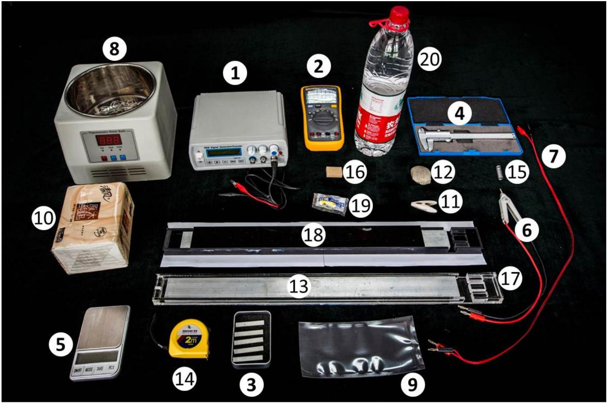

1) A signal generator which can output simple repetitive electrical waveforms over a wide range of frequencies.
2) A digital multimeter (DMM).
3) 5 PZT plates. Two flat surfaces of each plate are coated by thin films of silver.
4) A Vernier caliper.
5) An electronic weighing scale.
6) A Kelvin clip. The Kelvin clip features a crocodile clip with two isolated jaws, which are connected to two banana plugs respectively. It is used to clamp a PZT plate.
7) A cable with two banana plugs connecting to two crocodile clips, respectively. One jaw of each crocodile clip is wrapped by a black tube, and therefore it is important to have the correct polarity when clamping.
8) A thermostat water bath.
9) A plastic bag.
10) Paper towels.
11) A plastic clip.
12) A pebble.
13) An aluminum rod.
14) A steel tape measure.
15) A spring.
16) An eraser.

17) A transparent plastic box to accommodate the aluminum rod and the PZT plates together.
18) A black plastic box with an aluminum rod inside. A defect, invisible from outside the box, is artificially engineered at a spot along the rod.
19) A pair of earplugs.
20) 1.5 L bottled water.

## Instructions for the electronic weighing scale (see Figure 2)

- Place the scale on a flat, very stable surface.
- Press the "ON/OFF" button to turn on the scale.
- Wait until the reading is stable. If the reading is not zero, press the "TARE" button to re-Zero it.
- Press the "MODE" button to toggle units between "g", "gn", "oz", "ozt", "dwt", "ct" and "tl". It is recommended that you use the unit "g" (gram).

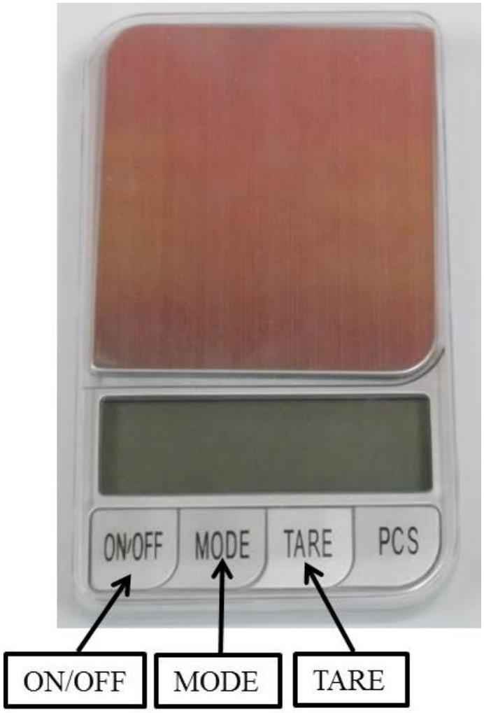
Figure 2. An electronic weighing scale.

## Instructions for the signal generator (see Figure 3)

- To turn on the machine, connect the detachable USB power cord (with the AC adapter) to the rear panel receptacle and turn on the front panel power button.
- The "Display Panel" shows the wave frequency and the wave type (sine, square, or triangle). We recommend sine for the experiment.
- Use the "Amplitude" knob to adjust the signal amplitude. Use the "Adjust" knob to change the signal frequency. Use the " «" or " » " button to move the cursor.
- Be careful when tuning the "DC offset" knob. This knob changes the DC offset of the signal. A big DC offset may cause signal clipping (see Figure 4 (a)). It is recommended that you calibrate the DC offset before using the signal generator: while using the DMM to monitor the DC voltage of the output, adjust the "DC Offset" knob until the DC voltage reaches zero.
- It is also recommended that you do not tune the "Amplitude" knob to maximum to avoid signal clipping (see Figure 4 (b)). You can tune the output amplitude to 3.0 V (rms) for the experiment: while using the DMM to monitor the AC voltage of the output at a frequency of, e.g., 1 kHz , adjust the "Amplitude" knob until the AC voltage reaches about $\mathbf{3 . 0 ~ V}$ (rms).

- If you press a button by mistake and do not know how to return to the original configuration, restart the machine to restore to default configuration.

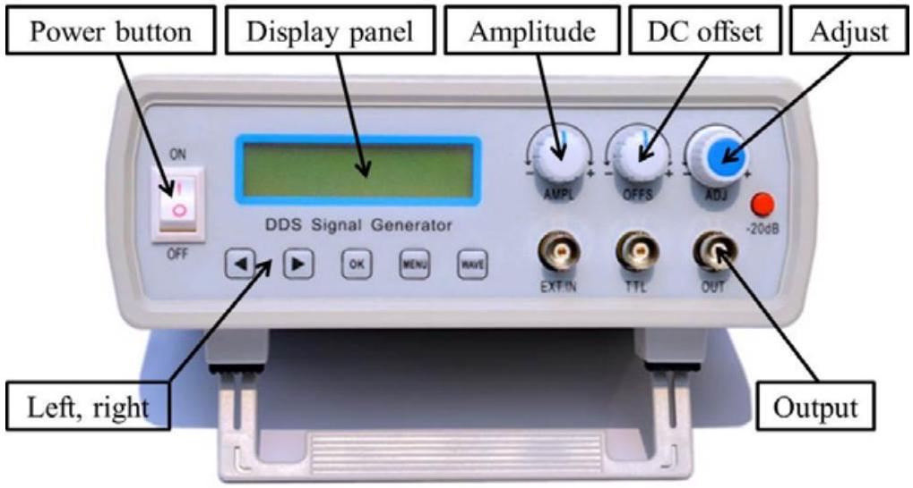
Figure 3. A signal generator.

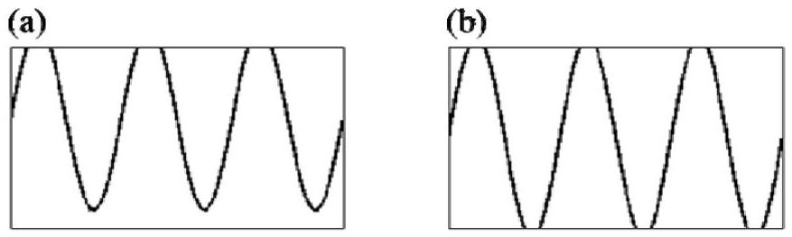
Figure 4. Two symptoms of signal clipping. (a) Signal clipping when the DC offset is nonzero. (b) Signal clipping when the output amplitude is too large.

## Instructions for the digital multimeter (DMM. See Figure 5)

- Use the "V $\Omega$ " and "COM" inlets for measuring voltage, resistance and capacitance.
- Use the "mA" and "COM" inlets for measuring current.
- Use the rotary switch to select the proper function and measuring range.
- Toggle between the AC and DC modes by pressing the YELLOW button.
- The DMM enters the "Sleep mode" and blanks the display if the DMM remains inactive for more than 20 minutes. Turn the rotary switch to OFF and back to wake up the DMM. To disable the Sleep mode, hold down the YELLOW button while turning the DMM on.
- Attention: although it is usable for the experiment with frequencies up to 40 kHz, the DMM is not designed for accurately measuring the amplitude values of AC signals above 1 kHz. To calibrate the output voltage of the signal generator using the DMM, you should set the signal frequency to 1 kHz or below.

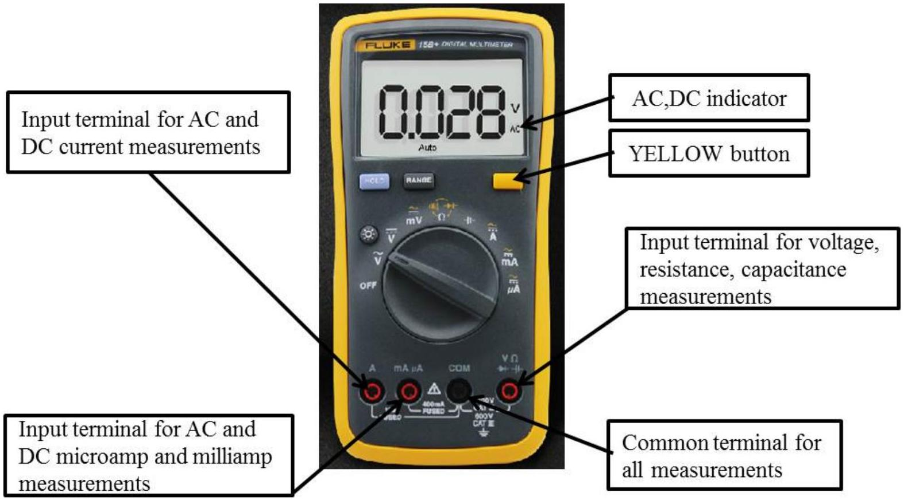
Figure 5. A digital multimeter.

## Instructions for the thermostat water bath (see Figure 6)

- Surfaces can become hot during use.
- It is strictly prohibited to turn on the machine if the heating unit is not covered by water.
- Be careful not to spill water onto the nearby electronics and the power socket.
- Fill in bottled water for the bath to be about half full. Properly connect the power cord and turn the bath on.
- To set the target temperature, press the "Set" button to enter the "Set" mode and the "Set" indicator will illuminate. Use the "Increasing" ("Decreasing") button to increase (decrease) the displayed value to the target temperature. Press the "Set" button again to exit the "Set" mode and the water bath will start heating automatically. Check the "Temperature display" for actual temperature readings.
- During heating, the "Heat" indicator illuminates. After reaching the set temperature, the "Keep" indicator will illuminate and heating will stop.
- It is recommended that you ramp up the temperature gradually from low to high during the experiment.

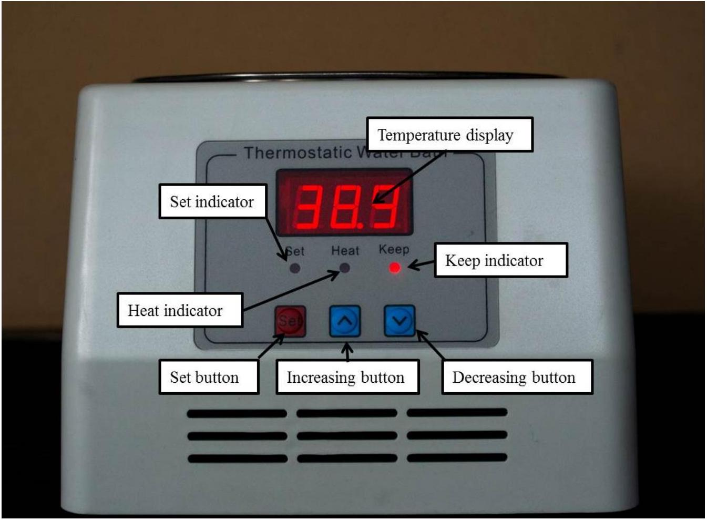
Figure 6. A thermostat water bath.

## Experiment A

## Basic measurement [3.0pts]

In this experiment, you are required to measure the dimensions, the mass and the capacitance of a PZT plate, and then calculate its density $\rho$ and relative permittivity $\varepsilon_{r}$.

Please choose a PZT plate. You are supposed to perform Experiments A, B and C using this same plate.

In Experiments A to E, error analysis is required if it is explicitly stated; it is not required if it is not stated.

| A. 1 | Choose a PZT plate and use the Vernier caliper to measure its length $l$, width $w$, and thickness $t$. Use the electronic weighing scale to measure its mass $m$. Use the DMM and the Kelvin clip to measure its capacitance $C$ (at ambient temperature).   Considering the slight non-uniformity in the dimensions of the PZT plate and the uncertainties of instrumental readings, repeat each measurement several times and then calculate the mean and the standard error. | 1.6pts |
| :--- | :--- | :--- |

Attention: The relative permittivity of the PZT plate is temperature dependent (see Experiment C). You are supposed to perform the capacitance measurement at ambient temperature. Avoid the direct warming up of the plate by your hand.

| A. 2 | Now calculate the density $\rho$ and the relative permittivity $\varepsilon_{r}$ of the PZT plate. Based on standard errors obtained from A.1, carry out the error analysis to estimate the uncertainties of $\rho$ and $\varepsilon_{r}$ (vacuum permittivity $\varepsilon_{0}=8.85 \times 10^{-12} \mathrm{~F} / \mathrm{m}$ ). | 1.4pts |
| :--- | :--- | :--- |

## Experiment B

## The resonant method to measure the piezoelectric coefficient

[4.5pts]

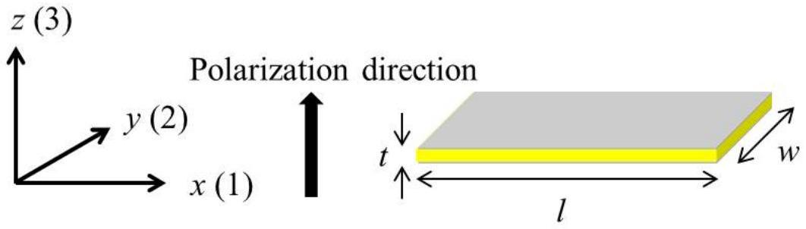
Figure 7. The PZT plate.

As described in the introduction section, the piezoelectric plate produces distortion (also called strain $S$ ) when subjected to an electric field. The proportional coefficient $d$ of the strain $S$ versus the electric field strength $E$ is defined as the piezoelectric coefficient

$$
d=\frac{S}{E} .
$$

In reality, the PZT plate is anisotropic. There is a special direction called the polarization direction. During production of the PZT plate, a strong DC electric field is applied along its thickness direction (z-axis in Figure 7) to align the molecular dipoles of the ceramic at a temperature higher than the Curie temperature (see Experiment C). This polarization remains after temperature is reduced below the Curie temperature and then the DC electric field is removed.

The top and bottom flat surfaces of the plate are coated with silver films as electrodes (see Figure 7). The electric field is along z-axis (3) when the electrodes are connected to a voltage source, and we shall denote it as $E_{3}$. Here we define

$$
\begin{aligned}
& d_{31}=\frac{S_{1}}{E_{3}}, \\
& d_{33}=\frac{S_{3}}{E_{3}},
\end{aligned}
$$

where $S_{1}=\Delta l / l$ and $S_{3}=\Delta t / t$ are strains along x-axis (1) and z-axis (3), respectively. Note that the strain is not necessarily parallel to the electric field $E_{3}$. For PZT materials, $d_{31}$ is roughly half of $d_{33}$. According to the parameters in Experiment A, it can be shown that length $l$ changes the most when a voltage $V$ is applied across the electrodes, i.e.,

$$
\begin{aligned}
& \Delta l=l d_{31} E_{3}=\frac{l}{t} d_{31} V, \\
& \Delta w=\frac{w}{t} d_{31} V, \\
& \Delta t=t d_{33} E_{3}=d_{33} V=2 d_{31} V,
\end{aligned}
$$

where $l / t \gg w / t \gg 2$. To simplify the theoretical treatment, for such a long thin plate, vibrations along the width (y-axis) and thickness (z-axis) directions can be neglected and the problem reduces to a one-dimensional vibration problem. As such we remove the redundant subscript and simply denote $\boldsymbol{d}_{\mathbf{3 1}}$ as $\boldsymbol{d}$. In Experiments $\mathbf{D}$ and $\mathbf{E}$ the ignored vibration along the width (y-axis) direction may cause slight imperfection to the measurement.

The PZT plate performs like a pure capacitor (with a capacitance $C$ from A.1) when driven by low-frequency signals. However, as frequency increases, the vibration of the PZT plate changes its circuitry behavior significantly. At certain frequencies called resonant frequencies, the plate vibrates strongly and its impedance reaches a minimum. Along with the resonant frequencies, there are also frequencies where the impedance reaches a maximum, and we call them antiresonant frequencies.

The first resonant frequency $f_{r}$ of the plate is associated with its fundamental vibration mode along the length direction (x-axis). Near $f_{r}$, the PZT plate can be approximated by a simple circuit, with two capacitors ( $C_{0}$ and $C_{1}$ ) and an inductor ( $L_{1}$ ) being arranged as shown in Figure 8.

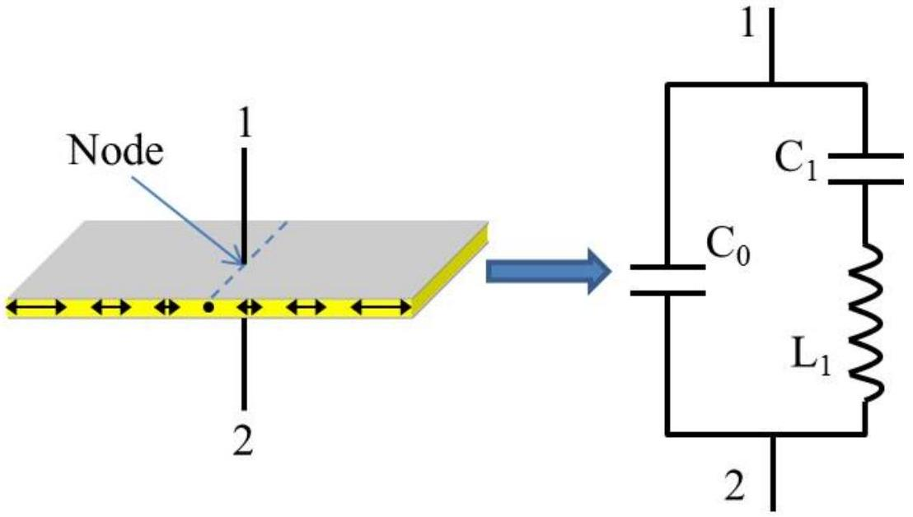
Figure 8. The equivalent circuit model (in response to an external signal drive) of the PZT plate near its first resonant frequency. The PZT plate vibrates in its fundamental mode. Under the free boundary condition, the middle point along the length direction is the node.

| B. 1 | Derive the expressions for the resonant frequency $f_{r}$ and the antiresonant frequency $f_{a}$ of the equivalent circuit. | 1.0pts |
| :--- | :--- | :--- |

The piezoelectric coefficient $d$ can be calculated by the following formula

$$
d=\sqrt{\frac{\varepsilon_{0} \varepsilon_{r}}{128 f_{r}^{4} l^{2} \rho\left[\frac{1}{\left(2 \pi f_{a}\right)^{2}-\left(2 \pi f_{r}\right)^{2}}+\frac{1}{32 f_{r}^{2}}\right]}} .
$$

Now we perform the experiment to locate $f_{r}$ and $f_{a}$. See the circuit schematics in Figure 9. We keep the output amplitude (the voltage $V$ ) of the signal generator constant, such that the impedance of the PZT plate correlates with the AC current in the circuit.

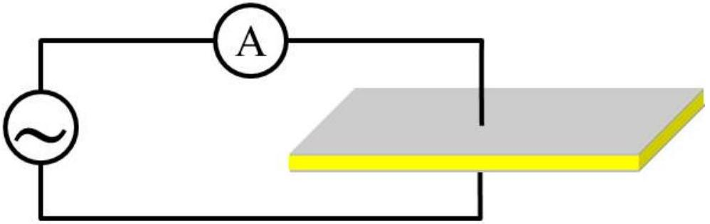
Figure 9. Circuit schematics for measuring the resonant and antiresonant frequencies.

| B. 2 | Measure the AC current $I$ through the PZT plate as a function of the signal frequency $f$. Draw the $I-f$ curve and find the resonant frequency $f_{r}$ and the antiresonant frequency $f_{a}$. Calculate the piezoelectric coefficient $d$ accordingly. | 3.5pts |
| :--- | :--- | :--- |

Instructions:

(1) Connect the signal generator, the DMM and the PZT plate according to Figure 9. Note that the PZT plate should be clamped at the middle point along the length direction using the Kelvin clip, since the middle point is the node under the free boundary condition.
(2) The amplitude of the output signal changes little with frequency if the "Amplitude" knob of the signal generator remains untouched. However, the DMM may not respond to signals with a frequency above 40 kHz . Data above 40 kHz are not required.
(3) Attention: keep the clamped PZT plate intact during the experiment. Slight movement may cause drifting of the current reading.
(4) Attention: as mentioned in A.1, you are supposed to perform the measurement at ambient temperature. Avoid the direct warming up of the plate by your hand.
(5) Attention: if you do not hear any high pitch sound from your testing plate after sweeping frequency and you are confident with your measurement setup, you should contact the organizer as your instruments might be faulty.

## Experiment C

## The Curie temperature of the PZT plate [4.0pts]

Most insulators have a dielectric susceptibility which is insensitive to the temperature variation. However, the static relative permittivity of the PZT ceramics changes with temperature according to the relation

$$
\varepsilon_{r}=A+\frac{B}{T-T_{c}}, \text { where } T>T_{c} .
$$

Here $A$ and $B$ are constants independent of temperature. This relation is known as the Curie-Weiss law. Parameters $B$ and $T_{c}$ are called the Curie constant and the Curie temperature respectively, named after Pierre Curie.

A phase transition occurs at the transition temperature, $T_{c}$. Above $T_{c}$, the substance is in the paraelectric phase, in which the elementary dipoles of the various unit cells in the crystal are oriented randomly. Below $T_{c}$, the elementary dipoles interact with each other, giving rise

to an internal field, which lines up the dipoles. A spontaneous polarization appears in the absence of an applied electric field. The relative permittivity below $T_{c}$ is given as

$$
\varepsilon_{r}=1+\frac{B}{2\left(T_{c}-T\right)}, \text { where } T<T_{c} .
$$

From Experiment A we know that $\varepsilon_{r} \gg 1$. We can ignore the constant term to obtain an approximation of the static relative permittivity as

$$
\varepsilon_{r}=\frac{B}{2\left(T_{c}-T\right)}, \text { where } T<T_{c} .
$$

Therefore capacitance of the PZT plate obtained from A. 1 could vary with temperature as well. Since the Curie temperature of the PZT plate is much higher than the boiling temperature of water, we will estimate its Curie temperature by linear extrapolation.

| C. 1 | Now measure the capacitance of the PZT plate at various temperatures and record the data. | 1.5pts |
| :--- | :--- | :--- |

Instructions:

(1) Use the cable with two banana plugs and two crocodile clips to connect the PZT plate

to the DMM. Pay attention to the polarity of the two crocodile clips when clamping the PZT plate. Do not use the Kelvin clip because its ABS plastics will soften when heated.

(2) Put the PZT plate inside the plastic bag. Use the plastic clip to clamp the cable and the bag. Warning: one side of the bag is open. Do not tear the other side!
(3) Pour the 1.5 L bottled water into the water bath. Immerse the plastic bag in the water. Use the pebble to keep the plastic bag in the water.
(4) Turn on the water bath and set the target temperature. Warning: it is strictly prohibited to turn on the machine if the heating unit is not covered by water.
(5) Warning: be very careful with the hot water in the water bath. Remember that water at temperatures higher than $\mathbf{5 0}^{\boldsymbol{\circ}} \mathbf{C}$ can cause burns. For safety please do not set the temperature higher than $90^{\circ} \mathrm{C}$.
(6) The temperature will rise slowly. Please record the capacitance $C$ of the PZT plate at different temperatures.
(7) Turn off the water bath and unplug the power cord from the power socket when the measurement is finished.
(8) Hint: to speed up the experiment, you can choose to set the target temperature to 90°C and record the capacitance as the temperate rises.

| C. 2 | Analyze the data, draw a proper plot and calculate the Curie temperature accordingly. | 2.5pts |
| :--- | :--- | :--- |

## Experiment D

## Application: measuring the speed of sound in aluminum [6.5pts]

In solids, sound can be transmitted as both longitudinal waves and transverse waves. The medium movements responsible for the two types of waves are illustrated below.

Longitudinal wave

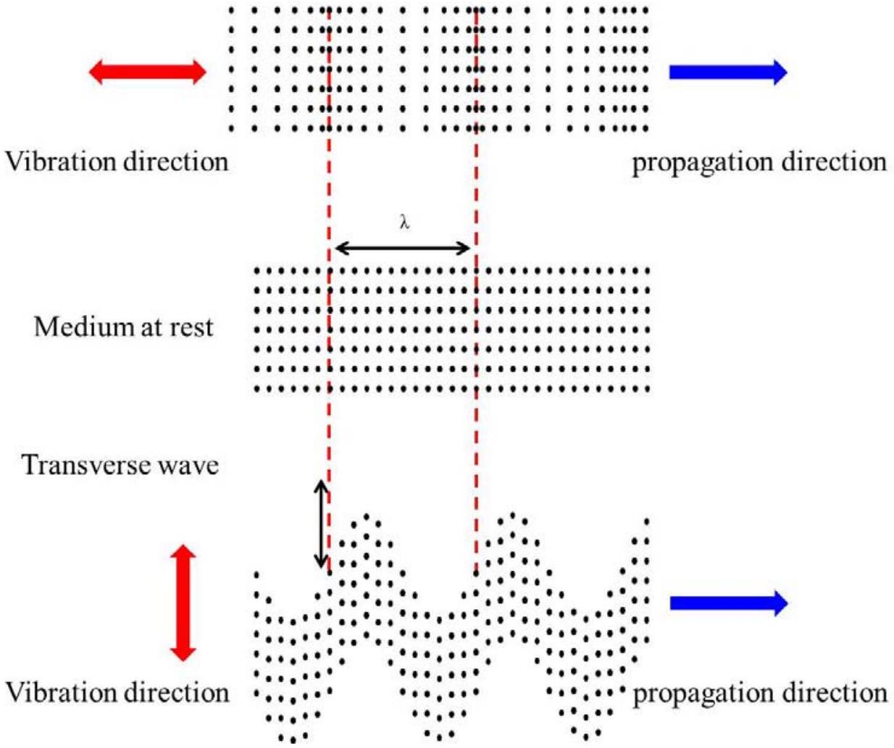
Figure 10. Longitudinal and transverse waves in solids.

In longitudinal waves, oscillation occurs in the longitudinal direction or the direction of wave propagation. Longitudinal waves can be generated in liquids, as well as in solids because the energy travels through the atomic structure by a series of compression and expansion movements.

In transverse waves, displacement of the medium is perpendicular to the direction of wave propagation. Transverse waves require a solid medium for propagation, and cannot effectively propagate in liquids or gasses.

In this experiment, we will measure the longitudinal and transverse wave velocities of sound in an aluminum rod. We will first measure the transverse wave velocity, and then the longitudinal wave velocity.

| D. 1 | Assume that the length of the aluminum rod is $L$ and the wave velocity is $u$. Under the free boundary condition, derive the equation for the frequencies $f_{n}$ of the standing (resonant) waves along the long rod. Then derive the equation for the wave velocity $u$ from $f_{n}$. | 0.6pts |
| :--- | :--- | :--- |

Now, we use a PZT plate as a transducer to produce sound waves in the aluminum rod, and use another PZT plate as a vibration sensor to detect the reflected sound waves.

First we measure the transverse wave velocity. As discussed in Experiment B, the vibration along the length direction is dominant. We position the transducer and the sensor to one end of the rod, as illustrated in Figure 11. The vibration of the transducer will propagate into the rod via friction, forming transverse waves.

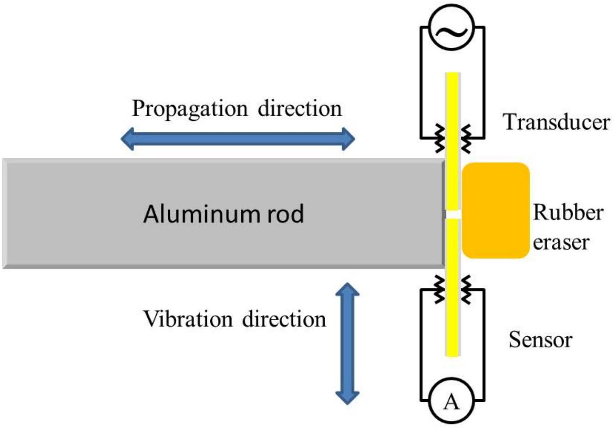
Figure 11. Illustration of the setup for measuring the transverse wave velocity (top view).

| D. 2 | Use the steel tape measure to read the length $L$ of the aluminum rod. Please repeat the measurement several times and calculate the mean and the standard error.   While changing the frequency of the sound waves produced by the transducer, record the peak values monitored by the sensor. Draw a spectrum containing all measured resonant peaks, similar to that shown in Figure 12. | 1.6pts |
| :--- | :--- | :--- |

Instructions:

(1) Following steps 2 to 4 to arrange the experimental setup as illustrated in Figure 11. Note that the plastic box is specifically designed to accommodate the setup.
(2) Place the aluminum rod in the long trough of the plastic box, and use the eraser to press the PZT plates against one end of the aluminum rod, as illustrated in Figure 11. The two plates should not touch each other.
(3) Put the spring on the other end of the trough to gently push the rod against the PZT plates.
(4) Connect one PZT plate to the signal generator as the transducer. Connect the other PZT plate to the DMM as the sensor. Pay attention to the polarity when using the crocodile clips.
(5) The PZT plate is fragile and there is no extra supply.
(6) Use earplugs if you are annoyed by the high pitch sound.
(7) It is recommended that you sweep the frequency in the range between 0 and 40 kHz .

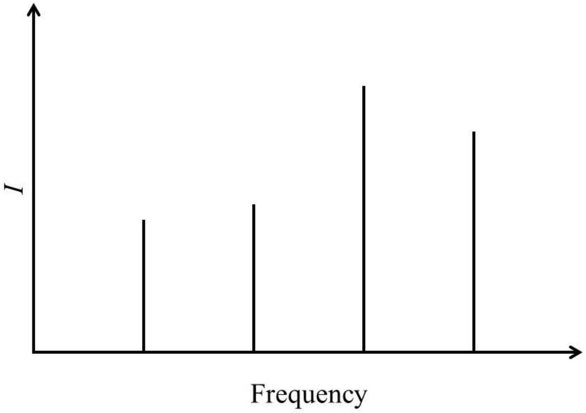
Figure 12. Exemplary spectrum showing all resonant peaks.

Figure 12. Exemplary spectrum showing all resonant peaks.
| D. 3 | Identify the resonant peaks likely resulting from the transverse waves. Calculate the transverse wave velocity accordingly and carry out the error analysis.   Attention: there might be irrelevant peaks caused by imperfection of the experimental setup, e.g., imperfect free boundary condition. You need to | 1.4pts |
| :--- | :--- | :--- |

|  | make a judgement and ignore the irrelevant peaks during your analysis. |  |
| :--- | :--- | :--- |

By changing the contact style between the PZT plates and the rod, we can also measure the longitudinal wave velocity in the rod. Attach the transducer and the sensor to the rod as illustrated in Figure 13. Vibration along the length direction of the transducer will propagate into the rod via compression, forming longitudinal waves.

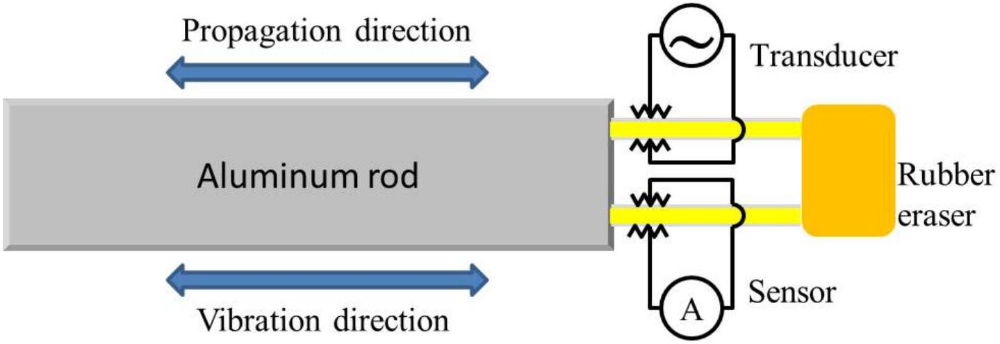
Figure 13. Illustration of the setup for measuring the longitudinal wave velocity.

As discussed in Experiment B, although vibration along the length direction is dominant, vibrations along other directions also exist, which could produce sound waves in the rod and introduce extra resonant peaks in the spectrum as well. Note that vibrations along other directions only introduce transverse waves. Therefore the extra resonant peaks will not coincide with the peaks caused by the longitudinal standing waves.

| D. 4 | While changing the frequency of the sound waves produced by the transducer, record the peak values monitored by the sensor. Draw a spectrum containing all measured resonant peaks, similar to that shown in Figure 12. | 1.5pts |
| :--- | :--- | :--- |

Instructions:

(1) Following steps 2 to 5 to arrange the experimental setup as illustrated in Figure 13. Note that the plastic box is specifically designed to accommodate the setup.
(2) Align two PZT plates in the two slim slots, respectively, on one end of the plastic box.
(3) With the long aluminum rod in the trough, use the eraser as a cushion to press the PZT plates against one end of the rod.
(4) Insert the spring on the other end to gently push the rod against the PZT plates.
(5) Connect one PZT plate to the signal generator as the transducer. Connect the other PZT plate to the DMM as the sensor. Note the polarity when using the crocodile clips.
(6) Attention: the style of contact between the PZT plates and the rod is crucial.

$16^{\text {th }}$ ASIAN PHYSICS OLYMPIAD 2015
$3^{\text {rd }}-11^{\text {th }}$ MAY, HANGZHOU, CHINA

Please have the edges of the PZT plates fully in touch with the side of the rod, so as to avoid point or partial contact.

(7) Attention: if you find too many resonant peaks in the spectrum, you can try to reduce the signal amplitude from the signal generator and/or slightly release the pressure between the PZT plates and the rod to reduce the production of transverse waves. You can also try to remove the spring on the other end if the contact between the PZT plates and the rod is still decent without the spring.
(8)It is recommended that you sweep the frequency between 0 and 40 kHz.

| D. 5 | Compare with the result in D.2, identify the resonant peaks caused by the transverse waves. Select the resonant peaks resulting from the longitudinal waves and calculate the longitudinal wave velocity accordingly. Carry out the error analysis. | 1.4pts |
| :--- | :--- | :--- |

## Experiment E

## Application: locating a defect in an aluminum rod [2.0pts]

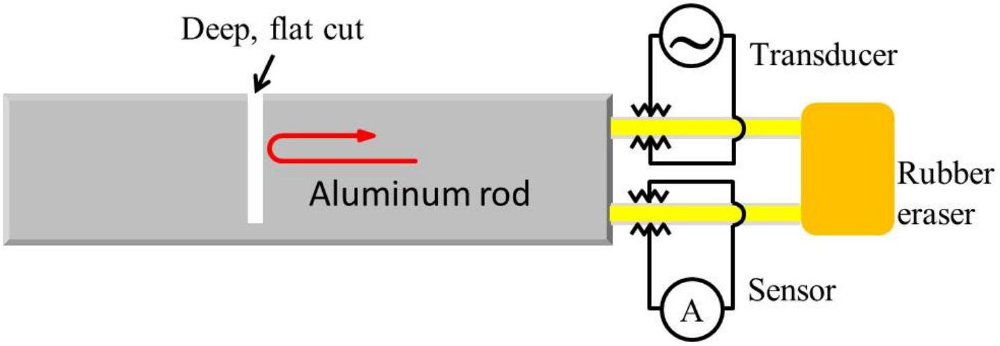
Figure 14. Illustration of the setup for locating a defect in an aluminum rod.

After knowing the longitudinal wave velocity from Experiment D, here we attempt to locate an artificially-engineered defect, a deep cut, along the long aluminum rod.

Sound waves through solid materials have been used to detect hidden cracks, voids, and other internal discontinuities in metals, composites, plastics, and ceramics. The industrial ultrasonic testing is done by repeatedly generating a several megahertz short pulse with an amplitude up to several hundred volts to drive the transducer, and then by amplifying the received signal to see if there is any reflection from a flaw. This is technically too complicated for our current setup. Instead, as a simple demonstration, we use the resonant method again to detect a deep, flat cut in the rod. Different from the case in Experiment D, sound waves will be bounced back at the spot of the deep cut instead of the far end of the rod. Therefore arrangement of the resonant peaks in the spectrum will be different from that in Experiment D, which can be the criterion for locating the spot of the deep cut.

The detection can be done using longitudinal waves.

| E. 1 | While changing the frequency of the sound waves produced by the transducer, record the peak values monitored by the sensor. Draw a spectrum containing all measured resonant peaks, similar to that shown in Figure 12. | 1.2pts |
| :--- | :--- | :--- |

| E. 2 | In the measured spectrum, identify the resonant peaks corresponding to the existence of the deep cut. Estimate the distance from the spot of the cut to the end of the rod that is in contact with the PZT plates. | 0.8pts |
| :--- | :--- | :--- |
