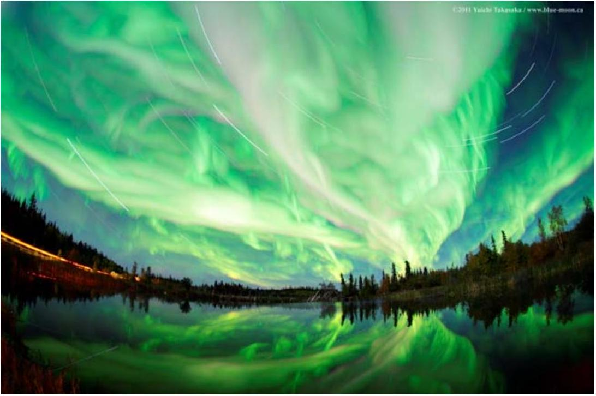
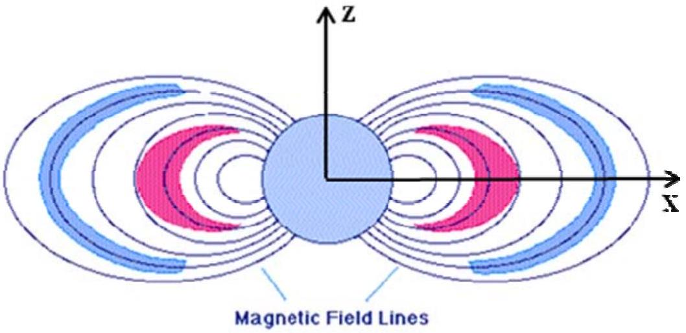
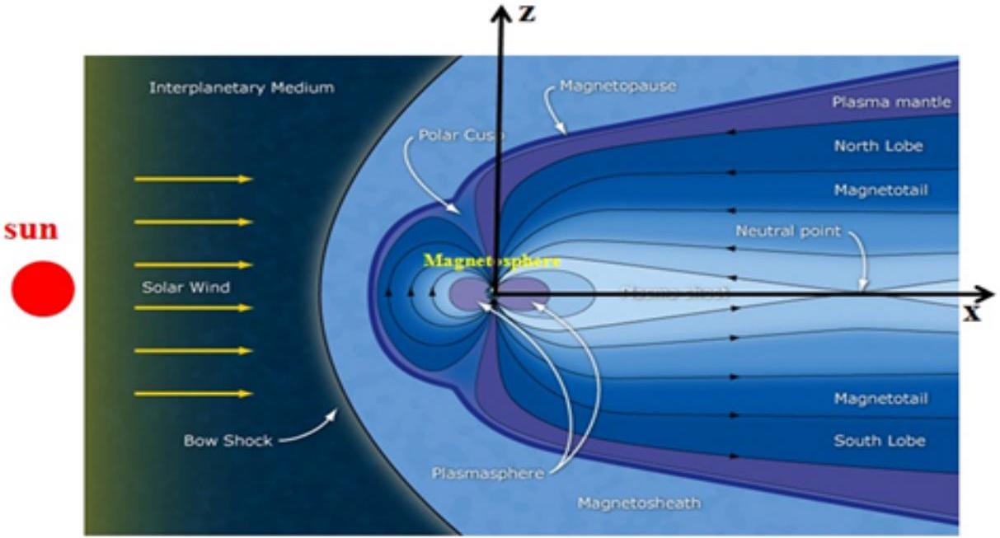
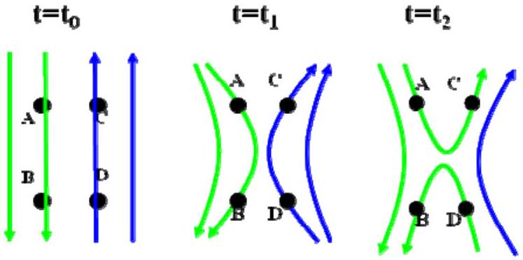
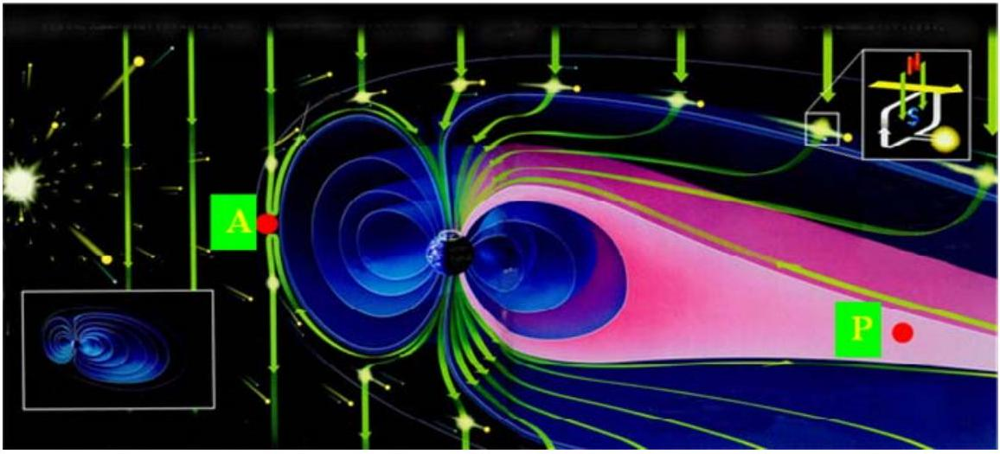
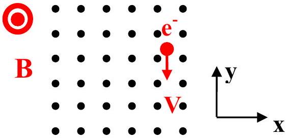
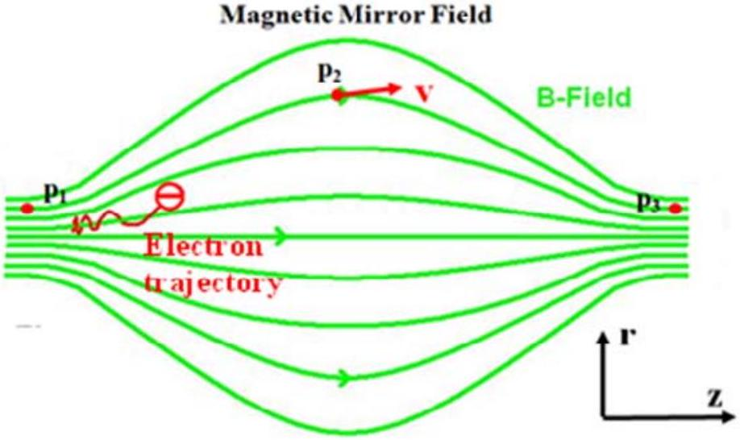
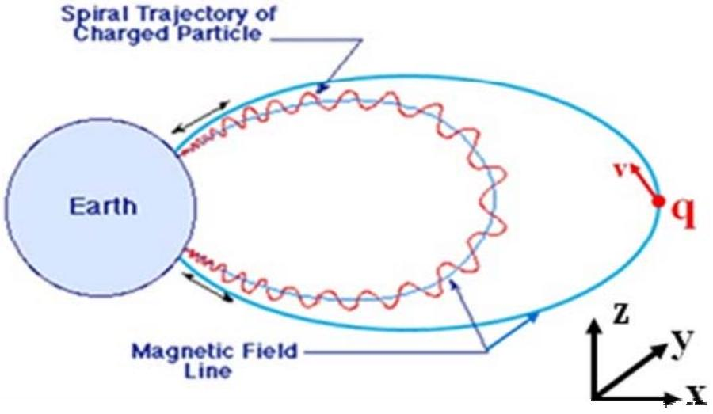
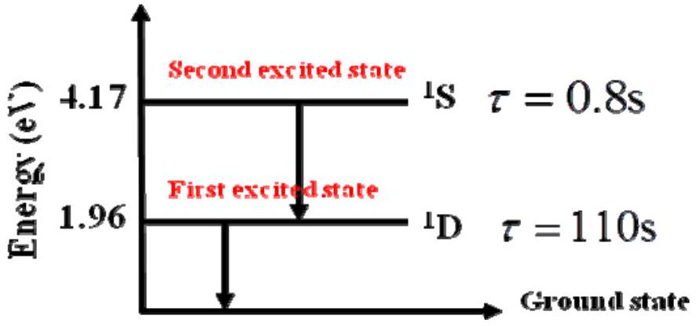

## Question 2

How are aurora ignited by the solar wind?

Figure 1

The following questions are designed to guide you to find the answer one step by one step. Background information of the interaction between the solar wind and the Earth's magnetic field

It is well known that the Earth has a substantial magnetic field. The field lines defining the structure of the Earth's magnetic field is similar to that of a simple bar magnet, as shown in Figure 2. The Earth's magnetic field is disturbed by the solar wind, whichis a high-speed stream of hot plasma. (The plasma is the quasi-neutralionized gas.)The plasma blows outward from the Sun and varies in intensity with the amount of surface activity on the Sun. The solar wind compresses the Earth's magnetic field. On the other hand, the Earth's magnetic field shields the Earth from much of the solar wind. When the solar wind encounters the Earth's magnetic field, it is deflected like water around the bow of a ship, as illustrated in Figure 3.

Figure 2

## Question 2

Figure 3

The curved surface at which the solar wind is first deflected is called the bow shock. The corresponding region behind the bow shock andfront of the Earth's magnetic field is called themagnetosheath. The region surroundedby the solar wind is called the magnetosphere.The Earth's magnetic field largely prevents the solar wind from enteringthe magnetosphere. The contact region between the solar wind and the Earth's magnetic field is named the magnetopause. The location of the magnetopause is mainly determined by the intensity and the magnetic field direction of the solar wind. When the magnetic field in the solar wind is antiparallel to the Earth's magnetic field, magnetic reconnection as shown in Figure 4 takes place at the dayside magnetopause, which allows some charged particles ofthe solar wind in the region "A" to move into the magnetotail "P" on the night side as illustrated in Figure 5. A powerful solar wind can push the dayside magnetopause tovery close to the Earth, which could cause a high-orbit satellite (such as a geosynchronous satellite) to be fully exposed to the solar wind. The energetic particles in the solar wind could damage high-tech electronic components in a satellite.Therefore, it isimportant to study the motion of charged particles in magnetic fields, which will give an answer of the aurora generation and could help us to understand the mechanism of the interaction between the solar wind and the Earth's magnetic field.

## Question 2

Figure 4

Figure 5

Numerical values of physical constants and the Earth's dipole magnetic field:
Speed of light in vacuum: $c=2.998 \times 10^{8} \mathrm{~m} / \mathrm{s}$;
Permittivity in vacuum: $\varepsilon_{0}=8.9 \times 10^{-12} \mathrm{C}^{2} /\left(\mathrm{N} \cdot \mathrm{m}^{2}\right)$;

Permeability in vacuum: $\mu_{0}=4 \pi \times 10^{-7} \mathrm{~N} / \mathrm{A}^{2}$;
Charge of a proton: $e=1.6 \times 10^{-19} \mathrm{C}$;
Mass of an electron: $m=9.1 \times 10^{-31} \mathrm{~kg}$;
Mass of a proton: $m_{p}=1.67 \times 10^{-27} \mathrm{~kg}$;
Boltzmann's constant: $k=1.38 \times 10^{-23} \mathrm{~J} / \mathrm{K}$;
Gravitational acceleration: $g=9.8 \mathrm{~m} / \mathrm{s}^{2}$;
Planck's constant: $h=6.626 \times 10^{-34} \mathrm{~J} \cdot \mathrm{~s}$
Earth's radius $R_{E}=6.4 \times 10^{6} \mathrm{~m}$.
The Earth's dipole magnetic field can be expressed as

$$
\vec{B}_{d}=\frac{B_{0} R_{E}^{3}}{r^{5}}\left[3 x z \hat{x}-3 y z \hat{y}+\left(x^{2}+y^{2}-2 z^{2}\right) \hat{z}\right] \quad,\left(r \geq R_{E}\right)
$$

where $r=\sqrt{x^{2}+y^{2}+z^{2}}, B_{0}=3.1 \times 10^{-5} \mathrm{~T}$, and $\hat{x}, \hat{y}, \hat{z}$ are the unit vectors in the $x, y, z$ directions, respectively.

Questions:

(a) (3 Points)
(i) (1 Point) Before we study the motion of a charged particle in the Earth's dipole magnetic field,

## Question 2

we first considerthe motion of an electron in a uniform magnetic field $\vec{B}$. When the initial electron velocity $\vec{v}$ is perpendicular to the uniform magnetic field as shown in Figure 6, please calculate the electron trajectory. The electron is initially located at $(\mathrm{x}, \mathrm{y}, \mathrm{z})=(0,0,0)$.

Figure 6

(ii) (1 Point) Please determine the electric current of the electron motion and calculate the magnetic moment $\vec{\mu}=I \vec{A}$, where ${ }^{I}$ is the area of the electron circular orbit and the direction of $\vec{A}$ is determined by the right-hand rule of theelectric current.
(iii) (1 Point) If the initial electron velocity $\vec{v}$ is not perpendicular to the uniform magnetic field, i.e, the angle $\theta$ between $\vec{B}$ and $\vec{v}$ is $0^{0}<\theta<90^{0}$, please give the screw pitch (the distance along the z-axis between successive orbits) of the electron trajectory.
(b) (4 Points) In the uniform background magnetic field as shown in Figure 6, theplasma density isnonuniform in $x$. For simplicity, we assume that the temperature and the distribution of the ions andelectrons are the same. Thus, the plasma pressure can be expressed as

$$
p(x)=k T\left[n_{i}(x)+n_{e}(x)\right]=2 k T n(x)=2 k T\left(n_{0}+\alpha x\right),
$$

Where $B, T, k, n_{0}$, and $\alpha$ are positive constants, $n_{i}(x)$ and $n_{e}(x)$ are the number densities of the ions and electrons.
(i) (2 Points) Please explain the generation mechanism of the electric current by a schematic drawing.
(ii) (2 Points) If both the ions and electrons have a Maxwellian distribution, the ion distribution is

$$
f_{i}\left(x, v_{\perp}, v_{\|}\right)=n_{i}(x)\left(\frac{m_{i}}{2 \pi k T}\right)^{3 / 2} e^{-m_{i}\left(v_{\perp}^{2}+v_{\|}^{2}\right) / 2 k T},
$$

please calculate the constant $\beta$ in the magnetization $M=\beta n(x) \frac{k T}{B}$, where the magnetization

## Question 2

Mis the magnetic moment per unit volume. (Hint: We have $\int_{0}^{\infty} x \exp (-x) d x=1$ and

$$
\int_{-\infty}^{\infty} \exp \left(-x^{2}\right) d x=\sqrt{\pi} .
$$

(c) (1 Point)Now let's go back to the Earth's dipole magnetic field. Please apply the result from Question(b) to calculate the ratio of the diamagnetic field and the Earth's dipole magnetic field in Equation (1) at the position $\left(x=10 \mathrm{R}_{\mathrm{E}}, y=0, z=1 \mathrm{R}_{\mathrm{E}}\right)$. The plasma pressure is assumed to be $p(z)=p_{0} e^{-(z / a)^{2}}$, where $p_{0}=3 \times 10^{-10}$ pa and $a=2 R_{E}$. The magnetic field around this position is also assumed to be uniform. Be aware of the difference in the coordinate systemsin Questions (b) and (c). (Hint: The diamagnetic field is given by $B_{m x}=\mu_{o} M$.)
(d) (4 Points) From Figures 2, 3, and 5, it can be clearly seen that the Earth's magnetic fieldstrength along a magnetic field line is the largest at the poles and the smallest in the equatorial plane.Since the Earth's dipole magnetic field is axially symmetric and slowly varying along a magnetic field line, it can for simplicitybe treated as a magnetic-mirror field as shown in Figure 7.The magnetic field strength along a magnetic field line is the smallest ( $B_{0}$ ) at the point " $\mathrm{P}_{2}$ " and the largest ( $B_{m}$ ) at the points " $\mathrm{P}_{1}$ " and " $\mathrm{P}_{3}$ ". An electron with an initial velocity $\vec{v}$ is located at the point " $\mathrm{P}_{2}$ " and drifts towards the point " $\mathrm{P}_{3}$ ". The angle between the initial velocity $\vec{v}$ and the magnetic field at the point " $\mathrm{P}_{2}$ " is $0^{0}<\theta<90^{0}$. For the magnetic-mirror field $\vec{B}=B_{r} \hat{r}+B_{z} \hat{z}$ (with $B_{r} \ll B_{z}$ ), we can assume $\frac{d B}{d z}=\frac{d B}{d s}$, where $\frac{d B}{d s}$ is the spatial derivative of $B$ along a magnetic field line. Since there is no evidence of the existence of magnetic monopoles, we have $\left\langle B_{r}\right\rangle=-\frac{1}{2} \frac{d B}{d z} r_{c} \ll B_{z}$, where $\left\langle B_{r}\right\rangle$ is the gyro-average of $B_{r}$ and $r_{c}$ is the electron gyroradius.

## Question 2

Figure 7

(i) (3 Points) Please givethe gyro-averaged magnetic-field force along the magnetic field lines on an electron and show that the magnetic moment is a motion constant, i.e., $\frac{d \mu}{d t}=0$, based on the law of the total kinetic energy conservation.
(ii) (1 Point) Based on the motion constant of magnetic moment, please determinewhat the condition should be satisfied for the angle $\theta$ between the initial electron velocity $\vec{v}$ and the magnetic field at the point " $\mathrm{P}_{2}$ "ifan electron will not escape from the magnetic mirror field.
(e) (1 Point) Earth's dipole magnetic field lines (blue lines) are shown in Figure 8. The spiral trajectory of a charged particle (red curve) is assumed to be confined in the $y=0$ plane since the gradient and the curvature of the magnetic field can be ignored. If a charged particle with the mass $m$, charge $q$, and velocity $\vec{v}$ is initially located at the equatorial position $\left[x=6 \mathrm{R}_{\mathrm{E}}, y=0, z=0\right]$ and the angle between the electron velocity $\vec{v}$ and the magnetic field is $\theta$ initially, please determine what the condition should be satisfied for $\theta$ if the charged particle arrives below 200 km of its altitude at the latitude $60^{0}$.

## Question 2

Figure 8
(f)(5 Points) As shown in Figure 5, when magnetic reconnection takes place at the dayside magnetopause, reconnected magnetic field lines drift towards the nightside region because the solar wind flows tailward. Thus, some solar wind electrons in the region "A" also move towards the magnetotail in the region "P". After the electrons arrive in the region "P", some electrons can be accelerated to around 1keV. If energetic electrons drift down to the thermosphere (The altitude of the thermosphere is about 85km-800km.), energetic electrons can collide with the neutral atoms, which could cause the neutral atoms to jump into excited states. A photon is emitted when the higher excited state of aneutral atom returnsto its lower excited state or ground state. Splendid aurora (Figure 1) is generated in the aurora oval due to photons with different wavelengths. It is found that the aurorais mainly resulted fromphotonsemittedby oxygen atoms. The energy levels in the first and second excited states relative to the ground stateare 1.96 eV and 4.17 eV , respectively. The lifetimes of the two excited states of an oxygen atomare 110s and 0.8s as shown in Figure 9.

Figure 9

(i) (2 Points) Please give the atmospheric density as a function of the altitude and the ratio of the oxygen density at the altitudes $\mathrm{H}=160 \mathrm{~km}$ and $\mathrm{H}=220 \mathrm{~km}$. For simplicity, we assume that the atmospheric temperature is independent of the altitude and the air is an ideal gas.
( $\rho_{0} g / P_{0}=0.13 / \mathrm{km}$, where $\rho_{0}$ and $P_{0}$ are the atmospheric density and pressure at sea level.)
(ii) (3 Points)Please give the colors of auroras at the altitudes $\mathrm{H}=160 \mathrm{~km}$ and $\mathrm{H}=220 \mathrm{~km}$. (Hint: The dependence of the collision frequency of atmosphericmolecules on the atmospheric density is $v=v_{0} \rho / \rho_{0}$, where $v_{0} \approx 10^{9} / s$ is the collision frequency of atmosphericmolecules at sea level.The excited oxygen atom will lose a part of its energy when it collides with other neutral molecules. )
(g) (2 Points) As mentioned above, a powerful solar wind can push the dayside magnetopause tovery close to the Earth, which could cause a high-orbit satelliteto be fully exposed to the solar wind. The energetic particles in the solar wind could damage high-tech electronic components in a

## Question 2

satellite.For simplicity, the Earth's dipole magnetic field is assumed to remain unchanged when the solar wind compresses it and that the plasma density is ignorable in the magnetosphere. Please give the minimum solar wind speed to cause a damage of a geosynchronous satellite if the magnetic field strength and the plasma density of the solar wind are $B_{s}=5 \times 10^{-9} \mathrm{~T}$ and $\rho_{s}=50$ proton $/ \mathrm{cm}^{3}$, respectively. (Hint: The force per unit area associated with the magnetic field is $f=B^{2} / 2 \mu_{0}$. We only consider the variation in $x$ for all physical quantities, i.e., the physical quantities are independent of $y$ and $z$.)
