## Reflected optical diffraction patterns from one-dimensional structures

(Total marks: 12)

## Introduction

This experiment is based on a recent discovery of a reflected high-energy electron diffraction phenomenon of a nanostructured Zinc-Selenide (ZnSe) surface that not only has a onedimensional (1D) non-uniform modulation in nanoscale, but also has periodic atomic lattice spacing along the orientation of the 1D nanostructure (Nanotechnology, 20 (21), 215607(2009)). Figure 1 shows the cross-sectional image of the nanostructured ZnSe surface capped with a Au layer while the inset is an image of its surface without the Au cap.

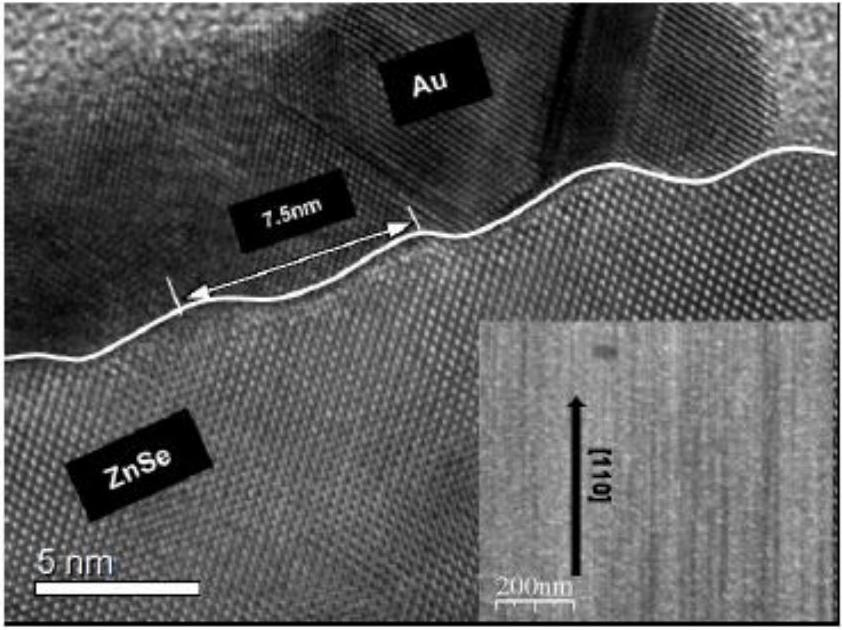
Figure 1: A cross-sectional image of the nanostructured ZnSe surface capped with a Au layer while the inset is an image of its surface without the Au cap.

## Objective

In this experiment, you are going to explore the optical analogy of this phenomenon for samples with 1D structure on a micrometer scale.

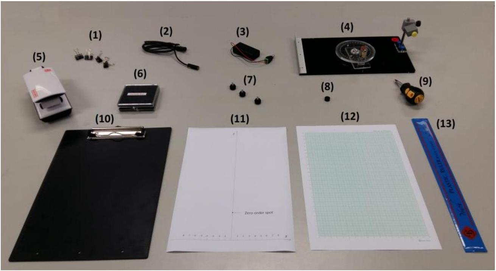
Figure 2: Apparatus and tools for this experiment

List of apparatus and tools
| [1] | 4 Paper clips |
| :--- | :--- |
| [2] | Laser diode |
| [3] | Battery pack with on/off switch |
| [4] | Optical platform with rotary disk, angular scale and laser-diode holder |
| [5] | LED lamp |
| [6] | Sample box containing Samples 1 to 5 |
| [7] | 3 screws for the observation board |
| [8] | Pinhole |
| [9] | Flat-head screw driver |
| [10] | Observation board |
| [11] | Alignment sheet |
| [12] | Graph papers |
| [13] | 30 cm ruler |

Pictures of key apparatus and tools
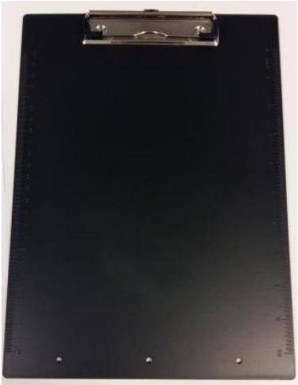

Figure 3: Observation board
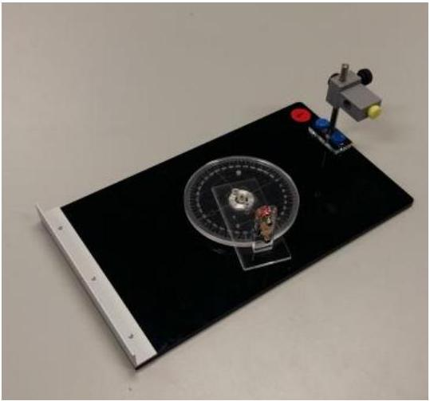

Figure 4: Optical platform with rotary disk, angular scale and laser diode holder
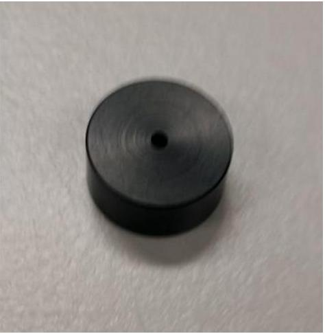

Figure 5: Pinhole

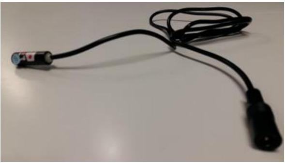
Figure 6: Laser diode with 0.5 mW output at wavelength of 650 nm (Class II).

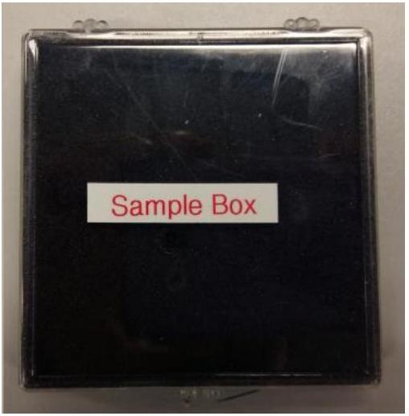
Figure 7: Sample box containing samples labelled 1 to 5

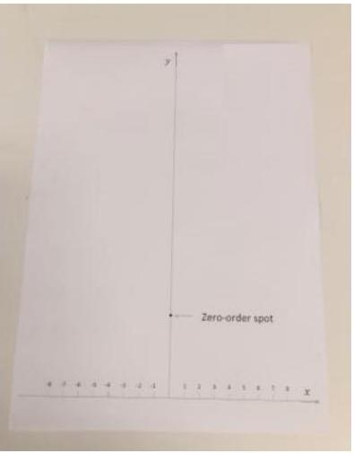
Figure 8: Alignment sheet

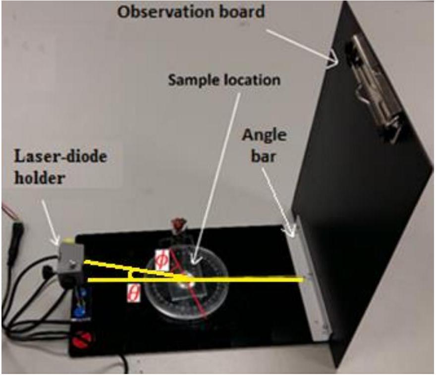
Figure 9: The setup used in this experiment. This shows how the observation board, the sample under test, the optical platform with rotary disk and the laser diode should be assembled. Angle $\boldsymbol{\phi}$ is the rotation angle of the sample. Angle $\boldsymbol{\theta}$ is the incident angle of the laser beam relative to the surface of the sample.

Additional notes for items in the sample box

- All samples used in this experiment are squarely-shaped with dimensions of 1.5 cm × 1.5 cm. They are all labelled from 1 to 5 at one side of each sample holder.
- All sample holders have dimensions of 2.0 cm × 2.0 cm with a reference point marked as a triangle engraved near the center of one edge.
- Before placing each sample on the center of the rotary disk, you should ensure the tip of the arrow on the rotary disk is pointing to the 0° mark of the angular scale. When placing a new sample, try to align it with the square marking on the rotary disk of the platform. The sample position at $\phi=0^{\circ}$ (only refers to Samples 2 to 5) is defined when the reference point is aligned with and facing the 0° mark on the angular scale.

| Sample | Description of the samples |
| :--- | :--- |
| 1 | A plane mirror. |
| 2 | A steel plate having straight scratch grooves parallel to two edges with nonuniform spacing. |
| 3 | A regular grating with the spacing between adjacent grooves equal to $a$, the grating constant. |
| 4 | Similar to Sample 2, but with non-uniformly spaced scratch grooves oriented at an angle of $\boldsymbol{\phi}^{*}$ with respect to the line joining the 0° and 180° marks on the angular scale of the rotary disk. |
| 5 | A steel plate that not only has straight scratch grooves with non-uniform spacing, but also has pre-made grooves with equal adjacent spacing $b$. These pre-made grooves lie perpendicularly to the straight scratch grooves with non-uniform spacing. |

Safety precautions and general advice

1. Caution: Do not stare into the laser beam directly!!
2. Switch off the laser diode when it is not in use to avoid unnecessary draining of the battery.
3. Always keep the samples in an upright position. Avoid any contact with the surface of the samples.
4. Always hold the edges of the sample holder with your hands, when transferring the samples.

Initial adjustments / procedures

1. Construct the experimental setup as shown in Figure 9. The observation board can be attached to the rotary disk using the three screws, as shown in Figure 10.

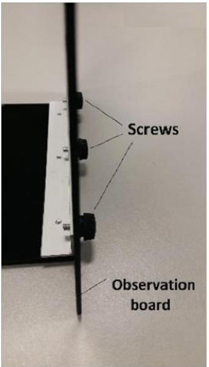
Figure 10: The observation board can be attached to the rotary disk using the three screws.
2. Mount the laser diode on the laser-diode holder. [Note: Do not over-tighten the yellow screw when securing the laser diode to the holder; otherwise the laser diode may get damaged.]
3. Connect the battery pack to the laser diode as shown in Figure 11.

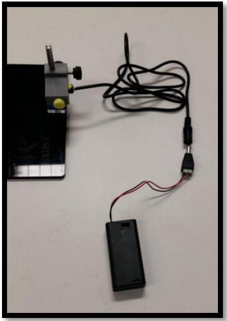
Figure 11: Laser diode connected to the battery pack.

4. Attach a piece of paper to the observation board to observe the light emitted by the laser diode, then adjust the aperture of the laser diode using a flat-head screw driver to obtain a beam spot of about 1 mm in diameter.
5. Place the laser diode in the laser-diode holder such that its head is about 5 to 10 mm out of the holder.
6. Attach the provided pinhole to the laser diode as shown in Figure 12, so that the size of the beam spot can be further reduced.

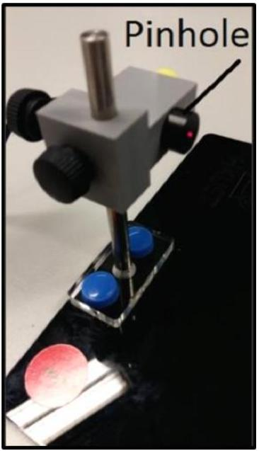
Figure 12: Laser diode with the pinhole attached.
7. This experiment requires that the horizontal projection of the laser beam must be aligned with the $0^{\circ}$ and $180^{\circ}$ marks on the angular scale and the laser beam must hit on the center of the sample being studied. These can be achieved by adjusting the location and tilting angle of the laser-diode holder with the screws as shown in Figure 13.

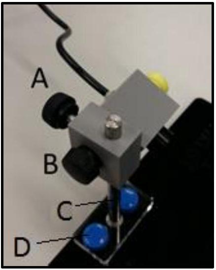
Figure 13: The location and the tilting angle of the laser-diode holder can be adjusted with the screws labelled. Screw 'A' allows the height of the laser beam to vary. Screw 'B' allows the laser beam to be tilted. Screws 'C' and 'D' allow the laser-diode holder to be adjusted horizontally.

## Experiment

Part A: Alignment of the setup
Construct the experimental setup based on Figure 9. Note that the distance $D$ between the observation board and the center of the rotary disk has been fixed at 15 cm. Place Sample 1 at the center of the rotary disk following the procedure as described in the additional notes for items in the sample box (Page 3). Attach the alignment sheet to the observation board with the $x$-axis matching with the top edge of the angle bar holding the observation board (This can be done by folding the portion of the paper below the marked $x$-axis backward). The $x$ axis is defined in this way because the experimental setup is designed in a way that the surfaces of all the samples sitting on the rotary disk are aligned with the top edge of this angle bar. In addition, the origin of the $x$-axis must be aligned with the $180^{\circ}$ mark on the angular scale. In this experiment, the incident angle $\theta$ of the laser beam is fixed at a certain value. Adjust the height and tilting angle of the laser diode so that the laser beam hits the center of Sample 1 and the spot of the reflected laser beam overlaps with the "zero-order spot" marked on the alignment sheet.

| Tasks |  | Mark |
| :--- | :--- | :--- |
| A1 | Measure the height of the "zero-order spot" $h$, from the origin of the $x$-axis. Determine the incident angle $\theta$ of the laser beam from $D$ and $h$. Write down the values of $h$ in cm and $\theta$ in degrees to three significant figures in the corresponding table in the answer sheet. | 0.6 |

Part B: Diffraction patterns from Sample 2
Replace Sample 1 with Sample 2 with the reference point on the sample holder aligned with and facing the 0° mark, in which the direction of non-uniformly spaced scratch grooves of Sample 2 is parallel to the horizontal projection of the laser beam. The angle of rotation $\phi$ of the sample can be adjusted by turning the rotary disk and read from the angular scale.

Attach a graph paper to the observation board. Ensure that the bottom axis of the graph paper matches with the top edge of the angle bar holding the observation board (This can be done by folding the portion of the paper below its bottom axis backward). In addition, the origin of the $x$-axis must be aligned with the $180^{\circ}$ mark on the angular scale.

| Tasks |  | Mark |
| :--- | :--- | :--- |
| B1 | Record the diffraction patterns on the graph paper for $\phi=0^{\circ}, 30^{\circ}, 60^{\circ}$ and $90^{\circ}$ of the rotary disk and write down the corresponding angle of rotation $\phi$ next to each pattern. Write down "\# 2" at the top of this graph paper. | 0.8 |

## Part C: Diffraction patterns from Sample 3

The experiments in this and the next tasks will help you to understand the physics behind the diffraction patterns observed in Task (B1). Remove Sample 2 from the rotary disk and replace it with Sample 3 with the reference point on the sample holder aligned with and facing the 0° mark. For the starting position of Sample 3 (i.e. $\phi=0^{\circ}$ ), the direction of the grating lines is parallel to the horizontal projection of the laser beam.

Attach a graph paper to the observation board. Ensure that the bottom axis of the graph paper matches with the top edge of the angle bar holding the observation board as described in Part (B). In addition, the origin of the $x$-axis must be aligned with the $180^{\circ}$ mark on the angular scale.

| Tasks |  | Marks |
| :--- | :--- | :--- |
| C1 | Mark the centers of the diffraction spots from Sample 3 for $\phi=0^{\circ}, 30^{\circ}, 60^{\circ}$ and $90^{\circ}$ on the graph paper and write down the corresponding angle of rotation $\phi$ next to each pattern. Write down "\# 3" at the top of this graph paper. | 0.8 |

After completing Tasks (B1) and (C1), you should have realized that the reflected diffraction patterns from Sample 2 are continuous while those from Sample 3 are discrete. The reason is that since the spacing between the neighboring straight scratch grooves of Sample 2 is nonuniform, so it is like a grating with its grating constant covers various values. Thus, its diffraction patterns follow the general shapes of the diffraction patterns from a regular grating (like those of Sample 3), however, the diffraction spots become broadened and form the continuous patterns as observed.

## Part D: Theory behind the reflected diffraction patterns from Sample 3

The origin of the reflected diffraction patterns from a regular grating like Sample 3 can be understood with wave optics. In this experiment, we define the $x-y-z$ coordinate system with the origin at the center of the sample as shown in Figure 14.

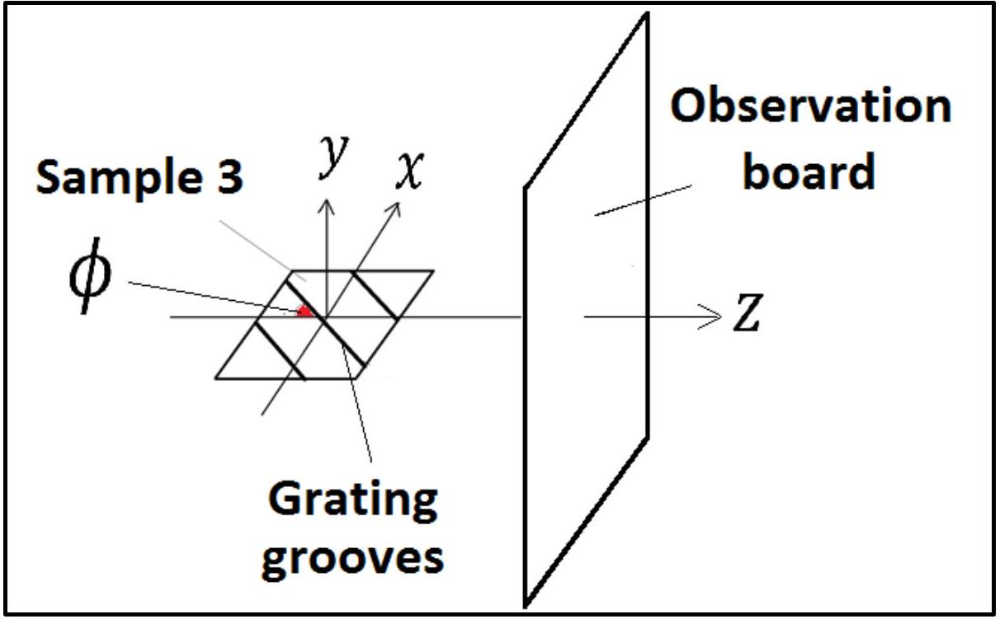
Figure 14: The definition of the $\boldsymbol{x}-\boldsymbol{y}-\boldsymbol{z}$ coordinate system used in this task, in which $\boldsymbol{\phi}$ is the rotation angle of the sample, with the observation board perpendicular to the $z$-axis.

Using wave optics, one can derive the following equations for the reflected diffraction patterns from Sample 3,

$$
\begin{aligned}
y^{2} & =\frac{(D \cos \phi+x \sin \phi)^{2}}{\cos ^{2} \theta \cos ^{2} \phi}-x^{2}-D^{2} \\
x & =\frac{D m \lambda \cos \phi}{a \cos \theta-m \lambda \sin \phi}
\end{aligned}
$$

where $\lambda$ is the wavelength of the incident laser beam and $m$ is the order number of diffraction. One can predict the $x$ and $y$ co-ordinates of the diffraction spots as a function of $\phi$ using Equations (1) and (2), which can be demonstrated to be consistent with the observed patterns recorded in Task (C1).

Based on Equations (1) and (2), the diffraction spots for $\phi=90^{0}$ should lie along the $y$-axis at $x=0$ with their y-coordinates expressed by the following equation:

$$
y=D \sqrt{\frac{a^{2}}{(a \cos \theta-m \lambda)^{2}}-1}
$$

| Tasks |  | Marks |
| :--- | :--- | :--- |
| D1 | Equation (3) can be rearranged to obtain a quadratic equation for the grating constant $a$ of Sample 3, as $A a^{2}+B a+C=0 .$   Derive the expressions for $A, B$ and $C$. Enter your results in the corresponding table in the answer sheet. | 0.9 |

| D2 | By solving this quadratic equation and using the measured $y$ values of the diffraction spots for Sample 3 at $\phi=90^{0}$ (See Task (C1)), together with the known values of $D, \theta$ and $\lambda$, determine the grating constant $a$ of Sample 3 in meters to three significant figures for each diffraction order from the 1st order $(m=1)$ up to the 6th order $(m=6)$ [Hints: These orders correspond to the six spots above the zero-order spot]. Enter your results in the corresponding table in the answer sheet. | 1.8 |
| :--- | :--- | :--- |
| D3 | Calculate the mean for the grating constant $a$ in meters to three significant figures and the standard error of the mean. Enter your results in the corresponding table in the answer sheet. | 0.8 |

Part E: Determination of the unknown angle $\boldsymbol{\phi}^{*}$ for Sample 4
Replace Sample 3 with Sample 4 with the reference point on the sample holder aligned with and facing the 0°mark. In placing Sample 4 onto the rotary disk, the side of its sample holder close to the reference point should be perpendicular to the laser beam.

Attach a graph paper on the observation board. Ensure that the bottom axis of the graph paper matches with the top edge of the angle bar holding the observation board (This can be done by folding the portion of the paper below its bottom axis backward). In addition, the origin of the $x$-axis must be aligned with the $180^{\circ}$ mark on the angular scale.

| Tasks |  | Marks |
| :--- | :--- | :--- |
| E1 | Along the continuous diffracted curve of Sample 4 projected on the graph paper, measure the $y$-coordinates in cm for ten points starting from $x=-1.0 \mathrm{~cm}$ to 3.5 cm with a step of 0.5 cm. Enter your results in the corresponding table in the answer sheet. | 0.6 |
| E2 | Based on Eq. (1) given in Task (D), construct a linear equation in the form of $M(y, x, D, \theta)=I(D)+S\left(\phi^{*}\right) x .$   Determine the functional forms for $M(y, x, D, \theta), I(D)$ and $S\left(\phi^{*}\right)$. Plot $M$ against $x$, using the data recorded in E1. Determine the unknown angle $\phi^{*}$ in degrees from this graph. Write down all the functional forms and the value of $\phi^{*}$ in the corresponding table in the answer sheet. | 1.6 |

Part F: Diffraction patterns from Sample 5
Replace Sample 4 with Sample 5 with the reference point on the sample holder aligned with and facing the $0^{\circ}$ mark. The geometry of Sample 5 is shown in Figure 15. For the starting position of Sample 5, the direction of non-uniformly spaced scratch grooves is parallel to the horizontal projection of the laser beam.

Attach a graph paper to the observation board. Ensure that the bottom axis of the graph paper matches with the top edge of the angle bar holding the observation board (This can be done by folding the portion of the paper below its bottom axis backward). In addition, the origin of the $x$-axis must align with the $180^{\circ}$ mark on the angular scale.

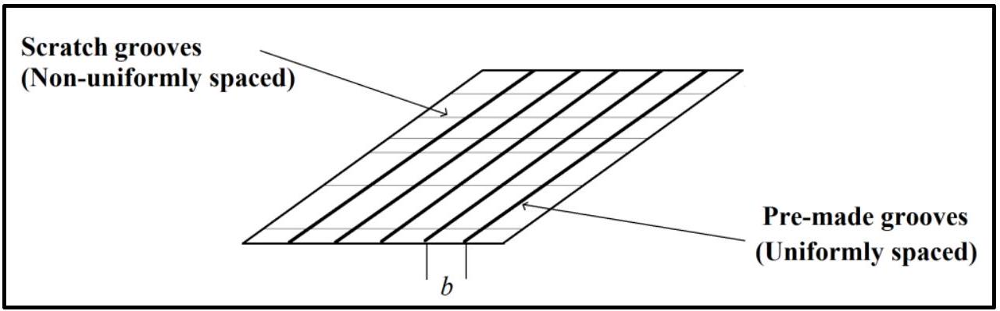
Figure 15: The structure of Sample 5, where the scratch grooves are non-uniformly spaced and the premade grooves are uniformly spaced. The adjacent spacing between the pre-made grooves is $\boldsymbol{b}$.

| Tasks |  | Marks |
| :--- | :--- | :--- |
| F1 | Record the diffraction patterns you observed for $\phi=0^{\circ}, 30^{\circ}, 60^{\circ}$ and $90^{\circ}$ on separate graph papers for each value of $\phi$. At the top of each graph paper, put down '\#5' and the corresponding $\phi$ value. It is expected that you could observe more than 10 diffraction orders. However, you are required to record only three relatively brighter orders on each graph paper. | 0.8 |

The sample structure of Sample 5 can be considered as a combination of Sample 2 and Sample 3, where the uniformly-spaced pre-made grooves are placed perpendicularly to the scratch grooves with non-uniform spacing. This is an optical analogy of the nano-grating as described in the introduction.

| Tasks |  | Marks |
| :--- | :--- | :--- |
| F2 | With this understanding, estimate the spacing $b$ in meters of the uniformly spaced premade grooves of Sample 5 using the recorded diffraction pattern for $\phi=0^{\circ}$ from Task (F1). Enter the value of $b$ in the answer sheet.   [Note that in estimating the value of $b$, you are only required to take the measured data of the first diffraction order and the estimated $b$ should be rounded up to three significant figures.] | 1.6 |

Part G: Determination of the lattice-plane spacing for ZnSe
As mentioned in the introduction, the above phenomenon was firstly discovered on the reflection high energy electron diffraction (RHEED) patterns of a nanostructured ZnSe surface. Such a surface has a one-dimensional (1D) modulation in nanoscale with nonuniform spatial separation, as well as having periodic atomic lattice planes perpendicular to these nano-grooves. Figure 16 shows the RHEED pattern of such a nanostructured ZnSe surface when the electron-beam is perpendicular to the nano-grooves with non-uniform spacing (Hint: With respect to the periodic atomic lattice planes, such a condition corresponds to $\phi=0^{\circ}$ )

Note that the spacing of the streaks in this figure, which can be measured using the given scale below the RHEED pattern, matches exactly with the actual diffraction pattern projected on the fluorescence screen (an analogy to the observation board used in this experiment).

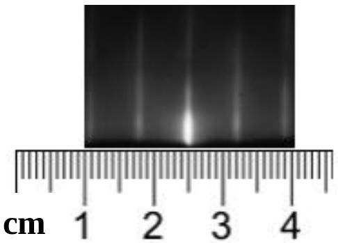
Figure 16: The reflection high energy electron diffraction (RHEED) pattern from a nano-structured surface of ZnSe, when the electron-beam is perpendicular to the nano-grooves with non-uniform spacing.

In taking the diffraction pattern shown in Figure 16, the accelerating voltage of the electron gun was set to be $V=13,000$ volts. The corresponding wavelength $\lambda$ of the high-energy electrons incident to the center of the sample surface can be calculated by

$$
\lambda=\frac{12.247 \times 10^{-10}}{\sqrt{V\left(1+10^{-6} V\right)}}[\mathrm{m}],
$$

where the relativistic effect has been taken into account.
The incident angle of the electron beam to the surface of the ZnSe sample is $\theta \approx 0^{\circ}$ and the distance between the fluorescence screen and the incident spot of the electrons on the nanostructured ZnSe surface is $D=26 \mathrm{~cm}$.

| Tasks |  | Marks |
| :--- | :--- | :--- |
| G1 | For the ZnSe sample, based on Figure 16 and the experimental conditions given above, determine the lattice-plane spacing $a^{*}$ of the periodic atomic lattice planes that are perpendicular to the nano-grooves with non-uniform spacing, in meters to three significant figures. Enter your result in the corresponding table in the answer sheet. | 1.7 |
