## Reflection Phase Shift of Metal

(Total marks: 8.0)

## Introduction

It is known that natural materials have refractive indexes $(n)$ larger than that of vacuum ( $n>$ $n_{0}=1$ ). However, meta-materials (artificial materials with nano-scale structures) can exhibit exotic phenomena, such as negative refraction which can be explained by considering negative effective refractive index. In general, the refractive index of a material, for instance metal, can also be a complex number when there is light absorption.

A simple method to study complex refractive index is by measuring the phase shift $\phi$ when a light beam is being reflected from the surface of a material. In optics, the phase shift due to reflection from a surface is important for many applications especially those in holographic measurements.

For ordinary glass, the reflection phase shift $\phi$ for normal incidence is 180° (or $\pi$ in radian). However, $\phi$ can take different values for metals, depending on the absorptions of the metals. Phase measurement in optics is challenging and high precision is required. Many sophisticated techniques or methods have been developed for optical phase measurements. However, they are too complicated to be implemented for high school students. Here, we introduce a simple and inexpensive approach.

## Objective

To study the phase shift of light reflected from Titanium (Ti) surface using Fabry-Perot laser interferometry.

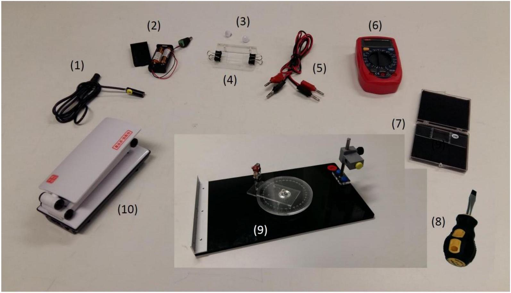
Figure 1: Apparatus for this experiment

## List of apparatus

| [1] | Laser diode |
| :--- | :--- |
| [2] | Battery pack with batteries for the laser diode |
| [3] | White-color-capped screws for sample holder |
| [4] | Sample holder with two paper clips |
| [5] | Wires with banana connectors |
| [6] | Digital multi-meter |
| [7] | Sample box with one Titanium (Ti)-coated Fabry-Perot etalon with specific sample number |
| [8] | Flat-head screw driver |
| [9] | Optical platform with rotary disk, turntable detector holder, fixed angular scale, and laser diode holder |
| [10] | LED lamp |

## Description of apparatus

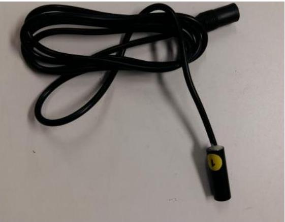
Figure 2: Laser diode with 0.5 mW output at wavelength of 650 nm (Class II)

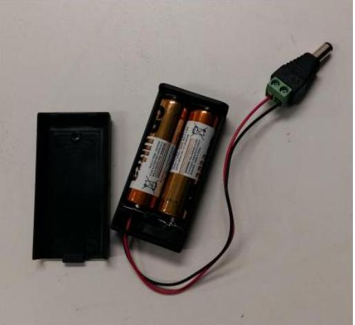
Figure 3: Battery pack with $2 \times 1.5 \mathrm{~V}$ AA batteries and outlet plug for the laser diode

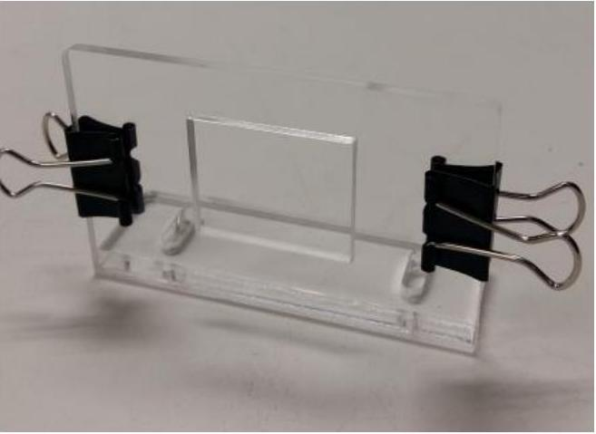
Figure 4: Sample holder with two paper clips

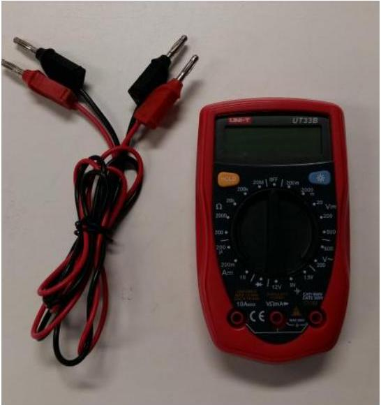
Figure 5: Digital multi-meter and wires with banana connectors

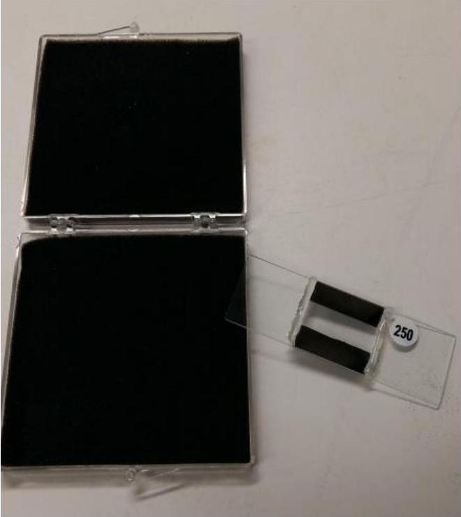
Figure 6: Sample box and one Ti-coated Fabry-Perot (FP) etalon (for illustration purpose, the sample number in this figure is \#250)

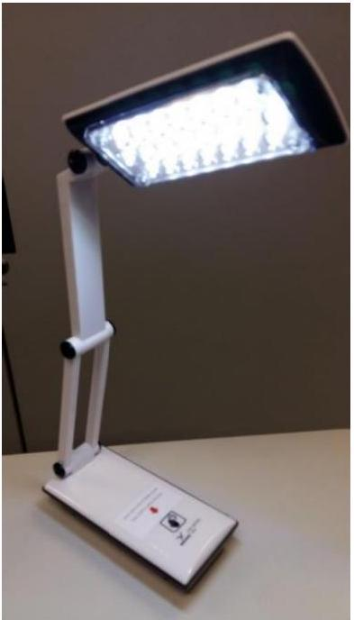
Figure 9: LED lamp for reading and writing

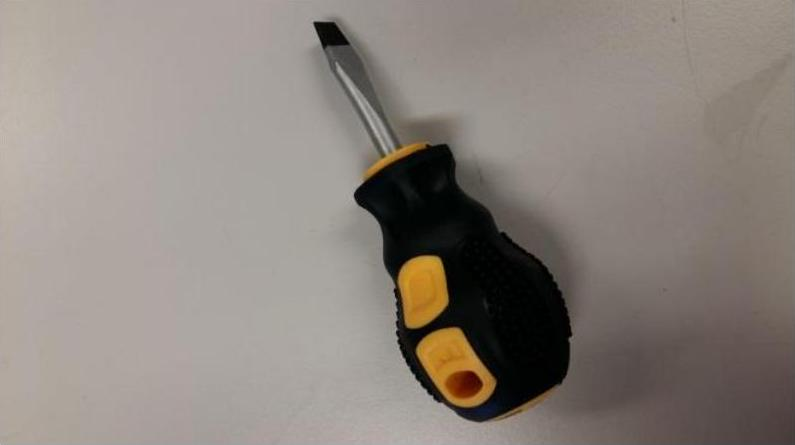
Figure 7: Flat-head screw driver for adjusting the beam size of the laser diode

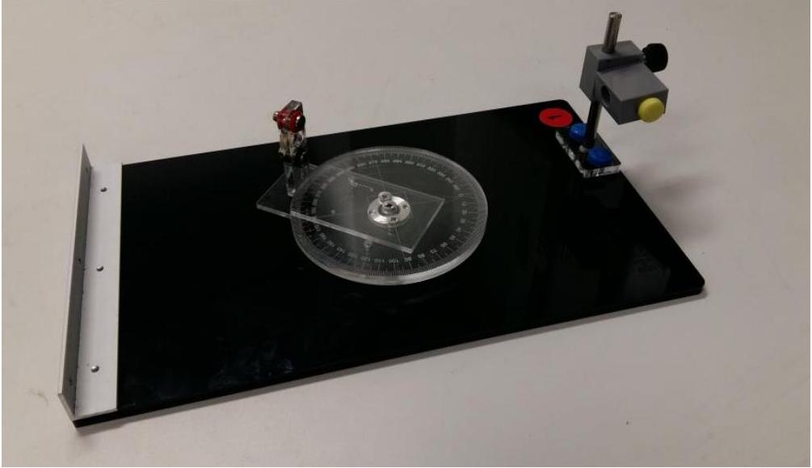
Figure 8: Optical platform consisting of a rotary disk, a turntable detector holder, a fixed angular scale, and a laser diode holder

Theory
Consider an ideal air-gap Fabry-Perot (FP) etalon as shown in Figure 10. The etalon consists of a top thick glass plate (with refractive index $n_{\mathrm{g}}$ ) and a bottom sample plate (with refractive index $n_{\mathrm{s}}$ ) sandwiching a thin air-gap ( $L \sim 5$ micron) in-between.

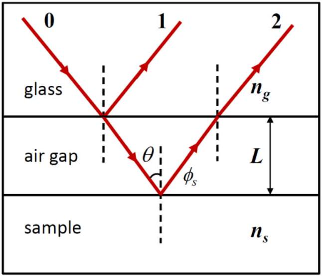
Figure 10: Light reflections from an ideal air-gap Fabry-Perot etalon consisting of a top glass plate and a bottom sample plate.

We use a two-beam interference approximation to model the air-gap etalon. A light beam (beam 0 ) incident on the top glass plate, neglecting the reflection from the air-glass interface of the top glass, is partially reflected (beam 1) and partially transmitted (refracted) at the glass-air interface. The transmitted (refracted) beam then gets reflected at the air-sample interface and then transmitted (refracted) through the top glass plate, which is labeled as beam 2 shown in Figure 10. For beam 2, the reflection at the air-sample interface picks up an additional phase shift $\phi_{\mathrm{s}}$ while there is no phase shift at other interfaces. The resulting intensity of reflected light $I(\theta)$ for incident angle $\theta$ is the superposition of beams 1 and 2 given by:

$$
I(\theta)=I_{1}+I_{2}+2 \sqrt{I_{1} I_{2}} \cos \left(2 k L \cos \theta+\phi_{\mathrm{s}}\right),
$$

where $I_{1}$ and $I_{2}$ are the intensities of beams 1 and 2, respectively, $k=\frac{2 \pi}{\lambda}$ is the wavenumber and $\lambda$ is the wavelength of the incident light. Equation (1) exhibits intensity peaks and troughs as a function of incident angle $\theta$ for fixed wavelength $\lambda$ and air-gap spacing $L$. In this experiment, we fix the polarization direction of the incident light and neglect polarization effects when the beam is reflected/refracted at the interfaces. Moreover, we use a Titanium (Ti)-coated glass plate as the bottom sample plate of the FP etalon.

## Preparatory procedures/adjustments

1. If you have chosen to do experiment E1 first, remember to remove the observation board and also the pin hole for E1 before assembling the apparatus for this experiment E2.
2. CAUTION: DO NOT LOOK DIRECTLY AT THE LASER LIGHT OF THE LASER DIODE!!
3. Install the laser diode into the circular hole of the laser holder as shown in Figure 11. Fasten the laser diode by using the yellow-color-capped screw. Make sure the body of the laser head is horizontal with the attached yellow label (see Figure 2 the laser diode with the yellow label) facing up (for setting the polarization of the laser light in the vertical direction). [Note: Do not over-tighten the (yellow-color-capped) screw of the laser holder; otherwise it will damage the laser diode!]

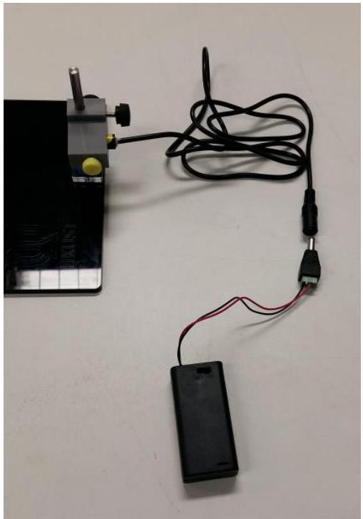
Figure 11: Laser diode mounted inside the laser holder

4. Connect the battery pack to the laser diode as shown in Figure 11 and switch on the laser diode.
5. It is desirable to have the laser diode to form a beam spot about 1 mm in diameter at a distance of 20 cm. To check the beam size, place a piece of paper at about 20 cm from the laser diode and observe the spot size of the laser beam emitted by the laser diode. Adjust the aperture of the laser diode using a flat-head screw driver to obtain a spot size about 1 mm in diameter if necessary.
6. Connect the output terminals of the photo-detector pre-mounted on the detector holder to the multi-meter CAREFULLY using the electric wires as shown in Figure 12. The photo-detector is a photodiode connected in parallel with a resistor such that the current produced by the photodiode when illuminated with light can be recorded by measuring the voltage across the resistor.

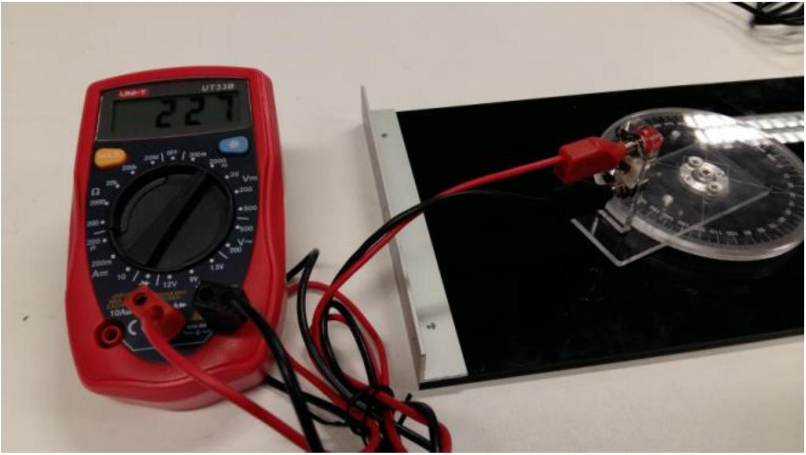
Figure 12: Photo-detector connected to the multi-meter

7. Adjust the position of the laser diode such that the laser beam shoots horizontally over the 0° mark of the angular scale, crossing over the center of the rotary disk, and hits directly onto the detector positioned at the 180° mark of the angular scale (as shown in Figure 13). You can turn on the multi-meter to monitor the intensity (in terms of voltage) of the laser beam to obtain an optimal condition. [Note: Remember to turn off the laser diode when you are done with this step!]

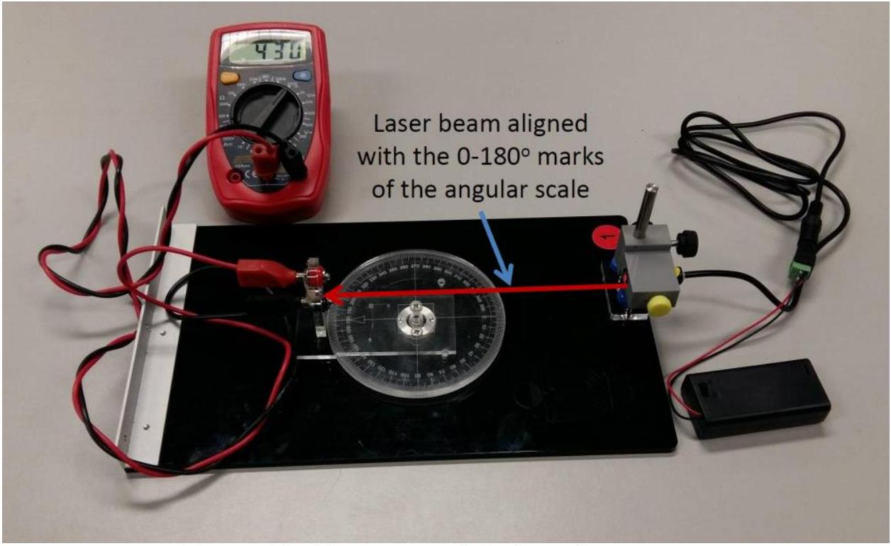
Figure 13: Alignment of the laser beam
8. Mount the sample holder to the rotary disk on the optical platform using the white-colorcapped screws as shown in Figure 14.

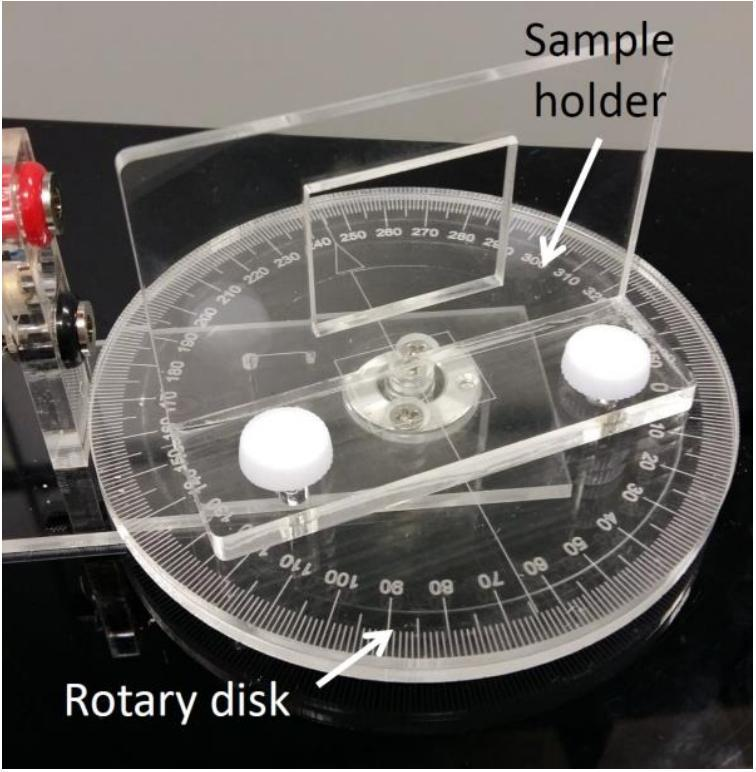
Figure 14: Sample holder mounted on the rotary disk

9. Then mount the Ti-coated etalon with the sample number (here \#250) upright to the sample holder using the two paper clips provided such that the bottom glass plate of the sample is in contact with the wall surface of the holder as shown in Figure 15.

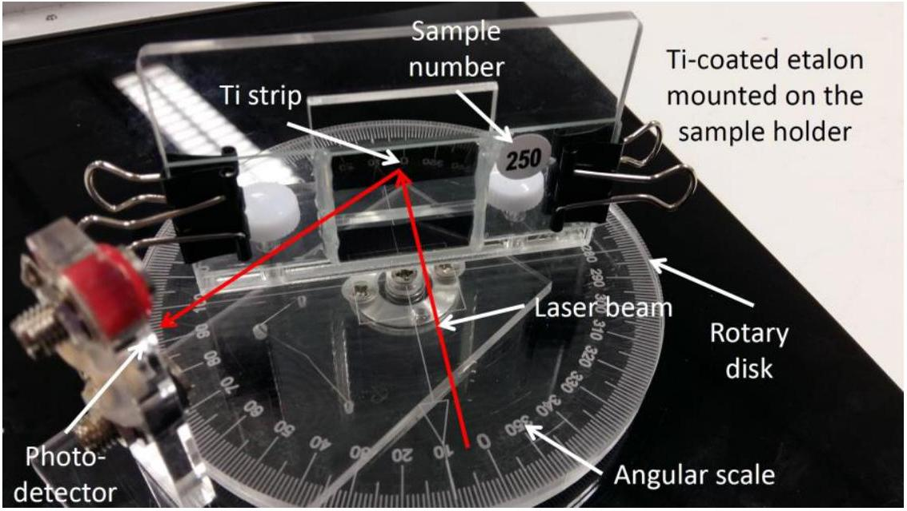
Figure 15: Sample mounted on the sample holder
10. Turn on the laser diode and adjust the vertical position of the etalon so that the laser beam shoots at the middle area of the top or the bottom Ti strip of the etalon and gets reflected to the photo-detector as shown in Figure 15. Then adjust the position of the photo-detector for maximum signal (in terms of the voltage measured by the multimeter). Furthermore, you have to adjust the position of the sample holder using the two white-color-capped screws such that the Ti strip rotates with the same axis as the rotary disk, i.e. they are coaxial.

11. Now rotate the sample holder together with the mounted Ti-coated etalon such that the laser beam makes an incident angle $\theta$ with respect to the normal of the sample surface as indicated by the angular scale. Then move the photo-detector to an angle of about $2 \theta$ and adjust the angular position of the photo-detector for obtaining a maximum signal from the multi-meter. After completing all the above steps/procedures, the setup is now ready for the experiment.
Note: All numerical values and answers should have three significant figures.

## The Experiment

| Tasks | Description | Marks |
| :--- | :--- | :--- |
| 1 | Measure the reflection intensity of the Ti-coated etalon in terms of voltage as a function of incident angle $\theta$ at fine enough angular steps, starting at $\theta \sim 4^{\circ}$ such that as many intensity peaks as possible are recorded. Enter your data in Table E2_1. | 1.0 |
| 2 | In order to reduce errors resulted from the mis-alignment of the laser beam with respect to the sample holder, and also with respect to the angular scale of the optical platform, carry out similar measurements for incident angles on the other side of the 0° mark of the angular scale by first turning the sample to face the opposite side of the 0° mark of the angular scale and then moving the photo-detector accordingly for measuring intensity of the reflected laser beam. Enter your data in Table E2_2. | 1.0 |
| 3 | Plot the reflection intensity as a function of incident angle $\theta$ on a graph paper using the recorded data in Table E2_1 and label the graph as 'Graph E2_1'. Plot a similar graph for the data in Table E2_2 on a different graph paper and label the graph as 'Graph E2_2'. Show the variation of the reflection intensity by drawing a smooth curve fitting the data points in Graph E2_1 as well as in Graph E2_2. | 0.9 |
| 4 | Identify the peaks of the reflection intensity and label them with sequential peak numbers in Graphs E2_1 and E2_2, starting with the peak having the largest incident angle. | 0.2 |
| 5 | Derive the condition for the reflection intensity peaks in terms of $L, \theta, \phi_{\mathrm{s}}, \lambda$ using Equation (1). Label this condition as Equation (2). | 0.3 |
| 6 | Choose a suitable function of $\theta, X(\theta)$, as a new independent variable such that the reflection intensity peaks in Graphs E2_1 and E2_2 will be evenly spaced in a graph of reflection intensity vs $X(\theta)$. Then calculate the corresponding values of $X(\theta)$ and insert them, as a new column, to Tables E2_1 and E2_2. | 0.4 |
| 7 | Construct Table E2_3 consisting of the peak number and the corresponding incident angle for the data in Tables E2_1 and E2_2. You may label them with the notations of LHS (lefthand side) and RHS (right-hand side), respectively, i.e. $\theta_{\text {LHS }}$ and $\theta_{\text {RHS }}$. Then, for each matched reflection intensity peak, calculate the average values of $\theta_{\mathrm{LHS}}$ and $\theta_{\mathrm{RHS}}$, and label the average as $\|\theta\|_{\text {avg }}$ and $X\left(\|\theta\|_{\text {avg }}\right)$ and enter the results as new columns in Table E2_3. [Note: The peak numbers in Tables E2_1 and E2_2 can be different. Make sure you match the corresponding peaks obtained from Graphs E2_1 and E2_2.] | 0.6 |
| 8 | Plot a graph on a separate graph paper to show the relationship between the peak number vs. $X\left(\|\theta\|_{\text {avg }}\right)$. Label this graph as 'Graph E2_3'. | 0.6 |

| 9 | Draw a straight line through all the data points in Graph E2_3 and then determine the slope and $y$-intercept of this line. [Note: A graphical approach will also be accepted and error analysis is not required.] | 0.4 |
| :--- | :--- | :--- |
| 10 | Rewrite Equation (2) derived in Task 5 to give an expression of the interference order $m$ and the function $X\left(\|\theta\|_{\text {avg }}\right)$ obtained in Task 6. Label this equation as Equation (3a). From Equation (3a), write down the expression of $m$ in terms of $L, \lambda$, and $\|\theta\|_{\text {avg }}$ as Equation (3b). Hence, express the normalized reflection phase $\phi_{\mathrm{s}, \mathrm{n}}=\phi_{\mathrm{s}} / 2 \pi$ in terms of $L, \lambda$, and $\|\theta\|_{\text {avg }}$ as Equation (3c). Write down the range of $\phi_{s, n}$. Then determine the values of $m$ for the peaks from the results obtained in Task 7 and insert them as a new column in Table E2_3. | 1.2 |
| 11 | Plot $m$ vs. $X\left(\|\theta\|_{\text {avg }}\right)$ on Graph E2_3, i.e. the same graph for the plot of peak number vs. $X\left(\|\theta\|_{\text {avg }}\right)$. Draw a line through all data points for this plot. Hence determine the air-gap spacing $L$ of the etalon and also the reflection phase $\phi_{\mathrm{s}}$ of the Ti. [Note: Again, graphical solution is acceptable and error analysis is not required.] | 1.4 |

END
