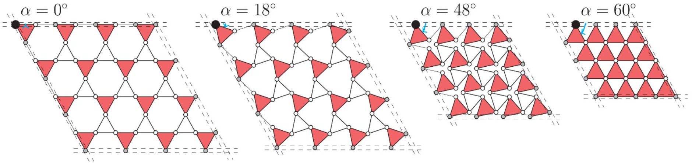
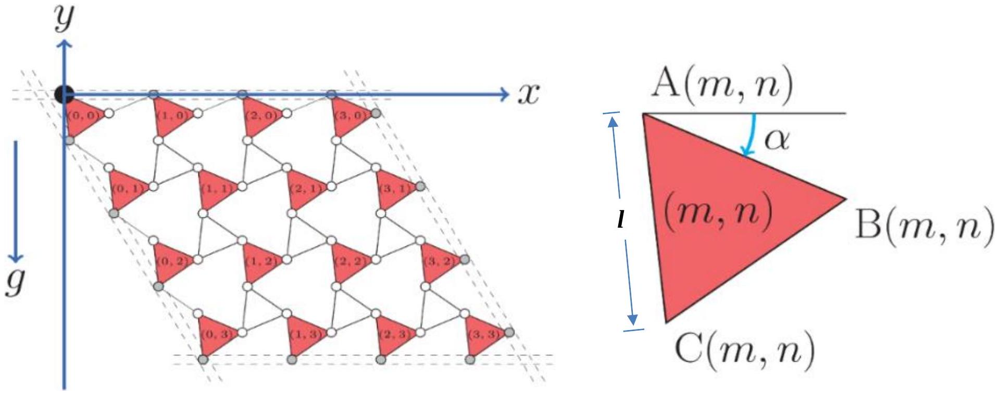
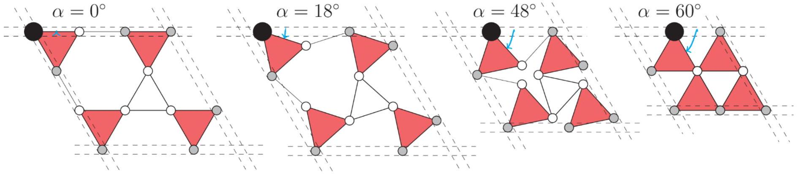
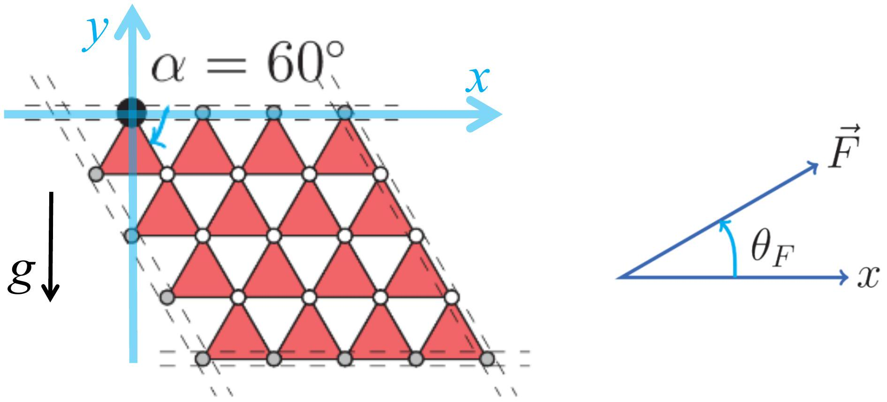

## Mechanics of a Deformable Lattice (Total Marks : 20)

Here we study a deformable lattice hanging in gravity which acts as a deformable physical pendulum. It has only one degree of freedom, i.e. only one way to deform it and the configuration is fully described by an angle $\alpha$. Such structures have been studied by famous physicist James Maxwell in $19{ }^{\text {th }}$ century, and some surprising behaviors have been discovered recently.

As shown in the figure 1, $N^{2}$ identical triangular plates (red triangle) are freely hinged by identical rods and form an $N \times N$ lattice $(N>1)$. The joints at the vertices are denoted by small circles. The sides of the equilateral triangles and the rods have the same length $l$. The dashed lines in the figure represent four tubes; each tube confines $N$ vertices (grey circles) on the edge and the $N$ vertices can slide in the tube, i.e. the tube is like a sliding rail.

The four tubes are connected in a diamond shape with two angles fixed at 60° and another two angles at 120° as shown in Figure 1. Each plate has a uniform density with mass $M$, and the other parts of the system are massless. The configuration of the lattice is uniquely determined by the angle $\alpha$, where $0^{\circ} \leq \alpha \leq 60^{\circ}$ (please see the examples of different angle $\alpha$ in Figure 1). The system is hung vertically like a "curtain" with the top tube fixed along the horizontal direction.

The coordinate system is shown in Figure 2. The zero level of the potential energy is defined at $y=0$. A triangular plate is denoted by a pair of indices $(m, n)$, where $m, n=0,1,2$, $\cdots, N-1$ representing the order in the $x$ and $y$ directions respectively. $\mathrm{A}(m, n), \mathrm{B}(m, n)$ and $\mathrm{C}(m, n)$ denote the positions of the 3 vertices of the triangle $(m, n)$. The top-left vertex, A(0, 0) (the big black circle), is fixed.

The motion of the whole system is confined in the $x-y$ plane. The moment of inertia of a uniform equilateral triangular plate about its center of mass is $I=M l^{2} / 12$. The free fall acceleration is $g$. Please use $E_{\mathrm{k}}$ and $E_{\mathrm{p}}$ to denote kinetic energy and potential energy respectively.

Figure 1

Figure 2

Section A: When $N=2$ (as shown in figure 3):

Figure 3

| A1 | What is the potential energy $E_{\mathrm{p}}$ of the system for a general angle $\alpha$ when $N=2$ ? | 2 points |
| :--- | :--- | :--- |

| A2 | What is the equilibrium angle $\alpha_{\mathrm{E}}$ of the system under gravity when $N=2$ ? | 1 point |
| :--- | :--- | :--- |

| A3 | The system follows a simple harmonic oscillation under a small perturbation from equilibrium. Calculate the kinetic energy of this system in terms of $\Delta \dot{\alpha} \equiv \mathrm{d}(\Delta \alpha) / \mathrm{d} t$. Calculate the oscillation frequency $f_{\mathrm{E}}$ when $N=2$. | 5 points |
| :--- | :--- | :--- |

Section B: For arbitrary $N$ :

| B1 | What is the equilibrium angle $\alpha_{\mathrm{E}}^{\prime}$ under gravity when $N$ is arbitrary? | 3 points |
| :--- | :--- | :--- |

| B2 | Consider the case when $N \rightarrow \infty$. Under a small perturbation of angle $\alpha$, the change of potential energy of the system is $\Delta E_{\mathrm{p}} \propto N^{\gamma_{1}}$, the kinetic energy of the system is $E_{\mathrm{k}} \propto N^{\gamma_{2}}$, and the oscillation frequency is $f_{\mathrm{E}}^{\prime} \propto N^{\gamma_{3}}$. Find the values of $\gamma_{1}, \gamma_{2}$ and $\gamma_{3}$. | 3 points |
| :--- | :--- | :--- |

Section C: A force is exerted on one of the $3 N^{2}$ triangle vertices so that the system maintains at $\alpha_{\mathrm{m}}=60^{\circ}$.

Figure 4

| C1 | Which vertex should we choose to minimize the magnitude of this force? | 1 point |
| :--- | :--- | :--- |

| C2 | What are the direction and magnitude of this minimum force? Describe the direction in terms of the angle $\theta_{F}$ defined in Figure 4. | 5 points |
| :--- | :--- | :--- |
