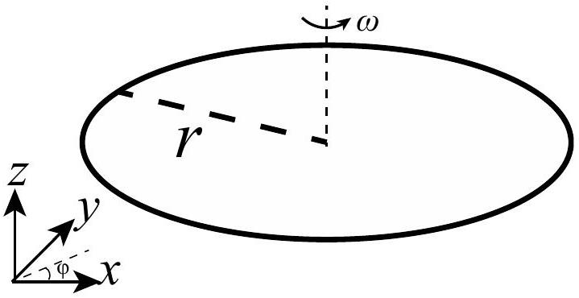
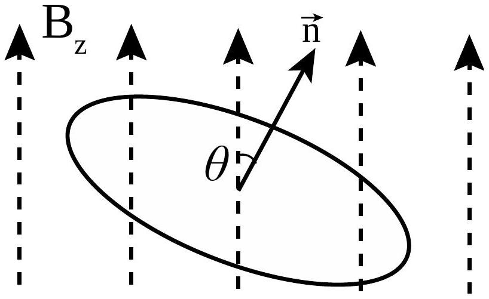
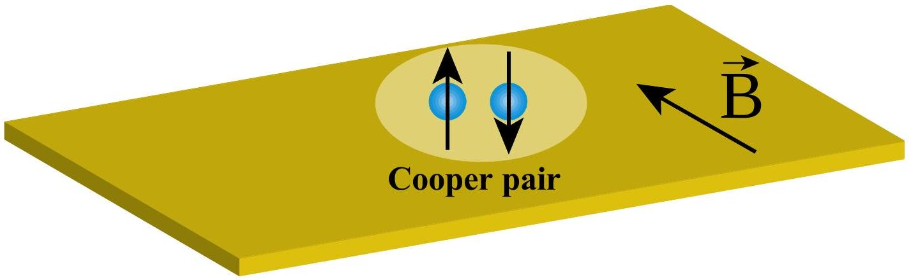
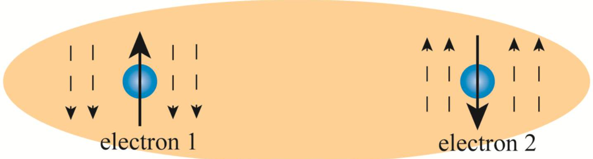

## Magnetic Field Effects on Superconductors (Total Marks: 20)

An electron is an elementary particle which carries electric charge and an intrinsic magnetic moment related to its spin angular momentum. Due to Coulomb interactions, electrons in vacuum are repulsive to each other. However, in some metals, the net force between electrons can become attractive due to the lattice vibrations. When the temperature of the metal is low enough, lower than some critical temperature $T_{\mathrm{c}}$, electrons with opposite momenta and opposite spins can form pairs called Cooper pairs. By forming Cooper pairs, each electron reduces its energy by $\Delta$ compared to a freely propagating electron in the metal which has energy $\frac{p^{2}}{2 m_{\mathrm{e}}}$, where $p$ is the momentum and $m_{\mathrm{e}}$ is the mass of an electron. The Cooper pairs can flow without resistance and the metal becomes a superconductor.

However, even at temperatures lower than $T_{c}$, superconductivity can be destroyed if the superconductor is under the influence of an external magnetic field. In this problem, you are going to work out how Cooper pairs can be destroyed by external magnetic fields through two effects.

The first is called the paramagnetic effect, in which all the electrons can lower their energy by aligning the electron magnetic moments parallel to the magnetic field instead of forming Cooper pairs with opposite spins.

The second is called the diamagnetic effect, in which increasing the magnetic field will change the orbital motion of the Cooper pairs and increase their energy. When the applied magnetic field is stronger than a critical value $B_{\mathrm{c}}$, this increase in energy becomes higher than $2 \Delta$. As a result, the electrons do not prefer forming Cooper pairs.

Recently, a type of superconductor called Ising superconductors was discovered. These superconductors can survive even when the applied magnetic field is as strong as 60 Tesla, comparable to the largest magnetic fields which can be created in laboratories. You will work out why Ising superconductors can overcome both the paramagnetic and the diamagnetic effects of the magnetic fields.
A. An Electron in a Magnetic Field

Let us consider a ring with radius $r$, charge $-e$ and mass $m$. The mass and the charge density around the ring are uniform (as shown in Figure 1).

Figure 1

| A1 | What is the angular momentum $\vec{L}$ (magnitude and direction) of this ring if the ring is rotating with angular velocity $\vec{\omega}$ ? | 2 points |
| :--- | :--- | :--- |
| A2 | The magnitude of the magnetic moment is defined as $\|\vec{M}\|=I A$, where $I$ is the current and $A$ is the area of the ring. What is the relationship between the magnetic moment $\vec{M}$ and the angular momentum $\vec{L}$ of the ring? | 2 points |

Suppose the normal direction of the ring is $\vec{n}$ and it makes an angle $\theta$ with the applied magnetic field as shown in Figure 2.

| A3 | For the ring described in Part (A1), what is the potential energy $U$ of this ring if the ring is placed in a uniform magnetic field $B_{z}$ pointing to the z-direction? You should assume the potential energy to be zero when $\theta=\pi / 2$. Figure 2 | 2 points |
| :--- | :--- | :--- |

| A4 | An electron carries an intrinsic angular momentum, which is called spin. We know that the magnitude of spin in a particular direction is $\frac{\hbar}{2}$, where $\hbar=h / 2 \pi$ and $h$ is the Planck's constant.   What are the values of the potential energy $U_{\text {up }}$ and $U_{\text {down }}$ for electrons with spins parallel and anti-parallel with the applied magnetic field respectively?   Please express your results in terms of the Bohr magneton $\mu_{\mathrm{B}}=\frac{e \hbar}{2 m_{\mathrm{e}}}=5.788 \times 10^{-5} \mathrm{eV} \cdot \mathrm{T}^{-1}$ and the magnetic field strength $B$. | 1 point |
| :--- | :--- | :--- |
| A5 | According to quantum mechanics, the potential energy $\tilde{U}_{\text {up }}$ and $\tilde{U}_{\text {down }}$ are twice the values $U_{\text {up }}$ and $U_{\text {down }}$ found in Part (A4). Assuming that the applied magnetic field is 1 Tesla. What is the potential energy $\tilde{U}_{\text {up }}$ and $\tilde{U}_{\text {down }}$ for an electron with spin parallel and anti-parallel to the applied magnetic field respectively? In the rest of this question, you should use the expressions for $\tilde{U}_{\text {up }}$ and $\tilde{U}_{\text {down }}$ for your calculations. | 1 point |

## B. Paramagnetic effect of the magnetic field on Cooper pairs

In the question below, we consider the paramagnetic effect of an external magnetic field on Cooper pairs (as shown in Figure 3).
Theoretical studies show that in superconductors, two electrons with opposite spins can form Cooper pairs so that the whole system saves energy. The energy of the Cooper pair can be expressed as $\frac{p_{1}^{2}}{2 m_{\mathrm{e}}}+\frac{p_{2}^{2}}{2 m_{\mathrm{e}}}-2 \Delta$, where the first two terms denote the kinetic energy of the Cooper pair and the last term is the energy saved for the electrons to form a Cooper pair. Here, $\Delta$ is a positive constant.

Figure 3

| B1 | Assuming that the effect of the external magnetic field is only on the spins of the electrons, not on the orbital motions of the electrons. What is the energy $E_{\mathrm{S}}$ of the Cooper pair under a uniform magnetic field $\vec{B}=\left(B_{x}, 0,0\right)$ ? Recall that the electrons which form a Cooper pair must have opposite spins. | 1 point |
| :--- | :--- | :--- |
| B2 | In the normal state (non-superconducting state), electrons do not form Cooper pairs. What is the lowest energy $E_{N}$ for the two electrons under a uniform in-plane magnetic field $\vec{B}=\left(B_{x}, 0,0\right)$ pointing to the $x$-direction? Please use the $\tilde{U}_{\text {up }}$ and $\tilde{U}_{\text {down }}$ defined in Part (A5) in your calculations and ignore the effects of the magnetic field on the orbital motions of the electrons. | 1 point |
| B3 | At zero temperature, a system will favor the state with the lowest energy. What is the critical value $B_{\mathrm{P}}$ in terms of $\Delta$, such that for $\|\vec{B}\|>B_{\mathrm{P}}$ superconductivity will disappear? | 1 point |

## C. Diamagnetic effect of the magnetic field on Cooper pairs

In the question below, we are going to ignore the effects of magnetic fields on the spins of the electrons and consider the effects of external magnetic fields on the orbital motions of the Cooper pairs.

At zero temperature, the energy difference between the superconducting state and the normal state for a superconductor in a magnetic field $\vec{B}=\left(0,0, B_{z}\right)$ can be written as

$$
F=\int_{-\infty}^{+\infty} \psi\left(-\alpha \psi-\frac{\hbar^{2}}{4 m_{\mathrm{e}}} \frac{\mathrm{~d}^{2} \psi}{\mathrm{~d} x^{2}}+\frac{e^{2} B_{z}^{2} x^{2}}{m_{\mathrm{e}}} \psi\right) \mathrm{d} x .
$$

Here $\psi(x)$ is a function of position $x$ and independent of $y . \psi^{2}(x)$ denotes the probability of finding a Cooper pair near $x$. Here, $\alpha>0$ is a constant and it is related to the energy saved by forming Cooper pairs. The second and the third terms in $F$ are related to the kinetic energy of the Cooper pairs taking into account the effect of the magnetic field.

At zero temperature, the system prefers to minimize its energy $F$. In this case, $\psi(x)$ takes the form $\psi(x)=\left(\frac{2 \lambda}{\pi}\right)^{\frac{1}{4}} \mathrm{e}^{-\lambda x^{2}}$, with $\lambda>0$.

| C1 | Find $\lambda$ in terms of $e, B_{z}$, and $\hbar$.   The following integrals may be useful: $\int_{-\infty}^{+\infty} \mathrm{e}^{-a x^{2}} \mathrm{~d} x=\sqrt{\frac{\pi}{a}}, \quad \int_{-\infty}^{+\infty} x^{2} \mathrm{e}^{-a x^{2}} \mathrm{~d} x=\frac{1}{2 a} \sqrt{\frac{\pi}{a}} .$   Here $a$ is a constant. | 3 points |
| :--- | :--- | :--- |

| C2 | Work out the critical value of $B_{z}$ in terms of $\alpha$, at which the superconducting state is no longer energetically favorable. | 2 points |
| :--- | :--- | :--- |

## D Ising Superconductors

In materials with spin-orbit coupling (spin-spin couplings can be ignored), an electron with momentum $\vec{p}$ experiences an internal magnetic field $\vec{B}_{1 \perp}=\left(0,0,-B_{z}\right)$. On the other hand, an electron with momentum $-\vec{p}$ experiences an opposite magnetic field $\vec{B}_{2 \perp}=\left(0,0, B_{z}\right)$. These internal magnetic fields act on the spins of the electrons only as shown in Figure 4. Superconductors with this kind of internal magnetic fields are called Ising superconductors.

Cooper pair

Figure 4: Two electrons form a Cooper pair. Electron 1 with momentum $\vec{p}$ experiences internal magnetic field $\vec{B}_{1 \perp}=\left(0,0,-B_{z}\right)$ but electron 2 with momentum $-\vec{p}$ experiences an opposite magnetic field $\vec{B}_{2 \perp}=\left(0,0, B_{z}\right)$. The internal magnetic fields are denoted in dashed arrows.
| D1 | Then what is the energy $E_{\mathrm{I}}$ for a Cooper pair in an Ising superconductor? | 1 point |
| :--- | :--- | :--- |
| D2 | In the normal state of the material with spin orbit coupling, what is the energy $E_{\\|}$for the two electrons under a uniform in-plane magnetic field $\vec{B}_{\\|}=\left(B_{x}, 0,0\right)$ ? (Here the internal magnetic fields still exist and perpendicular to $\vec{B}_{\\|}$. You should also ignore the effects of the in-plane magnetic field on the orbital motions of the Cooper pairs.) | 2 points |
| D3 | What is the critical value $B_{\mathrm{I}}$ such that for $\left\|\vec{B}_{\\|}\right\|>B_{\mathrm{I}}, E_{\\|}<E_{\mathrm{I}}$ ? | 1 point |
