## Vortices in superfluid

## Introduction

Superfluidity is a property of flowing without friction. Everyday experience tells us that motion of an ordinary fluid (say, water at room temperature) is always accompanied by viscous dissipation of energy, so that the flow gradually becomes slower unless it is maintained by external forces. In contrast, superfluid exhibits no loss of kinetic energy: once excited the motion of superfluid can continue indefinitely. Superfluidity was originally discovered experimentally in liquid helium.

We study properties of superfluid helium at zero temperature. It will be treated as an incompressible fluid with density $\rho$. Flow continuity (the fact that the mass flowing into and the mass flowing out of a given infinitesimal volume are equal) implies that the flux of helium velocity $\vec{v}$ through a closed surface is always zero. Superfluid velocity in this aspect is analogous to the magnetic field intensity. By analogy with the magnetic field lines, "streamlines" are tangential to the fluid velocity at each point and their density is proportional to its magnitude.

True superflow has an important property of being irrotational: circulation of superfluid velocity $\vec{v}$ along any closed path within helium is zero

$$
\int_{L} \vec{v} \cdot d \vec{l}=0
$$

This statement must be amended if superfluidity is absent along a thin "vortex filament". The thickness of the filament itself is of approximately atomic dimensions $a$, but the vortex induces long range velocity field in surrounding superfluid: velocity circulation around such filament is the circulation quantum ${ }^{1}$

$$
\left|\int_{L} \vec{v} \cdot d \vec{l}\right|=2 \pi \kappa,
$$

and zero if the path can be contracted to a single point without crossing the vortex, see Fig. 1. This supports the analogy between superflow and the magnetic field created by wires carrying current: superposition of two valid velocity distributions is a valid velocity distribution and the velocity at any point is equal (up to a dimensional factor) to the magnetic field produced by the unit currents running through a system of wires representing vortex filaments.

[^0]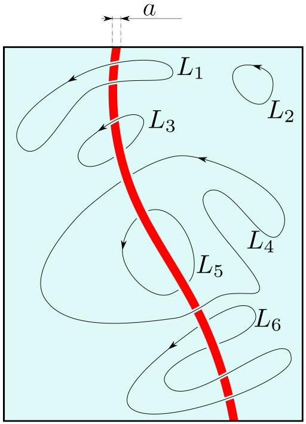
Fig. 1: Vortex filament (red) in superfluid (light blue). Velocity circulations along paths $L_{1}, L_{2}$, $L_{5}$, and $L_{6}$ are all zero, but those for $L_{3}$ and $L_{4}$ are equal to $\pm 2 \pi \kappa$. Note that circulations along $L_{3}$ and $L_{4}$ have opposite signs.

Part A. Steady filament (0.75 points)
Consider a cylindrical beaker (radius $R_{0} \gg a$ ) of superfluid helium and a straight vertical vortex filament in its center Fig. 2.
A. 1 Plot the streamlines. Find out the velocity $v$ at a point $\vec{r}$. 0.25pt
A. 2 Work out the free surface shape (height as a function of coordinate $z(\vec{r})$ ) around 0.5pt the vortex. Free fall acceleration is $g$. Surface tension can be neglected.

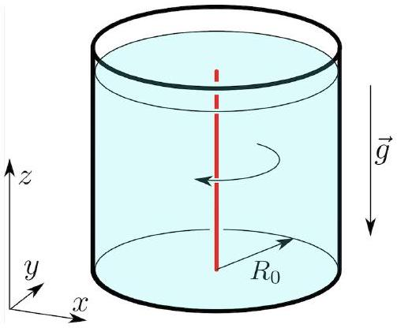
Fig. 2: Straight vortex along the axis of a beaker.

Part B. Vortex motion (1.4 points)
Free vortices move about in space with the flow ${ }^{2}$. In other words each element of the filament moves with the velocity $\vec{v}$ of the fluid at the position of that element.

[^1]As an example, consider a pair of counter-rotating straight vortices placed initially at distance $r_{0}$ from each other, see Fig. 3. Each vortex produces velocity $v_{0}=\kappa / r_{0}$ at the axis of another. As a result, the vortex pair moves rectilinearly with constant speed $v_{0}=\kappa / r_{0}$ so that the distance between them remains unchanged.

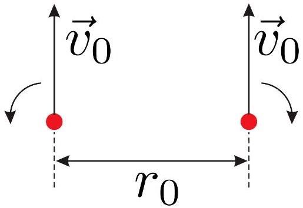
Fig. 3: Parallel vortex filaments with opposite circulations.

B. 1 Consider two identical straight vortices initially placed at distance $r_{0}$ from each other as shown in Fig. 4. Find initial velocities of the vortices and draw their trajectories.

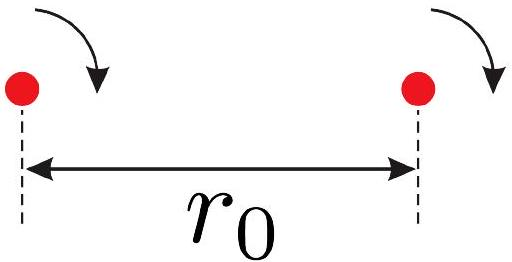
Fig. 4: Parallel vortex filaments with equal circulations.

A beaker of helium (see Part A) is filled with triangular lattice ( $u \ll R_{0}$ ) of identical vertical vortices, see Fig. 5.

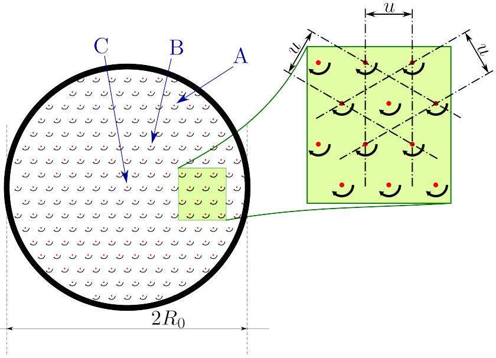
Fig. 5: Triangular lattice of vortices in a beaker. The view from above.

| B. 2 | Draw the trajectories of vortices A, B, and C (located in the center). | 0.15pt |
| :--- | :--- | :--- |
| B. 3 | Find velocity $v(\vec{r})$ of a vortex positioned at $\vec{r}$. | 0.4pt |
| B. 4 | Find the distance $\mathrm{AB}(t)$ between the vortices A and B at time $t$. Treat $\mathrm{AB}(0)$ as given. | 0.35pt |
| B. 5 | Work out the "smoothed out" (omitting the lattice structure) free helium surface shape $z(\vec{r})$. | 0.25pt |

## Part C. Momentum and energy (1.75 points)

The long range velocity field is the major contribution to the energy of a system of vortices, it is insensitive to exact structure of the filament. The filament itself can not be properly described by the macroscopic theory and apparent singularities (infinities) are insignificant. Real physical quantities, such as the energy, of the region inside a thin tube of radius $a$ around the filament should be neglected. Outside of this tube the density of superflow kinetic energy $\rho v^{2} / 2$ (where $\rho=$ const) is analogous to the energy density of the magnetic field $B^{2} /\left(2 \mu_{0}\right)$ - they are both quadratic in respective variables. This analogy together with the correspondence between magnetic field and superfluid velocity generated by vortices (currents) facilitates calculation of the flow energy for a given system. For instance, given the inductance of a circular wire loop $L \approx \mu_{0} R \log (R / a)$, where $R$ is the loop radius and $a$ is wire radius, we get the superfluid vortex loop energy ${ }^{3}$

$$
U \approx 2 R \rho \pi^{2} \kappa^{2} \log (R / a)
$$

Total fluid momentum is also determined by the long range velocity distribution. It is obtained by integration of the momentum density $\rho \vec{v}$. Again, consider a flow generated by a circular vortex loop placed in $x y$ plane. It is obvious from the symmetry considerations, that total momentum has only $z$ component:

$$
P=\int \rho v_{z} d V=\rho \iint \underbrace{\left(\int v_{z} d z\right)}_{q(x, y)} d x d y
$$

The innermost integration is in fact an integration along appropriate paths parallel to $z$-axis, see Fig. 6. From the circulation identity (2) it follows that

$$
q(x, y)=\int_{L(x, y)} \vec{v} \cdot d \vec{l}
$$

is piecewise constant. Particularly, it is zero for paths passing outside the ring and $2 \pi \kappa$ for paths inside it. Total momentum is therefore

$$
P=\rho \cdot \pi R^{2} \cdot 2 \pi \kappa=2 \pi^{2} \rho R^{2} \kappa
$$

[^2]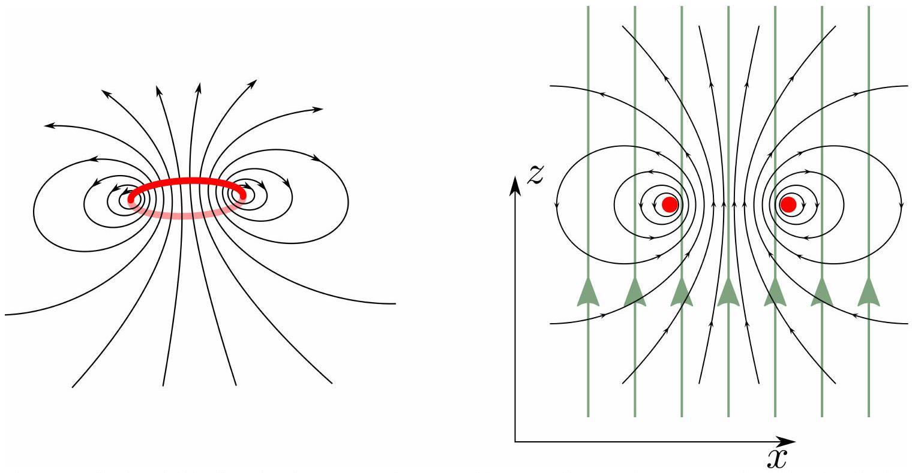
Fig. 6: Velocity field of a circular vortex loop and integration paths (green) for $q(x, y)$ calculation.

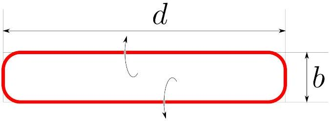
Fig. 7: A nearly rectangular vortex loop, $b \ll d$.

C. 1 Consider a nearly rectangular vortex loop $b \times d, b \ll d$, Fig. 7. Indicate the 0.3pt direction of its momentum $\vec{P}$. Find out the momentum magnitude.
C. 2 Calculate its energy $U$. 0.7pt
C. 3 Suppose we shift a long straight vortex filament by a distance $b$ in $x$ direction, see Fig. 8. How much does the fluid momentum change? Indicate the momentum change direction. The filament length (constrained by the vessel walls) is $d$.

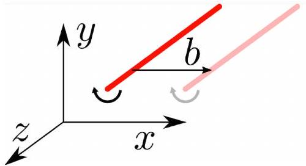
Fig. 8: Momentum changes whenever the vortex shifts with respect to the fluid.

## Part D. Trapped charges (2.85 points)

Electrons, if injected in helium, get trapped in the vortex filaments. Here and below polarizability of helium can be neglected $(\epsilon=1)$.

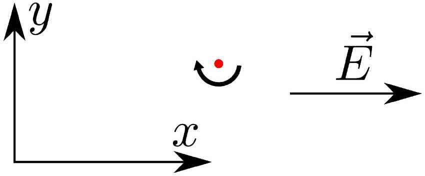
Fig. 9: Straight vortex in a uniform electric field.

D. 1 Consider a straight vortex charged with uniform linear density $\lambda<0$ in a uniform electric field $\vec{E}$. Draw the vortex trajectory. Find its velocity as a function of time.

A circular vortex loop of radius $R_{0}$ initially charged with uniform linear density $\lambda<0$ is placed in a uniform electric field $\vec{E}$ perpendicular to its plane, opposite to its momentum $\vec{P}_{0}$.

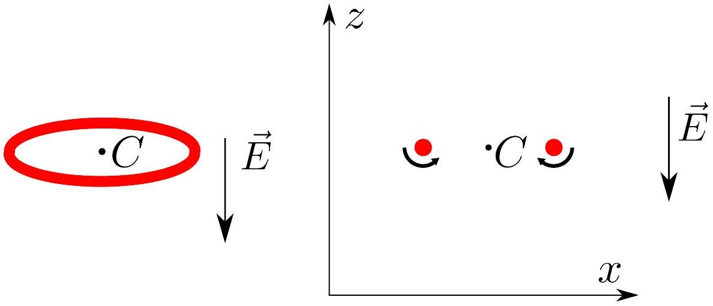
Figure 10: (left) Vortex ring in a uniform electric field. (right) Cross section of the ring.

D. 2 Draw the trajectory of the loop center $C$. Find the radius of the loop as a function 0.6pt of time.
D. 3 Find its velocity $v(t)$ as a function of time. 1.5pt
D. 4 The field is switched off at a time $t^{*}$ when the velocity reaches the value $v^{*}=0.25 \mathrm{pt}$ $v\left(t^{*}\right)$. Find the loop velocity $v(t)$ at a later time $t>t^{*}$.

Part E. Influence of the boundaries (3.25 points)
Solid walls alter the velocity field created by a vortex filament, because the fluid cannot flow through them. Mathematically this means that the wall-normal velocity component vanishes at the wall surface.

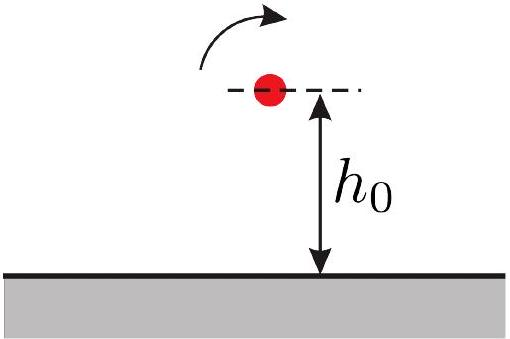
Fig. 11: Straight vortex filament near a flat wall.

E. 1 Draw the trajectory of a straight vortex, initially placed at a distance $h_{0}$ from a 0.5pt flat wall. Find its velocity as a function of time.

Consider a straight vortex placed in a corner at a distance $h_{0}$ from both walls.

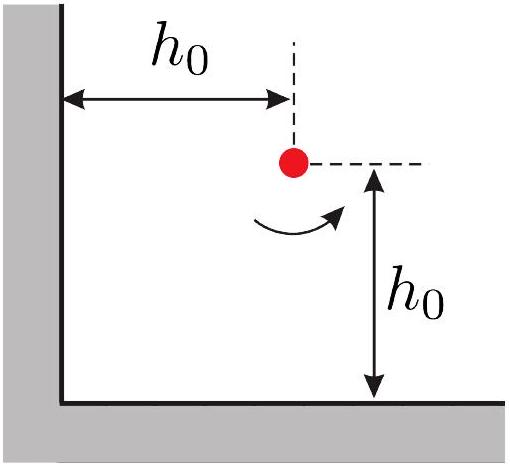
Fig. 12: Straight vortex filament in a corner.

| E. 3 | Draw the trajectory of the vortex. | 0.5pt |
| :--- | :--- | :--- |
| E. 4 | What is the velocity of the vortex $v_{\infty}$ after very long time? | 1.5pt |

[^0]:    ${ }^{1}$ Circulation quantization is a macroscopic quantum effect and corresponds to the angular momentum quantization in Bohr model. The circulation quantum can be expressed as $\kappa=\hbar / m_{\mathrm{He}}$, where $m_{\mathrm{He}}$ is the mass of helium atom.

[^1]:    ${ }^{2}$ This is a consequence of momentum conservation, see next section.

[^2]:    ${ }^{3}$ This expression is also valid only if $\log R / a \gg 1$.
