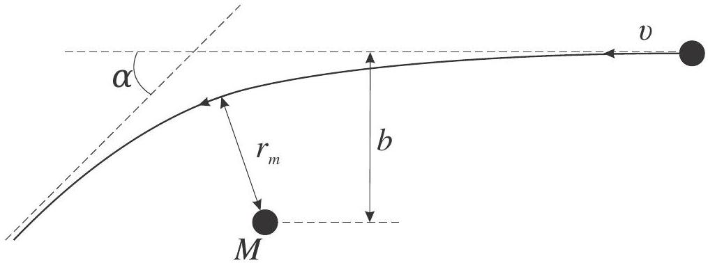
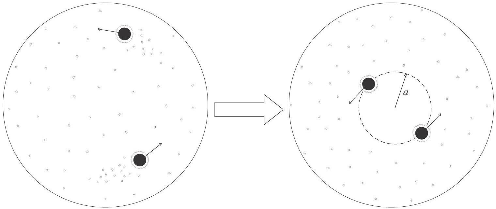

## Evolution of Supermassive Black Holes Binary

## Introduction

The concept of gravitational waves is one of the most impressive predictions of Einstein's Theory of General Relativity. Gravitational waves are the space-time ripples propagating with the speed of light similarly to electromagnetic waves. Direct detection of gravitational waves is incredibly difficult, however, the first signal was detected on September 14, 2015, by LIGO and VIRGO collaborations.

Gravitational waves are emitted during the rapid motion of massive objects. The most powerful source of gravitational waves is the merging of two Supermassive Black Holes (SBH). Black holes predicted by Theory of General Relativity represent extremely compact objects which might have very large masses. Other specific properties of black holes will not be needed in the solution of this problem.

In the generally accepted theory of galaxies' evolution, it is supposed that there is SBH with the mass ranging from $10^{5}-10^{9}$ of Solar masses in the galaxy's center. Galaxies are huge stellar systems containing $10^{10}-10^{11}$ stars. During their evolution, two galaxies can collide and merge into one. What happens to two SBHs initially located in their centers? The evolution of the SBH binary system can be divided into three main stages. At each stage SBHs approach each other, although the underlying physical phenomena differ. We will examine these phenomena separately in the first three parts of the problem. In the fourth part, we will use the obtained relations to calculate the total time of the SBH binary system evolution.

At the end of their evolution, two SBHs will eventually approach each other and merge into a single black hole. The merging process lasts about an hour and is accompanied by an intense burst of gravitational radiation. Future observatories like LISA will be able to detect this gravitational radiation. Still, the research on the SBH evolution is under way now, at the dawn of gravitational-wave astronomy.

## General information

1. Express all your numerical answers in parsecs (pc) for the distances and giga-years (Gy) for the time intervals. We will use Solar mass $\left(M_{S}\right)$ as a reference mass. You might need these values:

$$
\begin{aligned}
& 1 \mathrm{pc}=3.1 \times 10^{16} \mathrm{~m}, \\
& M_{s}=2.0 \times 10^{30} \mathrm{~kg}, \\
& t_{H}=13.7 \mathrm{~Gy}, \text { age of the Universe, } \\
& G=6.67 \times 10^{-11} \mathrm{~N} \times \mathrm{m}^{2} / \mathrm{kg}^{2}, \\
& c=3.0 \times 10^{8} \mathrm{~m} / \mathrm{s} .
\end{aligned}
$$

2. When you encounter the word "estimate", you are not demanded the exact answer. It is sufficient to obtain a result that differs from the accurate one, not more than by a factor of 10. On the contrary, when you encounter the word "find", you are supposed to achieve the exact answer. The word "calculate" asks you to bring the numerical answer.
3. Throughout the problem, assume every star in the galaxy to have the same mass $m=M_{S}$.
4. Throughout the problem we will not take into account the effects of the Theory of General Relativity except gravitational waves emission. All stars and black holes are considered as point masses governed by Newton's gravitation law.

Part A. Dynamic Friction (1.6 points)
In this part we shall study the simplified model of the galaxy. You can ignore the velocities of the stars in the galaxy and assume the constant stellar concentration $n$. The characteristic size of the galaxy is $R$. The stellar concentration is small enough, so the stellar collisions are extemely rare and negligible. Let us consider a SBH with the mass $M \gg m$ moving with the velocity $v$ through the galaxy. Surprisingly, the SBH experiences nonzero average force from the stars. This force slows the motion of the SBH and is called the force of dynamical friction for this reason. This part is devoted to the determination of this force.

A. 1 Let us work in the SBH's reference frame and consider the transit of one star with impact parameter $b$ (fig. 1). Assume that
$$
b \gg b_{1}=\frac{G M}{v^{2}} .
$$
The angular deflection of the star $\alpha=k b_{1} / b$, where $k$ is some coefficient. Find the value of $k$. If you cannot find $k$, assume $k=1$ hereafter.

Fig. 1: The deflection of a star by the SBH with mass $M$. The impact parameter is $b$, the minimal distance between the star and the SBH is $r_{m}$.

A. 2 Let Ox axis be directed along the SBH's velocity. Find the momentum component $\Delta p_{x}$ transferred from the star to the SBH.
A. 3 Estimate the average force $F_{D F}$ acting on the SBH by taking the average over impact parameter $b$. Neglect the contribution of the stars with impact parameters $b<b_{1}$. Assume the SBH to reside in the central part of a galaxy. Express $F_{D F}$ in terms of $M, v, R, G$ and stellar density $\rho=m n$.
A. 4 As you obtained in the previous task, the expression for $F_{D F}$ includes the factor $\log R / b_{1}$, which we will denote further as $\log \Lambda$. Calculate the value of $\log \Lambda$ for $M=10^{8} M_{S}, R=20 \mathrm{kpc}=20 \times 10^{3} p c$ and velocity $v=200 \mathrm{~km} / \mathrm{s}$.

Part B. Gravitational sligshot (3.0 points)
In this part, we will consider the system of two SBHs with equal masses $M \gg m$ located in the center of the galaxy. Let's call this system a SBH binary. We will assume that there are no stars near the SBH binary, each SBH has a circular orbit of radius $a$ in the gravitational field of another SBH.

B. 1 Find the orbital velocity $v_{\text {bin }}$ of each SBH. Find the total energy $E$ of the SBH 0.25pt binary. Express it in terms of $a, G$ and $M$.

There are a lot of stars at distances much larger than $a$ from the binary. Stars travel along complex and diverse trajectories in the gravitational field of the whole galaxy. The motion of the stars can be considered chaotic, like the motion of the molecules in an ideal gas. Let us assume that stars' velocities have equal magnitudes $\sigma \ll v_{\text {bin }}$ and their average mass density is $\rho$. In this case dynamical friction is no longer affecting the SBH binary and energy losses are caused by other phenomenon.

B. 2 Let us solve a related problem. Let a star of mass $m$ transit by a point mass 0.5pt $M_{2} \gg m$ being at rest. The minimal distance between the star and the point during the transit is $r_{m}$. The velocity of the star at large distance is $\sigma$. Find the exact value of impact parameter $b$.

If a star approaches the SBH binary for a distance about $a$, it participates in a complex 3-body interaction with the binary that almost always results in a star being shot out with the velocity about $v_{\text {bin }}$ (the velocity of the star at the large distance after interaction). We will call such a strong interaction a collision of a star with the SBH binary. Acceleration and the shot of the star after the collision is called "gravitational slingshot".

B. 3 Estimate the characteristic time $\Delta t$ between two successive collisions of the SBH 1.0pt binary with stars. Take into account that $\sigma \ll v_{\text {bin }}$.
B. 4 Estimate the SBH binary energy loss rate $d E / d t$. Estimate the radius variation 0.25pt rate $d a / d t$. Express it in terms of $a, \rho, \sigma, G$.
B. 5 Let us denote the initial radius of the system as $a_{1}$. Estimate the time $T_{S S}$ for 1.0pt the radius to decrease by a factor of 2 due to "gravitational slingshot". Calculate $T_{S S}$ for $\sigma=200 \mathrm{~km} / \mathrm{s}, a_{1}=1 \mathrm{pc}, \rho=10^{4} M_{S} / \mathrm{pc}^{3}$.

Part C. Emission of gravitational waves (1.0 points)
In this part we shall study the SBH binary with equal masses which doesn't interact with the stars. Even in this case the system loses the energy due to gravitational waves emission. The energy loss rate due to gravitational waves is

$$
\frac{d E}{d t}=-\frac{1024}{5} \frac{G}{c^{5}}\left(\omega^{3} I\right)^{2}
$$

where $\omega$ is angular velocity of the binary, and $I=2 M a^{2}$ is quadrupole moment of the system.

C. 1 Find the SBH binary radius variation rate $d a / d t$ due to the emission of gravita- 0.2pt tional waves.

When the orbit radius of the SBH binary $a$ becomes close to the gravitational radius of the black hole:

$$
r_{g}=\frac{2 G M}{c^{2}},
$$

two SBHs quickly merge.

C. 2 Let us denote the initial radius of the system as $a_{2} \gg r_{g}$. Estimate the time $T_{G W}$ it takes for the SBH binary to shrink to the radius about $r_{g}$ due to the emission of gravitational waves. Express $T_{G W}$ as a function of $a_{2}, M, c$ and $G$.
C. 3 Calculate the initial radius $a_{H}$ of the binary of SBHs with equal masses $M=0.1$ pt $10^{8} M_{S}$ if it takes it the age of the Universe to merge: $T_{G W}=t_{H}$.

Part D. Full evolution (4.4 points)
In this part we will use the results obtained above. Let us consider the real astrophysical situation. Two galaxies having SBH of mass $M=10^{8} M_{S}$ in their centers merged into a new stellar system. Let the new galaxy be spherically symmetrical with radius $R=20 \mathrm{kpc}=20 \times 10^{3} \mathrm{pc}$. Let us assume that stellar density varies with radius $r$ to the galaxy center as

$$
\rho(r)=\frac{\sigma^{2}}{4 \pi G r^{2}},
$$

where $\sigma=200 \mathrm{~km} / \mathrm{s}$.

D. 1 Let the body move in circular orbit of radius $a<R$ in gravitational field of the stars. Neglect the force of dynamical friction and find the velocity $v$ of the body.

0.25pt Immediately after the merging of galaxies two SBHs have arbitrary positions inside the new galaxy and do not affect each other. Let's consider one SBH. We assume it moves in a circular orbit of radius $a<R$ around the galaxy center and slowly loses energy due to the dynamical friction.

D. 2 Estimate the orbit radius variation rate $d a / d t$. In part A we ignored the velocities of the stars. Although stars are moving in the real galaxy, not all of them have exactly the same speed $\sigma$. Instead, the speed of the stars is only of the order of $\sigma$, and so is the relative speed of SBH with respect to the stars, hence you can use the result obtained in A. 3 for estimation. You should use the density $\rho(r)$ from equation (4). Assume $\log \Lambda$ to be a constant calculated in A.4.

After a certain time, two SBH will approach the center of the galaxy. Let two SBH move in a circular orbit of radius $a$ around the center galaxy in the gravitational field of the stars.

D. 3 Estimate the critical radius $a_{1}$ at which gravitational interaction between two SBHs is no longer negligible and calculate it. We will say that at this moment two SBHs form a binary system (fig. 2).

Fig. 2: The evolution of SBHs before and after the formation of the binary system

## Q2-6   -

" новогоминаний রমে T

"

" н не н никт att
"
" напоменнонований Get have
" напретностикальноваَة GAOZNTUCE GAOZNTUCE

"
никаим awalter at ன
