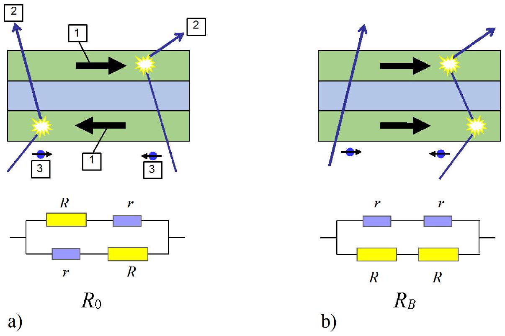
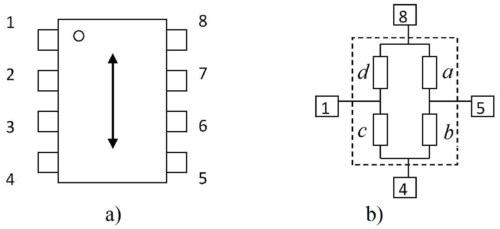
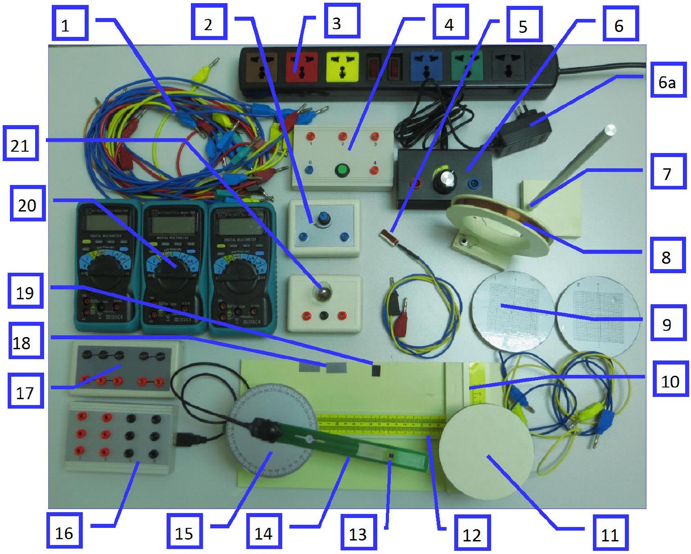
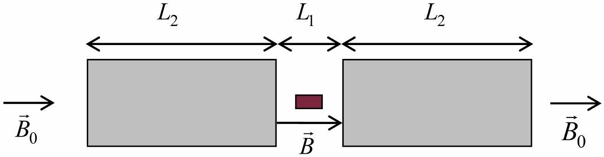
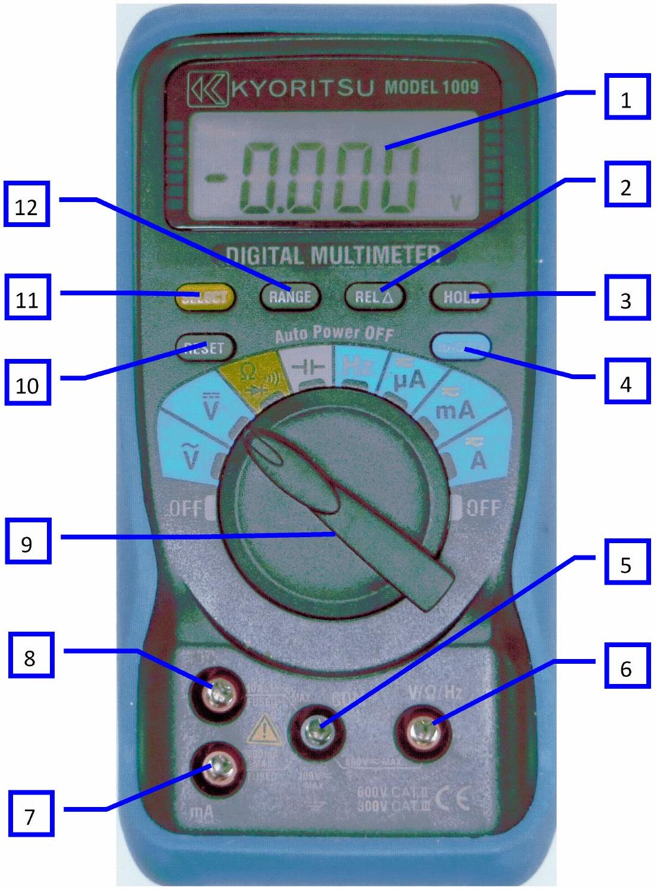
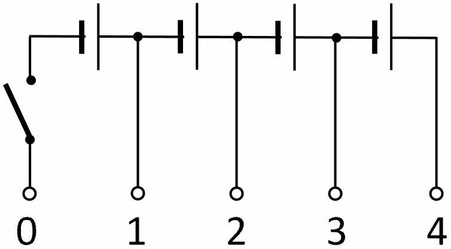

## Giant Magnetoresistance (GMR)

## I. INTRODUCTION

Magnetoresistance is the dependence of electrical resistance of a sample on the strength of an external magnetic field. It is characterized by the following formula:

$$
\delta(B)=\frac{R(B)-R(0)}{R(0)}
$$

where $R(B)$ is the resistance of the sample in the magnetic field $B$, and $R(0)$ corresponds to $B=0 ; \delta(B)$ is called the relative change of resistance.

There exist several "normal" magnetoresistance effects whose relative change of resistance is small at relatively weak magnetic field, typically in the order of less than several percent. For instance, one of the magnetoresistance effects may arise from the direct action of magnetic field on electric current. Due to the Lorentz force, the flow of the charge carriers is deflected, leading to the effective reduction in the mobility. Hence, the electric conductivity will decrease with increasing magnetic field, and the resistance of the sample will increase. It occurs in a relatively large range of change in the strength of the magnetic field.

Giant magnetoresistance arises from the interaction of the spin of conduction electrons with the magnetic moments in the solid. This effect consists of the reduction of the electrical resistance in multilayer structures composed of alternating ferromagnetic and non-ferromagnetic layers with thickness of several nanometers when an external magnetic field is applied. The change of the electric resistance is large in relatively weak field; therefore it is called Giant Magneto Resistance (GMR) effect. Due to the practical significance of GMR, its discoverers, Albert Fert and Peter Grünberg, were awarded the Nobel Prize in Physics, in 2007.

In such a multilayer, two adjacent ferromagnetic layers have spontaneous magnetization with opposite directions in the absence of an external magnetic field. Let us suppose that scattering of conduction electrons with magnetic moments of the solid is weak for electrons with spin parallel to the magnetization direction and is strong for electrons with spin antiparallel to the magnetization direction. Thus, both the parallel-spin and antiparallel-spin electrons are scattered strongly within one of the ferromagnetic layers. Therefore, in this case the total resistivity of the multilayer is high (see Fig. 1a)

If a sufficiently strong magnetic field is applied parallel to the plane of the layers, then all ferromagnetic layers are magnetized in the same direction of the magnetic field. As a consequence, the electrons with spin parallel to the magnetization direction pass through the structure almost without scattering on magnetic moments. On the contrary, the electrons with spin antiparallel to the magnetization are scattered strongly within the ferromagnetic layers. Since conduction occurs in parallel for the two spin channels, the total resistance of the multilayer is determined mainly by the highly-conductive parallelspin electrons and appears to be low (see Fig. 1b). In Figure 1, $R$ denotes the high resistance of the layer with strong scattering, and $r$ - the low resistance of the layer with weak scattering. $R_{0}$ is the resistance of the structure in a zero magnetic field, and $R_{B}$ is that in a sufficiently strong magnetic field which makes the two adjacent ferromagnetic layers magnetized in the same direction. The equivalent electrical model (so-called "two resistor" model) of the GMR effect is shown at the bottom of Figure 1. The circuit of the model represents one GMR element.

Figure 1: GMR effect model. (1) magnetization; (2) electron path; (3) electron spin

One of the applications of GMR is the magnetic sensor, also called magnetometer, which can be used to measure the strength of an applied magnetic field. A widely used GMR magnetic sensor consists of four GMR elements connected in a Wheatstone bridge as shown in Fig. 2b. Each GMR element consists of a multilayer structure as described in the above model. Two of these elements are shielded to prevent the applied magnetic field from reaching them hence they are not sensitive to the external magnetic field. The magnetic sensor is packaged in an 8-pin device as shown in Fig. 2a. The supply voltage is connected to pins 4 and 8. The signal output is taken from pins 1 and 5. This is the normal way of operation. However, during solving the problem, you can connect the power supply to any other pair of pins without destroying the sensor. The axis of sensitivity of the sensor is indicated by the arrow on Fig. 2a. The magnetic sensor is not sensitive to an applied magnetic field which is perpendicular to this axis.

Figure 2

We call the resistance of the elements $a, b, c, d$ as shown in Fig.2b.
Please note that resistance of the elements can be considered not dependent on current.
To fabricate sensors with different sensitivities, an integrated flux concentrator is used. Thanks to it, the magnetic field acting on the elements inside the sensor is stronger than the applied magnetic field.

Due to the presence of ferromagnetic materials in the flux concentrator and in the magnetic layers of the multilayer structure, there exists hysteresis in electrical characteristics of the sensor.

The aims of the experiment are:

1. Investigation of the GMR effect.
2. Investigation of the GMR magnetic sensor.
3. Study of some applications of the GMR magnetic sensor.

II. APPARATUS

Figure 3

| 1 | Leads | 12 | Platform with longitudinal rail |
| :--- | :--- | :--- | :--- |
| 2 | Rheostat | 13 | Magnetic sensor |
| 3 | $220-\mathrm{V}$ AC supply cord | 14 | Sensor holder |
| 4 | Battery *) | 15 | Round table graduated in degrees fixed on the support with short pole (not seen in the picture) |
| 5 | Flat coil | 16 | Sensor connection box *) |
| 6 | Adjustable DC current source (with its adapter [6a]) | 17 | Connection box |
| 7 | Support with tall pole | 18 | Ferromagnetic sheets |
| 8 | Circular coil | 19 | Plate of permanent magnet |
| 9 | Printed circuit boards with buried electric circuit | 20 | Multimeters *) (3 pcs) |
| 10 | Transverse rail | 21 | Double-filament electric bulb |
| 11 | Turntable |  |  |

*) See more details in the Appendix

Warning: The 220 V AC voltage is used only for the table lamp (it is not shown in the Figure 3) and the adapter (6a) of the adjustable DC current source. Plugging any other device to this voltage is strictly forbidden.
III. EXPERIMENT
A. Understanding of magnetic fields (1.0 point)

In this experimental problem, the magnetic field may be

- the magnetic field created by
    - a circular coil carrying an electric current;
    - a flat coil carrying an electric current;
    - a plate of permanent magnet.
- the magnetic field of the Earth.
1. Understanding of magnetic field created by a circular coil

The circular coil [8] has an average diameter $d=10.0 \mathrm{~cm}$ and the number of turns $N=500$. The magnetic field created by this coil at its center when a current $I$ flows in it can be approximated to that of a circular current loop with radius equal to the average radius of the circular coil and a current equal to $500 I$.

A. 1 The magnitude of the magnetic field at the center of the circular coil can be 0.5pt written in the form $B=k I$. Calculate the numerical value of $k$ if $B$ is measured mT and $I$ - in mA
2. Understanding of the Earth's magnetic field

The Earth's magnetic field exists everywhere. It can be considered as a uniform magnetic field in a large region of space around each given point. The magnitude of the horizontal component of the Earth's magnetic field is denoted as $B_{h}$.

A. 2 Write down the expression for the magnitude $B_{\beta}$ of the Earth's magnetic field measured in the horizontal plane and in the direction making an angle $\beta$ with the horizontal component of the Earth's magnetic field in terms of $\beta$ and $B_{h}$.

0.5pt

Note: Always take into account the effect of the Earth's magnetic field on the magnetic measurements.
B. Investigation of the GMR effect using a GMR magnetic sensor (7 points)

Note: This part is relatively independent of the remaining parts. You can also solve parts $C$ and $D$ without having to solve part $B$.

In this part, we investigate the dependence on the external magnetic field of the resistance of each element inside the magnetic sensor. The circular coil [8] stands on the longitudinal rail. The sensor holder [14] is screwed on the round plate [15] in the horizontal position, with the magnetic sensor [13] at the center of the circular coil, and the sensor axis perpendicular to the plane of the coil. By changing the electric current in the coil, we vary the magnetic field acting on the sensor. Be sure that the axis of sensitivity of the magnetic sensor is oriented along the West - East direction (marked on the experiment table) so that the Earth's magnetic field does not affect your measurements. Note that the West-East direction has been determined locally using a magnetic compass.

The magnetic sensor is supplied by the battery [4]. The circular coil is fed by current from the adjustable DC current source [6].

1. Determination of resistance of GMR elements
a. Resistance of the elements at $B=0$.

Set the current in the circular coil at $I=0$

B. 1 Sketch the diagrams of the experiment and find the expressions for calculating 1.25pt the resistance of each element in terms of measurement data.
B. 2 Perform the measurements and calculations to determine the resistance of the 1.25pt elements $a, b, c$ and $d$ at $B=0$.

b. Resistance of the elements at maximum external magnetic field.

Set the current $I$ in the coil to the highest possible value.

B. 3 Perform the measurements and calculations to determine the resistance of the 0.5pt elements $a, b, c$ and $d$ in the maximum external magnetic field.

c. Properties of the elements.
B. 4 Indicate which elements are sensitive to the magnetic field. 0.25pt
2. Characteristics of a GMR element

In this section, you will study the properties of one of the two GMR elements which are not shielded. Choose one of such GMR elements and determine $\delta(B)$ - the dependence on the external magnetic field of the relative change of resistance.

## Experiment

B. 5 Give the name of the chosen GMR element. Sketch diagrams of the experiment 0.75pt and find the expressions for calculating $\delta(B)$ in terms of measurement data.
B. 6 Perform the measurements and calculations to determine $\delta(B)$ with the exter- 1.25pt nal magnetic field $B$, in the range from zero to the maximum possible value. Fill the table with the values of the measured quantities and determine $\delta(B)$ corresponding to the values of the current $I$ and the external magnetic field $B$.
B. 7 Plot on a graph $\delta(B)$ as a function of the external magnetic field $B$ (Graph 1) 0.5pt
B. 8 Determine the average slope $\alpha=\frac{\Delta \delta(B)}{\Delta B}$ of the curve $\delta(B)$ in the region in which 0.25pt $\delta(B)$ depends strongly on $B$.
B. 9 Determine the GMR coefficient $\delta=\frac{\Delta R_{\text {max }}}{R(0)}$ of the element. Here $\triangle R_{\text {max }}$ is the 0.25pt maximum change of the resistance in a magnetic field.
B. 10 Find the value of the resistances $R$ and $r$ of the GMR element according to the 0.75pt model given in Figure 1 and the ratio $\gamma=\frac{r}{R}$.

## C. Study of GMR magnetic sensor (6 points)

In this part, we investigate the most important characteristics of the magnetic sensor [13]. The circular coil [8] stands on the longitudinal rail [12]. The sensor holder [14] is screwed on the round plate [15] in the horizontal position, such that the sensor is at the center of the circular coil, and the sensor axis is perpendicular to the plane of the coil. By changing the electric current in the coil, we vary the magnetic field acting on the sensor. Be sure that the axis of sensitivity of the magnetic sensor is oriented along the East-West direction so that the Earth's magnetic field does not affect your measurements.

## 1. Characteristics of sensor output signal

The magnetic sensor is supplied by the battery [4] at maximum voltage. The supply voltage is connected to pins 4 and 8. The circular coil is fed by the adjustable DC current source [6].

a. First, set the current $I$ in the coil to the highest possible value. The voltage between pins 1 and 5 is the output signal $S$ of the sensor.
b. While gradually decreasing the current in the coil to $I=0$, read the value of $S$ corresponding to each value of $I$.
c. Change the direction of current $I$ in the coil. While gradually increasing the current to its maximum value, read the value of $S$ corresponding to each value of $I$.
d. While gradually decreasing the current to $I=0$, read the value of $S$ corresponding to each value of $I$.
e. Change the direction of current $I$ in the coil. While gradually increasing the current to its maximum value, read the value of $S$ corresponding to each value of $I$.

## Experiment

C. 1 Fill the table with the values of $S$ corresponding to the values of the current $I$ in 1.0pt the coil and the external magnetic field $B$ during the above measuring process. the coil and the external magnetic field $B$ during the above measuring process.
C. 2 Plot the graph $S(B)$ of the output signal $S$ as a function of the external magnetic
C. 2 Plot the graph $S(B)$ of the output signal $S$ as a function of the external magnetic field $B$ (Graph 2). field $B$ (Graph 2). field $B$ (Graph 2). 1.0pt
C. 3 1. Circle the region of saturation in the curve $S(B)$ and label it with " S ". 0.5pt 2. Circle the region of linearity in the curve $S(B)$ and label it with "L". For this region, find the average value of the slope $m=\frac{\Delta S}{\Delta B}$.
C. 4 From the graph $S(B)$, determine the coercive field $B_{C}$, which is the external magnetic field needed to make $S$ minimum after being magnetized in the op- posite direction with a saturation field. posite direction with a saturation field.

0.5pt

Note: In the case you want to use the linear region of the curve $S(B)$, a small plate of permanent magnet [19] is provided. Just place the permanent magnet on the sensor holder [14], near the sensor [13], and change the relative position of the magnet to the sensor to choose the working point on the curve. Once the suitable working point is found, you can fix the magnet on the holder by means of adhesive tape. This process is called biasing.
2. Dependence of output signal on supply voltage

The magnetic sensor is supplied by the battery [4]. By connecting the sensor to different sockets on the battery box, you can change the supply voltage $E$. The current $I$ in the circular coil is set at a value corresponding to the linear region on the curve $S(B)$.

C. 5 Fill the table with the values of $S$ corresponding to the values of $E$ 0.25pt
C. 6 Plot a graph of $S$ as a function of $E$ 0.25pt
C. 7 Derive an analytical expression relating the output signal $S$ of the sensor with 0.5pt the slope $\alpha$ of the GMR element found in B.8, the supply voltage $E$ and the applied magnetic field $B$. Here, we assume that $\alpha$ is the same for the two elements and there is no hyteresis in the characteristics of the elements. Besides, we assume here that in the absence of a magnetic field, values of resistance of all 4 elements are the same.
3. Study of effects of a flux concentrator

The integrated flux concentrator inside the magnetic sensor consists of two thin-film ferromagnetic structures with thickness in the order of micrometers, with length in the order of some hundreds of micrometers. The purpose of the flux concentrator is to magnify the magnetic field in the gap between the structures.

In order to study the effect of a flux concentrator on a magnetic sensor, we use an external flux concentrator made of two ferromagnetic sheets (as shown in Fig. 4) placed near the two ends of the sensor, with length $L_{2}$, and mutual distance $L_{1}$.

Figure 4. Diagram of the flux concentrator

Once the sensor with a flux concentrator is put in a uniform magnetic field of magnitude $B_{0}$, the effective magnetic field acting on the sensor is $B$. In a not very large range of change of $L_{1}, B$ can be approximately found by using the empirical formula:

$$
\frac{B}{B_{0}}=n \frac{L_{2}}{L_{1}}+1
$$

You are asked to perform an experiment with the magnetic sensor and the two ferromagnetic sheets [18] to determine the value of $n$ in formula (2).

| C. 8 |  | 1.0pt |
| :--- | :--- | :--- |
|  | Which magnetic field in the following will you use in this experiment? a. The field of the circular coil carrying an electric current b. The field of the flat coil carrying an electric current c. The field of the plate of permanent magnet d. The magnetic field of the Earth | 0.25pt |
|  | Sketch diagrams of the experiment and find expressions to determine the value of $n$ in terms of measurement data. | 0.75pt |

C. 9 Perform the experiment to find $B / B_{0}$ for different values of $L_{1}$ and fill the table 0.5pt with the measurement data.
C. 10 Plot a graph of $B / B_{0}$ as a function of an appropriate variable to determine the 0.5pt value of $n$ (Graph 4).
Give the value of $n$.

D. Applications of GMR magnetic sensors (6 points)

In this part, we consider some applications of the magnetic sensor.

1. Measuring the Earth's magnetic field

You are asked to use the magnetic sensor to determine some parameters of the Earth's magnetic field. Some extra graph sheets are provided, in case you need them for solving this question.

a. Magnitude of the horizontal component of the Earth's magnetic field

## Experiment

Fix the round plate [15] in the horizontal plane. The sensor holder [14] is screwed on the round plate. By rotating the sensor holder on the round plate, you can determine the component in the horizontal plane of the Earth's magnetic field in different directions of the sensor axis.

D. 1 Sketch diagrams of the experiment and find expressions for calculating the 0.5pt magnitude $B_{h}$ of the horizontal component of the Earth's magnetic field in terms of measurement data.
D. 2 Perform the measurements and calculations to find $B_{h}$. 0.25pt

## b. Magnitude of the Earth's magnetic field and magnetic inclination

The magnetic inclination is defined as the angle $\theta$ between the Earth's magnetic field vector $\vec{B}_{\text {Earth }}$ and the horizontal plane.

Fix the round plate [15] to the tall pole [7], with the round plate in the vertical plane containing the SouthNorth direction. The sensor holder [14] is screwed on the round plate. By rotating the sensor holder on the round plate, you can determine the component of the Earth's magnetic field in different directions of the sensor axis.

D. 3 Sketch diagrams of the experiment and find expressions for calculating the Earth's magnetic field $B_{\text {Earth }}$ and the magnetic inclination $\theta$ in terms of measurement data.
D. 4 Perform measurements and calculations to find $B_{\text {Earth }}$ and $\theta$. 0.5pt

## 2. DC wattmeter

In this section, you use the magnetic sensor to form the circuit of a wattmeter. The flat coil [5] wraps around the sensor. This flat coil is connected in series with the load, so the electric current $I$ in the flat coil is the same as that in the load. The current $I$ in the flat coil creates the magnetic field which acts on the sensor, and the voltage $U$ across the load is used to supply the sensor.

The output signal $S$ of the sensor is used to determine the power $P$ dissipated in the load.
The double-filament electric bulb [21] is used as the load. By using the three terminals of the bulb in different ways, you may obtain several values of the load's resistance $R_{L}$.

In many cases, the Wheatstone bridge of the magnetic sensor is unbalanced even when there is no external magnetic field acting on it. This is due to a small difference in the resistance of the elements and remanence of the ferromagnetic layers. In this case, you need to balance the bridge before using it in the circuit of the wattmeter. The sensor holder [14] is screwed on the round plate [15] in the horizontal position. The sensor is supplied by the battery [4] with the highest voltage. Orient the sensor perpendicular to the Earth's magnetic field. Observe the output signal $S$ on a multimeter. If $S=0$, the bridge is balanced, and you do not need to do anything else. If $S \neq 0$, the bridge is unbalanced, and you need to balance it. Connect the rheostat [2] in parallel with one of the elements $a, b, c$, and $d$, for which once the rheostat is connected to it, $S$ decreases its magnitude. Adjust the rheostat to reduce $S$ to zero. Now the bridge is balanced. This process is called balancing.

In some cases, the use of the rheostat cannot help to balance the bridge. In such cases, it suffices to rotate the sensor holder by a small angle such that the output signal $S$ is reduced to $S=0$.

D. 5 Sketch the diagram of the wattmeter circuit together with the load and the mul- 0.5pt timeters used in the measurements.

Use the Connection Box [17] to build the circuit of the wattmeter according to your diagram. Vary the resistance $R_{L}$ of the load and adjust the output of the DC current source [6] to change the voltage $U$ across the load.

D. 6 Fill the table with the values of the sensor output signal $S$ corresponding to the 0.75pt values of $I$ and $U$, and of $P=U . I$
D. 7 Plot a graph of $P$ as a function of $S$ (Graph 5)

The curve $P=f(S)$ is called the calibration curve of the wattmeter.

D. 8 Find the form of the function $P=f(S)$ of the calibration curve and determine 0.25pt values of its coefficients.

## 3. Detection of buried electrical circuits

In this section, you are asked to use the magnetic sensor to form a device for finding the shapes of two buried electric circuits. The electric circuit is made on the hidden surface of a printed circuit board. A grid sheet attached on the reversed surface of the printed circuit board serves as a system of coordinates.

You may carry out this experiment in the following way. Set the round plate [15] in the horizontal position and fixed to the short pole. The sensor holder [14] is screwed on the round plate. The printed circuit board with the buried electric circuit [9] lies flat on the turntable [11]. The turntable is free to rotate in the horizontal plane, and also to move in two perpendicular directions along the rails [10] and [12]. Connect the conductors of the printed circuit board to the adjustable DC current source [6], with the red conductor at the positive terminal. Adjust the DC current source to choose a value of the current in the circuit. By moving the printed circuit board relatively to the magnetic sensor [13], and looking at the change in the output signal $S$ of the sensor, you can detect the position and the shape of the buried circuit and also the direction of the current in the buried circuit. Some larger scale Grid Sheets are provided, in case you need them in solving this question.

D. 9 Draw a diagram of the buried electric circuits together with the direction of the 2.0pt current in them on the grid sheets in the Answer Sheet.

APPENDIX

1. Instructions for the multimeter

Figure A1

| 1 | Display | 7 | Measuring terminal (mA) |
| :--- | :--- | :--- | :--- |
| 2 | REL Key | 8 | Measuring terminal (A) |
| 3 | HOLD Key | 9 | Function Selector Switch |
| 4 | Hz/DUTY Key | 10 | RESET Key |
| 5 | Measuring terminal (COM) | 11 | SELECT Key |
| 6 | Measuring terminal (V/S/Hz) | 12 | RANGE Key |

- To avoid complications do not use the following keys: REL Key [2], HOLD Key [3], Hz, DUTY Key [4], RESET Key [10].
- To power on the multimeter and begin a measurement, rotate the Function Selector Switch [9] to the desired function.
- Use the Measuring terminal ( $\mathrm{V} / \Omega / \mathrm{Hz}$ ) [6] and Measuring terminal (COM) [5] for measuring voltage and resistance.
- Use the Measuring terminal (A) [8] and Measuring terminal (COM) [5] and Function A for measuring current.
- The multimeter is automatically switched off about 30 minutes after power on. Rotate the Function Selector Switch to OFF and then back to the function to continue the measurement.

To avoid automatic switching off, press the SELECT Key while rotating the Function Selector Switch to the desired function.
2. The battery

The circuit of the battery is given in Fig A2.
The battery is switched on when the button is pressed, and is switched off when the button is released.

Figure A2

3. Sensor connection box

Before using the sensor, its cable needs to be plugged to the sensor connection box. Once the sensor is connected to this box, the numbers labeled on the box correspond to the pin numbers in Figure 2.
