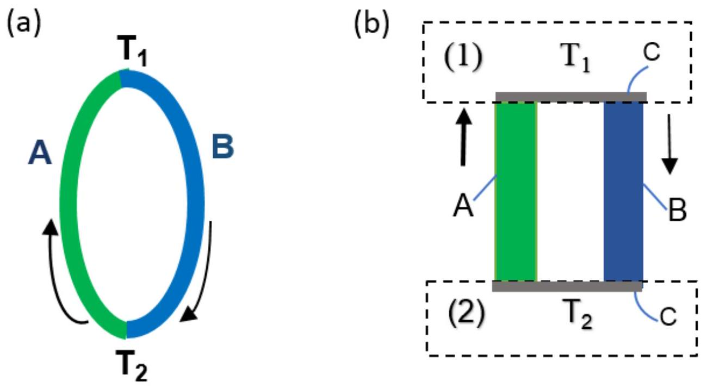
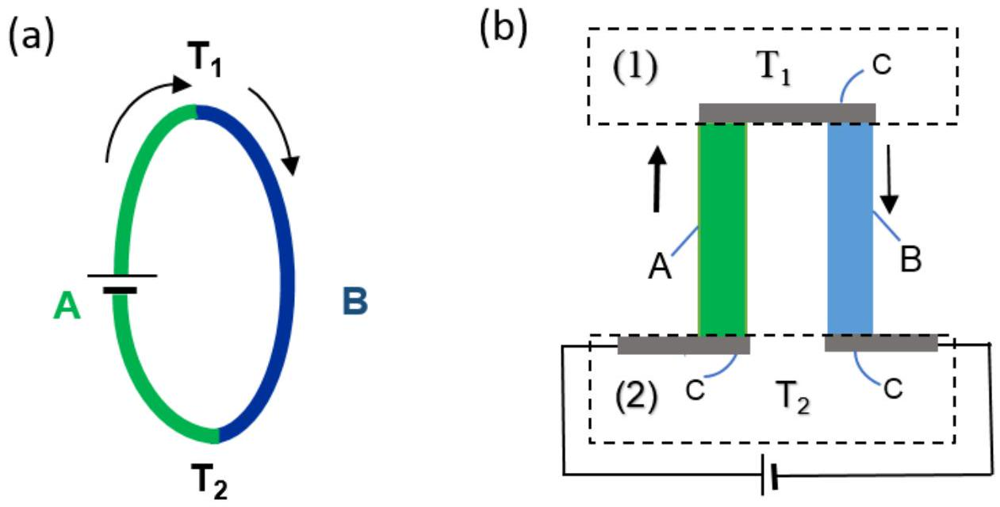
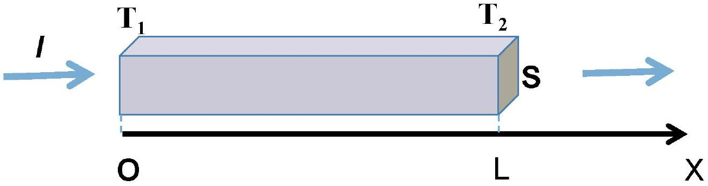
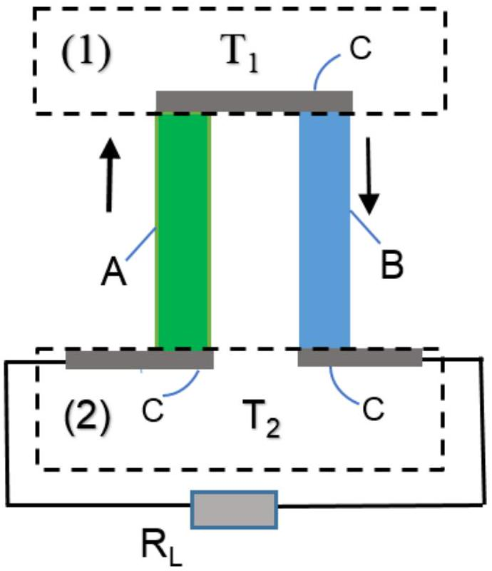
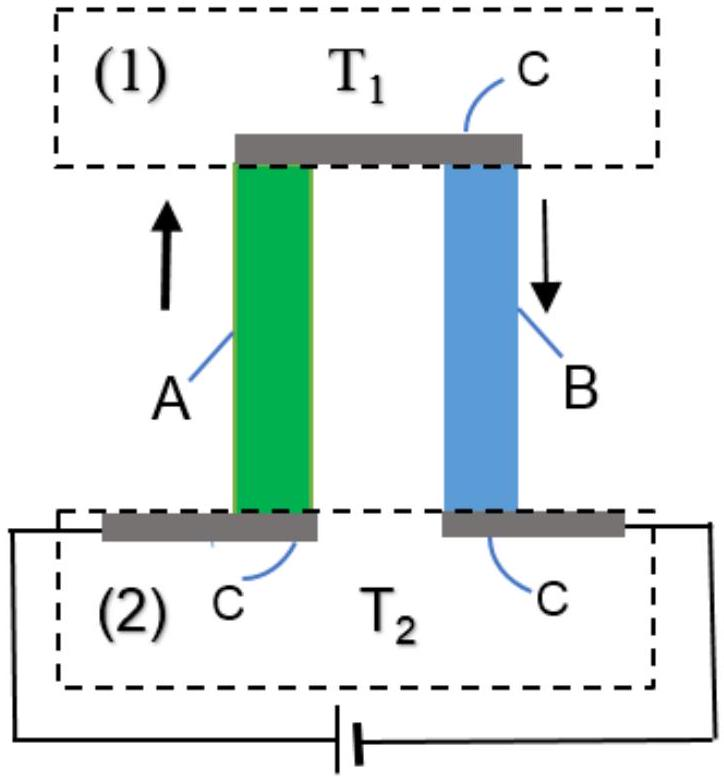

## Thermoelectric effects and their applications in thermoelectric generator and refrigerator (10 pt)

## Introduction: Thermoelectric effects

Thermoelectric effects in conducting materials are due to the interplay between heat current and electrical current. In this problem we consider only three predominant thermoelectric effects, namely the Joule, the Seebeck and the Peltier effects, neglecting the others.

The Joule effect is a consequence of the interaction between electrical carriers and crystal lattice. Moving directionally in presence of electrical current, carriers transfer a part of their energy to the vibrating crystal lattice, and as a result the crystal is heated. The Joule effect is irreversible.
The Seebeck effect can be observed in a thermocouple consisting of two dissimilar conducting bars A and B connecting by direct junction (Fig. 1a) or junction via an intermediate material C (Fig. 1b). The material C is good electrical conductor with very small specific heat. When the two junctions of the thermocouple are maintained at different temperatures $T_{1}$ and $T_{2}$ (Fig. 1a,b) the Seebeck electromotive force (emf) is produced

$$
\epsilon=\alpha\left(T_{1}-T_{2}\right)
$$

where $\alpha$ is the Seebeck coefficient of the thermocouple. $\alpha$ is considered temperature independent .
The Seebeck effect is applied in thermoelectric generator to convert heat energy into electrical one.

Figure 1. (a) direct junctions. (b) junctions via an intermediate material C. (1) Heat source (temperature $T_{1}$ ); (2) Heat sink (temperature $T_{2}$ )

## The Peltier effect

Whenever current passes through a thermocouple circuit consisted of two dissimilar conductors A and B with direct junctions (Fig. 2a) or junctioned via intermediate conductor C (Fig. 2b), depending on the
current direction, heat is either absorbed or released at the junctions of the two conductors. This is the Peltier effect. The Peltier heat power $q$ appeared at a junction is

$$
q=\pi I
$$

$\pi$ is the Peltier coefficient of this junction.The Seebeck and Peltier effects are reversible effects in contrast to the irreversible Joule effect. Although the Seebeck and Peltier effects need junctions between the thermoelements, they are essentially bulk effects. A closed electrical cycle in a thermocouple with the Peltier effect (Fig. 2b) can be used as a refrigerator when heat is removed from one isolated junction and rejected at the other.

For simplicity, the heat radiation, circulation, conduction through surrounding environment are considered negligible, and heat current is supposed to be inside the thermocouple and at the heat source and the heat sink.

Figure 2. (a) Direct junctions; (b) junctions via an intermediate material C

Data for thermal and electrical properties of materials and the thermocouple studied in this problem are given in the Table 1 and 2 for numerical calculation.

| Name | Material | Resistivity $\rho(\Omega \cdot \mathrm{m})$ | Thermal conductivity $k\left(\mathrm{~W} \cdot \mathrm{~m}^{-1} \cdot \mathrm{~K}^{-1}\right)$ |
| :--- | :--- | :--- | :--- |
| A | $\mathrm{Bi}_{2} \mathrm{Te}_{2.7} \mathrm{Se}_{0.3}$ | $1.0 \times 10^{-5}$ | 1.4 |
| B | $\mathrm{Bi}_{0.5} \mathrm{Sb}_{1.5} \mathrm{Te}_{3}$ | $1.0 \times 10^{-5}$ | 1.4 |

Table 1: Parameters of materials used in thermocouple (at room temperature)

| Thermocouple AB | Length (m) | Seebeck's coefficient $\alpha\left(\mu \mathrm{V} \cdot \mathrm{K}^{-1}\right)$ |
| :--- | :--- | :--- |
|  | 0.02 | 420 |

Table 2: Parameters of the thermocouple.

## A. Heat transfer and thermoelectric generator

## A1. Heat transfer in a homogeneous conducting bar

An electric current $I$ (Figure 3) flows along a homogeneous conducting bar with length $L$, resistivity $\rho$, thermal conductivity $k$. The two ends of the bar are located at coordinates $x=0$ and $x=L$ in the $O X$ axis. The temperature at $x=0$ is $T_{1}$, at $x=L$ is $T_{2}\left(T_{1}>T_{2}\right)$, both temperatures are kept constant.

Figure 3

The heat current $q(x)$ (the amount of heat transferred via perpendicular cross-section per unit time) flowing in the bar is described by the Fourier law

$$
q(x)=-k S \frac{d T(x)}{d x}
$$

here $k$ is thermal conductivity, and $S$ is the cross-sectional area of the bar.
A1.1 Find the temperature distribution $T(x)$ when $x$ varies along the bar at the steady 0.75 pt state assuming no heat loss to the surroundings.
Hint: the equation $\frac{d^{2} T(x)}{d x^{2}}=a$ has the solution $T(x)=\frac{1}{2} a x^{2}+C_{1} x+C_{2}$, where $C_{1}$ and $C_{2}$ are derived from boundary conditions.

A1.2 Find the heat current $q(x)$ at point $x$ and $q(0), q(L)$ at the two ends, respectively. 1.0pt

## A2. Relation between Peltier and Seebeck Coefficients

Relation between Peltier and Seebeck coefficients for all temperature range is generally proved in thermodynamics. Here, this relation is derived for the particular case when the thermocouple is made of conducting materials A and B (Fig.1b) with the Seebeck coefficient $\alpha$ and small-enough resistivity so that the Joule effect can be neglected. The Peltier coefficients at the hot (temperature $T_{1}$ ) and cold ( temperarure $T_{2}$ ) junctions are $\pi_{1}$ and $\pi_{2}$ correspondingly. During electrical process, the electron gas in the thermocouple performs a ideal thermodynamic cycle.

A2.1 Find the expression for the heat current received by the electron gas from the 0.25pt heat source with temperature $T_{1}$.

A2. 2 Find the expression for the heat current transferred by the electron gas to the 0.25pt heat sink with temperature $T_{2}$.
A2. 3 Find the net electrical power produced by the electron gas if the Seebeck coef- 0.5pt ficient is $\alpha$.
A2. 4 Express the Peltier coefficient $\pi$ at a junction in term of the Seebeck coefficient 0.5pt $\alpha$ and the temperature $T$ of the junction.

A3. Thermoelectric generator

Figure 4. Thermoelectric generator. (1) Heat source (temperature $T_{1}$ ); (2) Heat sink (temperature $T_{2}$ ).

Hereafter the Peltier coefficient $\pi$ is taken to be equal to $\alpha T$ for all temperatures and the Joule heat must be included in consideration.

The thermocouple consistsing of two conducting bar A and B with equal lenght $L$ is used as thermoelectric generator (Fig. 4). The parameters of the bars A and B are: cross-sectional areas $S_{A}, S_{B}$; resistivities $\rho_{A}, \rho_{B}$; thermal conductivities $k_{A}, k_{B}$. The lower ends of the A and B bars are connected to a load of resistance $R_{L}$. Parameters of the thermocouple are: $\alpha$ the Seebeck coefficient, $R=\frac{\rho_{A} L}{S_{A}}+\frac{\rho_{B} L}{S_{B}}$ the internal resistance, $K=\frac{k_{A} S_{A}}{L}+\frac{k_{B} S_{B}}{L}$ the thermal conductance. The upper hot end (lower cold end) of the thermocouple is maintained at temperature $T_{1}\left(T_{2}\right)$ and $T_{1}>T_{2}$. Denote $q_{1}$ as the heat power taken from the heat source with temperature $T_{1}, q_{2}$ as the heat power transferred to the heat sink with temperature $T_{2}$ by the themocouple.

A3.1 Find the expressions for $q_{1}, q_{2}$ in terms of the thermocouple parameters $\alpha, K, R, \quad 0.5 \mathrm{pt}$ the temperatures $T_{1}, T_{2}$ and the current $I$

The efficiency of the thermoelectric generator is defined as $\eta=\frac{P_{L}}{q_{1}}$, where $P_{L}$ the electrical power of the load. The ratio between the load and internal resistances of the thermocouple is denoted as $m=\frac{R_{L}}{R}$

A3.2 Find the expression for the efficiency $\eta$ in terms of the thermocouple parame- 0.75pt ters $\alpha, K, R$, the temperatures $T_{1}, T_{2}$ and the resistance ratio $m$

In order to determine the efficiency of thermoelectric generators, the following properties of the thermocouple are needed: low electrical resistance to minimize Joule heating, low thermal conductivity to retain heat at the junctions, and a maintained large temperature gradient. These three properties are put together in one quantity $Z=\frac{\alpha^{2}}{K R}$, which is called the figure-of-merit of the thermocouple.

A3.3 Find the expression for the efficiency in terms of $Z$, the ideal Carnot cycle effi- 0.25pt ciency $\eta_{c}=\frac{T_{1}-T_{2}}{T_{1}}, T_{1}$ and $m$.

## A4. The maximum efficiency

The efficiency of the thermocouple equals $\eta_{P}$ when the electric power of the load takes the maximum value, $P_{L}=P_{\text {max }}$.

A4.1 Find the expression for the $\eta_{P}$ in terms of the figure of merit $Z, T_{1}$, and $T_{2}$. 0.25pt

The efficiency is maximum $\eta=\eta_{\max }$ when the resistance ratio $m$ takes some value which is denoted by $M$.
A4.2 Find the expression for $M$ in terms of $T_{1}, T_{2}$, and $Z$. 0.75pt

A4.3 Express the maximum efficiency $\eta_{\text {max }}$ via $T_{1}, T_{2}, Z$ and $M$. 0.25pt

## A5. The maximum figure of merit

Increasing the figure of merit of the thermocouple leads to the increase of the efficiency of the thermoelectric generator. In practice, the cross-sectional areas $S_{A}, S_{B}$ of the bars of the thermocouple are choosen so that the figure of merit of the thermocouple has maximum value $Z=Z_{m}$

A5.1 Derive the expression for the ratio between the cross-sectional areas $\frac{S_{A}}{S_{B}}$ of the 0.5pt bars in terms of $\rho_{A}, \rho_{B}, k_{A}, k_{B}$ when the figure of merit of the thermocouple is maximum.

A5.2 Express the maximum figure of merit $Z_{m}$ in term of $\alpha, \rho_{A}, \rho_{B}, k_{A}, k_{B}$ 0.25pt

## A6. The optimum efficiency

The optimum efficiency $\eta_{\text {opt }}$ of the thermolectric generator is defined as the efficiency when the electric power at the load and the figure of merit both are at the maximum values. The hot heat source and cold heat sink are maintained at temperatures $T_{1}=423 \mathrm{~K}, T_{2}=303 \mathrm{~K}$ respectively.

## Q3-6   English (Official)

A6. 1 Find the numerical value $\eta_{\text {opt }}$ of the thermoelectric generator made from materials with parameters given in Table 1 and compare it with the ideal efficiency $\eta_{c}$.

A6.2 Find the numerical value of the maximum efficiency $\eta_{\text {max }}$ of the thermoelectric generator made from given materials.

## B. Thermoelectric refrigerator

The thermocouple with parameters $\alpha, K, R$ given in the question A3 is used as a thermoelectric refrigerator and described in the Fig.5.

B1. The cooling power and the maximum temperature difference
The upper end of the thermocouple is a heat source with the initial temperature $T_{1}$. It is thermally isolated with ambient environment, and needs to be cooled. The lower ends of the thermocouple, A and B bars are connected to a battery and are at the temperature $T_{2}$ of the heat sink. The sense of the electrical current is chosen so that the Peltier heat is absorbed at the upper junction and released to the heat sink at the lower junction.

Figure 5. Thermoelectric refrigerator. (1) Isolated heat source (temperature $T_{1}$ ); (2) Heat sink (temperature $T_{2}$ )

B1. 1 Find the expression for the cooling power $q_{C}$ (heat current flows from the heat source to the bars of the thermocouples) in terms of the thermocouple parameters $\alpha, K, R$ and $T_{1}, T_{2}, I$.

B1. 2 Find the expression for the maximum temperature difference $\Delta T_{\max }=T_{2}-$ $T_{1 \text { min }}$ in term of the figure of merit $Z$ of the thermocouple and the lowest temperature of the isolated heat source $T_{1 \text { min }}$.

0.5pt

B2. The working current
The thermocouple made from materials A and B with best value of figure of merit $Z_{m}$ found in part A is used for the refrigerator.

B2. 1 Calculate the numerical value of the minimum temperature of the isolated heat source $T_{1 \text { min }}$ if the temperature of the heat sink is $T_{2}=300 K$. source $T_{1 \text { min }}$ if the temperature of the heat sink is $T_{2}=300 K$.
0.25pt
B2. 2 Calculate the working current intensity $I_{w}$ of the thermoelectric refrigerator when the temperature of the heat source is at the minimum value $T_{1 \text { min }}$ and the temperature of the heat sink $T_{2}=300 K$. For simplicity the cross-sectional areas of the bars are taken to be equal, $S_{A}=S_{B}=10^{-4} m^{2}$.

0.5pt

B3. The coefficient of performance
When the temperature difference is less than its maximum value $\Delta T_{\text {max }}$, the coefficient of performance $\beta$ is usually used for assessing of the performance of the thermoelectric refrigerator. $\beta=\frac{q_{C}}{P}$, where $P$ is the supplied electrical power.

B3. 1 Find the expression for the coefficient of performance $\beta$ in terms of the parameters $\alpha, K, R$ of the thermocouple and $T_{1}, T_{2}, I$.

0.5pt

When the coefficient of performance has its maximum value $\beta_{\text {max }}$, the current intensity is $I_{\beta}$.

B3. 2 Find the expression for $I_{\beta}$ in terms of the parameters $\alpha, Z, R$ of the thermocouple and temperatures $T_{1}, T_{2}$.
B3. 3 Find the expression for the maximum coefficient of performance $\beta_{\max }$. 0.25pt
