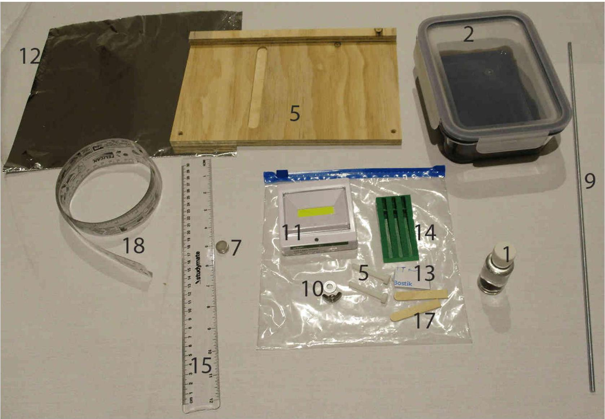
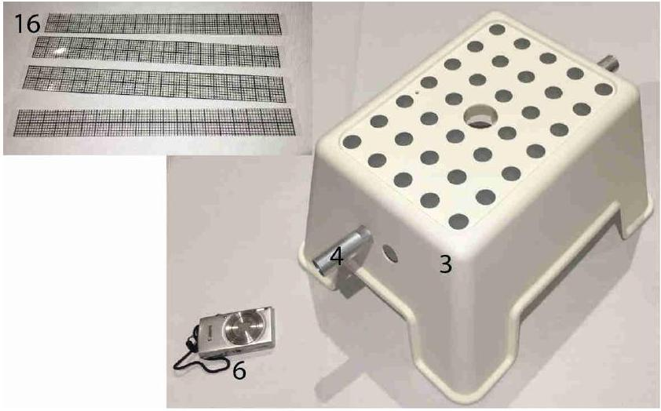
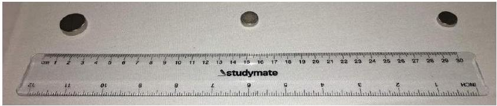
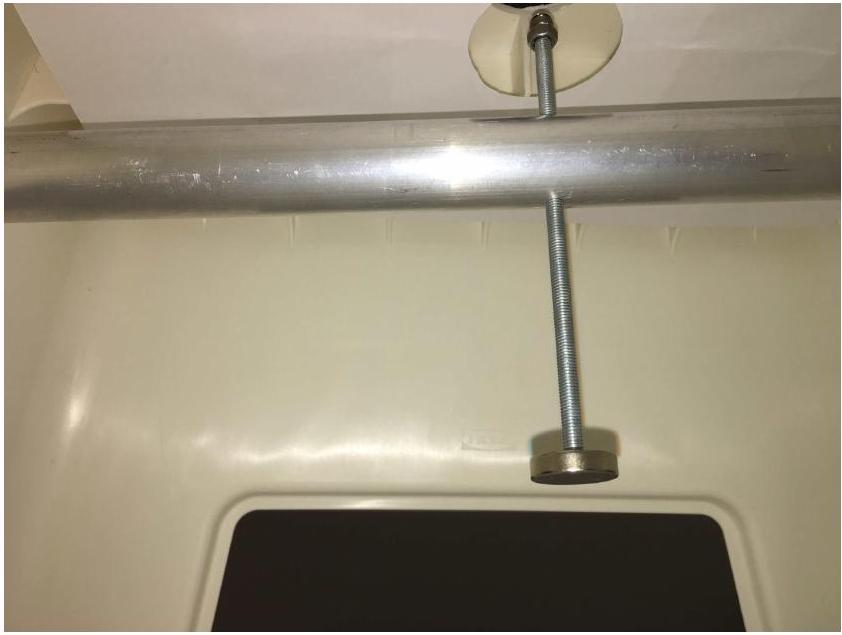
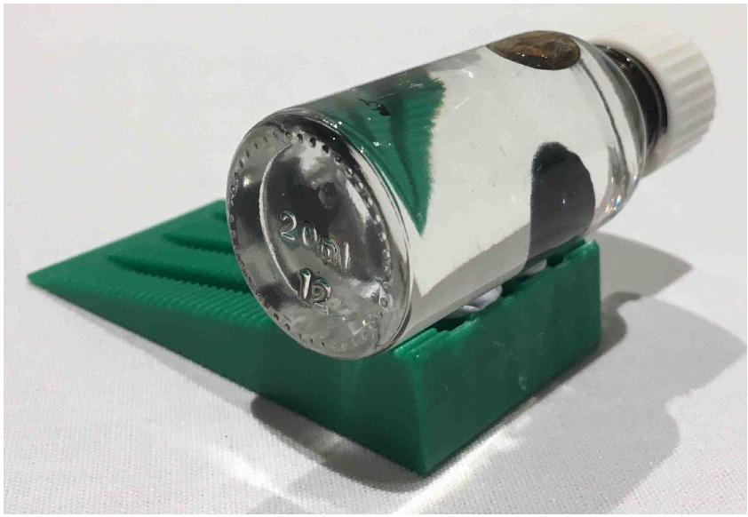
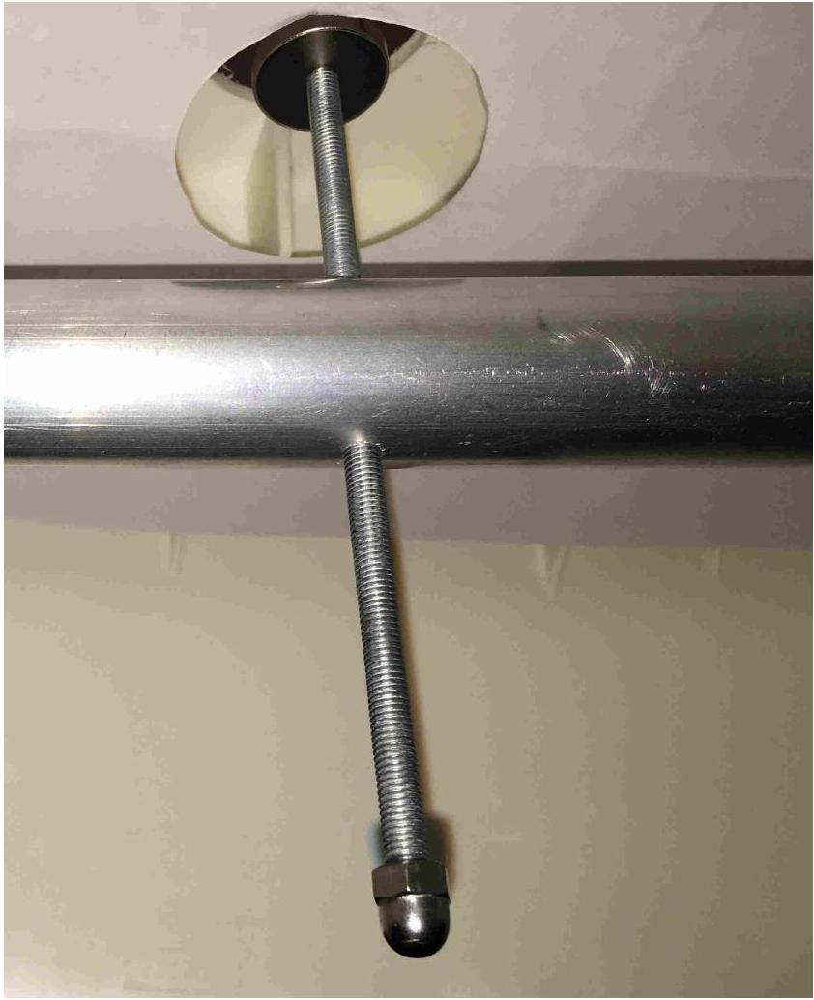
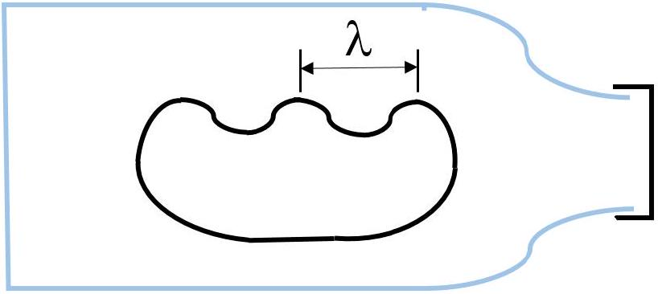
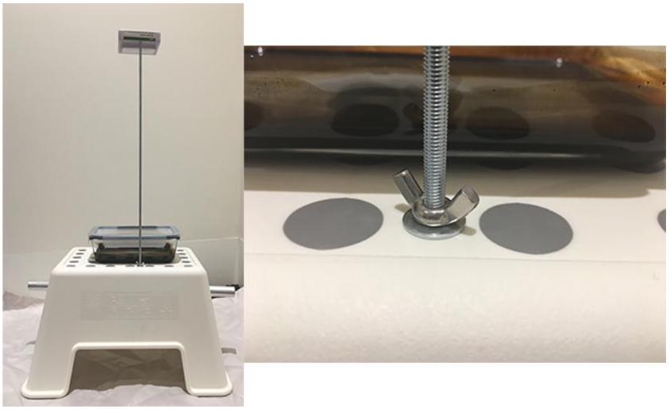
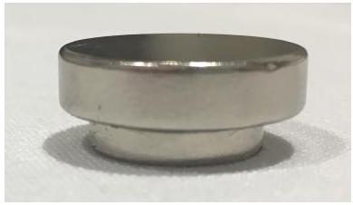

## Static response of a magnetically active fluid (10 points)

## Introduction

Ferrofluids are suspensions of nanoparticles of magnetite $\left(\mathrm{Fe}_{3} \mathrm{O}_{4}\right)$ in a carrier medium. They exhibit a range of interesting properties, and in particular a strong response to an applied magnetic field - they are sometimes described as superparamagnets. In this experiment you will be investigating empirically some of the properties of a ferrofluid using both static and dynamic testing methods, and using a range of experimental measurement and estimation techniques. The experiment is set up in two broad halves but it is suggested to work through the problems in order.

Equipment List

1. Small glass bottle with ferrofluid under a clear medium. You are NOT permitted to open the bottle for any reason!
2. Glass dish with sealed lid containing ferrofluid. You are NOT permitted to open the lid of the dish for any reason!
3. A combination light shroud and stand
4. Tube with adjustable magnet carrier (initially inserted through the stand)
5. Adjustable wooden base with nylon bolts for level adjustment
6. Camera with inserted memory card
7. $2 \times$ N 52 magnet, $14.2 \mathrm{~mm} \times 3.2 \mathrm{~mm}$
8. $1 \times \mathrm{N} 42$ magnet, $20.0 \mathrm{~mm} \times 5.0 \mathrm{~mm}$ (not shown in figure)
9. 500 mm threaded rod for use as a lamp pole
10. Washer and wing nut for attaching pole to stand
11. Battery-powered lamp with threaded mounting hole
12. Aluminium foil for making light guides and blockers
13. Blutack for attaching various components as needed
14. Green wedge
15. Transparent 30 cm ruler
16. 4 × transparent grid strips
17. 2 × wooden spacers
18. Paper tape measure

Safety and Other Important Notes
In this experiment you will be using high strength magnets. If you allow the magnets to attract each other they may pinch your fingers, or collide and shatter. Be careful to control the magnets at all times and not leave them near to each other unattended. Broken magnets will not be replaced.

This experiment has two sealed chambers of fluid. You may not open either the small glass bottle or the glass dish with sealed lid at any time during the experiment. If the sides of the dish become coated with ferrofluid, they will be very hard to see through so be careful not to tip the dish unnecessarily.

Your lamp is battery operated. If you deem it necessary, you may ask for one additional set of batteries for your lamp when you need them during the experiment.

If you hold a magnet close against the ferrofluid for more than around ten seconds, it will cause the fluid to behave differently due to residual magnetisation and interactions with the surrounding fluid. Although your experiment can still be performed, it may be more difficult to see the right effects.

When you store your magnets, ensure that they are far enough apart so that they won't snap together. They must be placed at least as far apart as is shown in the diagram above.

Part A: Static Testing (1.6 points)
In this part of the experiment, you will be investigating the ferrofluid properties through measurements of its static response to a magnetic field.

Magnetic interaction: force on a ferrofluid
The small glass bottle contains a volume of ferrofluid surrounded by an unknown fluid with which the ferrofluid is immiscible. The ferrofluid has density $1.21 \times 10^{3} \mathrm{~kg} \mathrm{~m}^{-3}$, and magnetic susceptibility $\chi=2.64$.
The ferrofluid responds to the presence of a magnetic field B and has an induced dipole moment per volume of magnitude $m=\frac{\chi B}{\mu_{0}}$.
The field on the axis of a cylindrical magnet is approximately

$$
B_{z}=\frac{B_{r}}{2}\left(\frac{z+l}{\sqrt{(z+l)^{2}+a^{2}}}-\frac{z}{\sqrt{z^{2}+a^{2}}}\right),
$$

where $z$ is the distance from the surface of the magnet, $l$ is its thickness, $a$ its radius and $B_{r}$ the remanent field strength which is a property of the magnetic material from which the magnet is made. For the large magnet (made of N42) $B_{r}=1.3 \mathrm{~T}$ and for the small magnets (made of N52) $B_{r}=1.4 \mathrm{~T}$.

The force per volume in the $z$ direction (along the direction of the magnet's magnetisation) on the ferrofluid can be taken to be

$$
\frac{f}{V}=\frac{\chi B_{z} \frac{d B_{z}}{d z}}{2 \mu_{0}} .
$$

## Experiment

Asian Physics Olympiad Adelaide 2019

## Q1-4

English (Official)

As this is tedious to calculate with the full field, you may use a dipolar approximation for the force on the ferrofluid in this part. Using this approximation the force per volume in the $z$ direction is

$$
\frac{f}{V}=-\frac{3 \chi B_{r}^{2} a^{4} l^{2}}{8 \mu_{0} z^{7}}
$$

Set up the stand so that the threaded rod through the aluminium tube has its flat face pointing downwards. You can rotate the aluminium tube to achieve this - make sure that the threaded rod does not hit the surface as you rotate the tube.

Stick the small bottle sideways to the top of the thick edge of the wedge using some of the blutack.

Magnet carrier in position for part A

Bottle setup for part A

A. 1 Find the position of the large magnet where the ferrofluid is just able to be suspended in the clear unknown fluid and record the distance $z$ on the answer sheet, along with its uncertainty. It can be difficult to achieve perfect balance, so if you are unable to keep the ferrofluid stably suspended, make the best estimate of the distance and its uncertainty.
In the box on the answer sheet, draw a diagram showing how you measure the distance.
Note that sometimes the ferrofluid may seem to 'split' into the magnetic blob and a separate, floating blob. This is usually due to the presence of a small amount of air in the bottle. You can use the magnet to adjust the position of the ferrofluid blob to find a clear space in the bottle to lift it.
A. 2 Using your distance result and any other measurements as necessary, calculate the difference between the density of the ferrofluid and of the clear surrounding fluid, including its uncertainty.

0.8pt

Part B: Magnetic interaction: surface tension of a ferrofluid (1.2 points)
The ferrofluid moves under the influence of three energies: gravitational potential energy, surface energy associated with the surface tension, and the magnetic energy.

Using one of the magnets, observe what happens when you bring the magnet very close to the bottle. The spikes appear in the ferrofluid due to the normal field instability, which occurs when the effective frequency of gravity-capillary-magnetic waves in the fluid becomes imaginary.

The dispersion relation is

$$
\omega^{2}=\frac{g k \Delta \rho}{\rho_{1}+\rho_{2}}+\frac{\sigma k^{3}}{\rho_{1}+\rho_{2}}-\frac{k^{2} \mu_{0} M_{0}^{2}}{1+(1+\chi)^{-1}},
$$

where $\sigma$ is the surface tension of the ferrofluid at a ferrofluid-clear fluid interface, $\rho_{1}$ is the density of the ferrofluid, $\rho_{2}$ is the density of the clear fluid, $\Delta \rho=\rho_{1}-\rho_{2}, M_{0}$ is the magnetisation in the ferrofluid, and $k$ is the wavenumber.

Applying the conditions $\omega^{2}=0$ and $\frac{\partial \omega^{2}}{\partial k}=0$, the surface tension can be found in terms of the density difference and the effective wavelength of the perturbations to the fluid surface at the point where the instability starts. The relationship is

$$
\sigma=\frac{g \Delta \rho \lambda^{2}}{4 \pi^{2}},
$$

where $\lambda$ is the distance between the centres of nearest neighbouring spikes when the magnetisation strength is at the instability threshold.

The magnet and carrier in position for part B.

Change the orientation of the threaded rod (rotating the tube while adjusting the rod position is the easiest way) so that you can raise and lower the magnet just under and through the hole in the top of the stand.

B. 1 Using the glass bottle, take a measurement of the distance $z_{\text {crit }}$ when the instability just starts to occur (peaks just start to form). Using the graticule or otherwise, measure the spacing of the peaks in the ferrofluid $\lambda$. at this position and record it. Estimate your uncertainties in both measurements.
Important hints: if you hold the fluid strongly to the glass wall with a magnet, it will stick slightly to the glass, making your measurements more difficult. If this happens, you can use a magnet to draw the fluid away from the sticky area, and use another part of the bottle for this measurement.

B. 2 Hence find the surface tension of the ferrofluid under the clear fluid, and its 0.6pt uncertainty.

Part C: Optical surface characterisation: non-spiking regime (4.1 points)
When the magnetic field is applied below the critical field, the surface of the fluid deforms to a first approximation as a balance between the magnetic and gravitational potential. In this next part we take the magnet to be sufficiently far from the fluid that it is well approximated by a dipolar field.

The surface deformation can be probed optically, using the surface of the fluid as an approximate spherical mirror. The effective radius of curvature of the centre of the deformation follows a power law, $R=\alpha z^{n}$ where $\alpha$ is a constant dependent on the materials and $z$ is the distance of the magnet from the unperturbed surface of the fluid.

First we need to calibrate the magnetic threaded rod.

C. 1 Use your equipment to find as precisely as you can the change in $z$ for one turn of the threaded rod magnet carrier, including an uncertainty estimate. Record the measurements you use and draw a diagram of your setup.

Now take the glass dish of ferrofluid and place it on the stand, so that the hole in the centre of the stand is under the middle of the dish. Do NOT open the sealed lid on the dish at any time during the experiment. Load one of the small magnets onto the rod.

Thread the lamp onto the rod, and use the washer and wing nut to fix the threaded rod to the hole in the stand (see figure).

C. 2 Using the relationship between the radius of curvature $R$ and image magnification $M$ for a spherical mirror, $R=\frac{2 l M}{1-M}$ where $l$ is the distance to the object, take measurements and then plot an appropriate graph to determine the constant $n$ in the relationship above. Estimate the uncertainty in your answer.

Part D: Spiked surface characterisation: spike formation and disappearance (3.1 points)
For larger fields the surface will undergo the instability and form spikes as observed with the glass bottle.

D. 1 Using a stack of one small and one large magnet, and the instability theory giving $\sigma=\frac{g \rho \lambda^{2}}{4 \pi^{2}}$, determine the surface tension of the ferrofluid at an air interface.

D. 2 Start with the magnet sufficiently far from the surface that no spikes are evident. Bring the magnet closer to the fluid and take distance readings for the appearance of each spike as it forms. Take another set of data as you withdraw the magnet, recording the position of the disappearance of each spike. Estimate the uncertainties in your measurements.
D. 3 Plot a graph of the number of visible spikes against magnet distance $z$. Fit curves to your graph indicating clearly which direction the magnet was moving.
D. 4 As the magnet's distance from the fluid surface changes, the fluid's gravitational, magnetic and surface energies change. Qualitatively sketch, as a function of the distance of the magnet from the fluid surface, the energy stored in surface energy and in magnetic potential energy. Mark any critical points from your previous graph and make clear the overall trend. You don't need to use the entire range of your data, just enough to show the idea.
