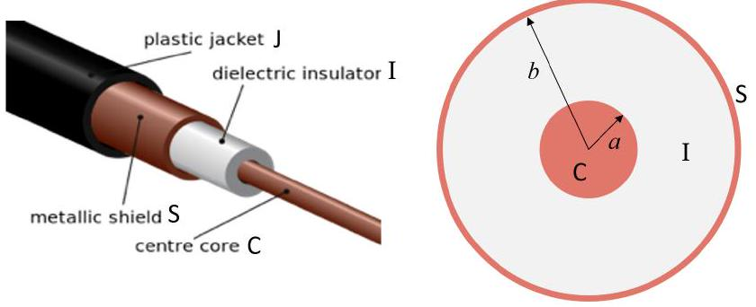
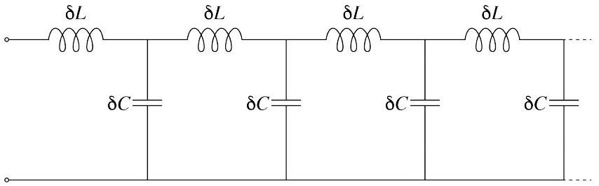
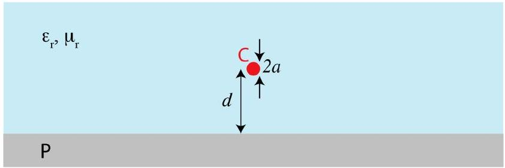
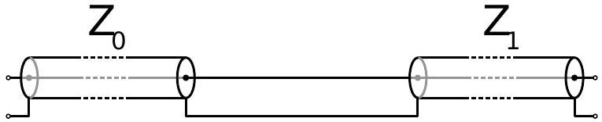
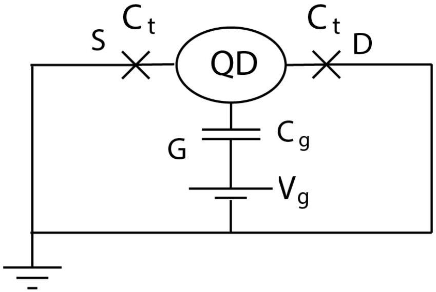
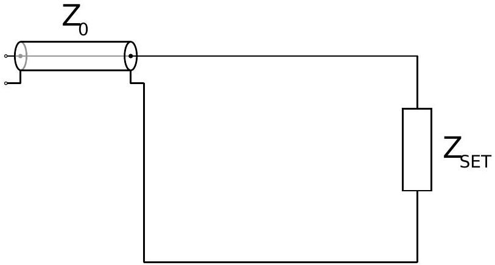
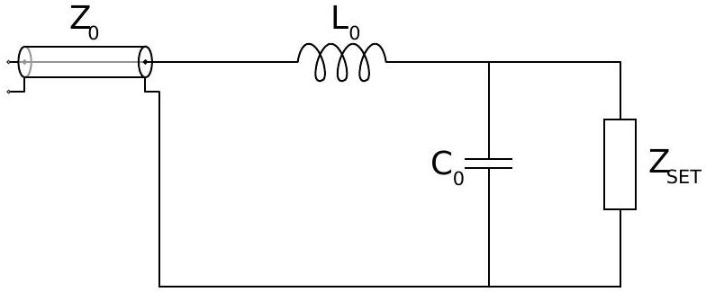
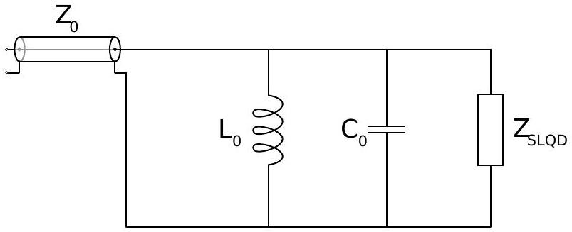

## RF reflectometry for spin readout for silicon quantum computing

## Introduction

Developing the idea of quantum computing into a practical technology is one of the largest outstanding challenges in science and technology. A promising path is to manipulate individual electrons in silicon transistors by time-dependent electromagnetic fields.

In this question, we investigate the use of radio frequency (RF) reflectometry and single-electron transistors to read out the state of quantum bits in silicon-based quantum computer prototypes.

Part A and Part B discuss radio wave transmission through cables and transmission lines, part C is devoted to conditions for wave reflection, part D introduces the single-electron transistor, and parts E and F introduce and ask you to optimise the method of reflectometry.

## Part A: Lumped element model of a co-axial transmission line (2.0 points)

When modelling DC or low frequency signals, one often assumes that a voltage pulse travels instantaneously throughout the circuit. This assumption is valid when the wavelength of such signals is much longer than the size of the circuit, however when working with radio frequency signals, the dynamics are more complex, and we need to account for the intrinsic capacitance and inductance of our cables in our model. We model a co-axial transmission line which acts as a waveguide as described below, ignoring the small resistance of the copper and the small conductance through the dielectric. Throughout the problem, we consider the large-wavelength limit of electromagnetic waves in the co-axial cable such that electric and magnetic fields are perpendicular to the axis of the cable everywhere (the so-called transverse electromagnetic mode).

Diagram of a coaxial cable showing C - the centre core, I - the dielectric insulator, S - the metallic shield and J - the plastic jacket.

Consider a co-axial cable consisting of a copper inner core of negligible resistance, negligible magnetic permeability and radius $a$, covered by an outer co-axial copper shield with inner radius $b$. A dielectric of dimensionless relative permittivity $\varepsilon_{\mathrm{r}}$ and dimensionless relative permeability $\mu_{\mathrm{r}}$ separates the layers. When electromagnetic signals propagate through the co-axial cable, they are confined between the inner core and outer shielding.

A. 1 At what speed do electromagnetic waves propagate in the co-axial cable?

A. 2 If there is a charge $\Delta q$ on a length $\Delta x$ of the inner core of the co-axial cable, and the outer shield is grounded, find the electric field in the region between the inner core and the shield.

| A. 3 | Find the capacitance per unit length, $C_{x}$, of the co-axial cable. You may wish to consider a length $\Delta x$ of the cable. | 0.3pt |
| :--- | :--- | :--- |
| A. 4 | Find the inductance per unit length, $L_{x}$, of the cable. | 0.3pt |

A lumped element model of the cable is constructed by considering the inductance and capacitance of short sections of the cable. The inductance is assumed to be a property of the inner core, and the capacitance links the core with the shielding. A diagram of the lumped element model is shown below.

Circuit diagram of lumped element model of coaxial cable.
A. 5 i. Show that the impedance $Z_{0}$ of a semi-infinite length of cable is $Z_{0}=\sqrt{L_{x} / C_{x}}$. 1.0pt ii. Find $b / a$ if the cable has impedance $Z_{0}=50 \Omega$ and is made using a dielectric material with $\varepsilon_{\mathrm{r}}=4.0$ and $\mu_{\mathrm{r}}=1.0$.

Part B: Hypothetical transmission line with return along a grounded plane (1.0 points)
An alternative hypothetical transmission line is shown in the diagram below. The input signal is sent through a very thin conductor of radius $a$, which is a distance $d \gg a$ from a highly conductive grounded plane. The material surrounding the conductor has dimensionless relative permittivity $\varepsilon_{\mathrm{r}}$ and dimensionless relative permeability $\mu_{\mathrm{r}}$. The return current flows along the grounded plane.

Diagram of a hypothetical transmission line showing C - the conductor of radius $a$, at a distance $d \gg a$ from P - the grounded conducting plane. The conductor is embedded in a material with dimensionless relative permeability $\varepsilon_{\mathrm{r}}$ and dimensionless relative permittivity $\mu_{\mathrm{r}}$.
B. 1 Find an expression for the characteristic impedance of this hypothetical trans- 1.0pt mission line.

Part C: Basics of RF reflectometry (1.2 points)
An electromagnetic wave can propagate in a transmission line in two opposite directions. For each di-
rection of propagation, the characteristic impedance $Z_{0}$ can be used to relate the voltage $V_{0}$ and current $I_{0}$ amplitudes as in the Ohm's law, $Z_{0}=V_{0} / I_{0}$.

Consider an interface between two transmission lines, with characteristic impedances $Z_{0}$ and $Z_{1}$. A schematic diagram of the circuit is shown below.

Circuit diagram of a transmission line of impedance $Z_{0}$ connected to a transmission line of impedance $Z_{1}$. The physical size of the interface is much smaller than the wavelength.

When a signal $V_{\mathrm{i}}$ sent into the transmission line with impedance $Z_{0}$ reaches the interface it is partially transmitted into the second transmission line, resulting in a signal $V_{\mathrm{t}}$ in that line which propagates forward. Some of the signal may also be reflected, resulting in a backward propagating signal in the initial transmission line $V_{\mathrm{r}}$.
C. 1 Find the reflectance of the interface $\Gamma=V_{\mathrm{r}} / V_{\mathrm{i}}$. 1.0pt
C. 2 State the condition(s) for the signal $V_{\mathrm{i}}$ to have gained a $\pi$ phase change on re- 0.2pt flection.

## Part D: The single electron transistor (3.3 points)

A single electron transistor (SET) consists of a quantum dot, which is a small isolated conductor where electrons can be localised, and of several electrodes in its vicinity. The gate electrode couples capacitatively to the quantum dot, while the two other electrodes --- the source and the drain --- are connected via tunnel junctions, through which electrons can tunnel due to quantum mechanics. A simplified circuit diagram for an SET is shown in the figure.

Circuit diagram representation of an SET. QD is the quantum dot, S is the source, D is the drain and G is the gate.

The capacitance of the gate is $C_{g}$ and the capacitance of the tunnel junctions is $C_{t} \ll C_{g}$. Consider $C_{g}$ to be the total capacitance of the quantum dot. In this part of the problem, the source and the drain are held at zero potential, and the voltage on the gate electrode is fixed at $V_{g}$.

D. 1 Consider a state of the SET in which the quantum dot contains $n$ electrons. 1.5pt i. Find the electrical potential $\varphi_{n}$ on the QD.
ii. Find the amount of energy $\Delta E_{n}$ that is necessary to bring an additional electron from the source or the drain onto the QD.

If $\Delta E_{n}<0$ then electrons will spontaneously tunnel into the quantum dot until such a number $\mathcal{N}>n$ is reached that $\Delta E_{\mathcal{N}} \geq 0$. The equilibrium number of electrons $\mathcal{N}$ and the corresponding addition energy $\Delta E_{\mathcal{N}}$ can be controlled by choosing the appropriate voltage $V_{g}$.

D. 2 Find an expression for the maximal possible value $E_{c}=\max \Delta E_{\mathcal{N}}\left(V_{g}\right)$ of the 0.5pt equilibrium addition energy that can be achieved by tuning the gate voltage of the SET.

If $\Delta E_{\mathcal{N}}=0$ then tunnelling of electrons does not require extra energy and SET is in a highly conductive ON state. If $\Delta E_{\mathcal{N}}>0$, then the conductance of the SET is reduced (high-resistance OFF).

For the number of electrons on the quantum dot to remain well-defined, certain conditions need to be satisfied. Firstly, if electrons in the source or drain have thermal energies sufficient to move spontaneously onto the quantum dot, the contrast between the ON and OFF states will disappear.

D. 3 Find a condition on the temperature of the electrons so that electrons cannot 0.5pt move onto the quantum dot by thermal excitation.

Secondly, tunnelling of electrons onto or off the dot limits the lifetime of their energy states. This tunnelling can be modelled using an effective resistance of the tunnel junction with the characteristic tunnelling time equal to the characteristic time for charging or discharging the quantum dot through the junction.

D. 4 i. Estimate the tunnelling time for a quantum dot in terms of capacitance $C_{t}$ 0.8pt and effective resistance $R_{t}$ of the tunnel junction.
ii. Find a condition on the effective resistance $R_{t}$ so that the electrons in the quantum dot retain sufficiently well-defined energy for the ON and OFF states to remain distinct.

## Part E: RF reflectometry to read out SET state (1.0 points)

The state of the SET is sensitive to electrical potentials created by nearby elements of the quantum circuit (such as quantum bits), and distinguishing between ON and OFF states provides a way to read out the information produced by the quantum computer. The SET in the ON state can be modelled by a resistance $R_{\mathrm{ON}}=100 \mathrm{k} \Omega$ while in the OFF state we can assume the SET to be a complete insulator (neglecting any capacitative connection between the source and the drain via the SET). While it is possible to determine the state of the SET by measuring the response to an input signal through the source, it is faster to do so using RF reflectometry to measure both the amplitude and phase of the reflected signal, i.e. determined the reflectance $\Gamma$.

Asian Physics Olympiad Adelaide 2019

The change in reflectance due to switching of an SET between ON and OFF states is

$$
\Delta \Gamma=\left|\Gamma_{\mathrm{ON}}-\Gamma_{\mathrm{OFF}}\right|,
$$

where $\Gamma_{\mathrm{ON}}$ and $\Gamma_{\mathrm{OFF}}$ are the reflectances in two different states.

Circuit diagram of transmission cable of impedance $Z_{0}$ connected to an SET.
E. 1 Find the change in reflectance $\Delta \Gamma$ between the conductive and insulating states 0.2pt for a typical SET connected to a co-axial cable with impedance of $50 \Omega$.

In order to increase the change in reflectance, and hence the sensitivity of the RF reflectometry, the circuit is modified by inclusion of an inductor. The intrinsic capacitance due to the device geometry $C_{0} \approx 0.4 \mathrm{pF}$ is also taken into account. The RF reflectometry is conducted using a signal of angular frequency $\omega_{\mathrm{rf}}$.

Modified SET circuit.

E. 2 Estimate the value of the inductance $L_{0}$ that can result in the change in re-
0.8pt flection on the order of one. Calculate your estimate for $L_{0}$ numerically for $\omega_{\mathrm{rf}} /(2 \pi)=100 \mathrm{MHz}$ and compute the corresponding $\Delta \Gamma$.

Part F: Charge sensing with a single lead quantum dot (1.5 points)
For a scalable quantum computing architecture, the number of wires reaching each individual quantum bit need to be minimized. A promising alternative to an SET for charge sensing in silicon quantum com-
puting is a Single Lead Quantum Dot (SLQD). In many ways it is similar to an SET, but does not have the source and drain leads. The gate is the only electrode, through which the electron energy states of the quantum dot are controlled and also through which RF reflectometry is conducted.

Like an SET, a SLQD has an OFF in which the SLQD behaves as a total insulator. In contrast to an SET, the ON state of the SLQD is capacitive, with capacitance $C_{\mathrm{q}}$. In order to maximize the difference in reflectance $\Delta \Gamma$ of the SLQD, the following circuit is constructed. The parasitic capacitance $C_{0} \approx 0.4 \mathrm{pF}$ is fixed by circuit geometry, but the value of $L_{0}$ and the operating frequency can be changed to optimize the performance. The characteristic impedance of the transmission line is $Z_{0}=50 \Omega$.

Circuit diagram of the SLQD readout circuit connected to the transmission line.
F. 1 Suggest $\omega_{\mathrm{rf}}$ and $Z_{\mathrm{C}}=\sqrt{L_{0} / C_{0}}$ that allow $\Delta \Gamma \sim 1$ for given $C_{0}$ and $C_{q}$. 1.0pt

Optimal values of $L_{0}$ are relatively large and not always technically feasible. Hence, other types of circuit elements may be needed to improve sensitivity of the reflectometry readout circuit.

F. 2 Assume that $L_{0}$ (and hence $Z_{C}$ ) is fixed. Draw a circuit diagram showing where to place an additional element in the SLQD readout circuit and specify the parameter(s) of this element such that $\Delta \Gamma \sim 1$ can still be achieved without requiring a large inductance.
