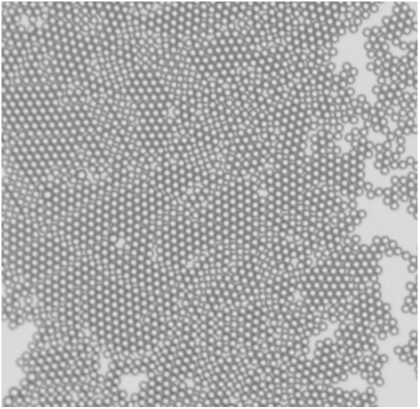
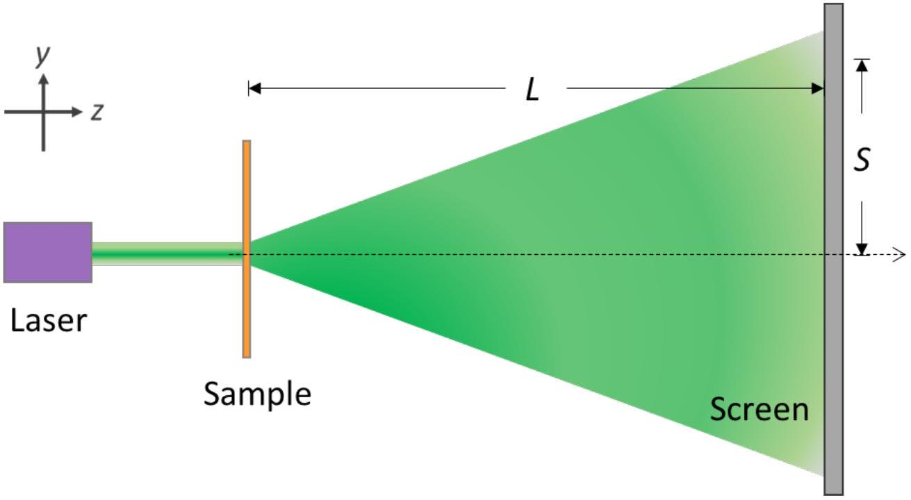
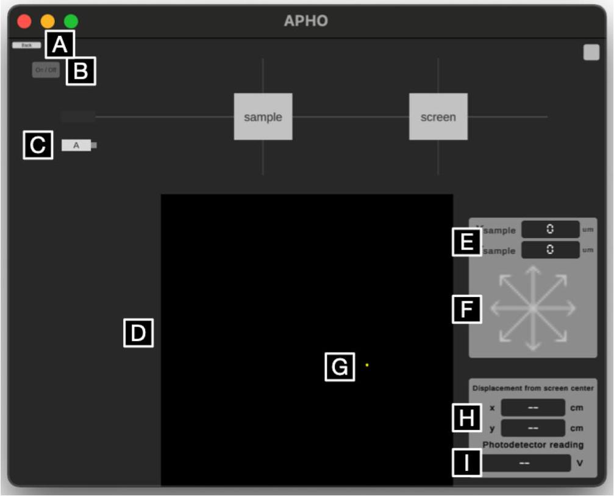
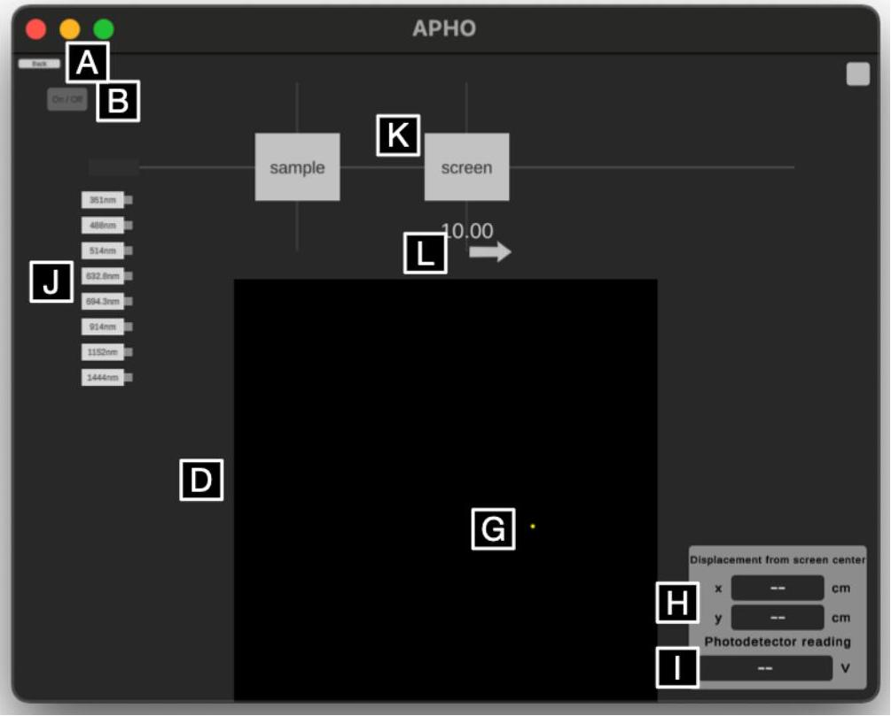

## Q2-1   English (Official)

## Exploring the spatial structure of the sample with optical methods (10 points)

(Use software 2A to 2E to answer questions)

I. Experimental setup

Figure 1 The illustration of the microspheres arrangement

Figure 2 Experimental setup

## Q2-2   English (Official)

## II. Introduction

Microspheres have many applications in the field of biomedical measurements. The use of a carrier with a structure and pattern design to inject the microspheres can be used to make related photoelectric sensing components. This online experiment aims to simulate the above-mentioned experimental framework, carry out relevant measurements, infer the diameter of the microsphere, the size of the structure pattern, and finally describe the spatial structure of the sample.

There is a sample used for biomedical detecting. This sample is made up of many transparent glass microspheres with the same diameter arranged in a two-dimensional densest packing. The microspheres are closely adjacent to each other, and the arrangement direction is somehow not consistent (as shown in Figure 1). These microspheres are filled into a rectangular array grid which has a size larger than the diameter of the microspheres with a rotation angle. In order to know all the pattern structures of this sample, this experimental design (as shown in Figure 2) uses a laser light source to irradiate the sample to observe the diffraction phenomenon. From the structure analysis of the diffraction pattern, the symmetry and structure size of the sample can be known.

## Experiment

Software Instruction Manual

2A
A. Back to experiment overview

Note that using this button during experiments wipes all experiment states and data.
B. Laser power on/off

Power on/off laser with this button while the laser is on the optical track. When the laser is activated, a light trail is shown on the track.
C. Laser source

Draggable onto or away from the optical track. Note when a new laser source is placed onto the track, "Installing" would be shown to indicate the installation progress.
D. Projection screen

The laser first irradiates the sample, then projects the resulting pattern onto the screen on the right side of the track. In Part A experiment, the screen is fixed at 50 cm from the sample.
E. Sample coordinate display

Shows the coordinates $X_{\text {sample }}$ and $Y_{\text {sample }}$ for the sample in the middle of the track in $100 \mu \mathrm{~m}$ increments.
F. Sample coordinate adjustment

Click to adjust the coordinates of the sample in $100 \mu \mathrm{~m}$ increments. Long press to move continuously. Diagonal arrows move the sample in both axes in $100 \mu \mathrm{~m}$ increments.
G. Photodetector coordinate adjustment

Click on the projection screen to place a photodetector at the spot clicked. Use arrow keys on your keyboard to finetune the location.

## Experiment

H. Photodetector coordinate display

Numerically show the location $(x, y)$ of the photodetector with respect to the origin in 0.01 cm increments.
I. Photodetector voltage display

The voltage readings of the photodetector in 0.01 V increments. Note that the range of the meter cannot be adjusted.

2B - 2E

J. Laser sources of multiple wavelengths

Draggable onto or away from the optical track. Note when a new laser source is placed onto the track, "Installing" would be shown to indicate the installation progress.
K. Projection screen

The laser first irradiates the sample, then projects the resulting pattern onto the screen on the right side of the track. In Part B to Part E experiments, the distance of the projection screen to the sample is adjustable.
L. Projection screen adjustment

Use the mouse to horizontally drag the arrow. This adjusts the distance of the projection screen to the sample at a 1.0 cm increment. Adjustable range is 10.0 cm to 100.0 cm.
III. Experiment

Part A. Collimation of light and sample (1.0 points)
To collimate the laser properly irradiating the sample, a double slit is used as the sample for light calibration. If the laser is properly collimated and irradiated at the center of the double slit, a clear interference fringe can be observed on the screen. The original position of the double slit is $\left(X_{\text {sample }}, Y_{\text {sample }}\right)=(0,0)$, and the value is displayed on the software interface. The sample has a fixed z position. By sufficiently adjusting the position of the double slit along $x-y$ plane, you would observe the interference fringes displayed on the screen. Please find out the best position $\left(X_{\text {sample }}, Y_{\text {sample }}\right)$ of the double slit that the observer can determine the correct spacing of the interference fringes.

A. 1 Please determine the best position value $\left(X_{\text {sample }}, Y_{\text {sample }}\right)$ for the double-slit 0.5pt sample.
A. 2 According to the best position value, please draw the observed interference fringes and record the position $(x, y)$ of the dark fringes of the first and second orders and the distance $S$ between the position $(x, y)$ and origin. Please determine the spacing $\Delta S$ between two adjacent dark fringes.

0.5pt

Part B. Exploration of sample structure size (3.0 points)
Assuming that the optical path of the entire system has the optimal setting, the laser position and the sample position are fixed. Just need to change the wavelength of the laser light $\lambda$ and the position of the screen $L$, and then the corresponding diffraction pattern can be seen on the screen. The corresponding distance between each microsphere $d$ can be determined by using the relationship in terms of $\lambda, L$ and $S$ (the distance between the position $(x, y)$ and origin). Please refer to the schematic plot of microsphere arrangement in Figure 1 and use three kinds of laser light sources in the visible light range to estimate the diameter of the microsphere $a$.

B. 1 Show the formula for the indicated microsphere distance $d$ in terms of $\lambda, L$ and $S$.
B. 2 With selecting appropriate position of the screen $L$, please record the coordinates ( $x, y$ ) of diffraction pattern on the screen for microsphere, and the estimate distance $S$ and $\tan ^{-1}\left(\frac{\bar{S}}{L}\right)$ (unit: radian) in the selected three laser sources in the visible range. (record five sets on the same ring to obtain the average $\bar{S}$ value)
B. 3 Using the formula to estimate the corresponding distance between each microsphere $d$, the diameter of the microsphere $a$ and average diameter $\bar{a}$ in the three laser sources.

## Q2-6   English (Official)

## Part C. Exploration of sample structure size (2.5 points)

This sample has a rectangular grid array with a orientation angle. In each rectangle, there are many transparent glass microspheres arranged in a two-dimensional densest-packed condition. From the pattern on the screen, you can see the crossed diffraction fringe caused by the regular arrangement of the rectangular grid array. Please select a visible laser for experiment, and try to derive the sizes of the rectangular structure and the corresponding orientation angle from the diffraction pattern.

C. 1 Please select a visible laser for experiment. Fix the distance between the screen and the sample at $L=90 \mathrm{~cm}$, and observe the diffraction pattern. Please mark the coordinates $(x, y)$ of the $4^{\text {th }}$ to $7^{\text {th }}$ order bright fringes in the two axial directions, calculate the corresponding distance $S$ and estimate the corresponding value of $\tan ^{-1}\left(\frac{S}{L}\right)$ (unit: radian).
C. 2 Please calculate the distance $\Delta S_{l}$ and $\Delta S_{w}$ between adjacent bright fringes based on the data in the previous question. Please also estimate the length of the long $(l)$ and short $(w)$ sides of a single rectangle.
C. 3 Estimate the orientation angle: Draw a line to estimate the angle. Four coordinates ( $x, y$ ) of the bright patterns should be marked. Estimate the orientation angle $\phi$ of the long side of a single rectangle with respect to the horizontal axis.

## Part D. Exploration of sample structure size (2.5 points)

With the incident light in the visible range as in the previous problems, there are finer diffraction spot patterns within the crossed bright fringes on the screen, which are not easy to identify. Therefore, light of longer wavelength is necessary to acquire clearer diffraction pattern for the sample. Please use infrared lasers to irradiate the samples for generation of fine diffraction spot patterns. Since infrared is invisible, a photodetector is required to find the positions of diffraction spots. Try to determine the sample grid structure by the diffraction spot patterns.

D. 1 Please set the screen position at 95 cm, select one infrared laser for the experiment, and use the photodetector to identify the fine diffraction spot patterns on the screen. In the table, please write down the laser wavelength and the center coordinates of a set of 4 × 4 fine diffraction bright spots on the screen. Draw the $4 \times 4$ spot pattern, denote the distances between adjacent spots, $\Delta S_{x}$ and $\Delta S_{y}$, in the diagram, and calculate the values.
D. 2 Determine the spacings $d_{x}$ and $d_{y}$ of the sample grid from the results of the infrared experiments.

Part E. Exploration of sample structure size (1.0 points)
This sample is made up of many transparent glass microspheres arranged in a two-dimensional densestpacked condition (as shown in Figure 1), and is covered in a rectangular array grid with a specific rotation angle. The microspheres are closely adjacent to each other, and the arrangement direction is somehow not consistent. In addition to the regular arrangement of the microspheres, this sample has other rectangular arrays that are larger than the diameter of the microspheres. According to Part C and Part D questions, the structure size and direction information obtained by observing the diffraction fringes, the specific structured pattern of the sample is identified.

E. 1 Please draw the periodic arrangement of the sample: Please represent it by a $3 \times 3$ rectangular array and mark the sizes ( $l$ and $w$ ), spacings ( $d_{x}$ and $d_{y}$ ) and orientation angle $(\phi)$ corresponding to the question Part C and Part D in the pattern with symbols $\left(l, w, d_{x}, d_{y}, \phi\right)$.
