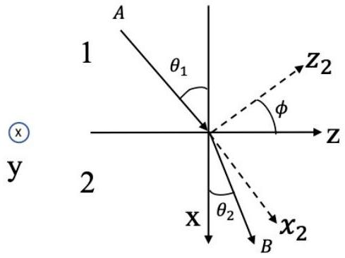
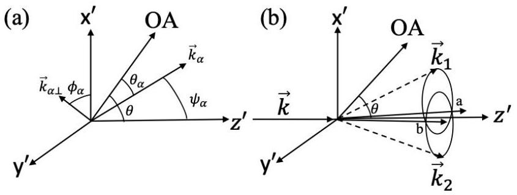
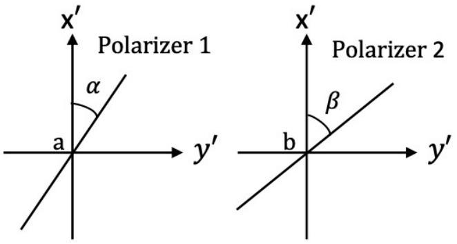

## Ray tracing and generation of entangled light

Useful formula:

$$
\vec{A} \times(\vec{B} \times \vec{C})=\vec{B}(\vec{A} \cdot \vec{C})-\vec{C}(\vec{A} \cdot \vec{B})
$$

Introduction
Let $\vec{E}$ represent the electric field, $\vec{H}$ the magnetic field, $\vec{D}$ the electric displacement, and $\vec{B}$ the magnetic induction. We have $\vec{D}=\epsilon_{0} \vec{E}+\vec{P}$, with $\vec{P}$ being the polarization of the medium and $\epsilon_{0}$ being the permittivity of free space. Only nonmagnetic dielectric media are considered in this problem, hence $\vec{B}=\mu_{0} \vec{H}$, with $\mu_{0}$ being the permeability of free space. The energy density and energy flow density associated with the electromagnetic field are given by $u_{e m}=\frac{1}{2}(\vec{E} \cdot \vec{D}+\vec{H} \cdot \vec{B})$ and Poynting's vector $\vec{S}=\vec{E} \times \vec{H}$, respectively.
In homogeneous dielectric media, a monochromatic plane wave of light can be described by its angular frequency $\omega$, wave vector $\vec{k}, \vec{D}$, and $\vec{B}$. According to Maxwell's equations, we have $\vec{k} \times \vec{E}=\omega \vec{B}$ and $\vec{k} \times \vec{H}=-\omega \vec{D}$. For such a wave, variations of $\vec{D}$ and $\vec{B}$ with position $\vec{r}$ and time $t$ are given by sinusoidal functions of the phase $(\vec{k} \cdot \vec{r}-\omega t)$.

Part A. Light propagation in isotropic dielectric media (1.0 points)
If the medium is isotropic, we have $\vec{P}=\chi \epsilon_{0} \vec{E}$ and $\vec{D}=\epsilon \vec{E}$, with $\chi$ and $\epsilon=\epsilon_{0}(1+\chi)$ being the electric susceptibility and permittivity, respectively, of the medium. For a light wave of angular frequency $\omega$ in such a medium, a given phase will propagate in the direction $\vec{k}$ with a velocity (called phase velocity) $v_{p}=c / n$. Here $c$ is the speed of light in vacuum and $n$ is the refractive index of the medium. One can also use rays to represent a train of light waves. The propagation of a light ray is characterized by the direction and speed $v_{r}$ of the electromagnetic energy flow.

Consider a plane wave of light with angular frequency $\omega$ and wave vector $\vec{k}$ in a homogeneous isotropic dielectric medium.
A. 1 Express its phase velocity $v_{p}$ in terms of $\epsilon$ and $\mu_{0}$. 0.4pt
A. 2 What is the refractive index $n$ of the dielectric medium for the wave? 0.2pt
A. 3 What are the direction $\hat{S} \equiv \vec{S} / S$ and speed $v_{r}$ of its electromagnetic energy flow? 0.4pt

Part B. Light propagation in uniaxial dielectric media (4.8 points)
We now assume the dielectric medium to be uniaxial, i.e, it is electrically anisotropic along a special direction fixed in the medium, called the optic axis, which we presently call it the $z$ direction. In such a case, the displacement $\vec{D}$ and the electric field $\vec{E}$ are related by $D_{x}=\epsilon E_{x}, D_{y}=\epsilon E_{y}$, and $D_{z}=\epsilon^{\prime} E_{z}$, where $x, y$, and $z$ axes are mutually orthogonal. Consequently, the phase velocity of a light wave is anisotropic and depends additionally on the directions of $\vec{k}$ and $\vec{D}$. Let $n_{o}=c \sqrt{\mu_{0} \epsilon}$ and $n_{e}=c \sqrt{\mu_{0} \epsilon^{\prime}}$, answer the followings questions: B.1, B.2, and B.3.

## Q2-2   English (Official)

B. 1 Suppose the wave vector $\vec{k}$ of a monochromatic plane light wave is in the $x z$ plane so that $\vec{k}=k(\sin \theta, 0, \cos \theta)$. At each angle $\theta$, what directions of $\vec{D}$ and $\vec{B}$ are permissible for the light wave? Find all possible refractive indices and express the refractive indices in terms of $\theta, n_{o}$, and $n_{e}$. Find the angle $\theta$ for which only one value is permitted for the refractive index.
B. 2 The polarization of a light wave, i.e., the direction of its electric field $\vec{E}$, can be either perpendicular (called an ordinary wave or ray ) or parallel (called an extraordinary wave or ray) to the $x z$ plane. For each of the light waves you found in B.1, specify its polarization as a unit vector and indicate whether it is an ordinary or extraordinary wave. Also compute $\tan \alpha$, where $\alpha$ is the angle between $\vec{E}$ and $\vec{D}$ ( $\alpha$ is positive when going from $\vec{E}$ to $\vec{D}$ is clockwise).
B. 3 Extend the results in B. 1 and B. 2 to the general case when the angle between $\vec{k}$ and the positive $z$ direction is still $\theta$, but $k$ is not in the $x z$ plane. Find all possible values of the refractive indices and the corresponding polarizations.

In a uniaxial medium, the direction of $\vec{k}$ of a light wave may differ from the direction of the light ray. The phase velocity of the wave is still given by $c / n$ with $n$ being the refractive index along $\vec{k}$, while the ray velocity is defined jointly by the direction and the rate of energy flow.

B. 4 Following problems B.1-3, consider a light wave with $\vec{k}=k(\sin \theta, 0, \cos \theta)$. Let the angle between $\hat{k} \equiv \vec{k} / k$ and the direction of the ray, $\hat{S}$, be $\alpha_{r}$ ( $\alpha_{r}$ is positive when going from $\hat{S}$ to $\hat{k}$ is clockwise). Find all possible values of $\tan \alpha_{r}$, speed $v_{r}$ of the ray and $\widehat{S}$. Using these results, express the ray index $n_{s}=c / v_{r}$ in terms of $\hat{S}, \hat{x}, \hat{z}, n_{o}$, and $n_{e}$.

Consider the propagation of a light ray from A to B through an interface between an isotropic medium, labelled 1, and an anisotropic medium, labelled 2, as shown in Fig. 1. The interface coincides with the $y z$ plane, while the plane of incidence is the $x z$ plane. Let the angle of incidence be $\theta_{1}$. The refractive index of medium 1 is $n$, while the refractive indices of medium 2 for axes $z_{2}, y_{2}, x_{2}$, are $n_{e}$, $n_{o}$, and $n_{o}$, respectively. Here $y_{2}$ axis coincides with $y$ axis. Fermat's principle states that the propagation time for the path that the light ray goes from A to B is a minimum. For light with polarization parallel to $x z$ plane and incident at the angle $\theta_{1}$, Fermat's principle leads to the following equation:

$$
\bar{A}\left(\tan \theta_{2}\right)^{2}+\bar{B} \tan \theta_{2}+\bar{C}=0
$$

B. 5 Find $\bar{A}, \bar{B}$, and $\bar{C}$ in terms of $P_{1}, P_{2}, P_{3}$, and $n \sin \theta_{1}$, where $P_{1}=n_{o}^{2} \cos ^{2} \phi+$ $n_{e}^{2} \sin ^{2} \phi, P_{2}=n_{o}^{2} \sin ^{2} \phi+n_{e}^{2} \cos ^{2} \phi$, and $P_{3}=\left(n_{o}^{2}-n_{e}^{2}\right) \sin \phi \cos \phi$. From Eq. (1), find corresponding $\tan \theta_{2}$ to two special orientations: $\phi=0$ and $\phi=\pi / 2$.

Fig. 1: Propagation of light from A to B through an interface between an isotropic medium 1 and an anisotropic medium 2.

## Part C. Entanglement of light (4.2 points)

In a nonlinear medium, the electric field $\vec{E}$ is related to the polarization $\vec{P}$ by $P_{i}=\left(\epsilon-\epsilon_{0}\right) E_{i}+$ $\sum_{j} \sum_{k} \chi_{i j k}^{(2)} E_{j} E_{k}$. Here $i, j, k$ each can be any one of the three components $x, y, z$, and $\chi_{i j k}^{(2)}$ are constants representing the second-order nonlinear susceptibility of the medium. Non-vanishing of $\chi_{i j k}^{(2)}$ implies that as a light wave travels through a nonlinear medium, it can split into two light waves.
Suppose that because $\chi_{i j k}^{(2)}$ are not all zero, the electric field in the medium is made up of a superposition of three plane waves of angular frequencies $\omega, \omega_{1}$, and $\omega_{2}$, propagating with wave vectors $\vec{k}, \vec{k}_{1}$, and $\vec{k}_{2}$, respectively. Assume $\omega \geq \omega_{2}$ and $\omega_{1} \geq \omega_{2}$.

C. 1 Find all possible relations (known as the phase matching conditions) between these angular frequencies and wave vectors. Viewing light as composed of photons, what kinds of conservation laws do these conditions imply for the three photons involved? Write down equations expressing these conservation laws for the case that a photon with angular frequency $\omega$ and wave vector $\vec{k}$ being split into two photons of angular frequencies $\omega_{1}$ and $\omega_{2}$, propagating with wave vectors $\vec{k}_{1}$ and $\vec{k}_{2}$, respectively.
C. 2 Consider a light wave in a uniaxial medium. Denote an ordinary ray as o and an extraordinary ray as e. There are 8 possible ways of splitting for the light wave: o → O + o, o → e + o, o → o + e, o → e + e, e → o + o, e → e + o, e → o + e, and $\mathbf{e} \rightarrow \mathbf{e}+\mathbf{e}$. Assume that the refractive indices $n_{o}$ and $n_{e}$ are both increasing functions of $\omega$. Using the same notations for wave vectors as in problem C. 1 and considering the case that $\vec{k}, \vec{k}_{1}$, and $\vec{k}_{2}$ are collinear, indicate which of the 8 ways of splitting are not possible.

Consider an incoming e ray traveling along $z^{\prime}$ direction with wave vector $\vec{k}$ and $\omega=\Omega_{p}$ in an uniaxial medium with refractive index $n_{e}<n_{o}$. Suppose that, in a collinear splitting $\mathbf{e} \rightarrow \mathbf{e}+\mathbf{o}$, the phase-matching conditions are realized with $k_{1}=K_{e}, \omega_{1}=\Omega_{e}, k_{2}=K_{o}$, and $\omega_{2}=\Omega_{o}$. Here subscripts 1 and 2 refer to e ray and $\boldsymbol{0}$ ray. $\vec{k}_{1}, \vec{k}_{2}$ and $\vec{k}$ all point in the $z^{\prime}$ direction. As shown in Fig. 2(a), the optic axis (OA) of the medium lies in the $x^{\prime} z^{\prime}$ plane and makes an angle $\theta<\pi / 2$ with the $z^{\prime}$ axis. Therefore, $n_{e}$ is a function of $\omega$ and $\theta$, i.e., $n_{e}=n_{e}(\omega, \theta)$. For the same incoming e ray with wave vector $\vec{k}$ and $\omega=\Omega_{p}$, suppose its non-collinear splitting into $\mathbf{e + o}$ rays causes the latter two rays to separate but remain on two cones with $\omega_{1}=\omega_{2}=\Omega$, $k_{1}=k_{2}$, as shown in Fig. 2(b). Note that in the collinear splitting, $\Omega_{e}$ is already close to $\Omega_{o}$, and here $\Omega$ is only slightly less than $\Omega_{e}$. In a plane perpendicular to $\vec{k}$, two circles on the cones for $\vec{k}_{1}$ and $\vec{k}_{2}$ intersect at points $a$ and $b$ with the line $\overline{a b}$ parallel to $y^{\prime}$ axis. As shown in Fig. 2(a), $\vec{k}_{\alpha}(\alpha=1,2)$ makes an angle $\theta_{\alpha}$

## Q2-4   English (Official)

with the optic axis and has angular coordinates $\left(\psi_{\alpha}, \phi_{\alpha}\right)$ with $\vec{k}_{\alpha \perp}$ being its projection in the $x^{\prime} y^{\prime}$ plane. Each vector $\vec{k}_{\alpha}$ deviates from $z^{\prime}$ axis only slightly so that $\left|\left(\Omega-\Omega_{e}\right) / \Omega_{e}\right| \ll 1,\left|\vec{k}_{\alpha \perp}\right| / k_{\alpha} \ll 1$ and $\left|\theta_{\alpha}-\theta\right| \ll 1$. Using approximations which agree with the $z^{\prime}$ component of $\vec{k}_{\alpha}$ to terms of the order $k_{\alpha \perp}^{2}$ and the angle $\theta_{\alpha}$ to $\left(\theta_{\alpha}-\theta\right)^{2}$, one finds that $\vec{k}_{2 \perp}=\left(q_{x^{\prime}}, q_{y^{\prime}}\right)$ must satisfy $M\left(q_{x^{\prime}}+N\right)^{2}+M q_{y^{\prime}}^{2}=L$.

C. 3 Let $M>0$. Evaluate $M, N$, and $L$ in terms of $\Omega, \Omega_{e}, \Omega_{o}, K_{e}, K_{o}$ and $N_{e}(\omega, \theta)=$ 1.3pt $\frac{1}{n_{e}(\omega, \theta)} \frac{d n_{e}(\omega, \theta)}{d \theta}$ and the group velocities $u_{o}=\frac{d w_{2}}{d k_{2}}$ and $u_{e}=\frac{d \omega_{1}}{d k_{1}}$ for the o and e rays. Estimate the angle between the axis of the cone and $z^{\prime}$, and also the angle of the cone in terms of $L, M, N$ and $K_{o}$.

Fig. 2: (a) Vector $\vec{k}_{\alpha}$ has angular coordinates ( $\psi_{\alpha}, \phi_{\alpha}$ ) in the $x^{\prime} y^{\prime} z^{\prime}$ coordinate system with $\vec{k}_{\alpha \perp}$ being its projection in the $x^{\prime} y^{\prime}$ plane. Note that $\vec{k}_{\alpha}$ makes an angle $\theta_{\alpha}$ with OA. (b) Non-collinear splitting of an e ray into $\mathbf{e + o}$ rays that form two cones. Line $\overline{a b}$ is parallel to the $y^{\prime}$ axis.

Problem C. 3 shows that a photon may split into two photons which when passing through points a and b are polarized in perpendicular directions. These two photons are called entangled photon pair because if one photon that passes $a$ (called $a$-photon) is polarized in a direction $\hat{x}^{\prime}$, the other that passes $b$ (called $b$-photon) will be polarized in the direction $\hat{y}^{\prime} \perp \hat{x}^{\prime}$, and if the $a$-photon is polarized in $\hat{y}^{\prime}$, then the $b$ photon will be polarized in $\hat{x}^{\prime}$. The entangled photon-pair state can be prepared experimentally. It is a superposition of the above two alternative states and can be expressed as $\frac{1}{\sqrt{2}}\left(\left|\hat{x}_{a}^{\prime}\right\rangle\left|\hat{y}_{b}^{\prime}\right\rangle+\left|\hat{y}_{a}^{\prime}\right\rangle\left|\hat{x}_{b}^{\prime}\right\rangle\right)$. Here $\left|\hat{x}_{a}^{\prime}\right\rangle\left|\hat{y}_{b}^{\prime}\right\rangle$ represents the state when $a$-photon is polarized in $\hat{x}^{\prime}$ direction and $b$-photon is polarized in $\hat{y}^{\prime}$ direction; similar meaning applies to $\left|\widehat{y}_{a}^{\prime}\right\rangle\left|\widehat{x}_{b}^{\prime}\right\rangle$. The coefficient $1 / \sqrt{2}$ can be viewed as the product of electric field amplitudes (expressed in suitable units) of $a$ - and $b$-photons. As illustrated in Fig. 3, two linear polarizers 1 and 2 have transmission axes at angles $\alpha$ and $\beta$ respectively with respect to $\hat{x}^{\prime}$. We may use them to perform coincidence measurement on the two photons that pass $a$ and $b$. Let the probability of simultaneously finding two photons passing through polarizers 1 and 2 be $P(\alpha, \beta)$. Alternatively, $P(\alpha, \beta)$ can also be regarded as being proportional to the product of intensities (after appropriate superpositions) of light passing through the two polarizers. Denote $\alpha+\pi / 2$ and $\beta+\pi / 2$ by $\alpha_{\perp}$ and $\beta_{\perp}$ respectively.

Fig. 3: Two linear polarizers 1 and 2 for coincidence measurement of photons that pass $a$ and $b$.

## Q2-5   English (Official)

C. 4 Consider the total electric field projected by linear polarizers. Find the probabilities $P(\alpha, \beta), P\left(\alpha, \beta_{\perp}\right), P\left(\alpha_{\perp}, \beta\right)$, and $P\left(\alpha_{\perp}, \beta_{\perp}\right)$.
C. 5 Assign $\sigma_{a}=1$ when polarizer 1 with angle $\alpha$ finds an $a$-photon and $\sigma_{a}=-1$ when polarizer 1 with angle $\alpha_{\perp}$ finds an $a$-photon. Similarly, $\sigma_{\beta}=1$ or -1 is assigned when polarizer 2 with angle $\beta$ or $\beta_{\perp}$ finds a $b$-photon. If $E(\alpha, \beta)$ denotes the average of $\sigma_{a} \sigma_{b}$, the quantity $S=\left|E(\alpha, \beta)-E\left(\alpha, \beta^{\prime}\right)\right|+\left|E\left(\alpha^{\prime}, \beta\right)+E\left(\alpha^{\prime}, \beta^{\prime}\right)\right|$ has important meaning. For classical theories of light, $S \leq 2$. This is a variant form of Bell's inequality (the Clauser-Horne-Shimony-Holt inequality). Find the expression of $S$ and evaluate $S$ for the case $\alpha=\frac{\pi}{4}, \alpha^{\prime}=0, \beta=-\frac{\pi}{8}, \beta^{\prime}=\frac{\pi}{8}$. Indicate if $S$ is consistent with the classical theories.
