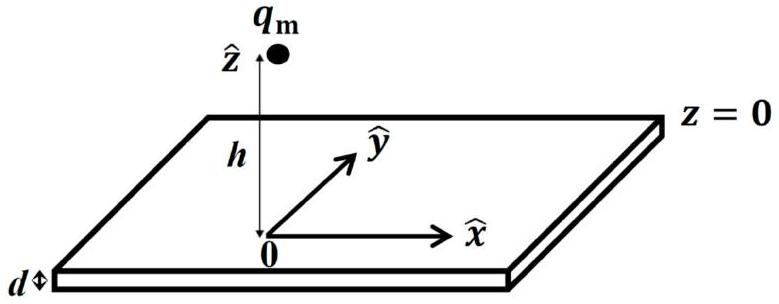
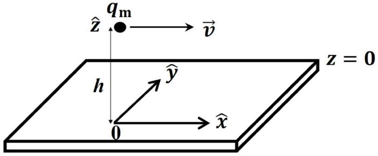
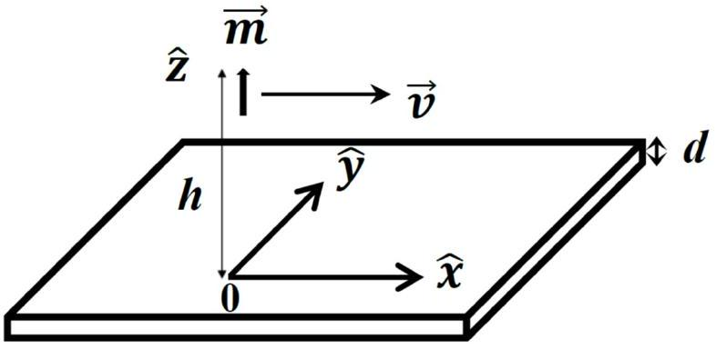

## Magnetic Levitation

Useful Information
(1) Directional derivative of a spatial function $f(\vec{r})$, given by $\vec{\nabla} f(\vec{r})$, has
$\vec{\nabla} f \equiv\left(\hat{x} \frac{\partial}{\partial x}+\hat{y} \frac{\partial}{\partial y}+\hat{z} \frac{\partial}{\partial z}\right) f(\vec{r})$, where $\frac{\partial}{\partial x} f(\vec{r})$ denotes a partial derivative of $f(\vec{r})$ with respect to $x$ while keeping $y$ and $z$ unchanged.
(2) Integral:

$$
\int_{0}^{\infty} d t \frac{(a+p t)}{\left[(a+p t)^{2}+(b+q t)^{2}\right]^{3 / 2}}=\frac{1}{b p-a q}\left(\frac{b}{\sqrt{a^{2}+b^{2}}}-\frac{q}{\sqrt{p^{2}+q^{2}}}\right)
$$

Introduction
We intend to study the motion of a small magnetic dipole in the vicinity of a conducting thin film. In the problem text, the terms dipole and monopole are to be regarded, respectively, as synonymous with magnetic dipole and magnetic monopole.
A dipole consisting of a spherical permanent magnet with a uniform magnetization $\vec{M}$ (magnetic dipole moment per unit volume) and a uniform mass density $\rho_{0}$ may be treated as a point-like object when its radius $R$ is small. Such a dipole representation is good for describing the magnetic field that the dipole produces everywhere outside of its sphere. The representation is also a good approximation for the force acting on the dipole from an applied magnetic field, whenever distances of field sources from the dipole are much larger than $R$.

A point-like dipole can be considered as a pair of monopoles carrying negative and positive magnetic charges $-q_{\mathrm{m}}$ and $q_{\mathrm{m}}$ respectively. The pair has a vanishingly small separation, but possesses a finite magnetic dipole moment $\vec{m}=q_{\mathrm{m}} \vec{\delta}_{\mathrm{m}}$. Here $\overrightarrow{\delta_{\mathrm{m}}}$ is the displacement vector from the south monopole $\left(-q_{\mathrm{m}}\right)$ to the north monopole $\left(+q_{\mathrm{m}}\right)$. The position of the point-like dipole is chosen to be that of the north monopole.
The magnetic field $\vec{B}_{\mathrm{mp}}$ from a monopole $q_{\mathrm{m}}$ is assumed to have a Coulombic form, given by

$$
\vec{B}_{\mathrm{mp}}=\frac{\mu_{0} q_{\mathrm{m}}}{4 \pi r^{2}} \hat{r},
$$

where $\vec{r}$ is the displacement vector from $q_{\mathrm{m}}$ to the observation point (or field point), $\hat{r}$ is the unit vector $\hat{r}=\vec{r} / r$, and $\mu_{0}$ is the free-space permeability. The force exerted by an applied magnetic field $\vec{B}^{\prime}$ on $q_{\mathrm{m}}$ is given by $\vec{F}=q_{\mathrm{m}} \vec{B}^{\prime}$. It follows, from extending the concept of the monopole field just described in Eq.(1), that the magnetic field $\vec{B}$ from a point-dipole is derivable from a scalar potential $\Phi$, given by the form $\vec{B}=-\vec{\nabla} \Phi$. The scalar potential $\Phi$ is also called the magnetic potential.

The conducting thin film is uniform with thickness $d$ in the $z$ direction (Fig. 1). It extends horizontally in $x$ and $y$ directions to infinity and its upper surface is located at a distance $h$ from either a point monopole or a dipole. We consider only the case $h \gg d$. This allows us to take the electric current density induced in the film to be independent of $z$. We also assume that the displacement current effect to be negligible.

Fig. 1 A monopole $q_{\mathrm{m}}$ appears at a distance $h$ from a conducting thin film of thickness $d$. The origin of the coordinates is located on the upper surface.

The problem is divided into three parts. In Part A, the system consists of a monopole and a thin film, while in Parts B and C, a moving dipole and a thin film.
We choose the $z=0$ plane to coincide with the upper surface of the thin film. The vector $\vec{\rho}=x \hat{x}+y \hat{y}=\rho \hat{\rho}$ denotes the in-plane position vector.

## Part A. Sudden appearance of a magnetic monopole: initial response and subsequent time evolution of the response in the thin film (3.0 points)

We first focus on the initial response of the conducting thin film when at time $t=0$ a north monopole $q_{\mathrm{m}}$ appears suddenly at the position $\vec{r}_{\mathrm{mp}}=h \hat{z}(h>0)$, as is shown in Fig. 1. The monopole remains stationary in all later times $(t>0)$.
Our interest here is the initial total magnetic field $\vec{B}(\vec{\rho}, z)$ in regions $z \geq 0$ and $z \leq-d$, and the induced electric current density in the thin film. The total magnetic field $\vec{B}=\vec{B}_{\mathrm{mp}}+\vec{B}^{\prime}$, where magnetic fields $\vec{B}_{\mathrm{mp}}$ and $\vec{B}^{\prime}$ are, respectively, due to the monopole and the induced current in the thin film. The initial $\vec{B}(\vec{\rho}, z)$ we refer to is at the time $t_{0}$, which falls within the interval $h / c \leq t_{0} \ll \tau_{\mathrm{c}}$. Here $\tau_{\mathrm{c}}$ is a time constant characterizing the subsequent response of the thin film, and $c$ is the speed of light in vacuum. In this problem, we take the limit $h / c \rightarrow 0$ and hence let $t_{0}=0$.
The calculation of the initial total magnetic field $\vec{B}(\vec{\rho}, z)$ (at $t_{0}=0$ ) is facilitated by introducing an image monopole. For $\vec{B}(\vec{\rho}, z)$ in the region $z \geq 0$, the image monopole has a magnetic charge $q_{\mathrm{m}}$ and is located at $z=-h$. On the other hand, for $\vec{B}(\vec{\rho}, z)$ in the region $z \leq-d$, the image monopole has a magnetic charge $-q_{\mathrm{m}}$ and is located at $z=h$.
Initial response

A. 1 Obtain the initial total magnetic field $\vec{B}(\vec{\rho}, z)$ in $z \geq 0$ at $t_{0}=0$.

A. 2 Obtain the initial total magnetic field $\vec{B}(\vec{\rho}, z)$ in $z \leq-d$ at $t_{0}=0$.

A. 3 Find the initial magnetic flux $\Phi_{\mathrm{B}}$ through surfaces at $z=0$, and at $z=-d$.

A. 4 Obtain the initial induced electric current density $\vec{j}(\vec{\rho})$ in the conducting thin film at $t_{0}=0$.

For $t>0$, the total magnetic field $\vec{B}$ becomes $\vec{B}(\vec{\rho}, z ; t)=\vec{B}_{\mathrm{mp}}(\vec{\rho}, z)+\vec{B}^{\prime}(\vec{\rho}, z ; t)$, by superposition, with $\vec{B}^{\prime}(\vec{\rho}, z ; t)$ due to the induced electric current in the thin film. You are required below to obtain an equation for $B_{z}^{\prime}(\rho, z ; t)$ near the $z=0$ thin film surface. The time-evolution behavior of $B_{z}^{\prime}$ would reveal a moving image-monopole picture for the description of the $\vec{B}^{\prime}$ field near $z \approx 0$ in $t>0$.

The equation for $B_{z}^{\prime}$ inside the thin film is given below,

$$
\frac{\partial^{2} B_{z}^{\prime}(\rho, z ; t)}{\partial z^{2}}=\mu_{0} \sigma \frac{\partial B_{z}^{\prime}(\rho, z ; t)}{\partial t} .
$$

This equation has been obtained from imposing inside the thin film the Maxwell equation and the Ohmic behavior of the conducting thin film ( $\vec{j}=\sigma \vec{E}$, where $\sigma$ is the electrical conductivity) while neglecting the displacement-current effect. Term being neglected on the left-hand side of Eq.(2) is $\frac{1}{\rho} \frac{\partial}{\partial \rho}\left(\rho \frac{\partial B_{z}^{\prime}}{\partial \rho}\right)$, based on the $h \gg d$ condition.

Subsequent response

A. 5 Obtain from Eq. (2) an equation of $B_{z}^{\prime}(\rho, z ; t)$ near $z \approx 0$. The equation contains 0.6pt first partial derivatives of $B_{z}^{\prime}(\rho, z ; t)$ with respect to $z$, and, separately, to $t$.
A. 6 Solve for the general form of $B_{z}^{\prime}(\rho, z ; t)$ near $z \approx 0$ in $t>0$.

A. 7 Show that your solution in A. 6 reveals a moving image-monopole picture for the magnetic field $B_{z}^{\prime}(\rho, z \approx 0 ; t)$, with a downwardly moving velocity. Find the speed $v_{0}$ of the image monopole in terms of known parameters from the problem text.

## Part B. Magnetic force acting on a point-like dipole moving with a constant velocity and at a constant h (4.0 points)

The moving image-monopole concept developed in A. 7 for $B_{z}^{\prime}$ near $z \approx 0$ can be assumed to hold also for the $\vec{B}^{\prime}$ field in the $z \geq 0$ region. This assumption is good as long as the time evolution is sufficiently slow in the conducting thin film response.

Fig. 2 A monopole $q_{\mathrm{m}}$ moves with a constant velocity $\vec{v}$ and a constant height $h$ from the conducting thin film. As shown are its coordinates at $t=0$.

A monopole $q_{\mathrm{m}}$ (Fig. 2) is caused to move in a constant velocity $v \hat{x}$, with $v \ll c$, and a constant height, at $z=h$, motion up to the present moment ( $t=0$ ). Its present coordinates $(x, y)$ are ( 0,0 ). Our focus is
on the magnetic potential $\Phi_{+}$due to all image monopoles generated by this moving monopole along its trajectory.

By splitting $q_{\mathrm{m}}$ 's trajectory into discrete time steps (a very small time step $\tau$ ), we replace the motion of the $q_{\mathrm{m}}$ by a hopping at the beginning moment of each time step. The hopping is represented by a simultaneous removal and creation of the monopoles. The position of the created monopole coincides with a point on its trajectory right at the beginning moment of this time step. Thus the position of the removed monopole coincides with its trajectory position at the beginning moment of the previous time step. This is achieved by a simultaneous sudden appearance of two magnetic monopoles: $q_{\mathrm{m}}$ and $-q_{\mathrm{m}}$ at, respectively, the trajectory positions corresponding to the beginning moments of this and the previous time step. The two positions are separated by a hopping distance $\Delta x=v \tau$. This time-step approach facilitates the determination of all the image magnetic monopoles, and their positions, that are generated in all the time steps.

A moving monopole

B. 1 Write down the present $(t=0)$ positions of all the image monopoles of the 0.8pt types $q_{\mathrm{m}}$ and $-q_{\mathrm{m}}$. The beginning moments of the time steps are at $t=-n \tau$, where $n \geq 0$.
B. 2 Find the summation form of the magnetic potential $\Phi_{+}(x, z)$ at $t=0$ from all the 0.7pt image monopoles in B.1. Calculate $\Phi_{+}(x, z)$.

Fig. 3 A dipole with an upward-pointing magnetic dipole moment $\vec{m}$ moves with a constant $\vec{v}$ and a constant height $h$ from the conducting thin film. As shown are its coordinates at $t=0$.

Now consider a point-like moving magnetic dipole as shown in Fig. 3. The dipole, with a dipole moment $\vec{m}=m \hat{z}$, is caused to move in a constant velocity $v \hat{x}$, and a constant height $(z=h)$ motion up to the present moment $(t=0)$, where its present coordinates are at (0, 0). The point-like dipole can be represented by two slightly displaced monopoles as has been mentioned in the Introduction section. The location of the magnetic dipole is chosen to be that of the north monopole, and $\vec{m}$ is assumed kept fixed.

A moving dipole

B. 3 Find the force $\vec{F}$ acting upon the point-like magnetic dipole by the conducting 1.5pt thin film at $t=0$.

Relation between $v_{0}$ and $v$
For the numerical evaluation in this Part below, we consider a conducting thin film that is made of copper,
such that $\sigma=5.9 \times 10^{7} \Omega^{-1} \mathrm{~m}^{-1}, d=0.50 \mathrm{~cm}$, and $h=5.0 \mathrm{~cm}$.
B. 4 Calculate the value of $v_{0}$, the speed of the image dipole as according to A.7. 0.3pt

It is known that the penetration depth $\delta$ (called skin depth), which distance an electromagnetic wave can penetrate into a conducting slab, depends on the angular frequency $\omega$ of the wave. The dependence is given by

$$
\delta=\sqrt{\frac{2}{\omega \mu_{0} \sigma}} .
$$

For the consideration below, we take $\omega=v_{\mathrm{L}} / h$, where $v_{\mathrm{L}}$ equals the larger velocity of $v$ and $v_{0}$.
B. 5 Obtain the $v$ dependence of $v_{0}(v)$ in both the small and the large $v$ regimes. 0.4pt
B. 6 Obtain the critical velocity $v=v_{\mathrm{c}}$ at which the two regimes in B. 5 meet. 0.3pt

## Part C. Motion of the magnetic dipole when the conducting thin film is superconducting (3.0 points)

The consideration above can be applied to the case of type-I superconductors, where magnetic fields are completely repelled from the superconductors (the Meissner effect) at all times, by taking the limit that electrical conductivity $\sigma \rightarrow \infty$.

Here we consider a point-like magnetic dipole with a horizontal magnetic dipole moment $\vec{m}=m \hat{x}$, a mass $M_{0}$, and located at $(x, y, z)=(0,0, h)$. We focus on vertical motions of the magnetic dipole under the action of a gravitational field, with gravitational acceleration $\vec{g}=-g \hat{z}$. Weak coupling between the given dipole orientation and its center-of-mass motion is assumed and is neglected. As such, we fix the magnetic dipole moment, as is given above, for our considerations below. In addition, we assume an ultra-high vacuum environment so that no damping to the motion from the residual air needs to be considered.
C. 1 Find the equilibrium distance $h_{0}$ of the dipole from the superconducting thin 1.2pt film.
C. 2 Find the dipole angular frequency $\Omega$ of oscillations about the equilibrium. 0.8pt

Physical parameters for a spherical permanent magnet are as follows: radius $R=1.0 \mu \mathrm{~m}$, mass density $\rho_{0}=7400 \mathrm{~kg} \mathrm{~m}^{-3}, g=9.8 \mathrm{~m} \mathrm{~s}^{-2}, \mu_{0}=4 \pi \times 10^{-7} \mathrm{TA}{ }^{-1} \mathrm{~m}$, and magnetization $|\vec{M}|=75 \times 10^{-2} \mathrm{~T} / \mu_{0}$.
C. 3 Calculate the value of $h_{0}$. 0.7pt
C. 4 Calculate the value of $\Omega$. 0.3pt
