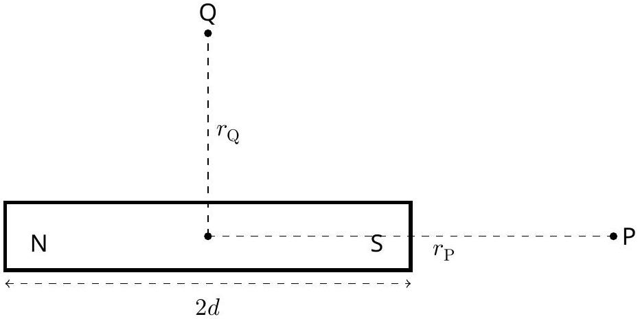
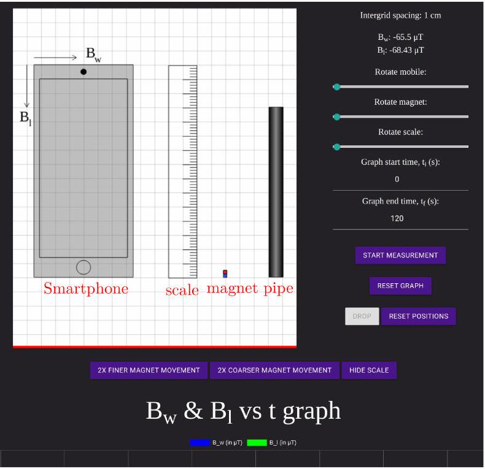

## Magnetic Black box: ${ }^{1}$

Smartphones use Hall effect-based magnetometers to measure the magnetic field in its vicinity. The magnetometer measures all three components of the magnetic field. The magnetometer sensor is located on the circuit board of the phone and is not visible from outside.
Magnetic field of a magnet
Figure 1 shows a small bar magnet with half length $d$ and the dipole moment $M$.

Figure 1

The magnitude of the magnetic field of a bar magnet in the axial direction at point $\mathrm{P}\left(B_{\text {axial }}\right)$ and at point $Q$ on its perpendicular bisector ( $B_{\text {equatorial }}$ ) is given by the following formulae

$$
\begin{aligned}
B_{\text {axial }} & =\frac{\mu_{0}}{4 \pi} \frac{2 M r_{\mathrm{P}}}{\left(r_{\mathrm{P}}^{2}-d^{2}\right)^{2}} \\
B_{\text {equatorial }} & =\frac{\mu_{0}}{4 \pi} \frac{M}{\left(r_{\mathrm{Q}}^{2}+d^{2}\right)^{3 / 2}}
\end{aligned}
$$

where $\mu_{0}$ is the permeability of free space ( $\mu_{0} / 4 \pi=10^{-7} \mathrm{NA}^{-2}$ ), and $r_{\mathrm{P}}, r_{\mathrm{Q}}$ are the distances between the center of the magnet to the points where the field is measured. For the given problem, consider the magnet to be a point dipole $\left(d \ll r_{\mathrm{P}}, r_{\mathrm{Q}}\right)$.
Click on "EQ1-Magnetic Black Box" link in the exam portal for the experimental exam.
About the simulation on the screen:
You will see a canvas with a white background in the form of a grid on the screen. This grid canvas is a part of the vertical plane where the experiment is being carried out. There are four objects on the canvas:

1. a smartphone
2. a magnet in blue (S) and red (N) color
3. a dark shaded hollow pipe with uniform thickness
4. a calibrated scale, which can be activated by clicking the 'SHOW/HIDE SCALE' button.

Intergrid spacing on the grid canvas is 1 cm.

[^0]
## Q1-2   Official (English)

Figure 2: Screenshot of the simulation

The set up:
The objects can be moved by holding and dragging the mouse. Smartphone, scale, and magnet can also be rotated in the plane. The rotation control slider is available in the right panel. You can drag the slider to change the orientation. For a better control, after clicking on the slider, you can use arrow keys to rotate an object.
There is a magnetometer inside the phone which measures the magnetic field of the magnet in its vicinity. The exact location of the magnetometer in the phone is not given to you. Depending on the location of the magnetometer, the right panel displays the components $B_{w}$ and $B_{l}$ of the magnetic field of the magnet measured by the smartphone along its width and length, respectively, as shown in Fig 2. Component $B_{w}$ points to the right for the default position (portrait/vertical orientation) of the phone. Component $B_{l}$ points downwards along the length of the phone.

The measurement:
When you click on 'START MEASUREMENT' you can also see the graph of variation of $B_{w}$ and $B_{l}$ as a function of time. 'RESET GRAPH' will erase all the values recorded in this graph. When you move the cursor over the curve in the graph obtained, you can see the value of the data point. A portion of the graph can be zoomed in by inserting the time in the "Graph start time $\left(t_{i}\right)$ " and the "Graph end time $\left(t_{f}\right)^{\prime \prime}$ fields.

## Q1-3   Official (English)

Smartphones may get damaged if they are exposed to high magnetic field. To prevent this, if the net magnetic field value measured by the smartphone exceeds $6500 \mu \mathrm{~T}$, the measurement will stop and you will see a warning on the right panel 'Maximum Magnetic field exceeded.' Measurement is restored as soon as the magnet is moved away from the phone at a sufficient distance.

Further features:
The magnet can be moved by keyboard arrow keys in up-down and left-right directions. For this, click anywhere on the canvas. A finer/coarser movement of the magnet can be achieved by clicking '2X FINER MAGNET MOVEMENT/2X COARSER MAGNET MOVEMENT'. With each clicking of these buttons, the movement will become two times finer/coarser. The buttons will grey-out when the maximum coarse/finer level is reached.

Gravity is in the downward direction, towards the bottom of the screen. The floor is indicated by a red line. Consider all the objects in the plane of the screen only. More information about the pipe is given before the part (B).

Consider the magnet to be held in a stationary position when you place it anywhere on the screen. Clicking on the "Drop" button will release the magnet and it will start descending. Note that the magnet can be dropped only after clicking the 'START MEASUREMENT' button. The 'RESET POSITION' button will bring back the magnet to the position from where it was dropped last. Objects can be moved outside the Canvas if needed.

In this experiment, consider the magnet to be a point dipole.
Note that there is no error estimation required in this question.

A. 1 Obtain the location of the magnetometer on the phone. To help you answer this part in the answer sheet, a finer grid is made inside the schematic diagram of the phone. Intergrid spacing in the finer grid is 2 mm . Indicate the location of the magnetometer by drawing " $\otimes$ " in the smartphone at an appropriate place.
1pt 1pt
A. 2 Plot a suitable linear graph and obtain the dipole moment of the magnet from the graph. Fill in the table for the recorded data of the method you have employed.

2.3pt

A hollow nonmagnetic vertically held pipe of finite uniform thickness is given on the screen. For the magnet to be dropped inside the pipe, the magnet should be aligned with the axis of the pipe properly. The "DROP" button will release the magnet in the vertical plane. The motion of the magnet inside the pipe cannot be viewed. Assume that when the magnet is dropped inside the pipe, it doesn't tilt or rotate as it descends. The pipe consists of three distinct sections: one section is made of wood (W), another section is made of aluminum (AI) having electrical conductivity $=3.77 \times 10^{7} \Omega^{-1} \mathrm{~m}^{-1}$, and the remaining section is made of copper (Cu) having electrical conductivity $=5.96 \times 10^{7} \Omega^{-1} \mathrm{~m}^{-1}$. These three different materials may/may not be in this order. If the magnet is dropped vertically (say along the downward $y$-axis), the fall of the magnet is governed by

$$
m \ddot{y}=m g-k \dot{y}
$$

where $m$ is the mass of the magnet, $g$ is the acceleration due to gravity $\left(g=9.8 \mathrm{~m} / \mathrm{s}^{2}\right)$, and $k$ is the damping constant due to the generation of the eddy current in the pipe. The damping constants for the wooden,

## Experiment

## Q1-4   Official (English)

aluminum, and the copper sections are zero, $k_{\mathrm{Al}}$, and $k_{\mathrm{Cu}}$, respectively. Drop the magnet inside the pipe following these steps:

1. Position the phone, the magnet and the pipe suitably.
2. Click the "Start Measurement" button.
3. click the "DROP" button.

The magnetometer can not measure very small magnetic field produced due to the eddy current in the pipe. As the magnet descends through the pipe, a graph of $B_{w}$ and $B_{l}$ as a function of time may be seen on the screen.

B. 1 From the graph of the magnetic field vs time shown on the screen, find out the sequence of sections of different materials in the pipe. Indicate your answer by writing the number next to the material of the pipe considering them in order from top to bottom: 1 for the top section, 2 for the middle section, and 3 for the bottom section.
B. 2 Determine the terminal velocity of the magnet in the Aluminium section of the pipe, plotting a suitable linear graph.
A canvas grid similar to the simulation screen is given in the answer sheet. Draw the schematic smartphone, pipe, and magnet to the exact locations and orientations you have used to obtain the data for this part. Use a box to indicate the Phone.
Fill tables with the relevant data set you are using for plotting the graph. Determine the length of the Aluminium section of the pipe. You may/may not use a graphical method for measuring the length of the aluminium section of the pipe. If you are using a graph/data set to determine the length, use the extra columns in the table to report the relevant data set.
B. 3 Determine the terminal velocity of the magnet in the copper section of the pipe, plotting a suitable linear graph.
Determine the length of the copper section of the pipe. You may/may not use a graphical method for measuring the length of the copper section of pipe. If you are using a graph/data set to determine the length use the extra columns in the table to report the relevant data set.

## Experiment

## Q1-5   Official (English)

B. 4 Determine the length of the wooden section of the pipe. You may/may not use a graphical method for measuring the length of the wooden section of pipe. If you are using a graph/data set to determine the length use the extra columns in the table to report the relevant data set.

[^0]:    ${ }^{1}$ Chandan Relekar (IISc, Bangalore), Siddhant Mukherjee (The University of Cambridge, UK), Siddharth Tiwary (IIT Powai, Mumbai), Charudutt Kadolkar (IIT Guwahati), Praveen Pathak (HBCSE-TIFR, Mumbai), were the principal authors of this problem. The contributions of the Academic Committee and the International Board are gratefully acknowledged.
