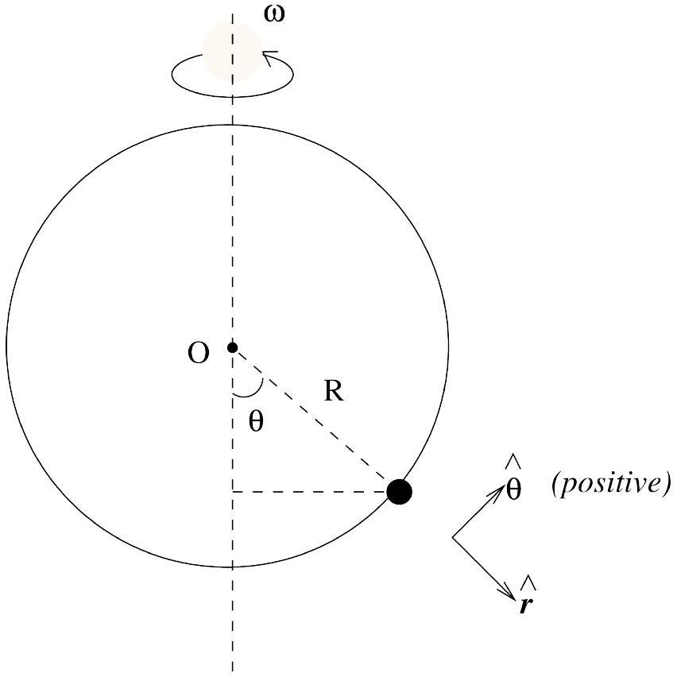
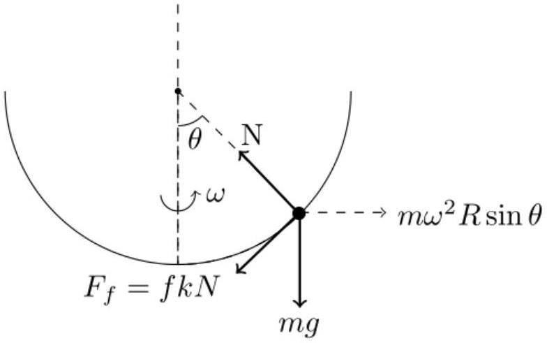

## Q2-1   Official (English)

## A Mechanical Model for Phase Transitions ${ }^{\mathbf{1}}$

A ring of radius $R$ has a bead of negligible size and mass $m$ threaded on it. The ring is set rotating about its vertical diameter with angular velocity $\omega$ as shown in Fig. 1. Alongside this, there is an opposing force on the bead, $F_{f}$, which is proportional to the normal reaction $N$, and is given by $F_{f}=f k N$ where $f$ is 1 or -1 . You are advised to employ polar coordinates $\{r, \theta\}$. As far as possible express your answers in terms of $\omega_{c}=\sqrt{g / R}$ where $g$ is the magnitude of the acceleration due to gravity.

In a phase transition the free energy, $V(\mathcal{M})$ [mechanical equivalent is potential energy] depends on the magnetization $\mathcal{M}$ as follows

$$
V(\mathcal{M})=a(T) \mathcal{M}^{2}+b(T) \mathcal{M}^{4}
$$

where $T \rightarrow$ temperature, $b(T)>0$ and $a(T)$ changes sign with temperature. We attempt to understand the phenomenon of phase transition using the above mentioned model.
Note 1: For circular motion of radius $R$, the velocity in polar coordinates is $\dot{\vec{r}}=R \dot{\theta} \hat{\theta}$ and the acceleration is $\ddot{\vec{r}}=-R \dot{\theta}^{2} \hat{r}+R \ddot{\theta} \hat{\theta}$. Here $\hat{r}$ and $\hat{\theta}$ are unit vectors in the radial and the tangential directions respectively.
Note 2: The direction of the opposing force say $\vec{F}_{f}$ will be denoted by $f$. Here $f=+1$ if the bead is moving in the counter-clockwise direction (of increasing) $\theta$ and $f=-1$ if the bead is moving in the clockwise direction $\theta$, e.g. $f=\operatorname{sgn}(\dot{\theta})$ where $\operatorname{sgn}$ is +1 or -1 depending on whether its argument is positive or negative.
Note 3: You may find the expansions

$$
\begin{aligned}
\sin (\theta) & =\theta-\theta^{3} / 6+. . \\
\cos (\theta) & =1-\theta^{2} / 2+\theta^{4} / 24+. . \\
(1+x)^{n} & =1+n x+n(n-1) x^{2} / 2+n(n-1)(n-2) x^{3} / 6+. .
\end{aligned}
$$

(where $\theta$ is in radians and $|x| \ll 1$ ) useful for some parts of the problem.

[^0]
## Q2-2   Official (English)

Fig. 1: The bead on a rotating ring.

In what follows we shall understand the dynamics of the bead in the frame of the rotating ring and for angles in the range $-\pi / 2<\theta<\pi / 2$. The free body diagram of the bead is shown in Fig.2. Neglect all forces other than the ones shown in the free body diagram.

Fig. 2: The free body diagram.

A. 1 Write down the equations of motion for the radial $F_{r}$ and the tangential $F_{\theta}$ components of the force on the bead. Assume $\theta$ increasing in the counter-clockwise direction.

## Q2-3   Official (English)

| B. 1 | State the relation between the equilibrium angle(s) $\theta_{0}$ in terms of $\left\{\omega, \omega_{c}\right\}$. | 1.0pt |
| :--- | :--- | :--- |
| B. 2 | Qualitatively sketch $\theta_{0}$ ( $y$-axis) as a function of $\omega / \omega_{c}$ ( $x$-axis). | 0.5pt |
| B. 3 | Qualitatively sketch the magnitude of the normal reaction force on the bead as a function of $\omega / \omega_{c}$ at stable equilibrium. | 0.5pt |

B. 4 We define the potential energy corresponding to the tangential force $F_{\theta}$, namely
$$
F_{\theta}=-\frac{1}{R} \frac{d}{d \theta} V(\theta)
$$
with the zero of potential energy at $\theta=0$. If $V(\theta)$ is expressed as $P+Q \cos (\theta)+$ $S \sin ^{2}(\theta)$, obtain $P, Q, S$.
B. 5 One can expand $V(\theta)$ for small $\theta$ and express it as $V(\theta)=a(\omega) \theta^{2}+b(\omega) \theta^{4}$. Obtain the coefficients $a(\omega)$ and $b(\omega)$. the coefficients $a(\omega)$ and $b(\omega)$.
1.0pt
B. 6 Make representative plots of $V(\theta)$ versus $\theta$ for values of $\omega / \omega_{c}$ just less than 1.0 (e.g. say 0.9 ) and $\omega / \omega_{c}$ large, say 5.0. Note that only qualitative sketches and no detailed calculations for the plots are required. detailed calculations for the plots are required.
1.0pt
B. 7 Landau theory of second order phase transitions can be used to demarcate simple magnetic systems into two phases. For temperatures $T$ greater than the critical temperature $T_{c}$ the system is paramagnetic. For $T<T_{c}$ the system is ferromagnetic and the magnetization $\mathscr{M}$ is given by
$$
\mathcal{M}(T)=\mathcal{M}_{0}\left(1-T / T_{c}\right)^{1 / 2} \quad T<T_{c}
$$
Let us denote the exponent $1 / 2$ by $\beta$. Compare this behaviour with the bead problem discussed above. What are the analougues of $\mathcal{M}, T_{c}, T / T_{c}$ in our case? What is the equivalent value of $\beta$ in our case?
B. 8 Determine the angular frequency of oscillation $\Omega_{0}$ of the bead when it is disturbed from its "equilibrium" position $\theta_{0}$. Note that for small oscillations
$$
\Omega_{0}=\frac{1}{R} \sqrt{\frac{V^{\prime \prime}\left(\theta_{0}\right)}{m}}
$$
B. 9 Qualitatively sketch $\Omega_{0}$ as a function of $\omega$. 1.0pt

## Q2-4   Official (English)

C. 1 Take $f=1$ and express $k=\tan \alpha$. We may express the condition for the equilib- 1.0pt rium angle(s) $\theta_{0}$ as
$$
\left(\frac{\omega}{\omega_{c}}\right)^{2}=\frac{\tan (x)}{\sin (y)}
$$
Obtain $x$ and $y$.
C. 2 It is given that $f=1$ and $k=0.05$. Obtain the equilibrium angles $\theta_{0}$, if any, for 0.5pt the following cases:
    1. $\omega / \omega_{c}=0.50$
    2. $\omega / \omega_{c}=0.70$

[^0]:    ${ }^{1}$ Sitikantha Das (IIT Kharagpur) and Pramendra Ranjan Singh (Principal, Narayan College, J.P. University) were the principal authors of this problem. The contributions of the Academic Committee, Academic Development Group, and the International Board are gratefully acknowledged.
