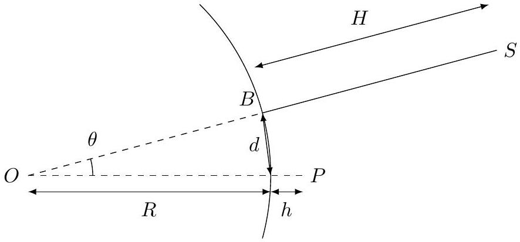

## Maxwell, Rayleigh and Mount Everest: THE PROBLEM ${ }^{1}$

Lord Rayleigh visited Darjeeling, India in 1897. On viewing Mount Everest at a distance of 170 km he was reminded of a query by James Maxwell 26 years earlier on the attenuation of light by air and the visibility of far-off peaks. Lord Rayleigh authored a famous research paper ${ }^{2}$ two years later in 1899 in which he investigated this problem. In the present problem we attempt to reconstruct, at least partially, a modern version of Lord Rayleigh's line of reasoning.

Oscillation of the electron cloud: We model a typical neutral air molecule by a stationary positive charge $q$ surrounded by a spherical uniform charge cloud of mass $m$, radius $r$ and charge $-q$. The natural angular frequency of vibration of the molecule is $\omega_{0}$. Light is incident on it and the negative cloud oscillates maintaining its spherical shape with angular frequency $\omega$ as,

$$
y=y_{0} \cos (\omega t),
$$

under the influence of the electric field

$$
\vec{E}(t)=E_{0} \cos (\omega t) \hat{y},
$$

of the light wave. Here $y$ represents the separation between the stationary positive charge and the centre of the negative charge cloud of the molecule.

A. 1 Set up the equation for the motion for $y$. Take the contribution to the magnitude 0.5pt of the acceleration due to the electric field to be $E(t) q / m$.
A. 2 Based on the information provided above, solve the equation for $y$. Find the 0.5pt amplitude.
A. 3 Find the magnitude $p(t)$ of the dipole moment of the air molecule as a function 0.5pt of time for $\omega \ll \omega_{0}$.
A. 4 Obtain an expression for $\omega_{0}$ in terms of $q, m$ and $r$.

Power radiated: The sinusoidal time dependent dipole radiates electromagnetic radiation. The power radiated depends on the amplitude of the dipole moment $p_{0}=q y_{0}$, the permittivity of vacuum $\epsilon_{0}$, the speed of light $c$, and the frequency of oscillation $\omega$.

B. 1 Use dimensional analysis to express the average power $s$ radiated in terms of 1pt these quantities.
[^0]
## Q3-2   Official (English)

B. 2 Take the proportionality constant to be $1 / 12 \pi$. Express the answer for the power 0.2pt radiated $s$ in terms of $E_{0}, \omega_{0}, \omega$ and related quantities. Take $\omega \ll \omega_{0}$.

Attenuation of the Intensity $I(x)$ : Recall that the intensity of EM waves is

$$
\frac{1}{2} c \epsilon_{0} E_{0}^{2} .
$$

The intensity decreases along the path of light because the power

$$
S=n_{0} s
$$

is lost per unit volume. Here $n_{0}$ is the number of molecules per unit volume.

C. 1 Set up the differential equation for the intensity $I(x)$ as a function of the dis-
1pt tance $x$. tance $x$.
C. 2 Obtain the expression for the intensity $I(x)$ as a function of $x$ in terms of the
C. 2 Obtain the expression for the intensity $I(x)$ as a function of $x$ in terms of the characteristic length scale $L$ associated with the drop in intensity. Take the ini- characteristic length scale $L$ associated with the drop in intensity. Take the initial intensity to be $I_{0}$. tial intensity to be $I_{0}$.
0.5pt
C. 3 Take $m$ to be the mass of the electron (typically only one electron constitutes the charge cloud) and take
$$
\begin{aligned}
& n_{0}=2.54 \times 10^{25} \mathrm{~m}^{-3}, \\
& \omega_{0}=1.25 \times 10^{16} \mathrm{rad} \cdot \mathrm{~s}^{-1}, \\
& \omega=3.25 \times 10^{15} \mathrm{rad} \cdot \mathrm{~s}^{-1} .
\end{aligned}
$$
Obtain the numerical value of $L$ in kilometers.

## Q3-3   Official (English)

D.1 Height $H^{\prime}$ of the Mountains as seen by an observer : In the figure the point $P$ denotes Darjeeling, a hill station in the eastern Himalayas at height $h=2042 \mathrm{~m}$ above the sea level. The line $B S$ denotes Mt Everest which is $d=170 \mathrm{~km}$ away from Darjeeling and is of height $H=8848 \mathrm{~m}$. Another peak Mount Kanchenjunga (not shown in the figure) is 75 km away from Darjeeling and is of height 8586 m. Obtain an expression and the numerical values of the vertical height $H^{\prime}$ of these mountains as seen by an observer from Darjeeling in terms of the above-mentioned quantities. Assume that the observer is unable to see below the local horizon. Draw an appropriate figure. Take the radius $R$ of the Earth to be 6378 km.

Figure 1. Great circle on which lie the mountain $B S$ at height $H$ and the observer $P$ at height $h$. Note that the figure is not to scale.
E. 1 Take the intensity of Mt Kanchenjunga at Darjeeling to be the reference value. What would be the intensity of Mt Everest relative to Mt Kanchenjunga as seen from Darjeeling? In this problem we ignore the variation in the number density of air molecules with height. If the intensity is 5 \% or more of the reference value the mountain is said to be visible. Will Mt Everest be visible from Darjeeling?
F. 1 Attenuation length $L_{p}$ due to aerosol pollution: Above, we calculated the characteristic length scale $L$ associated with the drop in intensity due to scattering with air molecules. We are now interested in the characteristic length $L_{p}$ associated with the drop in intensity due to scattering with aerosol particles (pollution). $L_{p}$ depends on the number density $n$ of particles and the cross sectional area $\pi r^{2}$ of the aerosol particle of radius $r$. Obtain this dependence using physical insight and dimensional analysis. Take the dimensionless constant to be 1/8. Given mild pollution the average aerosol density at Darjeeling is $\rho_{p}=5 \mu \mathrm{~g} / \mathrm{m}^{3}$, and their average radius is 500 nanometres. What is the length $L_{p}$ ? Let the density of an individual aerosol particle be $\rho=3 \mathrm{~g} / \mathrm{cm}^{3}$. Note $1 \mu \mathrm{~g}=$ $10^{-9} \mathrm{~kg}$ and $1 \mathrm{~nm}=10^{-9} \mathrm{~m}$.

## Q3-4   Official (English)

G. 1 Relative intensity and Visibility of Mt. Kanchenjunga and Mt. Everest : Estimate the relative intensity of Mt Kanchenjunga and Mt Everest with the above level of pollution with respect to the reference value. Which, if any of these peaks will be visible from Darjeeling? Assume that pollution is uniform throughout the path the light travels.

[^0]:    ${ }^{1}$ Amitabh Virmani (CMI, Chennai) and A. C. Biyani (retired Govt. Nagarjuna P.G. College of Science. Raipur) were the principal authors of this problem. The contributions of the Academic Committee, Academic Development Group, and the International Board are gratefully acknowledged.
    ${ }^{2}$ Philosphical Mag. "On the transmission of light through an atmosphere ... and the origin of the blue of the sky", Vol. 47, pg 375-384 1899
