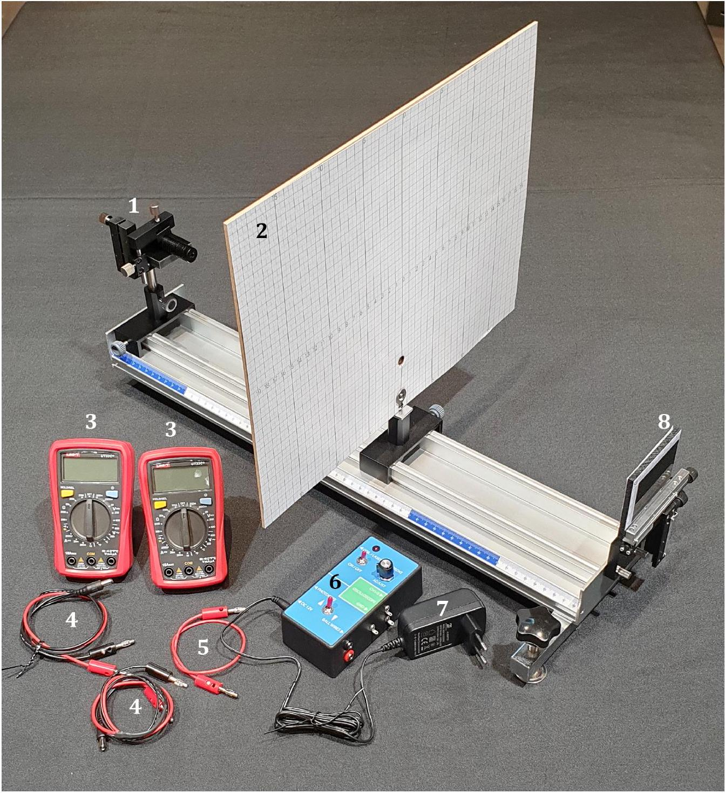
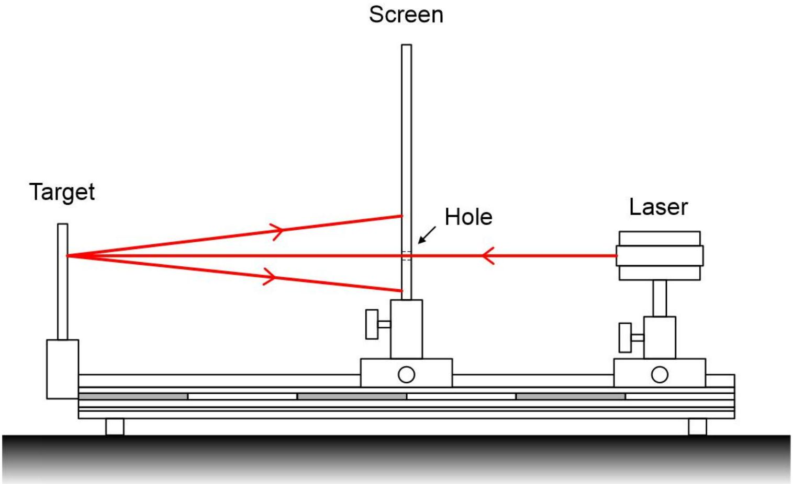
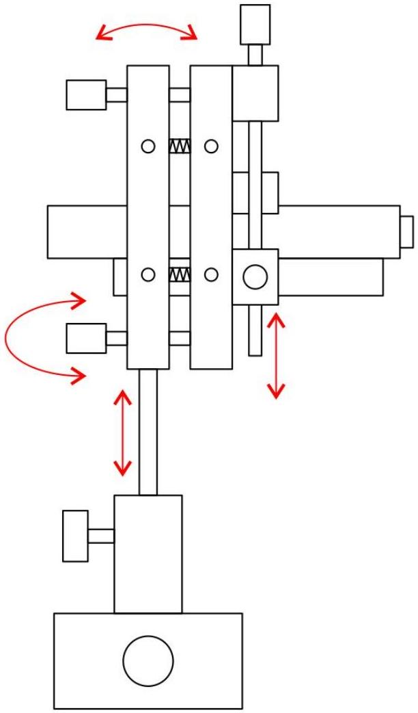
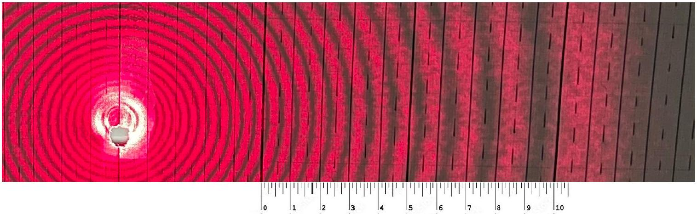
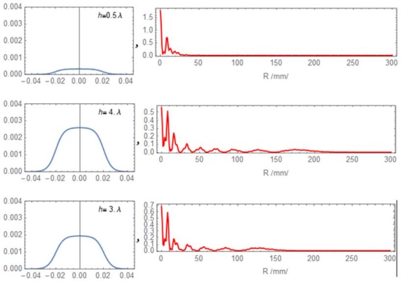

## Q2-1   English (Official)

## Problem 2: Interference from thermally deformed surface (thermos-deformation)

When light interacts with matter, it gives rise to various phenomena. This experimental study focuses on investigating the diffraction of light from a light-deformed acrylic (PMMA) surface.

Acrylic is 5 times stronger than regular glass and is an organic material that can be used in a variety of applications. The liquid monomer of methyl methacrylate serves as the primary material for acrylic. The liquid state has lower density compared to the solid state. Various colorants and hardeners are added to the liquid monomer. The thermoforming temperature ranges from 160 to 190°C. Acrylic is an environmentally friendly material as it does not release any harmful chemicals. Therefore, it is commonly used in items such as children's toys, utensils, and equipment frames. Moreover, it is resistant to water.

Test equipment:

1. Laser with voltage adjustment tool

2. Screen with holes
3. Two multimeters (one amperemeter and one voltmeter)
4. Connecting wires for laser source and power control unit
5. Connecting wires for multimeters
6. Control box
7. Power supply adaptor
8. Acrylic (PMMA) target with adjustable stand

Schematics of the experimental setup

Figure 1a. Lateral view of the setup. The laser beam passes through a hole in a semitransparent screen and is then directly reflected onto the target, allowing observation of the diffraction pattern of the reflected light.

Fig 1b. Sideview of the laser stand. The screws that can be moved along the axis are shown by red arrows.

The experiment consists of two parts. The first part involves studying parameters such as angular diameter and number of fringes, and angular width between the interference fringes as a function of the power supplied to the laser.

The second part focuses on studying the parameters of the aperture (including diameter, height, and shape) that generates the interference pattern, as functions of the power supplied to the laser. Additionally, the parameters of the reference aperture will be determined.

Experimental tools

1. Securely twist the string that was previously used to suspend the test ball onto the top fastener, detach the mechanical part, and place it on a soft mat.
2. Place the laser, screen and acrylic base on the optical bench as shown in the picture. Position the laser beam along the axis of the optical bench at the same level, allowing the beam to pass freely through the hole of the screen. Make sure that the beam is nearly perpendicular to the acrylic surface.
3. Fix the acrylic plate with a magnetic holder. An acrylic white paper surface is used to focus the beam and pre-determine the shooting coordinates.

YTY -
or ate me
or s no r s ns
"
semg. semer some
or s no asklons -
инструмента
water sureatr points "
mmgest
ber sureate ate terris the the the E
" -
" Lar 10-16 " "
-
" th sam the the the " ate the the "
" н Get "
" - -

## Q2-5   English (Official)

Part C [3.7 points]

C. 1 Measure the angular width (an angle between the ray of $n$th order fringe and the ray of $n+1$ th order fringe ) and visible angle (an angle between the ray of $n$th order fringe and $x$-axis) of the dark fringe at a constant power level, depending on the number of the fringe, and record the results in Answer Sheet Table.
1.2pt
C. 2 Plot a linear graph of the relationship between the visible angle vs order of C. 2 Plot a linear graph of the relationship between the visible angle vs order of fringe. fringe. fringe.
1.0pt
C. 3 Find the slope and Y-intercept of the graph plotted in Task C.2. 0.5pt
C. 4 Construct a graph of angular width as a function of the order of fringes. 1.0pt

Fig 2. Image of interference fringes on the screen

Part D [2.0 points]
In this section we will use the interference pattern to determine parameters of the thermal deformations. When the laser heats the surface this causes a deformation which creates an interference pattern on the screen as shown in the diagram below:

The graph in blue shows the cross section of the profile of deformation. The graph shown in red shows the intensity from the centre of the interference pattern. As the intensity increases, the height of the deformation increases and the number of bright interference fringes also increases. As we can see in the figure there is an empirical relationship between the height and the number of fringes which is $m=2 h / \lambda$

D. 1 By counting the number of the fringes determine the highest order of the fringes. Determine the height of the thermal deformation in terms of the laser wavelength as a function of the laser power. Plot a graph of your data. Hint: ensure your data includes the range of $200 m W$ to $400 m W$.
1.4pt D. 2 What are the thermal deformation heights for the following input laser powers? 0.6pt Give your answers in units of the number of laser wavelengths.
    - 200 mW
    - $300 m W$
    - $400 m W$
