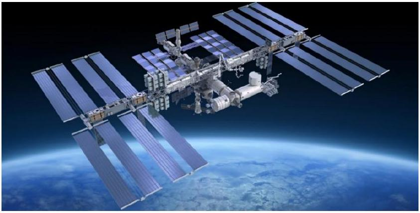
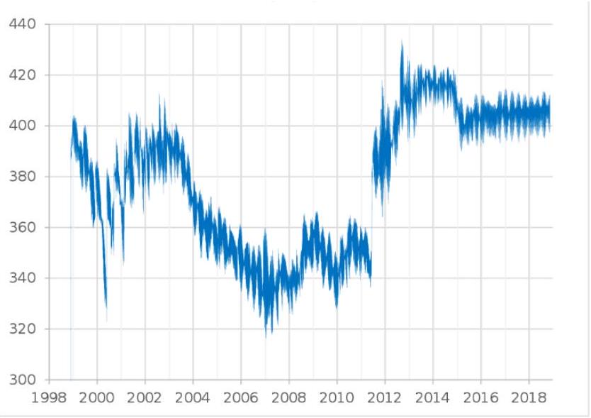
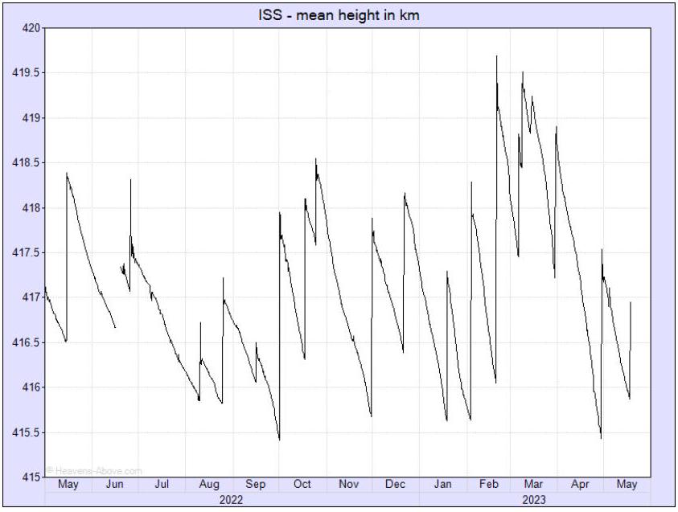
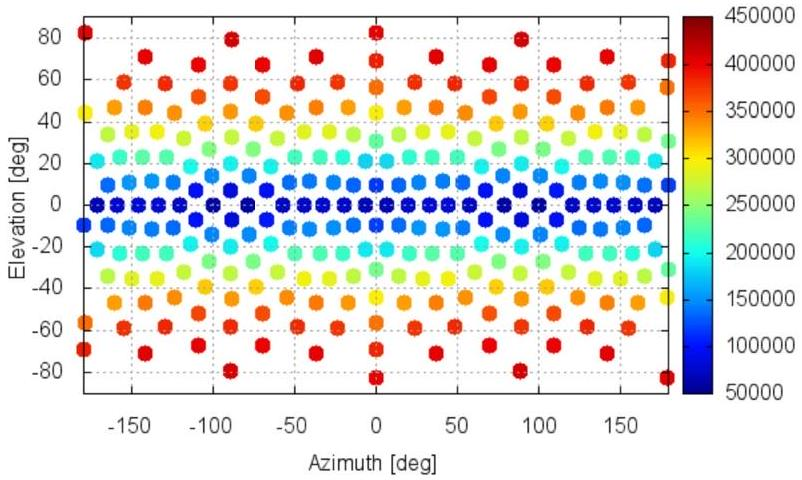
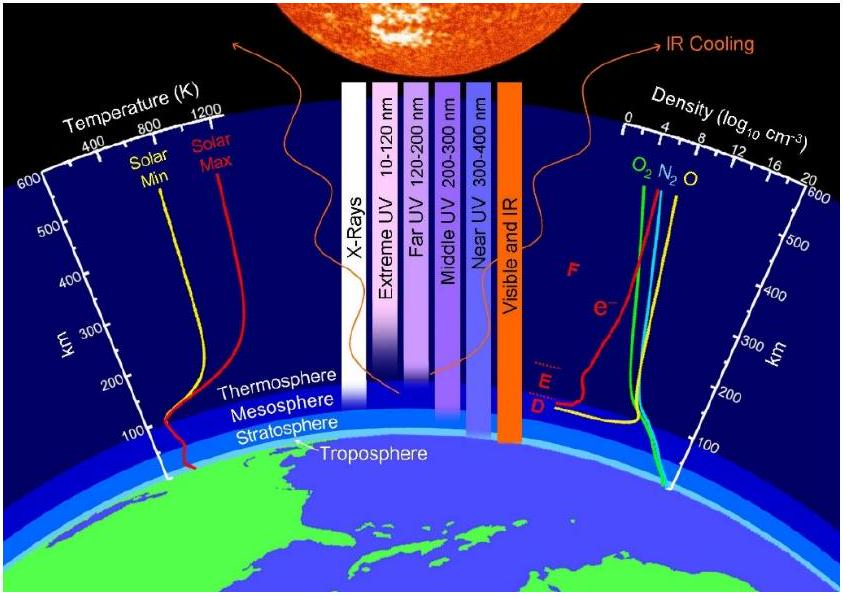

## Q1-1 English (Official)

## Theoretical Problem 1: ISS Orbital Decay Dynamics [10.0 points]

Introduction

Figure 1: The International Space Station orbiting above the Earth.

The ISS is currently maintained in a nearly circular orbit with a minimum mean altitude of $370 k m$ and a maximum of $460 k m$, in the center of the thermosphere, at an inclination of $\theta=51.6^{\circ}$ (degrees) to Earth's equator. The trajectory of the spacecraft is similar to a spiral with a slowly changing distance from the station to the Earth's surface, and during one cycle of revolution the change in altitude is inconsiderable.

The ISS mass is $M_{S}=4.5 \times 10^{5} k g$ and overall length is $L_{S}=109 m$. Huge solar panels with a width of $W_{S}=73 m$ provide the ISS with electrical energy [NASA Official Report (2023].

Including all batteries and other parts, the effective cross area (section) of the station is approximately $S \approx 2.5 \times 10^{3} \mathrm{~m}^{2}$ [European Space Agency, SDC6-23].

The ISS orbital decay is caused by one or more mechanisms which absorb energy from the orbital motion, the essential ones being:

- atmospheric drag at orbital altitude is caused by frequent collisions of gas molecules with the satellite,
- the Ampere force arising from the motion of the conductive apparatus in the Earth's magnetic field,
- the interaction with the atomic oxygen ions.

"... In May 2008, the altitude was 350 kilometers, the ISS lost $4.5 k m$ and was re-boosted by the Progess-60 supply ship by $5.5 k m$. Again, the ISS continued to lose altitude by $5.5 k m$..." [https://mod.jsc.nasa.gov]

Figure 2: The altitude of ISS $(k m)$ over the years.

Figure 3: The ISS mean height $(k m)$ in 2022-2023.

″. . . The ISS loses up to $330 f t(100 m)$ of altitude each day . . . " [NASA Control Data (2021)]. In 2023 the ISS flies at altitudes of 410 km, with an orbital decay about $70 m$ every day ( $\sim 2 k m$ per month), and during magnetic storms the daily descent reaches $300 m$. The ISS accomplishes the de-orbit maneuvers by using the propulsion capabilities of the ISS and its visiting vehicles [International Space Station Transition Report (2022)].

## Q1-3 English (Official)

Figure 4: ISS model with the cross sections from different aspect angles ( $d m^{2}$ ). The CROC provides $2481 m^{2}$ cross section.

## Denotations and Physical constants:

| Universal gas constant | $R \quad=$ | $8.31 J \cdot K^{-1} \cdot m o l^{-1}$ |
| :--- | :--- | :--- |
| Avogadro's number | $N_{A}=$ | $6.022 \cdot 10^{23} \mathrm{~mol}^{-1}$ |
| The molar mass of gas (for air) | $\mu$ = | $0.029 \mathrm{~kg} \cdot \mathrm{~mol}^{-1}$ |
| Mass of the Earth | $M_{E}=$ | $5.97 \cdot 10^{24} k g$ |
| Radius of the Earth | $R_{E}=$ | $6.38 \cdot 10^{6} m$ |
| Gravitational universal constant | $G=$ | $6.67 \cdot 10^{-11} \mathrm{~m}^{3} \cdot \mathrm{~s}^{-2} \cdot \mathrm{~kg}^{-1}$ |
| Density of air at Earth's surface | $\rho_{0} \quad=$ | $1.29 k g / m^{3}$ |
| Gravitational acceleration at Earth's surface | $g_{0}=$ | $9.81 m \cdot s^{-2}$ |
| Average magnitude of Earth's magnetic field | $B \quad=$ | $5.0 \cdot 10^{-5} T$ |
| The electron absolute charge | $e=$ | $1.60 \cdot 10^{-19} C$ |

## Part A: Modified barometric formula [2.0 points]

The pressure of atmospheric air, composed mainly of neutral $O_{2}$ and $N_{2}$ molecules, can be found by using the Clapeyron-Mendeleev law (the ideal gas law): $p V=\frac{M}{\mu} R T$. where $p, V, T, M$ and $\mu$ are the pressure, volume, temperature, mass and molar mass of a portion of air, $R$ is the ideal gas universal constant.

There are two equations for computing air pressure as a function of height. The first equation is applicable to the standard model of the troposphere $(h<100 k m)$ in which the temperature is assumed to vary with altitude at a lapse rate.

The second equation belongs to the standard model of the thermosphere $(h>250 k m)$ in which the temperature is assumed not to change considerably with altitude and is applicable to ISS.

We may assume that all pressure is hydrostatic and isotropic (i.e., it acts with equal magnitude in all directions).

## Q1-4   English (Official)

A. 1 Derive the general integral expression for the air pressure $p_{h}$ at ISS altitude $h$. 0.5pt This equation is called the general barometric formula. Hint: the temperature and gravitation may depend on $h$.

Remark 1. The temperature of Earth's thermosphere at altitude $300-600 \mathrm{~km}$ does not change considerably and reaches averagely about $800-900 K$ on the solar side [NASA data]. Therefore, one may put $T_{h}=T=$ const by investigating the ISS orbital flight. Particularly, since the spacecraft spends almost half of its flight time in the shadow side of the Earth, where the temperature drops sharply, we may take the value of $T=425 K$ as the average temperature at these altitudes. This temperature is also in agreement with the air density value $\rho_{h} \sim 10^{-12} \mathrm{~kg} / \mathrm{m}^{3}$ [MSISE-90 Model of Earth's Upper Atmosphere] at $h=400 \mathrm{~km}$.

Figure 5: The Earth's thermosphere.

A. 2 Write down the air pressure (the standard barometric formula) $p_{h}^{\text {sta }}$, when the temperature and gravitation $g_{h}$ do not depend on $h$. Calculate the parameter $h_{0}=\frac{R T}{\mu g_{0}}$ for $T=425 K$.
A. 3 Write down the air pressure (the improved barometric formula) $p_{h}^{i m p}$ when the temperature is constant but the gravitation depends on $h$. Hint: Use the leading-order correction only, with accuracy $O\left(z_{h}^{2}\right)$. Hereby, the flight altitude $h$ above the Earth's surface is significantly smaller than the Earth's radius: $z_{h} \doteq h / R_{E} \ll 1$.
A. 4 Write down the ratio of the 'standard' and 'improved' versions of the barometric formula $p_{h}^{i m p} / p_{h}^{s t a}$. Estimate it for $h=4.0 \times 10^{5} m$. Further use the 'improved' version.
A. 5 Write down the air density $\rho_{h}$ and the concentration of neutral air molecules $n_{h}$ at height $h$, with accuracy $O\left(z_{h}^{2}\right)$.

## Q1-5   English (Official)

Part B: Orbital deceleration and station descent rate [3.0 points]
Let us consider the problem of determining the rate of orbital decay of a satellite with mass $M_{S}$ that experiences constant friction force $\vec{F}_{\text {drag }}$ acting on it. We assume that the decrease in altitude $d h$ is much less than the flight altitude $h$ itself ( $d h \ll h$ ).

B. 1 Write down the satellite velocity $v_{h}$ and revolution period $\tau_{h}$ on a stable orbit of altitude $h$.
B. 2 Write down the total energy $E_{S}$ of a satellite moving along a circular orbit with radius $R_{E}+h$.
B. 3 The total decelerating force exerted on a satellite of constant mass is given by some external braking force $\vec{F}_{\text {drag }}$. As a result, the ISS slows down and its altitude decreases by a height $d h$ for a small time interval, $d t$. Write down the equation for the total enery balance of the ISS and surrounding system, given a value of $F_{\text {drag }}$.
B. 4 Define the rate of descent (de-orbiting) speed $u_{h}$ of the satellite. Hint: The deorbiting speed depends on the friction force, and on the altitude of the satellite, and on the mass of the satellite.
B. 5 Write down the amount of decent $H_{h}$ for a revolution around the Earth and the total time $T_{h}$ for which the satellite will fall from the altitude $h$ to the earth's surface due to the friction.
Hint: Take into account relations $h_{0} \ll h \ll R_{E}$.

0.5pt

Part C: Atmospheric drag [1.0 points]
The speed of the satellite $v$ is many times greater than the average velocities (hundreds $\mathrm{m} / \mathrm{s}$ ) of the thermal motion of atmospheric molecules at a height $h \approx 300-400 k m$, so we can assume that the molecules were at rest before the collision with the ISS. To roughly estimate the drag force, we assume that after the collision the molecules acquire the same speed as the satellite.

C. 1 Write down the air drag force $F_{\text {air }}$, the de-orbiting descending velocity $u_{h}^{\text {air }}$ and the descent rate $H_{h}^{a i r}$.
C. 2 Define the total time $T_{h}^{\text {air }}$ for which the satellite will fall from the altitude $h$ to the earth's surface due to air drag effect. Hint: Take into account relations $h_{0} \ll$ $h \ll R_{E}$. $h \ll R_{E}$.

0.5pt

Part D: Drag by atomic oxygen ion [1.0 points]
In the thermosphere, under the influence of ultraviolet and X-ray solar radiation and cosmic radiation, air ionization occurs ( ${ }^{\prime}$ polar lights"). Unlike $O_{2}, N_{2}$ does not undergo strong dissociation under the action of solar radiation, therefore, in general, there is much less atomic nitrogen $N$ in the Earth's upper atmosphere than atomic oxygen. At altitudes above $250 k m$, atomic oxygen $O$ predominates. Layers
containing electrons and ions of oxygen atoms appear on the day side of the atmosphere. In this case, the concentration of atomic oxygen ions reaches $n_{\text {ion }} \sim 10^{12} m^{-3}$

D. 1 Write down the decelerating force $F_{\text {ion }}$, averaged during a 24-hour, associated with the mechanical collisions of these particles. Take into account the strong decrease in ionized layers are negligible during the night. Express the density of ionized oxygen molecules $\rho_{\text {ion }}$.
D. 2 Define the speed of fall of the satellite $u_{h}^{\text {ion }}$ due to deceleration by ions of atomic oxygen. Write down the descent rate $H_{h}^{i o n}$ for a revolution caused by the ionization effect. Hint: Take into account relations $h_{0} \ll h \ll R_{E}$.

0.7pt

Part E: Drag by the Earth's magnetic field [2.0 points]
We consider the influence on the motion of the satellite of the Earth's magnetic field, the value of which near the Earth's surface is equal to $(3.5-6.5) \cdot 10^{-5} T$ with an average value of $B=5 \cdot 10^{-5} T$.

When a satellite moves at high speed in a magnetic field, an inducted electric current (electromotive force (EMF) ) occurs in the current-conducting elements of the satellite's structure. This electromotive force causes a redistribution of electric charges in the current-conducting elements of the satellite structure. An electric field appears around the satellite, which affects the movement electrically charged particles in the environment. Electrons are attracted to those parts of the satellite that have a positive potential (relative to the middle part of the satellite), and positively charged ions are attracted to those parts of the satellite that have a negative potential. Electrons and ions that hit the surface of the satellite structures are combined into neutral oxygen atoms, while the electrons 'travel' in the satellite's conductive structures, creating an electric current. The satellite, moving in space, 'collects' electrons and ions from the surrounding space and collides with them. For a rough estimate of the magnitude of the current that can flow through the conductive structures of the satellite, we will assume that the collection occurs only from an area equal to the cross-sectional area $S$ of the satellite, and all ions and electrons participate in the creation of this current.

| E. 1 | Evaluate approximately the magnitude of the induced electric current $I_{\text {ind }}$. | 0.6pt |
| :--- | :--- | :--- |
| E. 2 | Determine an approximate expression for the induced 'braking' Ampere force $F_{\text {ind }}$ in the direction opposite to the direction of the satellite's motion. Let $\phi$ be the angle between the Earth magnetic field $\vec{B}$ along the longitude lines. To simplify, you may approximate the length of the satellite $L$ as the square root of the satellite area $S$. Additionally, instead of computing the average of $\sin (\phi)$, you may approximate it with $\sin (\pi / 2-\theta)$. You may use a discrete number of sample points to compute an average value. | 0.6pt |

E. 3 Write down the descent speed $u_{\text {ind }}$ of the satellite due to Earth's magnetic field. Write down the descent rate $H_{h}^{\text {ind }}$ for a revolution caused by the magnetic drag effect.
Hint: Take into account relations $h \ll R_{E}$.

| F. 1 | Calculate and fill Table 1 in the Answer Sheet. | 0.4pt |
| :--- | :--- | :--- |
| F. 2 | Calculate and fill Table 2 in the Answer Sheet. | 0.4pt |
| F. 3 | Rank these three orbital slowing processes in order of how strong an impact they have on ISS orbital altitudes higher than $380 k m$. For the International Space Station, orbiting at an altitude above $380 k m$, write down the most significant factors contributing to orbital decay. | 0.2pt |
