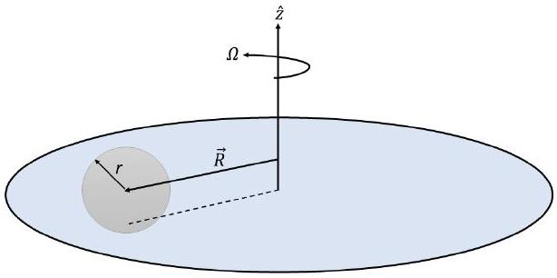
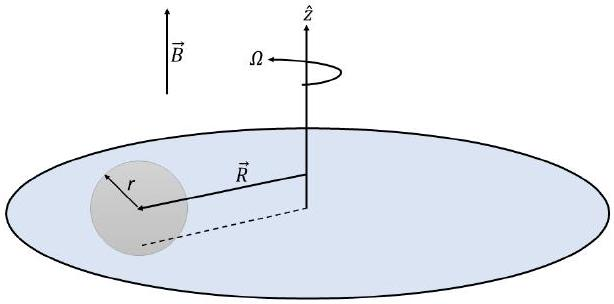

## Theoretical Problem 2: A ball on a turntable [10.0 points]

Preamble
Notations and conventions: The length of a vector $\vec{A}$ is simply denoted as $A \equiv|\vec{A}|$. It's $x, y, z$ components are denoted by $A_{x}, A_{y}, A_{z}$, respectively. The time derivative of a quantity is denoted by the dot over the quantity: $\dot{\vec{A}} \equiv d \vec{A} / d t, \dot{A} \equiv d A / d t$. The unit vector along the direction of vector $\vec{A}$ is denoted as $\hat{A}$. The unit vectors along the Cartesian coordinates are, therefore, $\hat{x}, \hat{y}$ and $\hat{z}$. The definitions of scalar and vector products are:

$$
\begin{aligned}
& (\vec{A} \cdot \vec{B})=(\vec{B} \cdot \vec{A})=A_{x} B_{x}+A_{y} B_{y}+A_{z} B_{z}=A B \cos \theta \\
& (\vec{A} \times \vec{B})=-(\vec{B} \times \vec{A}) \\
& =\left(A_{y} B_{z}-A_{z} B_{y}\right) \hat{x}+\left(A_{z} B_{x}-A_{x} B_{z}\right) \hat{y}+\left(A_{x} B_{x}-A_{y} B_{x}\right) \hat{z} \\
& |\vec{A} \times \vec{B}|=A B \sin \theta
\end{aligned}
$$

where $\theta$ is the angle between $\vec{A}$ and $\vec{B}$. You may need the following properties of vectors and their multiplications. Triple product rules for vectors:

$$
\begin{aligned}
& (\vec{A} \times \vec{B}) \times \vec{C}=(\vec{A} \cdot \vec{C}) \vec{B}-(\vec{B} \cdot \vec{C}) \vec{A}, \\
& (\vec{A} \times \vec{B}) \cdot \vec{C}=(\vec{B} \times \vec{C}) \cdot \vec{A}=(\vec{C} \times \vec{A}) \cdot \vec{B} .
\end{aligned}
$$

The vector products are very useful in describing many relations in physics. For example:

$$
\begin{aligned}
& \vec{v}=\vec{\omega} \times \vec{r}, \\
& \vec{F}_{\text {Lorentz }}=Q \vec{v} \times \vec{B},
\end{aligned}
$$

and, often, saves time combining three equations for vector components into a single equation.

The statement

Figure 1. Ball rolling on the turntable without slipping

A ball of mass $m$ and radius $r$ is rolling on a horizontal turntable without slipping (see Figure 1). Its mass density has a spherical symmetry, i.e. only depends on the distance from its center. The moment of inertia of the ball is $I$. In part B and C, where the turntable can rotate freely, the moment of inertia of the turntable is denoted as $I_{d}$. The purpose of the problem is to analyze the motion and trajectory of the ball with respect to the laboratory frame. Throughout the problem, assume the turntable is large enough so that the ball does not fall off. The following notations are used:
$\Omega$ - the magnitude of the turntable angular velocity,
$\vec{\omega}$ - the spinning angular velocity of the ball with respect to its spinning axis,
$\vec{R}$ - the horizontal position of the ball center with respect to the rotation axis of the turn table, $\vec{v}$ - the velocity of the ball at $\vec{R}$ with respect to the laboratory frame.
Assume that the initial position $\vec{R}_{0} \equiv \vec{R}(0)$ and velocity $\vec{v}_{0} \equiv \vec{v}(0)$ of the ball, the angular velocity of the turn table $\Omega_{0} \equiv \Omega(0)$ are known. For the initial vector quantities $\vec{R}_{0} \equiv \vec{R}(0)$ and $\vec{v}_{0} \equiv \vec{v}(0)$, assume that their directions are known. In addition, whenever you need to express a vector quantity, you may use $\hat{z}$ in your expression. Also, if asked to write your expression in terms of the known quantity you may use any or all of $m, r, I$ and $I_{d}$. Unless otherwise stated, keep $I$ as general. The following notations are recommended:

$$
\alpha=\frac{I}{I+m r^{2}}, \quad \delta=\frac{I_{d}}{m r^{2}},
$$

You may write the final answers as vector expressions involving cross product (vector product), dot product (scalar product) and unit vectors in axis directions.

## Part A: Ball on turntable with constant angular velocity [1.5 points]

First we start with the simplest case wherein the turntable angular velocity with respect to vertical axis $\hat{z}$ is constant, therefore $\Omega=\Omega_{0}$.

A. 1 Express the ball's velocity $\vec{v}$ in terms of $\Omega, \vec{\omega}, r$ and $\vec{R}$ from a kinematic constraint. 0.1pt
A. 2 Using Newton's equation and torque equation with respect to its center, find 0.2pt the acceleration of the ball $\vec{a} \equiv \dot{\vec{v}}$ in terms of $\Omega, \vec{v}, r, m$ and $I$.
A. 3 Find the velocity $\vec{v}$ in terms of $\Omega, \vec{R}, \vec{v}_{0}, \vec{R}_{0}, r, m$ and $I$. 0.2pt
A. 4 Write an explicit solution for the trajectory of the ball given the initial conditions 0.5pt $\vec{v}_{0}$ and $\vec{R}_{0}$.
A. 5 Assume this time that the ball has a uniform mass density, i.e. $I=2 m r^{2} / 5$. Trajectory you have found is a circle and it's radius is $R_{t}$. Choose its magnitude to be the same as $R_{0}$. How long does it take for the ball to approach the initial spot on the table (the position on the turntable at $t=0$ ) with the closest distance?

## Part B: Ball on freely rotating turntable [4.0 points]

In this part, the turntable can rotate freely without any friction around $z$-axis. Therefore its free rotation is hindered only by the ball's friction.

B. 1 Find the velocity $\vec{v}$ and acceleration $\dot{\vec{v}}$ of the ball in terms of $\Omega, \vec{R}, \Omega_{0}, \vec{R}_{0}, \dot{\Omega}, r, m$
B. 1 Find the velocity $\vec{v}$ and acceleration $\dot{\vec{v}}$ of the ball in terms of $\Omega, \vec{R}, \Omega_{0}, \vec{R}_{0}, \dot{\Omega}, r, m$
0.2pt and $I$. and $I$. and $I$.
B. 2 Find the magnitude of the angular acceleration of the turntable $\dot{\Omega}$ in terms of $\Omega, \Omega_{0}, \vec{R}, \vec{R}_{0}, \vec{v}_{0}, r, m, I$ and $I_{d}$. You may use the constants $\alpha$ and $\delta$ defined in the beginning of the problem.

## Q2-3   English (Official)

B. 3 Find the magnitude of the angular velocity of the turntable $\Omega$ as a function of $R \quad 0.6 \mathrm{pt}$ only. Use this constants in your expression: $\Omega_{0}, R_{0}, r, m, I, I_{d}$.
B. 4 From the result of B.3, for a given $\Omega_{0}, R_{0}$, find the maximum possible $\Omega$. $\quad 0.1$ pt
B. 5 Write down the vertical component the angular momentum $\hat{z} M_{z}$ of the whole system. Subtract any constant term and rename the remaining part as $\hat{z} L$. In part B. 1 you found the velocity of the ball $\vec{v}$, which can be written as the sum of a part that depends on the position of the ball $\vec{R}$ and a constant vector. Let us call this constant vector $\vec{c}$. Choose the direction of $x$-axis along this vector and $y$ axis along $\hat{z} \times \vec{c}$. In this frame of reference, find $\Omega$ in terms of $L, \vec{R}, \vec{c}, \hat{z}, R^{2}, r, m, I$ and $I_{d}$. Combining this with the result of B.3, write down an equation only containing $R^{2}$ and $y$ variables and $L, r, m, I, c$ and $I_{d}$. Here $c$ is the magnitude of $\vec{c}$. Substituting $R^{2}=x^{2}+y^{2}$, write down an expression containing only $x$ and $y$ variables and describing a curve. From this, list all possible types of trajectories.

## Part C: Ball on turntable in magnetic field [4.5 points]

In this part, we consider a density profile so that $I=m r^{2} / 10$. This can be realized, for example, if the ball is filled up to half of its radius with uniform density and the remaining part has a negligible mass. In addition, on its outer surface, the ball has a uniform charge density $Q /\left(4 \pi r^{2}\right)$, where $Q$ is the total surface charge. The whole setup is in a uniform magnetic field $\vec{B}$ that is in $\hat{z}$ direction. The turntable rotates with constant $\Omega$ like in Part A.

Figure 2. Ball rolling on the turntable in a constant magnetic field $\vec{B}$

C. 1 Write down Newton's equation and the torque $\vec{\tau}_{s}$ equation for the ball. Find
C. 1 Write down Newton's equation and the torque $\vec{\tau}_{s}$ equation for the ball. Find expression for the torque due to the spinning of the ball around its axis in terms expression for the torque due to the spinning of the ball around its axis in terms of $Q, r, \vec{\omega}$ and $\vec{B}$. of $Q, r, \vec{\omega}$ and $\vec{B}$. of $Q, r, \vec{\omega}$ and $\vec{B}$.

C. 2 Using the results of C.1, find expression for the linear acceleration of the ball with respect to the laboratory frame in terms of $Q, r, \vec{\omega}$ and $\vec{B}$.

C. 3 We assume all quantities of unit lenght are measured by meter, all angular velocities have unit of 1 Hertz, and all quantities of time have the unit of 1 second. The equation for the linear acceleration you found in part C. 2 is a second order differential equation for $\vec{R}$ of the following form:
$$
\frac{d^{2} \vec{R}}{d t^{2}}-\gamma \frac{d \vec{R}}{d t} \times \hat{z}+\beta \vec{R}=0
$$
Write down $\gamma$ and $\beta$ constants in terms of $Q, r, B, I, m, \Omega$. Make the following transformation to a polar coordinates for the components of $\vec{R}$ :
$$
\begin{aligned}
& x(t)=\rho(t) \cos (\eta(t)), \\
& y(t)=\rho(t) \sin (\eta(t))
\end{aligned}
$$
so that the new equations do not have the first time derivative term. Here the polar angle $\eta(t)$ is a function of time. Find the form of this function.
Express the coefficient $\beta^{\prime}$ of $\rho(t)$ in the new equation in terms of $\gamma$ and $\beta$.
Write down the conditions for different types of behavior of $\rho(t)$ with respect to time: harmonic, exponential etc.
C. 4 Consider the following initial conditions for the solution found in part C.3: $x(0)=1 m, \quad y=0 m, \quad v_{x}(0)=\left.\dot{x}\right|_{t=0}=1 m / s, \quad, v_{y}(0)=\left.\dot{y}\right|_{t=0}=-1 m / s$.
From these conditions, find $\beta$ and $\gamma$. Using them find the corresponding $\Omega$.
Sketch the trajectory. Is the charge of the surface negative or positive? For the negative write - and for the positive write + on your answer sheet.

C. 5 Consider the solution you have found in part C.4. If you identified it correctly your solution should have a rotating $\vec{R}(t)$. Find the expressions for the total and per rotation changes in energy for $N \gg 1$ number of rotations. Here you may ignore the terms small compared to $N$. In this part assume the mass and the radius of the ball are $m=1 \mathrm{~kg}$ and $r=1 \mathrm{~m}$ so that $I=1 / 11 \mathrm{~kg} \cdot \mathrm{~m}^{2}$.
