## Introduction

Figure 1 shows a gyroscope. A gyroscope is a device used to measure or maintain orientation and angular velocity. It consists of a spinning wheel mounted in a gimbal so that its axis can freely point in any direction. When rotating, the orientation of the axis is unaffected by tilting or rotation of the mounting, according to the conservation of angular momentum.

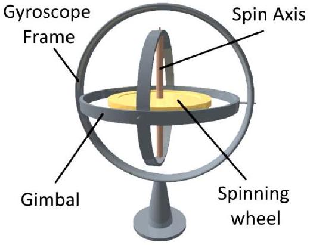
Figure 1. Gyroscope

The physics behind a gyroscope is based on the principle of conservation of angular momentum, which states that the angular momentum of a system remains constant if no external torques are applied to it. In a gyroscope, the spinning wheel creates a large angular momentum. When an external force attempts to turn the gyroscope's axis, the gyroscope resists this change in direction due to its angular momentum. This behavior is like a top (or whipping top) that spins around its axis, balancing due to gyroscopic effect, which stabilizes its tilt.

The behavior of gyroscopes is described by the equations of motion derived from Euler's equations for rigid body rotation. These equations account for the torques and rotational speeds and explain how and why the gyroscope behaves as it does under various conditions. This makes gyroscopes critical in applications like navigation systems for aircraft, spacecraft, and ships, where precise orientation information is crucial. Besides that, auto balancing vehicles, such as self-balancing scooters and advanced robotics incorporate gyroscopes and accelerometers to dynamically adjust and maintain the balance.

Experiment Instruction

1) Place the antistatic map on the table.
2) Screw the three star knobs to the bottom of the A shape retort stand and hand knob on the side as shown in Figure 1.
3)

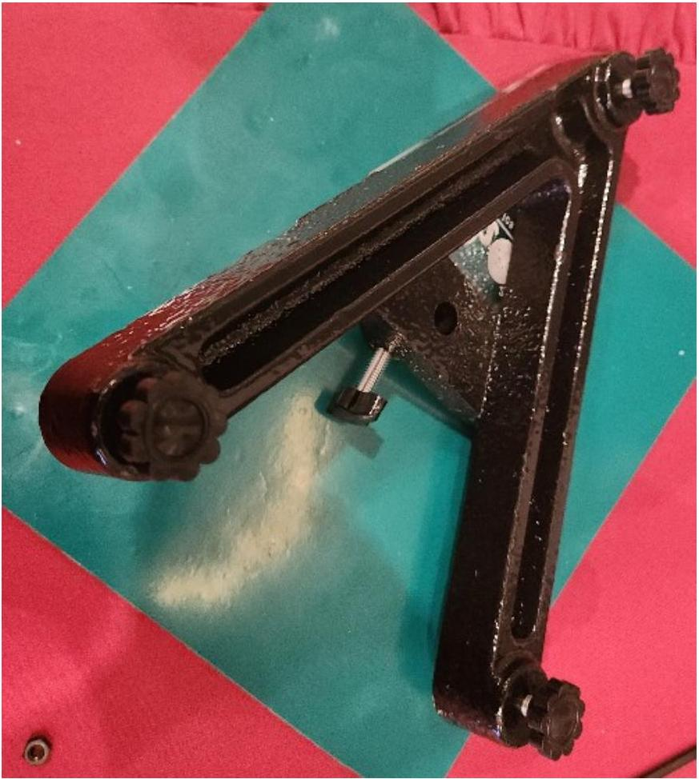
Figure 1

4) Place the A shape retort stand on the antistatic map which use to reduce the vibration and noise.
5) Insert the gyroscope main vertical stand into the retort stand.
6) Insert the aluminum tube through the center shaft and lock it tightly with star knob provided. Your setup should looks like Figure 2.

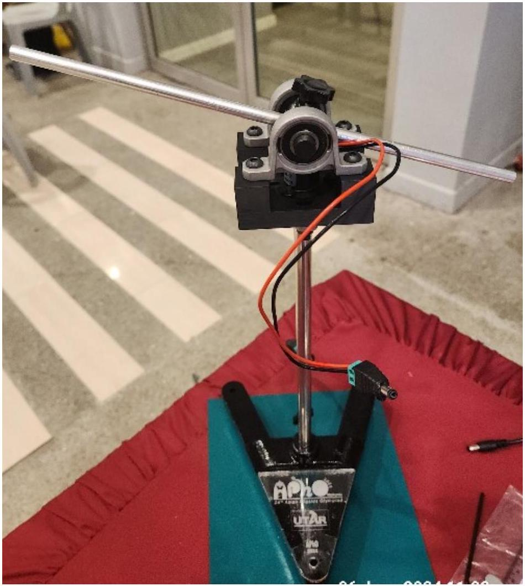
Figure 2

7) Connect the wire jack at the bottom to the adjustable power adapter as shown in Figure 3.

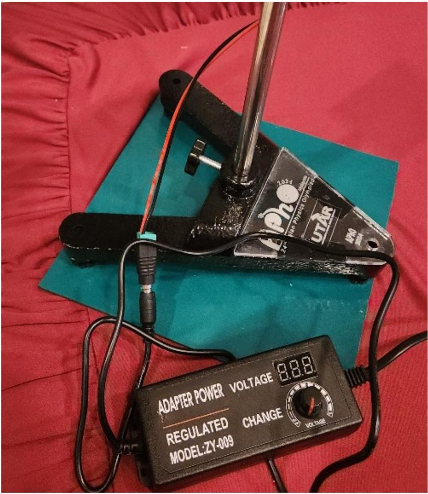
Figure 3.

8) If you plan to change the polarity of the supply to the motor, you can always swap the wire at this connection jack using screw driver provided.

Installation of motor

1) Screw the motor into the aluminum tube and connect the DC jack of the motor to the DC jack on the vertical stand as shown in Figure 4.

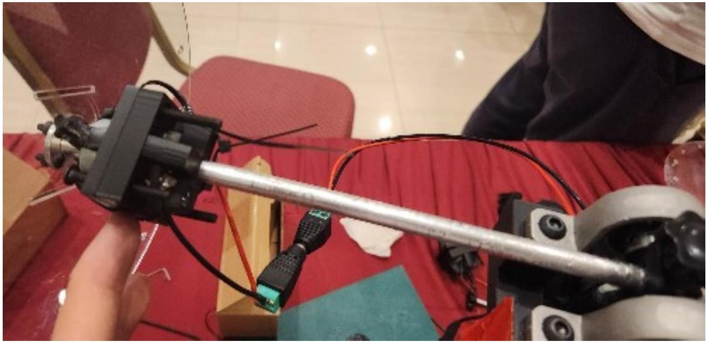
Figure 4

2) The coupler can attach to the disk using the M3 bolts and nuts given as shown in Figure 5.

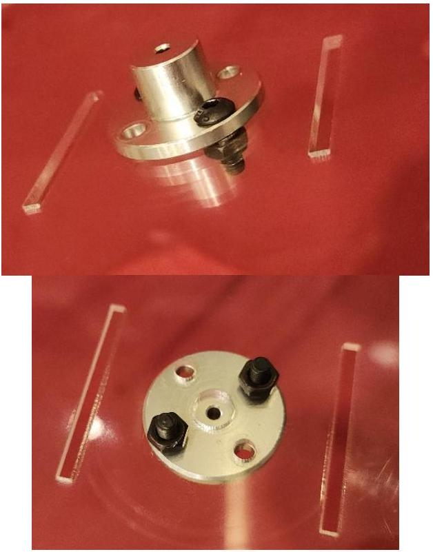
Figure 5

3) The coupler then can install on the motor shaft and lock using the lock screw from side as shown in Figure 6.

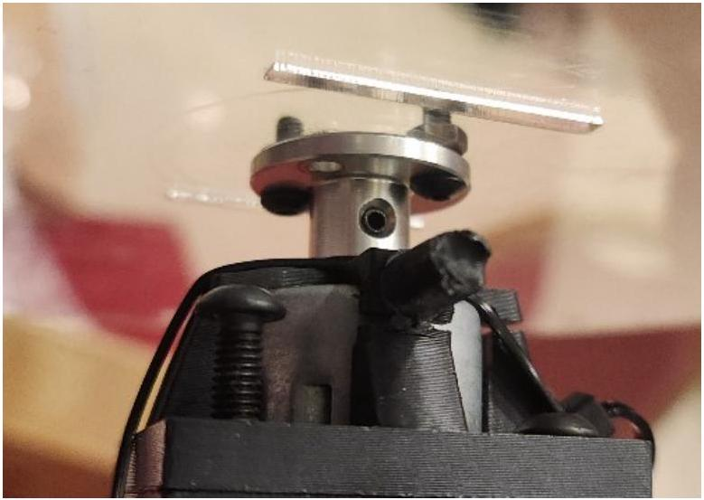
Figure 6

Installation of 26 mm disk

1) Sandwich the 26 mm disk with 2 washers.
2) Lock it to the aluminum tube using a M6 screw provided as shown in Figure 7.

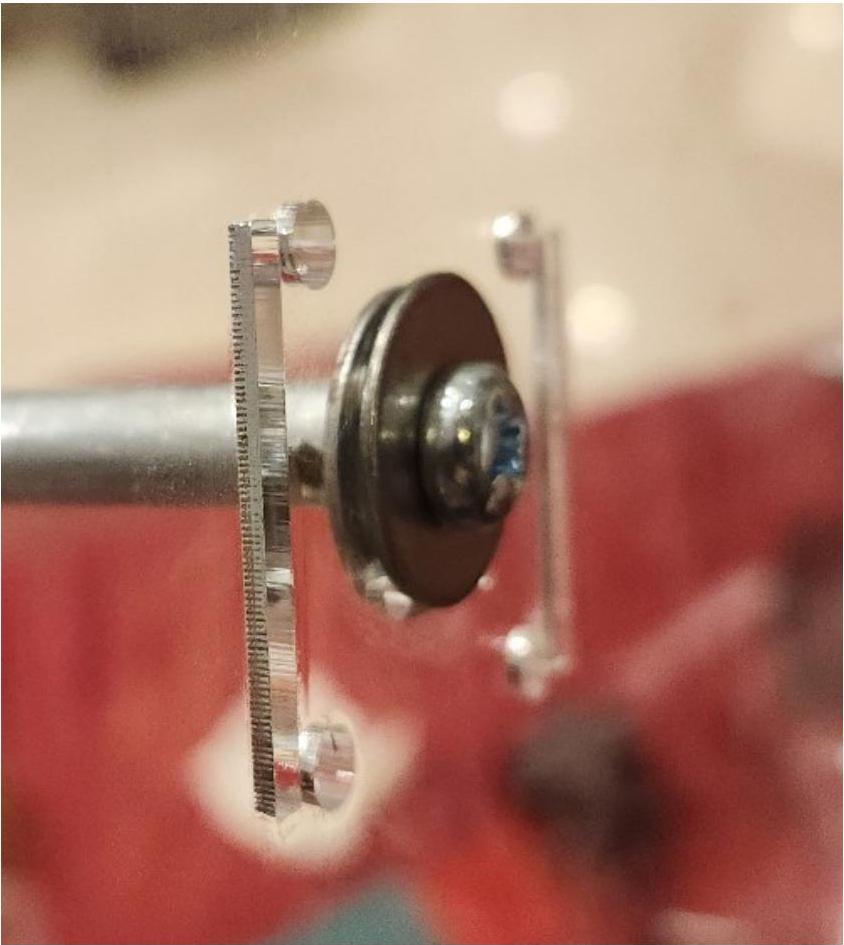

Figure 7

Equipments/Materials:

| Gyroscope main vertical stand ×1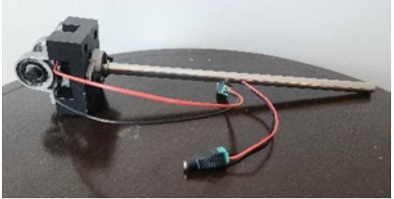 | Adjustable power adapter x1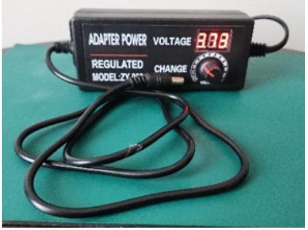 | DC motor with case and coupler x1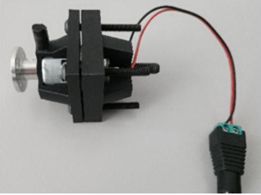 |
| :--- | :--- | :--- |
| 20cm spinning disk with thickness 2mm, 3mm, and 4mm. 26cm counter weight disk.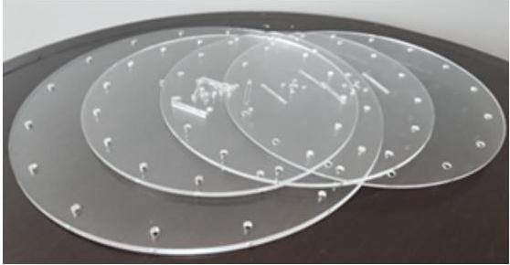 | Goniometer (or angle ruler) x1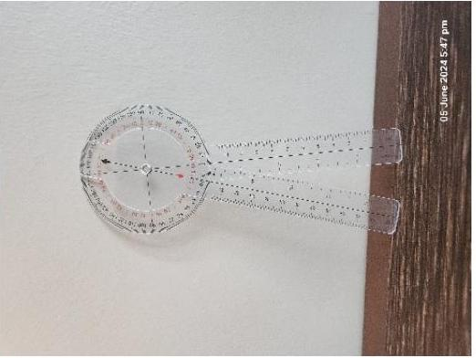 | Stopwatch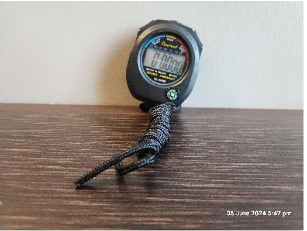 |
| Antistatic map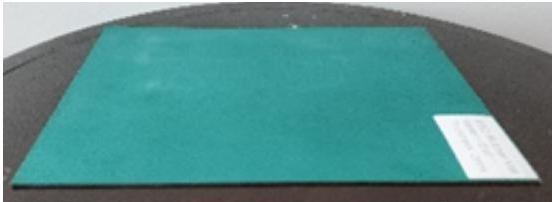 | Aluminium tube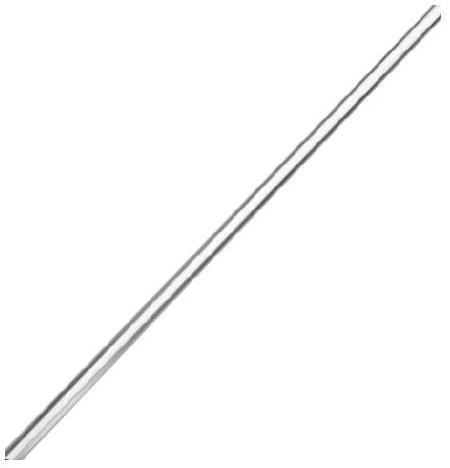 | Retort stand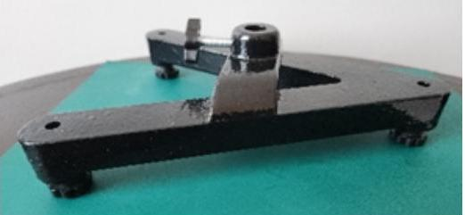 |
|  |  |  |

To mount the disk to the DC motor, you need to connect and tighten it to the coupler.
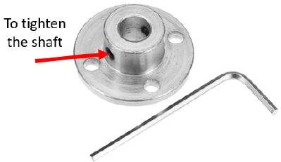

Mass of components
20 cm (diameter) × 2 mm (thickness) spinning disk → 65±1 g

20 cm (diameter) × 3 mm (thickness) spinning disk → 89±1 g
20 cm (diameter) × 4 mm (thickness) spinning disk → 131±1 g
26 cm (diameter) $\times 4 \mathrm{~mm}$ (thickness) spinning disk → 231±1 g
DC motor with casing → 94 g

The mass of the aluminium tube can be neglected throughout the whole experiment.

Precautious!!!

1) Before turning on the Adjustable power adapter, make sure that the knob is turned OFF. High voltage supply to the DC motor will burn the motor. Limit the driving voltage below 6 volts. Driving above 6 volts might cause the motor to overheat and burn. *Candidates will need to do the soldering and replacement of the DC motor as the penalty of not operating properly.
2) Do not leave the setup continuously running for a long period of time (10 minutes and above). Leave the motor to rest after each experiment.
3) Hold the retort stand when the experiment starts or when the motor is running until it is stable. The experiment will experience strong vibration.
4) Note that the spinning disk can pose a safety hazard, do not touch the spinning disk with bare hands when it is spinning, switch off the power and wait for it to come to a complete stop.
5) The wire connection of the DC motor is thin, please handle the connection with extremely gently.
6) The 3D printed DC motor holder is fragile, do not use brute force to adjust these 3D printed part. You might break the part.

Part A: Levelling the base and ensuring the stand is exactly vertical. [Total Point = 1.0]
You are provided with a retort stand with a leveling function. To conduct the experiment, you will need to level the gyroscope test kit until the vertical pole is perfectly vertical without any leveling device. You may use all the apparatus provided to achieve the purpose.
*Take note that leveling this set-up is crucial to all subsequent parts of the exam, ensure you do this carefully and maintain the position after leveling.

A. 1. Sketch your setup to show how you could level the gyroscope test kit without [0.6] a leveling device, label the parts in your diagram. Label all the parts with detailed information.
A. 2. Label the force that interact in the setup. [0.2]
A. 3. Which of the following two factors will allow you to most precisely determine whether the stand is vertical?
    (a) Equal length of the arm
    (b) Unequal length of the arm
    (c) Size of the disk
    (d) Thickness of the disk
    (e) Weight of the disk
    (f) Weight of the DC motor
    (g) Voltage applied to the DC motor

Part B: Effect of Spinning Speed [Total point = 6.5]
Objective: To investigate how the angular velocity of the gyroscope affects its stability and precession period.

Materials: Gyroscope test kit, adjustable power adapter, DC motor, goniometer, stopwatch, 20 cm (3 mm thick) spinning disk, ruler.

For this part of the experiment, the arm should not be balanced and allowed to hang freely.

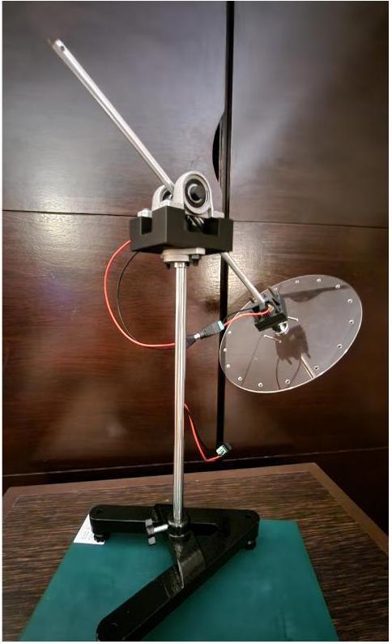
Figure 2

Procedure:

1. Fix the 20 cm diameter spinning disk with 3 mm thickness on the DC motor and mount it on one side of the gyroscope arm in perpendicular direction as shown in Figure 2.
2. Adjust the gyroscope arm so that the distance of the disk from the center is 15 cm.
3. Connect all the wiring connections as well as the adjustable power adapter.
4. Set the gyroscope to a low rotational speed using low voltage and allow it to stabilize.
5. Measure and record the precession period using the stopwatch.
6. Gradually increase the voltage of the adjustable power adapter in increments to increase the spinning speed, repeating the measurement at each driving voltage.

note: you may slightly increase the voltage to improve balance. Make sure that the aluminium tube is always lifted and not in contact with the holder.

Results:

B. 1. Table down the values that you obtained with the calculated precession period (s).
B. 2. Calculate the standard deviation and standard error of the precession period shows your steps with equations for one set of data used.
B. 3. Plot the precession period against the driving voltage wirth error bars and trendline.

Analysis:

B. 4. Determine the relation between precession period and the DC motor driving voltage using the above experimental results.
B. 5. Given that the DC motor performance characteristic as shown in Table 1. Obtained the relation between precession velocity and DC motor speed.

Table 1
| Voltage (V) | Current (A) | Speed (rpm) |
| :--- | :--- | :--- |
| 3.7 | 176 mA | 7200 |
| 4.8 | 185 mA | 9700 |
| 6.0 | 205 mA | 12600 |
| 7.4 | 230 mA | 15600 |
| 9.6 | 245 mA | 19800 |
| 12.0 | 298 mA | 24500 |

note: Do not drive the voltage above 6V. This table is for reference and not for replication.
B.6. Given that the moment of inertia of a uniform ring is $I=m R^{2}$ as shown in Figure 2. Given that the mass is M and radius is R.

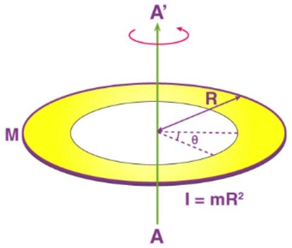
Figure 2. Moment of inertia of a uniform ring.

(i) Derive the equation of the moment of inertia of a uniform disk with respect to the rotation axis AA'.
(ii) Calculate the moment of inertia for the 20 cm diameter with 3 mm thickness spinning disk.
(iii) Given that the precession rate is given by [1.0]
$$
\omega_{p}=\frac{m g r}{I \cdot \omega_{s}}
$$
where
$m$ is the mass involved,
$r$ is the distance from pivot to center of mass of the system,
$I$ is the moment of inertia of the spinning disk (assume that the moment of intertia is solely contributed by the spinning disk).
$\omega_{s}$ is the spinning speed of the gyroscope.
Sketch a diagram and label all the external forces involved in this experiment. Derive the equation of precession rate of the setup from angular momentum.

(iv) Calculate the theoretical precession rate based on the motor speed in Table 1 when the motor is driving at 6 V.

Part C: Influence of Gyroscope Arm Length [Total point = 2.1]
Objective: To study the effect of changing the length of the gyroscope's arm on its precession behavior.

Materials: Gyroscope test kit, adjustable power adapter, DC motor, goniometer, stopwatch, 20 cm (3 mm thick) spinning disk, ruler.

Procedure:

1. Based on the previous setup, loosen the star knob that is used to lock the gyroscope arm.
2. Adjust the length of the gyroscope arm so to change the length is now 12 cm from the center of the setup.
3. Tighten the star knob.
4. Set the gyroscope driving voltage to approximately 4.5V and allow it to stabilize.
5. Measure and record the rotation period using the stopwatch.
6. Repeat the experiment for different lengths between 12 cm to 22 cm.

*Error analysis is not necessary in this experiment.
note: Make sure that the aluminium tube is always lifted and not in contact with the holder.

Results:

C. 1. Table down the values that you obtained with the calculated precession velocity (rad/s)
C. 2. Plot the precession velocity against the measured lengths.
C. 3. Choose the change of precession with respect to arm length.
    (a) Arm length increase, precession rate increase
    (b) Arm length increase, precession rate reduces.
    (c) Arm length increase, precession rate remains the same.

Part D: Influence of Gyroscope Disk weight [Total point = 3.7]
Objective: To study the effect of changing the weight of the gyroscope's disk on its precession behavior.

Materials: Gyroscope test kit, adjustable power adapter, DC motor, goniometer, stopwatch, and 20 cm spinning disk (thickness of 2 mm, 3 mm , and 4 mm ).

For this part of the experiment, the arm should not be balanced and allowed to hang freely.
Procedure:

1. Based on the previous setup, loosen the star knob that is used to lock the gyroscope arm.
2. Adjust the length of the gyroscope arm so that the spinning disk is now back to 15 cm from the center of the setup.
3. Tighten the star knob.
4. Change the spinning disk to 2 mm thickness.
5. Repeat step 3-6 in Part B.
6. Repeat the experiment using 4 mm thick spinning disk.

note: error analysis is not needed.

Results:

D. 1. Table down the values that you obtained with the calculated precession velocity (rad/s).
D. 2. Plot the precession velocity against the driving voltage for all the thicknesses you measured including in Part B.
D. 3. Select the correct response of precession with respect to disk weight. [0.1]
    (a) The gyroscope precession will not change as the disk weight increased.
    (b) The gyroscope will precess faster as the disk weight increased.
    (c) The gyroscope will precess slower as the disk weight increased.

D. 4. Without referring to the given mass of the disks, based on your experimental [0.8] measurements, calculate the mass of the disks. Assume that the moment inertial is only contributed by the disk.

Part E: Torque Induced by External Forces [Total point = 3.5]
Objective: To understand how external torques affect the gyroscope's behavior.
Materials: Gyroscope with motor, 20 cm (2 mm thick) spinning disk, stainless steel bolts and nuts, stopwatch, goniometer.

Procedure:

1. Install the 20 cm (2 mm thick) spinning disk.
2. Attach the 26 cm diameter counter weight disk on the other end of the gyroscope arm.
3. Loosen the star knob and adjust the arm length until the arm reach the balance horizontally.
4. Tighten the star knob so that the arm length does not change in this part of the experiment.
5. Apply 5 V to the DC motor and allow it to stabilize in both precession velocity and leverage angle.
6. Observe and ensure that precession does not happen.
7. Switch off the power adapter.
8. Add some stainless-steel bolts and nuts to the counter weight disk. Lock tightly through the holes created around the circumference of the disk.
9. Measure and record the rotation period using stopwatch and leverage angle using goniometer.
10. Measure the change of angle due to the change of number of bolts and nuts.
11. Repeat the measurements using different number of bolts and nuts.
12. Include error calculations in your results.

Results:

E. 1. Table down the values that you obtained with the calculated precession velocity (rad/s) including error estimation.
E. 2 Plot the precession velocity against the number of sets of bolts and nuts you measured. Include a linear trend line.
E. 3. Plot the leverage angle against the number of sets of bolt and nut you measured.

Analysis:

E. 4. Use experimental data to determine the mass of the bolt and nut set.
E. 5. If the screws are now added to the spinning disk, it is notice that the [0.1] precession is now in the opposite direction and the precession velocity will be different from previous results. What parameter that it affected? m, g, r, I, or $\omega_{\mathrm{s}}$ ? If there is more than one, list down in the highest to the lowest effect.

Part F: Nutation phenomenon [Total point = 1.5]
Objective: To observe the characteristics of the impulse affect the nutation frequency and damping in a gyroscope. Nutation is a periodic variation in inclination.

Materials: Gyroscope test kit, adjustable power adapter, DC motor, goniometer, stopwatch, 20 cm spinning disk (thickness of 2 mm ) and 26 cm counter weight disk.

Procedure:

1. Removed all the bolts and nuts on the disk from previous experiment.
2. Loosen the star knob and adjust the arm length until the arm reach the balance horizontally.
3. Tighten the star knob.
4. Apply 4 V to the DC motor and allow it to stabilize.
5. Make sure that the disk is rotate in anticlockwise direction (disc facing person).
6. Apply an impulse by quick pressing the counter weight and release it.
7. Observed the changes. Record down the parameters that you think is important.
8. Change the length of the aluminium tube to create an unbalanced condition where the angle of the spinning disk to an angle that is higher than horizontal.
9. Repeat steps 5 and 6: while the disk is spinning, hold and lift the rotation arm on the side of the spinning disk to a higher level.
10. Release the hold and observe the motion of the disk.
11. Repeat steps 7 to 9 by having the spinning disk at a lower than horizontal.

Results and analysis:

F. 1. Draw the nutation motion that you observed for angle lower than horizontal and higher than horizontal.

Analysis:
F.2. To understand the phenomenon, you observed. You may start with the general Euler's equation for rigid body dynamic

$$
\begin{aligned}
& I_{1} \dot{\omega}_{1}+\left(I_{3}-I_{2}\right) \omega_{2} \omega_{3}=\tau_{1} \\
& I_{2} \dot{\omega}_{2}+\left(I_{1}-I_{3}\right) \omega_{3} \omega_{1}=\tau_{2} \\
& I_{3} \dot{\omega}_{3}+\left(I_{2}-I_{1}\right) \omega_{1} \omega_{2}=\tau_{3}
\end{aligned}
$$

where $\mathrm{I}_{1}, \mathrm{I}_{2}, \mathrm{I}_{3}$ are the moments of inertia about the principal axes, $\omega_{1}, \omega_{2}, \omega_{3}$ are the components of angular velocity about these axes, and $\tau_{1}, \tau_{2}, \tau_{3}$ are components of the external torque.

(i) Assume that the disk is symmetric at the set voltage in the direction of axis [1.0] 3. Consider a frame in which there is no apparent torque. Solve Eq. 1 to 3 in this frame to obtain the nutation frequency equation.
(ii) State the part of your derivation in F.2. that shows nutation is simple harmonic motion.

## Part G: Application of gyroscope in self balancing [Total point = 1.7]

Introduction: A self-balancing gyroscope is a device that utilizes the principles of angular momentum to maintain orientation and balance automatically. It consists of a spinning wheel or rotor whose axis is free to assume any orientation. When rotating, the axis tends to remain pointing in the same direction due to the conservation of angular momentum. Applications of self-balancing gyroscopes are extensive and include stabilizing platforms in ships and aircraft, enhancing the stability of motorcycles and bicycles, and in robotics for balance and precise movement control.

Objective: To demonstrate and understand the principles of angular momentum and gyroscopic stabilization. By designing and constructing this prototype, you will explore how gyroscopes maintain orientation and balance under various conditions, gaining insights into their applications in real-world technologies such as navigation systems in aerospace, automotive stabilization, and robotic balancing mechanisms.

G. 1 Try to build prototype/s using the parts that you have to demonstrate the ability of self-balancing gyroscope. Label all the parts that you used and state clearly the moving and stagnant part. Safety of your setup will be concerned. In this experiment you are allowed to remove the coupler, change the disc, as well as removing the four bolts locking the DC motor clamp to reconstruct a new device using any provided parts. Sketch your prototype with label.
