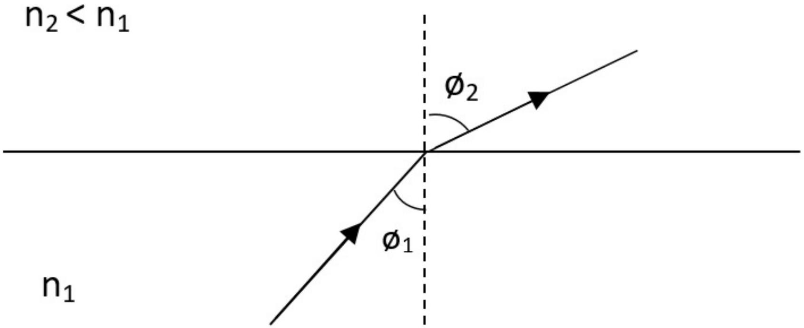
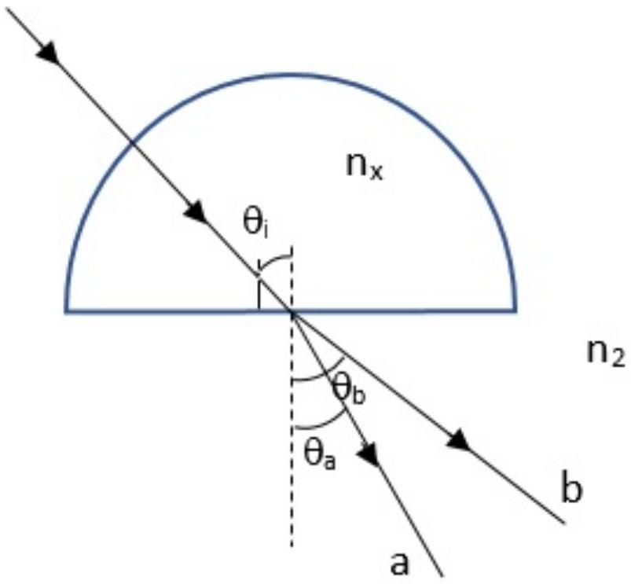
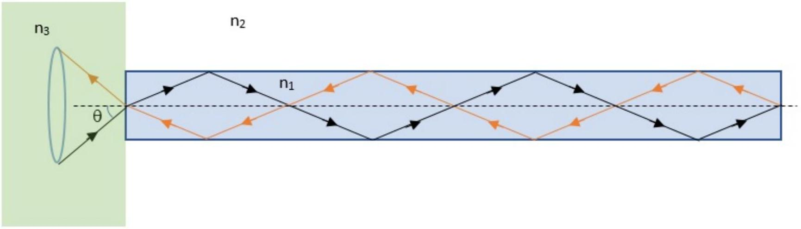
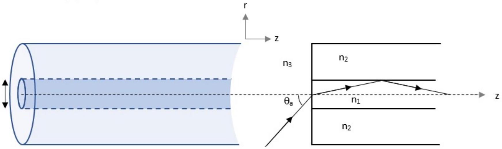

## Snell's Law

## Introduction

When light is incident upon a dielectric interface, it will be reflected and refracted, depending on the incident angle of the light and the refractive indices of the dielectric media as shown in Fig. 1. The refraction of light is governed by the Snell's law,

$$
n_{1} \sin \phi_{1}=n_{2} \sin \phi_{2}
$$

where $n_{1}$ and $n_{2}$ are the refractive indices of the lower and upper parts of the boundary, $\phi_{1}$ and $\phi_{2}$ are the angles that the light ray makes with the normal of the boundary.

Fig. 1: Refraction of light from a dielectric medium with refractive index, $n_{1}$, to a second dielectric medium with refractive index, $n_{2}$.

## Part A: Light Propagation Through a Semi-Sphere (1.5 points)

Fig. 2 illustrates how light that consists of two rays with different colour, $a$ and $b$, is incident along the radius of a semi-sphere with refractive index $n_{\chi}$, in air, before being refracted at the bottom at an angle of $\theta_{a}$ and $\theta_{b}$, respectively.

Fig. 2: Light propagation through a semi-sphere.

A. 1 Which ray $(a$ or $b)$ propagates faster in the semi-sphere? Please provide 0.5pt justification.
A. 2 When the incident angle, $\theta_{i}$, is slowly increased to 45°, ray $b$ no longer exits the bottom of the semi-sphere. When $\theta_{i}$ is further increased to $50^{\circ}$, the same happens to ray $a$. What is the difference between the refractive index of ray $a$ and $b$ in the semi-sphere?

## Part B: Light Propagation Through a Cylindrical Rod (3.5 points)

A cylindrical rod has a refractive index of $n_{1}=1.50$. The rod is placed in air, with one end coated with a polymer with refractive index $n_{3}=1.40$, as shown in Fig. 3 below. Light is incident from the polymer into the rod at an angle, $\theta$. When $\theta$ is changed, there is an instance when light is totally reflected back to the polymer.

Fig. 3: A cylindrical rod with one end coated with a polymer with refractive index $n_{3}$, where $n_{2}<n_{3}<$ $n_{1}$.

| B. 1 | Determine the range of incident angle, $\theta$, for this condition to happen. | 2.0pt |
| :--- | :--- | :--- |

B. 2 How does the condition in B. 1 change,

(i) if the other, open end of the rod is now coated with a thick layer of oil with 0.6pt refractive index of 1.60?
(ii) if the setup is placed in water with refractive index of 1.33?

## Part C: Light Propagation Through an Optical Fibre (5.0 points)

Optical fibre is formed by surrounding the medium with refractive index, $n_{1}$ with a lower refractive index medium, $n_{2}$, as shown in Fig. 4 below. The medium with refractive index, $n_{1}$ is known as the fibre core, and the medium with refractive index, $n_{2}$ is known as the fibre cladding. The refractive index, $n_{3}$, is typically the refractive index of air ( $n_{3}=1$ ).

Fig. 4: A schematic of an optical fibre and its cross section.

C. 1 In order for light to propagate inside the optical fiber, it first needs to be coupled into the optical fiber. The maximum angle of the light incident at the end of the fiber, $\theta_{a}$ so that the light can be guided inside the fiber without being refracted out is related to the refractive indices of the fiber core and cladding. Consider a ray that propagates along the meridional plane (plane that cuts across the fibre axis), formulate the relationship between the angle, $\theta_{a}$ and the refractive indices.
C. 2 Optical fibers are not always aligned in a straight line but need to be bent to go through different spaces. Given the fiber core diameter of $50 \mu \mathrm{~m}$, if the minimum bending radius on the optical fiber is 1.0 cm, how much will $\theta_{a}$ change?
