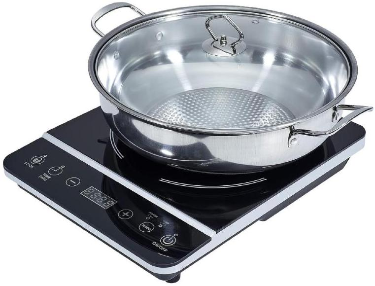
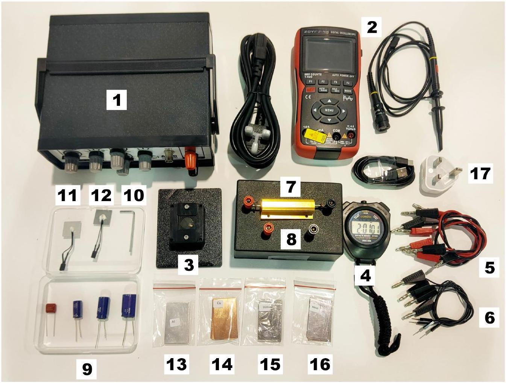
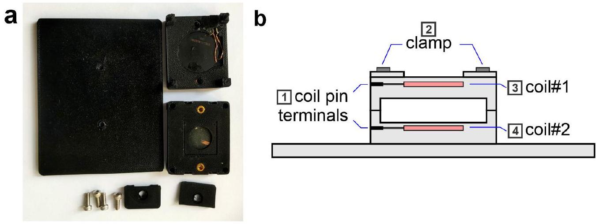
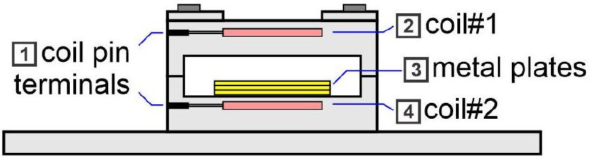
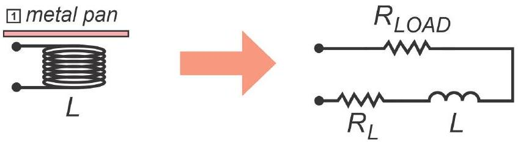
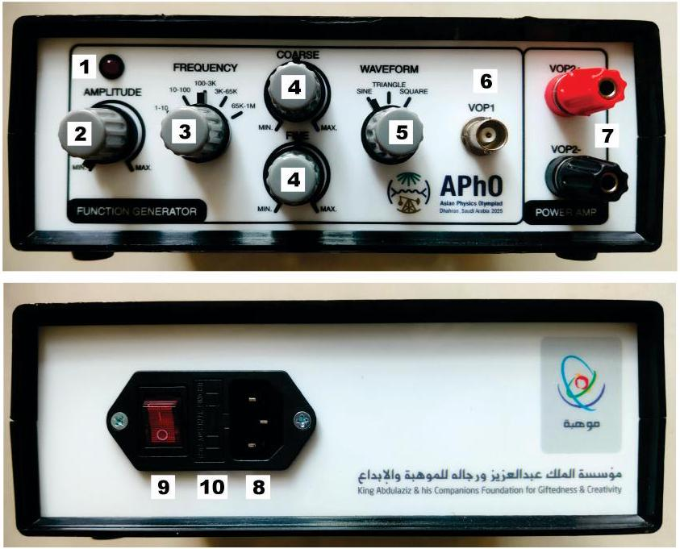
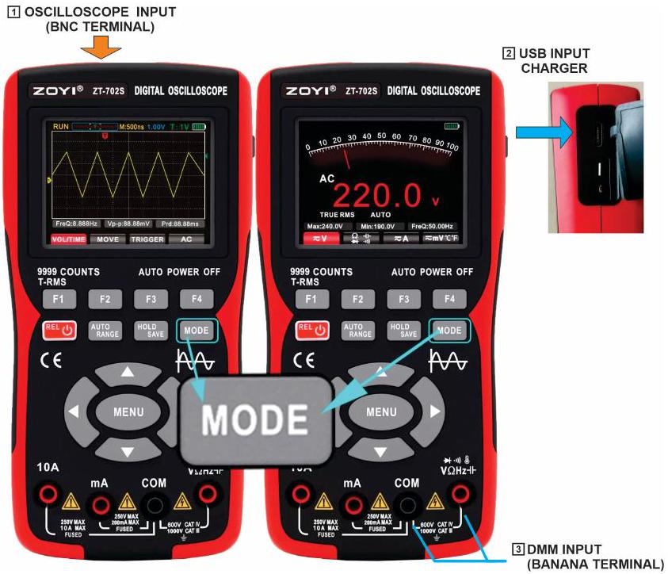

## Physics of Induction Cooking

A. INTRODUCTION

Figure 1. An induction cooker

This problem presents a very interesting kitchen physics: an induction cooker. Such a device consists mainly of a coil, which is driven by an alternating current that heats up a metal pan above it. It is a modern alternative for cooking that provides several benefits such as safer cooking environment (no fire or flammable gas involved), cleaner utensils (no soot), faster cooking and more environmentally friendly (can be powered by renewable electricity). In this experiment, we will explore the basic fascinating physics of an induction cooker.

There are three parts in the experiment. Firstly, we will measure the coil's inductance ( $L$ ) and its internal resistance $\left(R_{L}\right)$. Secondly, we will investigate the skin depth phenomena in metals which is important for induction cooking. Thirdly, we will determine the specific heat capacity $(c)$ of different metal pans and their effective load resistance $\left(R_{\text {LOAD }}\right)$.

Figure 2. Experimental setup. The components are described in the list below.

## B. EXPERIMENTAL COMPONENTS

1. Function generator (FG) (operating frequency: 20 Hz to 100 kHz ).
2. Digital oscilloscope "Zoyi" + BNC cable probe (1 pc).
3. Identical coil mounted on a plastic base (2 pcs).
4. Stopwatch (1 pc).
5. Banana to banana-jack cables two pairs (4 pcs).
6. Banana jack to pin cables two pairs (4 pcs).
7. Yellow metal resistor " $R_{1}$ " ( $1 \Omega, 100 \mathrm{Watt}$ ), mounted on a black box ( 1 pc).
8. Black box with four female banana jack sockets (1 pc).
9. Capacitors 470 nF: (brown), $470 \mu \mathrm{~F}, 1000 \mu \mathrm{~F}, 2200 \mu \mathrm{~F}:$ (dark blue cylinders) ( 1 pc each)
10. M3 Allen (L) key (1 pc).
11. Aluminium "pan" with NTC (negative temperature coefficient) thermistor attached, size = 2 cm × 2 cm , thickness $=0.73 \mathrm{~mm}(1 \mathrm{pc})$. Both surface appearance: silvery /silvery.
12. Stainless steel SS410 "pan" with NTC thermistor attached, size $=2 \mathrm{~cm} \times 2 \mathrm{~cm}$, thickness $=0.76 \mathrm{~mm}$ (1 pc). Both surface appearance: mirror-like/mirror-like.
13. Aluminium plates, size $=2.7 \mathrm{~cm} \times 4.6 \mathrm{~cm}$, thickness $=0.73 \mathrm{~mm}$, relative magnetic permeability $\mu_{r}=1$, (5 pcs). Both surface appearance: silvery/ silvery.
14. Copper plates, size $=2.7 \mathrm{~cm} \times 4.6 \mathrm{~cm}$, thickness $=0.71 \mathrm{~mm}$, relative magnetic permeability $\mu_{r}=1$ (5 pcs). Both surface appearance: orange-red/orange-red.
15. Stainless steel "SS304" plates, size $=2.7 \mathrm{~cm} \times 4.6 \mathrm{~cm}$, thickness $=0.72 \mathrm{~mm}$, relative magnetic permeability $\mu_{r}=1(4 \mathrm{pcs})$. Surface appearance: one side mirror, the other dull.
16. Stainless steel "SS410" plates, size $=2.7 \mathrm{~cm} \times 4.6 \mathrm{~cm}$, thickness $=0.76 \mathrm{~mm}$, relative magnetic permeability $\mu_{r}=700$ (4 pcs). Surface appearance: mirror-like / mirror-like.

17. Charger and USB-C cable for the digital handheld oscilloscope (1 pc).

Figure 3. The induction cooker setup, (1): coil pin terminals, (2): clamps, (3): coil\#1, (4): coil\#2.

## Parameters and Constants

| Parameter/Constant | Symbol | Value |
| :--- | :--- | :--- |
| Stefan-Boltzmann | $\sigma_{S}$ | $5.670 \times 10^{-8} \mathrm{~W} \mathrm{~m}^{-2} \mathrm{~K}^{-4}$ |
| Magnetic permeability in vacuum | $\mu_{0}$ | $4 \pi \times 10^{-7} \mathrm{H} / \mathrm{m}$ |
| Mass density of AI | $\rho_{\mathrm{Al}}$ | $2700 \mathrm{~kg} / \mathrm{m}^{3}$ |
| Mass density of SS410 | $\rho_{\text {SS410 }}$ | $7700 \mathrm{~kg} / \mathrm{m}^{3}$ |
| Emissivity of AI | $e_{\mathrm{Al}}$ | 0.65 |
| Emissivity of SS410 | $e_{\text {SS410 }}$ | 0.8 |

NOTE:

1. Please read section D: "Equipment Operating Procedures".
2. In all experiments we need capacitor $C$ to form RLC series circuit configuration, because without a capacitor (i.e. only RL configuration the coil could become very hot.
3. In all experiments error analysis is not required.
4. For all experiments, please set Function Generator's "Waveform" selection to "Sine" function.
5. Limit the current to the coil at maximum approximately 2 A-peak.
6. For the digital oscilloscope, the "oscilloscope" mode is used to measure voltage, frequency and view the waveforms. The "multimeter" mode is used to measure resistance.
7. You can connect the oscilloscope probe (item \#2) to banana-to-banana cable (\#5) to make it easier to connect to various "banana" terminals.

C. THE EXPERIMENT
C. 1 Experiment\#1: Characterisation of the induction coil (4.5 pts )

The first key component in the induction cooker is the coil. In this experiment we will measure the self inductance $(L)$ of coil\#1 (the top coil) as shown in Fig. 3b. This coil can be modeled as an ideal inductor $L$ in series with an internal coil resistance $R_{L}$.

We will use a series RLC circuit with the yellow metal resistor $R_{1}$, coil\#1 and a capacitor. There are four different capacitors. Please note that the Function Generator (FG) output voltage might vary as you change the frequency as the load impedance may change.

1.1 Sketch your circuit and label all the relevant parts. The resistance from all cables $\left(R_{C}\right)$, which contribute to the total resistance $\left(R_{\text {TOT }}\right)$ in the circuit, is not negligible. Determine $R_{C}$ using the ohmmeter.
0.4 pt
1.2 Determine the resonance frequency of the RLC circuit with two different capac-
1.2 Determine the resonance frequency of the RLC circuit with two different capacitors: $C=470 \mathrm{nF}$ and $2200 \mu \mathrm{~F}$. Record your experimental data in a table. Plot itors: $C=470 \mathrm{nF}$ and $2200 \mu \mathrm{~F}$. Record your experimental data in a table. Plot appropriate resonance curve and determine $L$. appropriate resonance curve and determine $L$. 1.2 pt
1.3 We also want to determine the coil resistance $R_{L}$. You might notice that the resonance data of one capacitor is insufficient to determine $L$ accurately. Therefore, develop an alternative linear equation model so you can extract both $L$ and $R_{L}$ from the series RLC experiment.
1.4 Perform the experiment for the other two capacitors: $C=470 \mu \mathrm{~F}$ and $1000 \mu \mathrm{~F}$. Record your data. Analyze all four RLC data using your new model. Focus on the appropriate range of frequencies and plot appropriate graphs. the appropriate range of frequencies and plot appropriate graphs. 1.4 pt
1.5 Determine $R_{L}$ and $L$ for all experiments with the four capacitors. Calculate their averages.

## Q1-5   English (Official)

NOTE:

1. In this experiment\#2 please use series RLC circuit with $C=1000 \mu \mathrm{~F}$ to drive the coil.
2. If the voltage signal is too low for the digital oscilloscope, you can: (1) Amplify the signal by 10x by choosing MENU > F4 to toggle "PROBE" between 1x and 10x. (2) Press "HOLD/SAVE" to freeze the display.
3. In using digital oscilloscope to measure voltage the "VMAX" reading can be inaccurate if there are noise or "spikes". Please read the signal amplitude directly from the waveform.

A. Mutual inductance

In this experiment\#2 we will use the two coils as shown in Fig. 4, but without any metal plates. First, we will measure the mutual inductance $M$ between both coils. Following Faraday's law, the change in current in the first coil will induce a voltage in the second coil.

2.1 Sketch your experimental setup to determine the mutual inductance between the two coils. the two coils.
0.4 pt
2.2 You need to perform the measurement for the mutual inductance $M$ twice by
1.0 pt reversing the roles of the coils. Perform the measurements, record the data and plot the appropriate graphs for each configuration. and plot the appropriate graphs for each configuration.
2.3 Determine the mutual inductance $M$ for each configuration. 0.4 pt

B. Skin depth experiment

Figure 4: Skin depth experiment, (1): coil pin terminals, (2): coil\#1, (3): metal plates, (4): coil\#2.

The "skin-depth" concept plays an important role in the induction cooker. The "skin-depth" characterizes the penetration depth of the alternating current (AC) induced electromagnetic field into metal. In this experiment we will investigate the skin depth of various metals that can be used as cooking pans. We will investigate its frequency-dependence and measure the electrical conductivity ( $\sigma$ ) of the metals.

We set coil\#1 as the primary coil and coil\#2 as the secondary coil. Since the total metal thickness (~ 3 mm) is small compared to coil-coil distance (15 mm), we can assume that the magnetic field at the bottom, near the secondary coil is approximately constant (if there is no metal).

Following Maxwell's equations, when an oscillating electric or magnetic field penetrates a conductor, the field inside the conductor decreases exponentially with the penetration distance $z$ :

$$
B(z)=B_{0} e^{-z / \delta} \cos (\omega t-z / \delta+\phi)
$$

where $B_{0}$ is the magnetic field amplitude before it enters the conductor, $\delta$ is the "skin depth" and $\phi$ is phase. Note: we ignore the phase factor $(-z / \delta+\phi)$ in this experiment.

The skin depth in a conductor is given as:

$$
\delta=\sqrt{\frac{\sigma^{m} f^{n}}{\pi \mu}}
$$

where $\sigma$ is the electrical conductivity, $f$ is frequency, $\mu=\mu_{r} \times \mu_{0}$ is the magnetic permeability, $m$ and $n$ are power factors which are integers and to be determined in this experiment.

We will perform experiments on four metals: (1) Aluminium, (2) Copper, (3) Stainless steel "SS304" and (4) Stainless steel "SS410". By inserting the metals in between the coils, the voltage in the secondary coil will drop due to magnetic field "shielding" of the eddy current in the metal.

Note: First explore the appropriate range of frequencies that yield significant changes in secondary coil voltage.

2.4 Develop model with equations and perform the experiment to determine $n$ for each metal (rounded to the nearest integer). Record your data, you may use linear regression to analyze the data as necessary to obtain data points to plot the final graphs for each metal to get $n$ and $\sigma$ (which will be asked in Q2.6). Identify one metal that does not yield good data due to extreme value of skin depth and thus you can ignore it for Q2.5 and Q2.6.
2.5 Using dimensional analysis, deduce the conductivity power factor $m$ from the previous result.

2.6 Determine $\sigma$ for the three metals that yield good data in Q2.4. 0.6 pt

## C. 3 Experiment \#3, "Cooking": Specific heat capacity and the effective load resistance (7.4 pt)

NOTES:

1. In this experiment\#3 please use series RLC circuit with $C=1000 \mu \mathrm{~F}$ to drive the coil.
2. WARNING: Please limit the maximum current to the coil to approximately 2 A -peak to prevent overheating.
3. To operate the "induction cooker" please use frequency approximately $f=40 \mathrm{kHz}$.

Figure 5. The induction cooking experiment setup, (1): coil\#1, (2): metal plates, (3): coil\#2, (4): NTC

In this experiment we will use the Aluminium and the SS410 metal as the "cooking pan". First you will mount the Aluminum "pan" (item\#11), clamp it on the top platform and then you flip it upside down as shown in Fig. 5. You will use coil\#2, which is well separated from the "pan", so that there is no heat transfer between them by conduction.

Place the setup inside the black box (item \#8) so the convection loss is negligible. Since the metal "pan" sits on a plastic platform (a thermal insulator), we also assume no heat loss due to conduction. Thus the only heat loss is due to radiation to surroundings. The radiation power of a body with temperature $T$ is given as:

$$
P_{R A D}=e A \sigma_{S} T^{4}
$$

where $e$ is the emissivity, $\sigma_{S}$ is the Stefan-Boltzmann constant and $A$ is the radiating surface area.

We can measure the temperature of the metal "pan" by measuring the resistance of the NTC thermistor (attached), which is given as:

$$
R_{N T C}=R_{0} \exp \left[B\left(1 / T-1 / T_{0}\right)\right]
$$

where $R_{0}=10 \mathrm{k} \Omega$ is the nominal resistance at reference temperature $T_{0}=298 \mathrm{~K}, B=3950 \mathrm{~K}$ is a constant, and $T$ is the thermistor temperature (in K).

3.1 Draw a diagram to illustrate how the induction cooker works. Label all physical 0.2 pt quantities involved.
3.2 Develop a physical model with equations to determine the specific heat (c) of 0.5 pt the metal pans.
3.3 Perform an experiment to determine the specific heat of the aluminium pan 1.5 pt and plot appropriate graphs. Use coil\#2 to heat the pan.
3.4 Repeat Q3.3 for the SS410 "pan".

1.5 pt

Figure 6. Equivalent model for an induction cooker

Finally, we can model the heating of the metal "pan" as if it introduces a "load resistance" $R_{\text {LOAD }}$ to the circuit as shown in Fig. 6. In other words, the coil and metal pan system can be modeled as coil inductance $L$, coil resistance $R_{L}$ and the "load resistance" $R_{\text {LOAD }}$.

3.5 Develop a model and perform an experiment to determine $R_{\text {LOAD }}$ for the AI "pan". Plot the appropriate data. Suggestion: Perform measurements after approximately 30 sec of applying power to ensure that the coil delivers steady power and so that the heat is distributed more uniformly.
3.6 Repeat Q3.5 for the SS410 "pan".

1.5 pt

3.7 Which one works better as cooking pan? Choose one: (a) Aluminum or (b) 0.1 pt SS410.

3.8 What physical parameter that plays the most dominant role in the induction heating effect in your choice above? Choose one: (a) Electrical conductivity, (b) Magnetic permeability, (c) Mass density, (d) Specific heat or (e) Thermal conductivity.

3.9 The induction cooking efficiency $(\eta)$ is defined as the ratio of power delivered to the plate to the power delivered to the coil. Calculate the efficiency for both metal pans.

## D. EQUIPMENT OPERATING PROCEDURES

## D.1. FUNCTION GENERATOR BOX

Figure 7. The function generator box.

Components:

1. Power LED indicator
2. Amplitude knob: to adjust the amplitude of the output signal
3. Frequency range knob: to choose frequency range
4. Coarse and fine knobs: to adjust the frequency within the range
5. Waveform knob: to choose "sine", "triangle" or "square" waveform. In this experiments: always choose "sine" function
6. BNC output before amplification: not used here. It is used to monitor the original signal before the amplifier
7. Output with banana jack terminal

8. Power socket
9. Power button: to turn on or off
10. Fuse box

Figure 8. Digital oscilloscope

## D.2. DIGITAL OSCILLOSCOPE

1. PANEL KEY FUNCTIONS These keys allow you to navigate through settings, select functions, and adjust measurements.
1. F1-F4 keys These keys correspond to the function menu displayed at the bottom of the screen.
2. HOLD/ SAVE key

In oscilloscope mode: - Short press: Freeze or resume the waveform display. - Long press: save the currently displayed waveform data.
In multimeter mode: - Short press: Freeze or resume the measurement reading.

3. MODE key To switch between "Oscilloscope" mode or "Multimeter" mode.
4. POWER key. Press for ~2 sec to turn on or off the unit
5. AUTO-RANGE key. To automatically adjust the range
6. MENU key
    - Press MENU to open the extended system function menu
    - Use the left/ right direction keys to navigate through the expanded menu options.
    - Use F1-F4 Keys to customize corresponding system functions.
7. Direction (Up, Down, Left and Right) keys. To adjust settings (e.g. voltage, time scale), move cursor position, and navigate through menus.

## 2. OSCILLOCOPE MEASUREMENT MODE:

In oscilloscope mode, the device only measures voltage and display the waveform as a function of time. This mode can measures voltage signal with very high frequency up to 1 MHz.

1. Input: use BNC cable probe (item\#2) and connect to the BNC terminal on the top, make sure to lock it by turning it clockwise.
2. Probe Attenuation Setting: The probe includes an attenuation switch that affects the signal measurement. It can be set to either X1 or X10.
IMPORTANT: Always ensure the probe's attenuation setting is X1. If necessary, you can adjust the oscilloscope software setting: Press MENU to open the extended menu and Press F4 to toggle "PROBE" between X1 and X10.
3. Oscilloscope Settings
    (a) Auto Range. To automatically adjust the vertical and horizontal scales.
    (b) Vertical/ Horizontal Scale and Position Vertical/ Horizontal Scale Adjustment: Press F1 to select the VOL/TIME menu. Use the Up/Down direction keys to adjust the voltage scale. Use the left/ right direction keys to adjust the time scale.
    (c) Vertical/ Horizontal Position Adjustment: Press F2 to select the MOVE menu. Use the up/ down direction keys to move the waveform vertically. Use Left/ Right direction keys to move the waveform horizontally. The trigger cursor will move along with the waveform.
    (d) Triggering System Trigger Cursor Setting: Press F3 to select the TRIG menu. Press up and down direction keys to adjust the trigger position Trigger Mode: Press MENU to expand the pop-up menu, press F2 to the trigger mode. You can select between Auto, Normal, and Single. Trigger Edge: Press MENU to expand the pop-up menu. Press F3 to select the trigger edge mode. You can select between rising edge and falling edge trigger.
    (e) Coupling Setting. Press F4 to switch between AC coupling and DC coupling. For this experiment, use AC coupling only.
    (f) Additional tips: In reading the voltage signal you can obtain the amplitude from the signal waveform or the readout "VPP" (peak-to-peak voltage) or "Vmax" for the maximum voltage or the amplitude. WARNING: Occasionally if there is noise or voltage spikes the "Vmax" reading maybe higher than the actual voltage amplitude. Please verify or use oscilloscope waveform reading for more reliable result.
3. MULTIMETER MEASUREMENT MODE: In multimeter mode, the device is used to measure electrical parameters such as voltage and resistance. In AC voltmeter mode it gives numerical readings with up to 4 siginificant figures but the frequency is only limited between 40 Hz to 1 kHz .
1. Input: Connect cables with banana jack to the banana input terminal on the front panel
2. Measuring voltage:
    (a) Press F1 to measure voltage
    (b) Press F1 again to toggle between AC and DC voltage ranges (we only use AC voltage mode in this experiment).
    (c) WARNING: For AC voltage measurements in multimeter mode, the frequency range is limited only between 40 Hz to 1kHz range. Please use "Oscilloscope" mode if you want to measure AC voltage with frequency larger than 1kHz
3. Measuring resistance
Press F2 to measure resistance. If you press F2 again it will cycle through the following modes: resistance, continuity, diode, and capacitance. Make sure you select "resistance" mode.
4. ADDITIONAL FUNCTIONS
1. Automatic shutdown ("Auto Off")
    (a) Press the MENU key to open the extended system menu.
    (b) Press F2 to select the automatic shutdown time setting.
    (c) It is recommended to set it to 15 minutes to conserve battery power when the device is idle.
2. Backlight Brightness ("BK Light")
    (a) Press the MENU key to open the extended system menu
    (b) Press F3 to adjust the backlight brightness adjustment
5. CHARGING THE DIGITAL OSCILLOSCOPE To ensure the device is always ready to use, keep track of the battery levels.
1. Battery indicator is displayed at the top right of the display
2. Charge the handheld oscilloscope using the type-C USB cable and adapter provided
3. It is not recommended to use the handheld oscilloscope while it is charging, as this may introduce unintended noise
4. To maintain battery level, we recommend charging the multimeter when it's not in use and also use the automatic shutdown feature.
