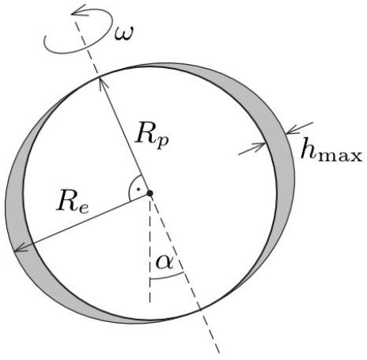
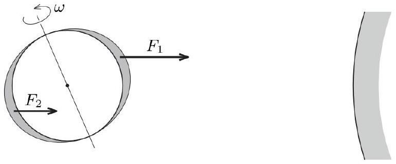
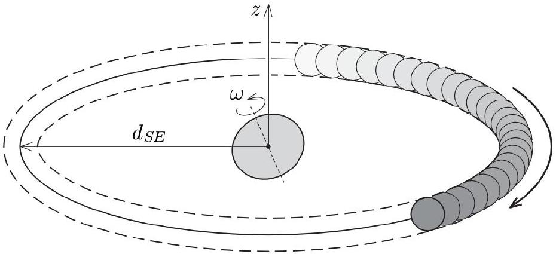
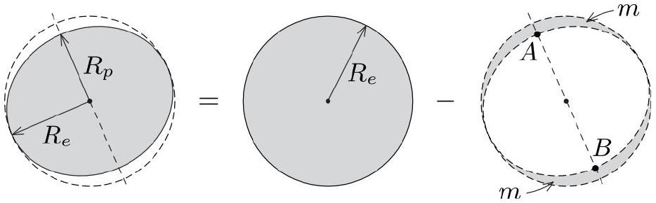

## Precession of the Earth's axis (10.0 points)

## Introduction

It has been known since ancient times that the Earth's axis of rotation precesses. That is, the axis itself rotates around the line perpendicular to the ecliptic plane, i.e., the plane containing the Earth's orbit around the Sun. Ancient Greek astronomer Hipparchus concluded that the annual angular displacement of the axis was approximately 45" (seconds of arc), which would imply that the period of axial precession is around 29000 years. Modern measurements indicate that the period is approximately 25800 years. In this problem, you are asked to investigate this phenomenon using Newtonian mechanics.

You may need the following constants:

- gravitational constant: $G=6.67 \times 10^{-11} \mathrm{Nm}^{2} / \mathrm{kg}^{2}$
- average radius of Earth: $R=6.371 \times 10^{6} \mathrm{~m}$
- mass of the Earth: $M_{E}=5.972 \times 10^{24} \mathrm{~kg}$
- average distance of the Sun from the Earth: $d_{S E}=1.496 \times 10^{11} \mathrm{~m}$
- mass of the Sun: $M_{S}=1.989 \times 10^{30} \mathrm{~kg}$
- average distance of the Moon from the Earth: $d_{M E}=3.844 \times 10^{8} \mathrm{~m}$
- mass of the Moon: $M_{M}=7.348 \times 10^{22} \mathrm{~kg}$
- Earth's axial tilt: $\alpha=23.5^{\circ}$

## Part A. The shape of the Earth (1.0 points)

The Sun and the Moon exert nonzero torques on the Earth because of its non-spherical shape, giving rise to its axial precession. The main reason behind the Earth's non-spherical shape is the centrifugal force caused by the Earth's rotation about its axis. The tectonic plates located on the Earth's surface have deformed over millions of years to minimize stress within them. Therefore, as an approximation, let us model the Earth as a large liquid droplet of uniform density whose shape is determined by centrifugal and gravitational forces. In this model, the Earth's surface is an oblate spheroid (ellipsoid of revolution) characterized by the polar radius $R_{p}$ and the equatorial radius $R_{e}$ (see Figure A.1).

Figure A.1. The ellipsoidal shape of the Earth. The polar and equatorial radii are indicated. $\alpha=23.5^{\circ}$ is the angle between the Earth's axis of rotation and the normal of the ecliptic plane.

The difference between the equatorial and polar radii of the Earth, $h_{\max }=R_{e}-R_{p}$ is much smaller than the average radius $R=\left(R_{e}+R_{p}\right) / 2$. Up to a dimensionless factor, the value of $h_{\text {max }}$ can be expressed in terms of the angular speed of the Earth's rotation $\omega$, its mass $M_{E}$ and average radius $R$ as

$$
h_{\max } \propto G^{-1} \omega^{\beta} M_{E}^{\gamma} R^{\delta},
$$

where $G$ is the gravitational constant, and $\beta, \gamma$ and $\delta$ are constant exponents.
A. 1 Find the values of exponents $\beta, \gamma$ and $\delta$. 0.8 pt
A. 2 Calculate the numerical value of $h_{\text {max }}$ assuming that the dimensionless factor 0.2 pt in the relation given above equals 1 .

Regardless of whether you were able to find $h_{\text {max }}$ in part A.2., use the empirical value $h_{\text {max }}=21 \mathrm{~km}$ in the following questions.

## Part B. The time-averaged gravitational field of the Sun (3.2 points)

To see why the Sun exerts a nonzero torque (with respect to the center of the Earth) on our planet, consider Figure B. 1 below. The difference in distance from the Sun causes the gravitational force $F_{1}$ to be greater than its counterpart $F_{2}$.

Figure B.1. Explanation of the nonzero torques exerted by the Sun (right side of the figure) on the Earth (left side).

The magnitude of this torque acting on the Earth varies continuously during the year. In the position shown in Figure B.1, the torque is maximal, a quarter of a year later, due to symmetry, the torque becomes zero. After half a year, it reaches the maximum again, three-quarters of a year later it is zero once again, and so on. Since the period of axial precession is much larger than one year, this time-dependent torque can be approximated well by its one-year average.

To calculate the average torque exerted by the Sun on the Earth, let us determine first the time average
of the gravitational field generated by the Sun in the vicinity of the Earth. This average can be calculated as the field of a uniformly dense mass ring, a Sun ring, whose mass equals the mass of the Sun $M_{S}$ and whose radius equals the average distance between the Sun and the Earth $d_{S E}$ (see Figure B.2).

Figure B.2. Time averaging is equivalent to uniformly spreading the Sun along the circle of radius $d_{S E}$.

Let our cylindrical coordinate system have the origin at the center of the Earth, and let the $z$ axis be perpendicular to the ecliptic plane (i.e. the plane of the ring). The axis of rotation of the Earth makes an angle of $\alpha=23.5^{\circ}$ with the $z$ axis.

B. 1 Find the direction and magnitude of the gravitational field generated by the Sun ring at a point on the $z$ axis. Write your answer in terms of $M_{S}, d_{S E}$, and the coordinate $z$. Assume that $|z| \ll d_{S E}$.

B. 2 Find the direction and magnitude of the gravitational field generated by the Sun ring at a point in the ecliptic plane whose distance from the origin is $r$. Assume that $r \ll d_{S E}$.

## Part C. The torque acting on the Earth (2.6 points)

In this section, you are asked to determine the torque exerted on the Earth due to the gravitational field obtained in Part B. For simplicity, consider the Earth as a rigid body with homogeneous mass distribution. Let us take into account that the rotational ellipsoid can be imagined as if we removed excess parts from a sphere with the equatorial radius of Earth $R_{e}$ (see Figure C.1).

Figure C.1. The ellipsoidal shape of the Earth can be imagined as if the excess parts were removed from a complete sphere of radius $R_{e}$.

C. 1 Find the mass $m$ of one of the two excess regions indicated in Figure C.1. Express 0.8 pt your answer in terms of $h_{\text {max }}$, the mass of the Earth $M_{E}$, and its polar radius $R_{p}$.

It can be shown that the torque acting on the excess regions is equivalent to the torque acting on two point masses, each with a mass equal to $2 m / 5$, positioned at the endpoints $A$ and $B$ of the polar diameter (see Figure C.1).

C. 2 Given this idea, find the torque $\tau$ exerted by the Sun ring on the Earth. Express your answer in terms of $M_{E}, M_{S}, d_{S E}, R$ (the average radius), $h_{\max }$ and the angle $\alpha$. You can use that $h_{\text {max }} \ll R$.

1.8 pt

Part D. Angular speed of the precession of the Earth's axis (2.0 points)

The Earth's axis of rotation moves very slowly around the $z$ axis in a conical motion. That is, it precesses.

D. 1 Give an expression for the period $T_{1}$ of precession of the Earth's axis. Express your answer in terms of $M_{S}, d_{S E}$, the angular speed $\omega$ of the Earth's rotation, your answer in terms of $M_{S}, d_{S E}$, the angular speed $\omega$ of the Earth's rotation, $h_{\text {max }}, R$ and $\alpha$. $h_{\text {max }}, R$ and $\alpha$.
1.8 pt
D. 2 Calculate the precession period $T_{1}$ in years. 0.2 pt

Part E. The effect of the Moon (1.2 points)

The value obtained in Part D is much larger than the observed value. The reason for this is that so far we have only considered the torque exerted by the Sun, and neglected the effect of the Moon. In the following calculations, assume that the Moon's orbit is in the ecliptic plane, and that the orbit of the Moon around the Earth is a circle of radius $d_{M E}$. Let us denote the mass of the Moon by $M_{M}$ and the period of precession in this modified model by $T_{2}$.

E. 1 By what factor $T_{2} / T_{1}$ does the period of precession of the Earth's axis change if we also take into account the torque exerted by the Moon? Give your answer in terms of $d_{M E}, d_{S E}, M_{S}$ and $M_{M}$. in terms of $d_{M E}, d_{S E}, M_{S}$ and $M_{M}$.
1.0 pt
E. 2 By substituting the data, calculate the period of precession $T_{2}$ in years.
0.2 pt
