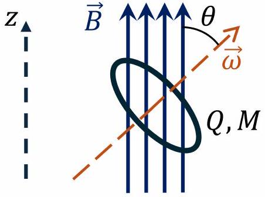
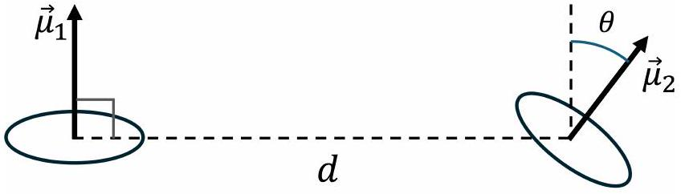
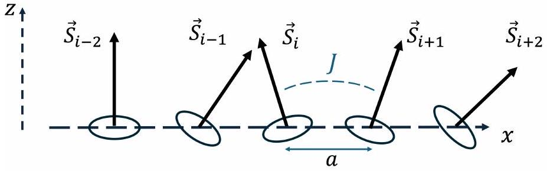
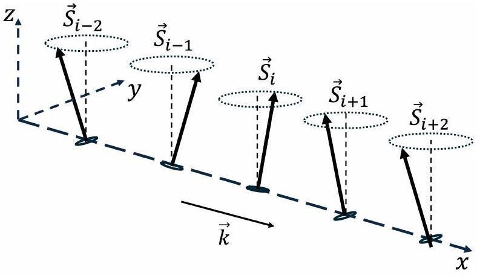
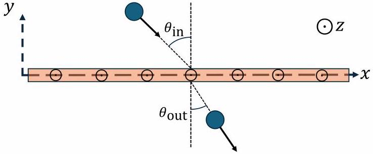
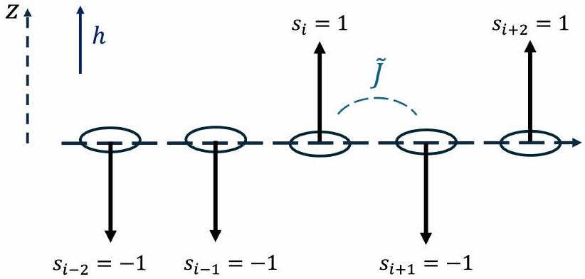

## Waves and Phase Transitions in Spin Systems (10.0 points)

## Introduction

In classical physics, angular momentum arises from the motion of an object around an axis - whether it be a spinning top, a rotating planet, or an orbiting electron in the atom. However, in quantum physics, fundamental particles possess an intrinsic and quantized form of angular momentum called spin. This property plays a crucial role in various physical phenomena, ranging from materials properties, such as magnetism, to modern applications, such as quantum computing.

In this problem we will treat spin classically, which will lead to some qualitatively correct results. You will explore the physics of spin systems through spin-spin interactions, evolution under magnetic fields, and statistical physics to understand the emergence of spin waves and phase transitions in magnets.

Useful information:

$$
\cosh (x) \equiv \frac{e^{x}+e^{-x}}{2}, \sinh (x) \equiv \frac{e^{x}-e^{-x}}{2}, \tanh (x) \equiv \frac{\sinh (x)}{\cosh (x)} \approx x-\frac{1}{3} x^{3} \text { for }|x| \ll 1
$$

The magnetic field due to a magnetic dipole of moment $\vec{\mu}$ at a position $\vec{r}$ away from it is given by ( $\mu_{0}$ is is the vacuum permeability):

$$
\vec{B}=\frac{\mu_{o}}{4 \pi}\left(\frac{3(\vec{\mu} \cdot \vec{r}) \vec{r}}{r^{5}}-\frac{\vec{\mu}}{r^{3}}\right)
$$

## Part A. Precession and interactions of magnetic dipoles (1.2 points)

Consider a ring of radius $R$, total mass $M$, and charge $Q>0$ distributed uniformly. The ring rotates with an angular speed $\omega$ around a perpendicular axis that passes through its center of mass.

A. 1 It is possible to write the ring's magnetic moment $\vec{\mu}$ in terms of its angular momentum $\vec{L}$ as $\vec{\mu}=\gamma \vec{L}$. Find the constant $\gamma$, called the gyromagnetic ratio, of this system in terms of $Q$ and $M$.

0.3 pt The ring is placed in a weak uniform magnetic field $\vec{B}=B \hat{z}$, making an angle $\theta$ with $\vec{\omega}$, see Figure A.1.

Figure A.1.

A. 2 Find the angular frequency $\omega_{L}$ of the angular momentum precession (the socalled Larmor frequency) due to the external magnetic field in terms of $B$ and $\gamma$. Take the positive direction to be counter-clockwise with respect to $+z$.

0.4 pt Now we turn off the external magnetic field and place an identical ring at a horizontal distance $d \gg R$ from the original ring such that the magnetic moment of the new ring $\vec{\mu}_{2}$ makes an angle $\theta$ with $\vec{\mu}_{1}$, see Figure A.2.

Figure A.2.

A. 3 The magnetic interaction energy between the two rings can be written as $U=0.5 \mathrm{pt}$ $J_{0} \vec{L}_{1} \cdot \vec{L}_{2}$, where $J_{0}$ is a constant and $\vec{L}_{i}$ is the angular momentum of the $i$ th ring. Find $J_{0}$ in terms of $\gamma, d$ and fundamental constants.

Part B. Spin Waves (4.5 points)
In what follows we investigate the dynamics of spins. A spin is a particle with intrinsic angular momentum $\vec{S}$, which has an associated magnetic moment $\vec{\mu}$ related to $\vec{S}$ via the gyromagnetic ratio as in Part A.1, $\vec{\mu}=\gamma \vec{S}$.

The magnetic dipoles of two spins interact with each other. However, this interaction is negligible compared to another interaction arising from a quantum mechanical origin, which is not present in classical systems. Interestingly, the energy associated with this quantum interaction has the same form which we found in Part A.3, scaling with $\vec{S}_{1} \cdot \vec{S}_{2}$, albeit with the opposite sign.

Now we will look at a very long chain of spins. The positions of the spins are fixed along the $x$-axis, with a distance $a$ separating them, see Figure B.1. We will approximate the total energy of the system by considering the interactions between nearest neighbors only, so that the energy can be written as

$$
E=-J \sum_{i} \vec{S}_{i} \cdot \vec{S}_{i+1}
$$

where $J>0$ is the interaction strength, and $\vec{S}_{i}$ is the spin angular momentum vector of the $i$ th dipole, with magnitude $S$. The spin vectors are free to rotate in three dimensions. Notice that the sign of the energy is different from the last part. This interaction is purely quantum mechanical.

Figure B.1.

B. 1 The energy terms containing $\vec{S}_{i}$ in the sum above can be viewed as the interaction energy between an effective magnetic field $\vec{B}_{i, \text { eff }}$ and the magnetic moment of $\vec{S}_{i}$. Find $\vec{B}_{i, \text { eff }}$ and express your answer in terms of $J$, the gyromagnetic ratio $\gamma$, and other spins $\vec{S}_{j}$ (specify the indices $j$ in relation to $i$ )
B. 2 Using the concept of effective magnetic field, express the rate of change of the $i$ th spin vector, $d \vec{S}_{i} / d t$, in terms of $J, \vec{S}_{i}$, and other spins $\vec{S}_{j}$ (specify the indices $j$ in relation to $i$ ).

For the rest of Part B, assume that the system is highly magnetized along the $z$ direction, so we can use the approximations $S_{i, z} \approx S$ and $d S_{i, z} / d t \approx 0$ for each spin, see Figure B.2. In this regime, the set of equations describing the spins time evolution is satisfied by a traveling wave solution for $S_{i, x}$ and $S_{i, y}$ characterized by a wave vector $k$ and angular frequency $\omega$.

Figure B.2.

B. 3 Find the relationship between $\omega$ and $k$ (known as the dispersion relation, $\omega(k)$ ) for the spin waves in terms of $J, S$ and $a$. Hint: express the position of the $i$ th spin as $x=a \cdot i$.

The spin wave described above carries energy and momentum. At low energies, the relation between its energy and momentum resembles that of a massive classical particle with an effective mass $m_{\text {eff }}$, a concept known as a quasi-particle.

B. 4 For small $k(k \ll 1 / a)$, find the effective mass $m_{\text {eff }}$ of the spin wave. Express your 0.6 pt answer in terms of $J, S, a$ and fundamental constants.

Spin waves can be experimentally probed using inelastic neutron scattering. Although neutrons have zero net charge, they have a finite spin, allowing them to interact with other spins.

B. 5 Suppose that initially, all the spins in the chain are pointing along the $z$ direction. A neutron with low energy travels on the $x-y$ plane making an incident angle $\theta_{i n}$ with the chain and scatters with an angle $\theta_{\text {out }}$ as shown in Figure B.3. Assuming the neutron excites a single low wave vector spin wave, find the effective mass $m_{\text {eff }}$ of the spin wave, in terms of $\theta_{\text {in }}, \theta_{\text {out }}$ and the neutron mass $m_{n}$. Assume that the chain stays at rest.

Figure B.3.

## Part C. Phase transitions in spin chains (4.3 points)

Next we consider the same chain made of $N$ spins from Part B, except the spin vectors are now restricted to point either up or down along the $z$-axis, so that the spin component along $z$ can be written as $S_{i, z}=$ $s_{i} S$, where $s_{i}= \pm 1$, see Figure C.1. In addition to the nearest neighbor interactions, we could have an external magnetic field pointing along the $z$-axis so that the total energy of the system is given by

$$
E=-\tilde{J} \sum_{i} s_{i} s_{i+1}-h \sum_{i} s_{i} .
$$

We assume $\tilde{J} \geq 0$, and $h$ is a constant dependent on the magnetic field. The spin system is at equilibrium with a heat bath at temperature $T$. Ignore the edges of the chain.

Figure C.1.

C. 1 Assume first that $\tilde{J}=0$, what is the ratio between the probability to find an arbitrary spin aligned to the magnetic field $p_{\uparrow}$ to being anti-aligned to the magnetic field $p_{\downarrow}$ ? Express $p_{\uparrow} / p_{\downarrow}$ in terms of $h, T$ and fundamental constants.
C. 2 Find the average polarization of the system $\bar{s} \equiv \frac{1}{N} \sum_{i} s_{i}$ for $N \gg 1$ in terms of $h, T$ and fundamental constants. If the magnetic field $h$ can range from $-h_{0}$ to $h_{0}$, make a sketch of $\bar{s}$ as a function of $h$ for the cases $h_{o} \gg k_{B} T, h_{o} \approx k_{B} T$ and $h_{o} \ll k_{B} T$.

1.0 pt In the remaining questions, we turn off the magnetic field, so $h=0$, and set $\tilde{J}>0$.

C. 3 What is the energy $E_{g}$ of the ground state (the lowest energy state)? Express your answer in terms of $\tilde{J}$ and $N$. your answer in terms of $\tilde{J}$ and $N$.

0.2 pt

Instead of considering the interactions between each spin and its neighbors, we assume that each spin sees an average polarization $\bar{s}$ from its nearest-neighbors.

C. 4 Approximate the energy of the system as a sum over all spins 0.2 pt
$$
E=-\tilde{J}_{\mathrm{eff}} \sum_{i} s_{i}
$$
and express $\tilde{J}_{\text {eff }}$ in terms of $\tilde{J}$ and $\bar{s}$.
C. 5 Using your result from C.2, find an equation that the average polarization $\bar{s}$ must satisfy. The number of solutions to this equation depends on $T$. Find the critical temperature $T_{c}$ at which the number of solutions changes. Express your answer in terms of $\tilde{J}$ and fundamental constants.
1.2 pt 1.2 pt
C. 6 Find all possible values of $\bar{s}$ when $T<T_{c}$ and $T_{c}-T \ll T_{c}$. Express your answers in terms of $T$ and $T_{c}$. Sketch all possible values of $\bar{s}$ for the temperature $T$ in the range $0 \leq T \leq 2 T_{c}$.
C. 7 What magnetic phase of matter does $T>T_{c}$ correspond to? How about when $T<T_{c}$ ? Choose between paramagnetic or ferromagnetic.
