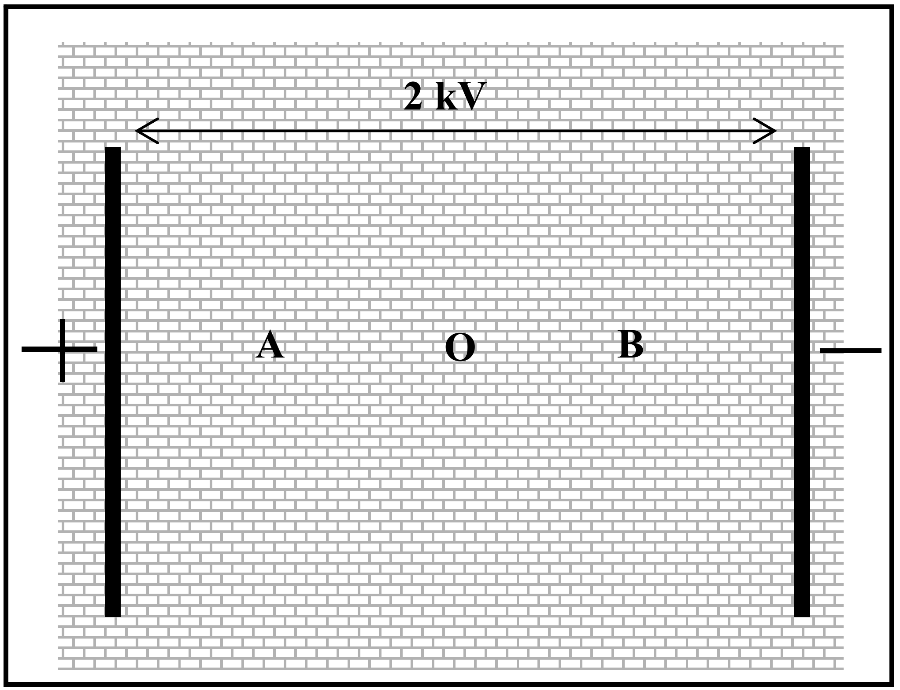

Some factories use dust precipitators in their chimneys to remove airborne pollutants. In one such precipitator a pair of plates is placed in the square chimney with a potential difference of 2 kV between them as shown.

Consider a particle with a small negative charge at rest at one of the three positions, A, O and B, marked on the diagram. The particle will:

(A) have greatest potential energy at A.
(B) have greatest potential energy at B.
(C) have greatest potential energy at O
(D) have the same potential energy at A and B
(E) have the same potential energy at A, B and O.
