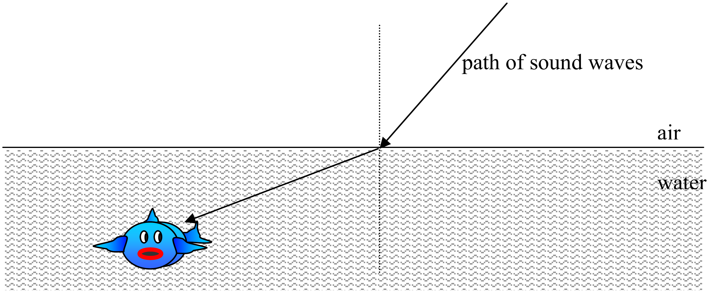
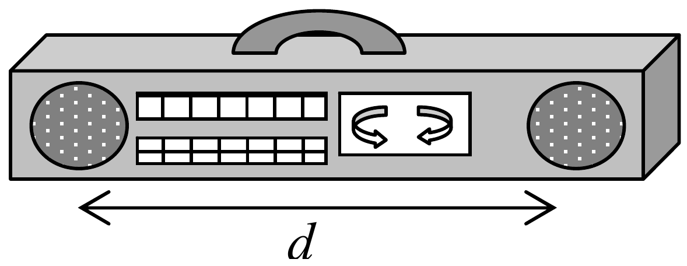

Graham has gone fishing, and is sitting quietly waiting for a fish to bite, but nothing is happening. So Graham turns on the radio to try to find some music to encourage the fish. The first piece of music Graham finds is a bass guitar solo, which has a very low frequency. Graham doesn't like the sound of that, so he finds another station which is playing a selection of soprano duets, which are much higher frequency.

a. Which music will travel from the radio to the fish faster, and why? (1 mark)

The path of the sound bends when it reaches the surface of the water, as shown.

b. Describe and explain what happens to the frequency, the wavelength and the speed of the sound when it moves from the air to the water. (2 marks)

Graham's radio has 2 speakers, separated by a distance $d$ as shown.

c. Draw a diagram showing where there will be constructive interference between the sound from the two speakers when the first station (the one with the bass guitar solo) is playing. Make sure you label your diagram carefully. Consider only the interference pattern in air. (3 marks)
d. How does the interference pattern change when Graham changes to the second station (the one playing soprano duets)? (1 mark)
e. For a given wavelength of sound from the speakers, what must be the minimum separation, $d$, in terms of the wavelength $\lambda$, for complete destructive interference to occur? Why? (1 mark)

Graham leans over the water to try to see some fish, and accidentally drops his radio in. The radio keeps playing under the water.

f. How would the interference pattern from part (c) change with the radio under the water? Why? (2 marks)
