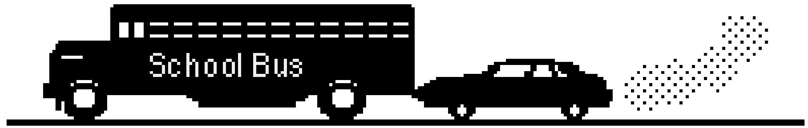

A school bus breaks down and receives a push back to the garage from a small compact car as shown in the diagram.

While the car, still pushing the bus, is speeding up to get up to cruising speed:

(A) the amount of force with which the car pushes against the bus is equal to that with which the bus pushes back against the car.
(B) the amount of force with which the car pushes against the bus is smaller than that with which the bus pushes back against the car.
(C) the amount of force with which the car pushes against the bus is greater than that with which the bus pushes back against the car.
(D) the car's engine is running so the car pushes against the bus, but the bus's engine is not running so the bus can't push back against the car. The bus is pushed forward simply because it is in the way of the car.
(E) neither the car nor the bus exert any force on the other. The bus is pushed forward simply because it is in the way of the car.
