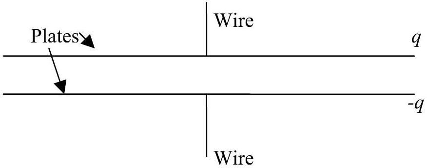

Question 14.
A capacitor is a component used in many electric circuits that stores charge using an electric field. They are used, for example, in photocopiers that can do clever things like stapling and duplexing, but only if you are clever enough to know which buttons to push. The potential difference, $V$, across a capacitor is $q / C$ where $q$ is the charge stored in the capacitor and $C$ is the capacitance, a property that depends on the individual capacitor.
A type of capacitor, called a parallel plate capacitor, is shown in the diagram below. It consists of two parallel conducting plates on which charge can be stored. These are attached to wires that connect the capacitor to the rest of the circuit. The plates are very large compared to the distance between them, so they can be considered infinite to a good approximation. You may ignore what happens at the edges of the plates in this question.

a. Draw an electric field diagram showing the field due to the positive charge on the top plate. (1.5 marks)
b. Draw an electric field diagram showing the field due to the negative charge on the bottom plate. (1.5 marks)
c. Using the superposition of the two fields sketched in parts a and b, draw an electric field diagram showing the total field in and around the parallel plate capacitor. (2 marks)

A capacitor with capacitance $C$ and charge $q$ on the positive plate is connected to a circuit of resistance $R$ such that current is allowed to flow, thus reducing the charge on each plate.

d. Find the current when the circuit is first connected. (2 marks)
e. Assuming the current is constant, how long before there is no charge left on the plates? (2 marks)
f. Given the physical situation, will the current actually be constant? Why or why not? (1 mark)
