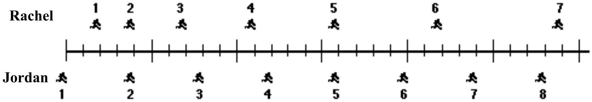

Question 6.
The positions of two joggers, Rachel and Jordan, are shown below. The joggers are shown at successive 0.20-second time intervals, and they are moving towards the right.

Do Rachel and Jordan ever have the same speed?

A) No.
B) Yes, at instant 2 .
C) Yes, at instant 5 .
D) Yes, at instants 2 and 5
E) Yes, at some time during the interval 3 to 4 .
