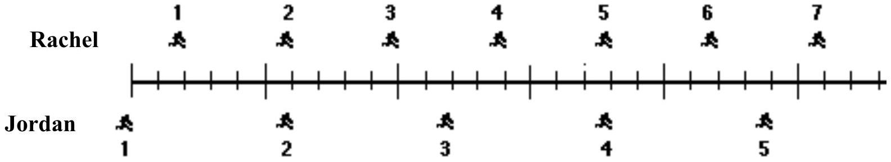

## Question 7.

The positions of two joggers, Rachel and Jordan, are represented below at successive equal time intervals. The joggers are moving towards the right.

The accelerations of the joggers are related as follows:

A) The acceleration of Rachel is greater than the acceleration of Jordan.
B) The acceleration of Rachel equals the acceleration of Jordan. Both accelerations are greater than zero.
C) The acceleration of Jordan is greater than the acceleration of Rachel.
D) The acceleration of Rachel equals the acceleration of Jordan. Both accelerations are zero.
E) Not enough information is given to answer the question.
