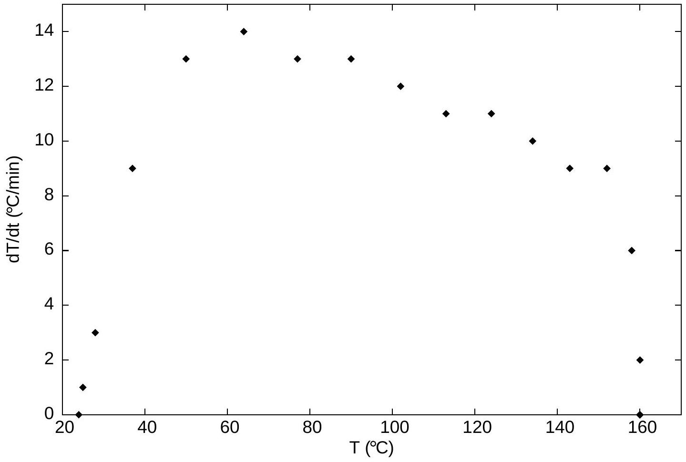
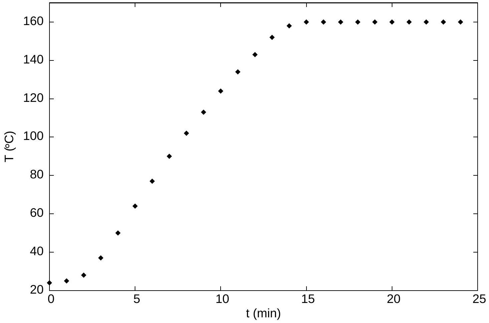

Question 14 Suggested time: 30 minutes Joseph wants to measure the latent heat of vaporization of substance X, which is the amount of energy required per unit mass to turn substance X from a liquid to a gas at its boiling point. He begins by putting approximately 200 mL of liquid X in a beaker on a combined hotplate and scale. He inserts a thermometer, turns on the hotplate at $t=0 \mathrm{~min}$ and records the liquid's temperature as well as the combined mass of the liquid, beaker and thermometer every minute. After 24 minutes, there is no more liquid in the beaker. Joseph's results are shown in the table below.

| Time (min) | 0 | 1 | 2 | 3 | 4 | 5 | 6 | 7 | 8 |
| :--- | :--- | :--- | :--- | :--- | :--- | :--- | :--- | :--- | :--- |
| Temperature $\left({ }^{\circ} \mathrm{C}\right)$ | 24 | 25 | 28 | 37 | 50 | 64 | 77 | 90 | 102 |
| Mass (g) | 310 | 310 | 310 | 310 | 310 | 310 | 310 | 310 | 310 |

| Time (min) | 9 | 10 | 11 | 12 | 13 | 14 | 15 | 16 | 17 |
| :--- | :--- | :--- | :--- | :--- | :--- | :--- | :--- | :--- | :--- |
| Temperature ( ${ }^{\circ} \mathrm{C}$ ) | 113 | 124 | 134 | 143 | 152 | 158 | 160 | 160 | 159 |
| Mass (g) | 310 | 310 | 307 | 307 | 305 | 302 | 288 | 264 | 241 |

| Time (min) | 18 | 19 | 20 | 21 | 22 | 23 | 24 |
| :--- | :--- | :--- | :--- | :--- | :--- | :--- | :--- |
| Temperature $\left({ }^{\circ} \mathrm{C}\right)$ | 160 | 160 | 160 | 161 | 160 | 161 | - |
| Mass (g) | 214 | 190 | 165 | 138 | 110 | 79 | 69 |

Joseph notices that the temperature increases at a different rate at different temperatures. To show this variation, he plots the difference between two successive temperature measurements divided by the time between them, i.e. the rate of change of the temperature, versus the temperature at the first of these measurement times. His graph (Graph 1) is shown over the page, along with a graph (Graph 2) of the temperature of the liquid as a function of time.

(a) Explain the shape of Graph 1, by giving reasons for the initial increase, the gradual decline over a wide temperature range and the sharp decrease near 160 °C. (Hint: Graph 2 might help you interpret the regions of Graph 1.)
(b) By drawing an appropriate graph, find the average rate at which liquid X boils, in $\mathrm{kg} \min ^{-1}$.
(c) In a previous experiment, Joseph measured the specific heat capacity of liquid X to be $2.19 \mathrm{~kJ} \mathrm{~kg}^{-1} \mathrm{~K}^{-1}$. This means that it takes 2.19 kJ of energy to raise the temperature of 1 kg of liquid X by 1 K (which is equal to 1 °C).
    (i) Pick the point on Graph 1 that gives the most information about the rate at which heat is transferred to the liquid at its boiling point. Explain how you chose this point and why it is the most appropriate.
    (ii) Using the information above and your answer to part (i), find the power being transferred to liquid X as it boils, in $\mathrm{kJ} \mathrm{min}^{-1}$.
(d) Using your answers to the previous parts, find the latent heat of vaporization of substance X , in $\mathrm{kJ} \mathrm{kg}^{-1}$.

Graph 1: Rate of change of temperature at different temperatures

Graph 2: Temperature of the liquid as it is heated

