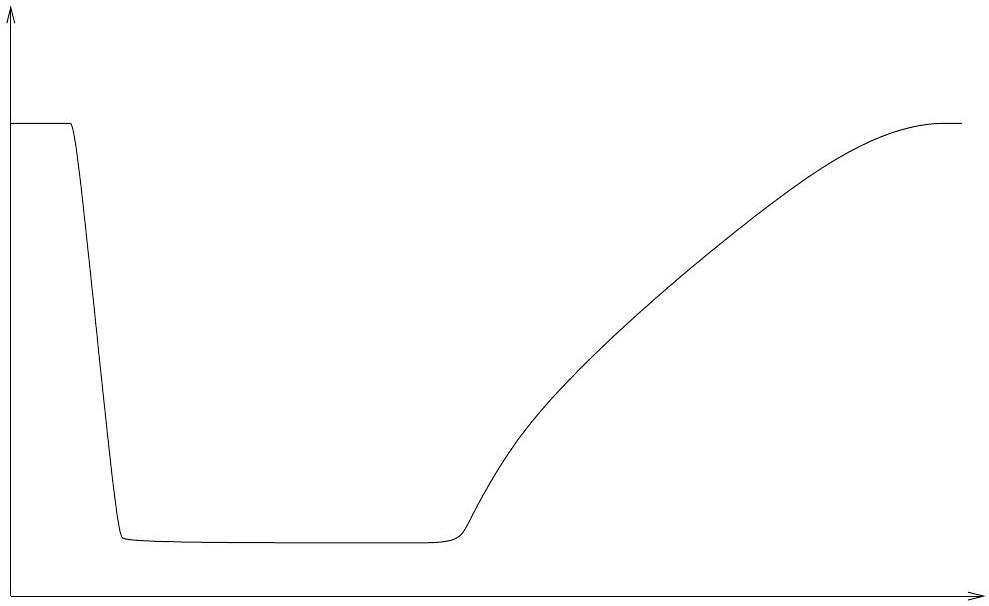

Question 8
A teacher collects science projects from a class and finds that one page has fallen out. All that it contains is this plot without any axis labels or scales.

Since the plot was unlabeled the teacher has to ask the class if anyone thinks it is theirs to work out whose assignment it came from. Even though they won't get many marks for an unlabeled plot five students claim it as their work, making the following statements. To whom does it belong?

(A) I plotted the number of birds on the island versus time over many years. The number was constant for the first few years but then decreased greatly over a single year because of a disease. After that the number increased more slowly until eventually it was greater than it had originally been.
(B) I plotted the height of a swing above the ground against horizontal distance.
(C) I plotted the volume of water in a jug as I poured out a glass of water, then stopped pouring, then poured another and so on until I had poured four glasses and then filled up the jug from the tap so it had enough water for another four glasses.
(D) I added different masses of compound A to some of compound B so the total initial mass was fixed and measured how much of A was left after they reacted. I plotted the amount of A left against the amount of A I added. When I only added a little A there wasn't much left at the end, but as I added more the amount left first increased and then decreased before increasing again.
(E) I plotted the temperature of my water and ice mixture versus time. First I had room temperature water, then I added ice and stirred until the mixture reached 0 °C. It stayed at $0^{\circ} \mathrm{C}$ until the ice had all melted and then slowly increased back up to room temperature.
