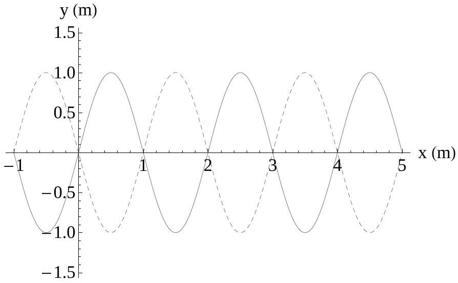
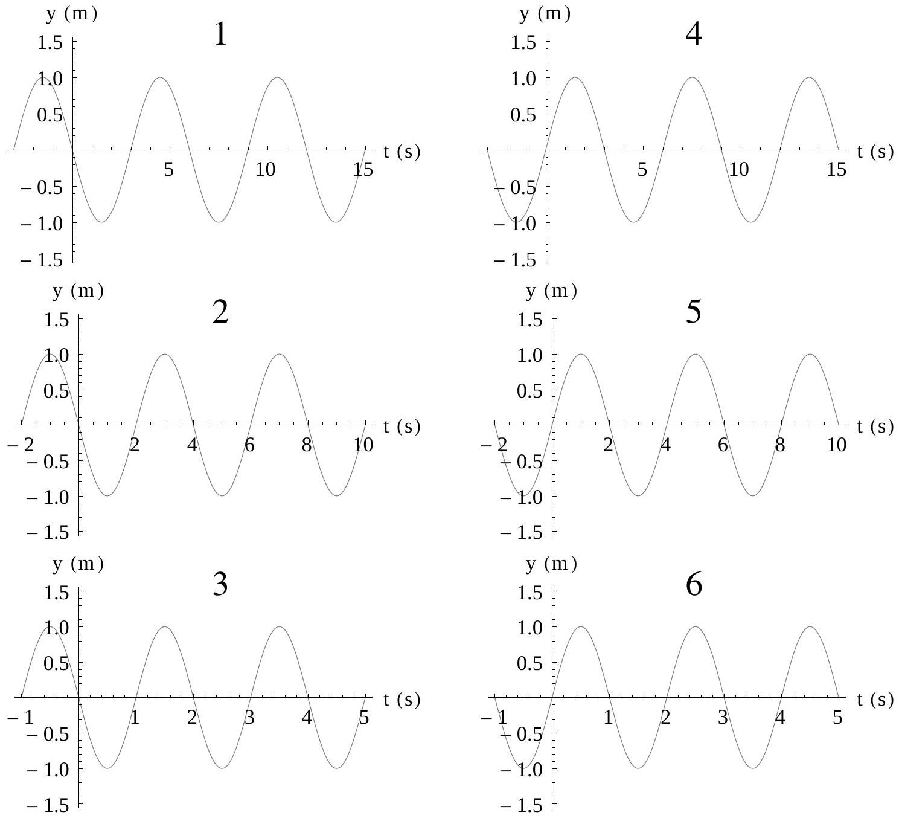

Question 10

The figure to the right shows a travelling wave moving in the positive $x$-direction. At time $t=0 \mathrm{~s}$, the wave plotted as a function of position has the shape shown by the solid curve, and at $t=3 \mathrm{~s}$, the shape shown by the dashed curve.

The following six panels show plots as a function of time, at the position $x=0 \mathrm{~m}$.

Which of the panels represent possible shapes of the travelling wave?
(A) 4 \& 6
(B) 1 \& 3
(C) 1, 2 \& 3
(D) 4, 5 \& 6
(E) 1 \& 4

# Section B

Written Answer Questions
Attempt ALL questions in this part.

You may be able to do later parts of a question even if you cannot do earlier parts.
Remember that if you don't try a question, you can't get any marks for it - so have a go at everything!
Suggested times to spend on each question are given. Don't be discouraged if you take longer than this - if you complete it in the time suggested consider that you've done very well.
