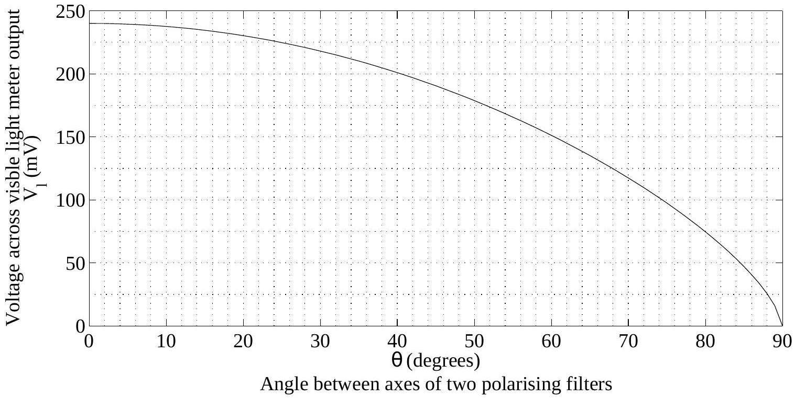

Question 12 Suggested time: 30 minutes
Charlotte and Ben have lots of old 100 W incandescent light bulbs that they don't like to see going to waste, but they also don't like to waste electricity so they want to find out how to run them most efficiently. They decide to compare the efficiencies of running a bulb at different input powers by comparing what they call the output ratio. Their definition of the output ratio is the ratio of the intensity of visible light at some fixed distance from the bulb to the electric power dissipated in the bulb.
To measure the visible light intensity they borrow a visible light meter a friend found in a collection of old photographic gear. This meter produces a voltage between its two output terminals that depends on the intensity of visible light incident on the detector. Its instruction booklet is long lost but a previous owner left brief hand-written instructions and the following graph.

After doing some research Charlotte finds that the intensity of light passing through two polarising filters is given by $I=I_{0} \cos ^{2} \theta$, where $I_{0}$ is the intensity that passes through the filters when they are aligned and $\theta$ is the angle between the polarisation axes of the two filters. To make best use of the graph they decide to set up the visible light meter at a distance from the bulb such that at maximum power the light meter voltage reading $V_{1}$ is just below the maximum given in the graph.
As the bulbs run on dangerous mains voltages, Ben asks his grandfather, a qualified electrician, for some help with adjusting the power of the bulb. Ben's grandfather provides them with a large variable transformer that plugs into the wall at one end and has a mains socket on the other, so that they can use a regular lamp to hold the bulb. To measure the power, he finds a plug-in power meter that can be connected between a mains plug and a mains socket and measures the power consumed by whatever is plugged into it.
Ben connects the power meter to the wall, plugs in the transformer and then plugs the lamp into the transformer output. Ben's grandfather checks it for electrical safety and then turns on the wall switch.

They choose a single bulb to use for all of their measurements. They don't have to worry about damaging it as the maximum output voltage of the transformer is the mains voltage, on which the bulb is designed to run.
Unfortunately, it is a sunny day and the voltage across the light meter is non-zero even when the bulb is off. Ben thinks that if he measures the voltage with the bulb off, he will be able to subtract this from his later measurements to find the voltage he would read if there were no sun. He does this and records 73 mV. He then takes the measurements, with the bulb on, that appear in the table below. Charlotte thinks that it would be better to close the blinds and make the room as dark as possible. She does this and takes her measurements. The following tables contain Ben's and Charlotte's data.

Ben
| $P_{\text {bulb }}(\mathrm{W})$ | $V_{1}(\mathrm{mV})$ |
| :--- | :--- |
| 9 | 87 |
| 20 | 102 |
| 42 | 139 |
| 62 | 166 |
| 79 | 198 |
| 100 | 248 |

Charlotte
| $P_{\text {bulb }}(\mathrm{W})$ | $V_{1}(\mathrm{mV})$ |
| :--- | :--- |
| 10 | 55 |
| 21 | 88 |
| 40 | 124 |
| 61 | 163 |
| 78 | 192 |
| 100 | 235 |

(a) Whose method would you use and why?
(b) Using the data acquired by the person with the better method, calculate the output ratio for each data point. The intensities you use to calculate the output ratio should be in units of $I_{0}$, i.e. express them as some number times $I_{0}$, and then just treat the $I_{0}$ as a unit.
(c) Given the values of the output ratio you calculated, at what power should they run their bulbs?
(d) Briefly suggest things that Charlotte and Ben could have done with the equipment they had to improve their results.
