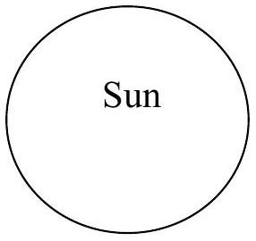
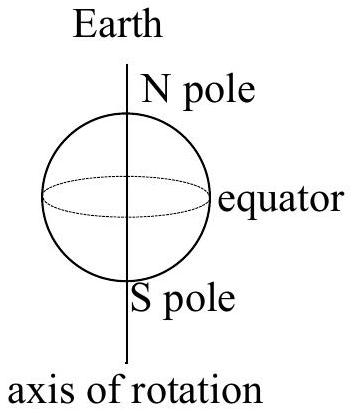

Question 13 Suggested time: 20 minutes

(a) The Earth's climate varies considerably between the hot equator and the cold poles. Explain this fact with reference to the diagram below of the Earth and Sun at an equinox.

(b) The Earth is surrounded by an atmosphere that is thin compared to its radius but still many kilometres thick, so air can flow up or down as well as across the surface of the Earth. The air high in the atmosphere at the poles is cool but warmer than than the air just above the surface which is cooled by the cold land and sea below. Similarly at the equator the air high in the atmosphere is warm but cooler than the air just above the surface which is heated by the hot land and sea below. Sketch a diagram of the large scale flows of air in the atmosphere that result. Explain your answer.
(c) So far the effect of the rotation of the Earth has been neglected. It can be included by considering the Coriolis force which appears to act on all bodies in rotating frames of reference such as the Earth. The magnitude of the component of the Coriolis force directed along the surface of the Earth is $F=m \Omega v \sin \theta$ where $m$ is the mass of the body experiencing the force, $\Omega$ is the Earth's rotational velocity, $v$ is the speed of the body and $\theta$ is the latitude (0° at the equator and 90° at the poles) of the body. The Coriolis force is always directed perpendicular to the velocity of the body and is directed towards the east for bodies heading towards the poles in both hemispheres. Since we live on the surface of the Earth the winds we feel are the large scale flows of air in the lowest level of the atmosphere, and only those across the surface of the Earth. Given your answer to part 13b, and including the Coriolis force, sketch the large scale winds across the Earth's surface. Explain your answer.
(d) Sailors describe a region right near the equator, called the doldrums, in which there are often long periods with no wind. Is this consistent with the above model? Explain.
(e) Just to the north and south of the doldrums are regions with very reliable winds called the trade winds. Using the model, predict the directions of the trade winds in the northern and southern hemispheres.
