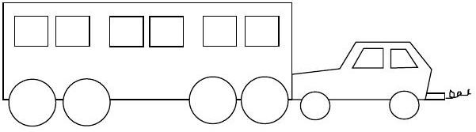

Question 7

A large train has ended up on the road and a small car is pushing it back to the tracks. After the small car and the large train being pushed have reached a constant cruising speed,

(A) the amount of force with which the small car pushes against the large train is equal to the amount of force with which the large train pushes back against the small car.
(B) the amount of force with which the small car pushes against the large train is smaller than the amount of force with which the large train pushes back against the small car.
(C) the amount of force with which the small car pushes against the large train is greater than the amount of force with which the large train pushes back against the small car.
(D) the small car's engine is running so the small car pushes against the large train, but the large train's engine is not running so it can't push back against the small car.
(E) neither the small car nor the large train exert any force on the other. The large train is pushed forward simply because it is in the way of the small car.
