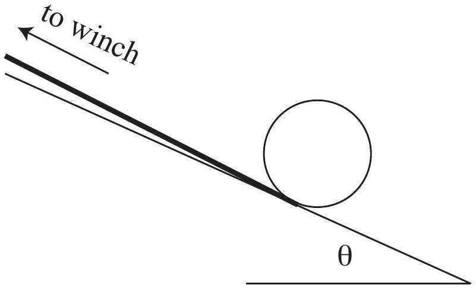

Question 12
An empty tin can has radius $r=50 \pm 1 \mathrm{~mm}$, height $h=150 \pm 1 \mathrm{~mm}$ and wall, base and lid of uniform thickness which lies within the range $s=0.10 \pm 0.01 \mathrm{~mm}$. Wound around its circumference is a string, which is attached to a winch. The can is placed on a slope at angle $\theta$ to the horizontal so that the string runs up the slope as in figure 1. The winch has radius $r_{w}$ and can be set to turn a fixed number of turns with a constant torque. Both the number of turns and torque can be adjusted. The torque applied by the winch is equal to the winch radius times the force applied to the winching string.

The can is initially held stationary and is then released, with the winch set to wind $n_{t}$ turns of rope. The time taken $t$ is measured for a range of different torques, $\tau$. The force applied by the winching rope is related to the mass $m$ of the can and the acceleration $a$ of the centre of the can by

$$
F-m g \sin \theta=m a
$$

and also obeys the relationship

$$
r^{2} F=I\left(a+a_{r}\right),
$$

where $a_{r}$ is the acceleration of the rope and $I$ is a constant.

Figure 1: Tin can on a slope attached to a winch

a) Given that the density of tin is $\rho_{\mathrm{Sn}}=7.30 \times 10^{3} \mathrm{~kg} \mathrm{~m}^{-3}$, find the mass of the tin can and its uncertainty. Also comment on whether you could easily determine the mass more accurately using common household devices.
Note that when two values are added or subtracted the uncertainty in the final value is the sum of the uncertainties of the two values. However, when two values are multiplied or divided the fractional uncertainty (the uncertainty divided by the value) of the product or quotient is the sum of the fractional uncertainties of the two values.
b) Find combinations of the quantities $\tau$ and $t$ which may be plotted so that the data fall on a straight line and the unknowns $I$ and $\theta$ may be determined from the slope and y-intercept of a line of best fit.
Hint: a graph of $y$ vs. $x$ is linear if $y$ is the sum of a term proportional to $x$ and a constant.
c) Find $I$ and $\theta$ in terms of the slope and y-intercept of the graph you suggested plotting in the previous part.
