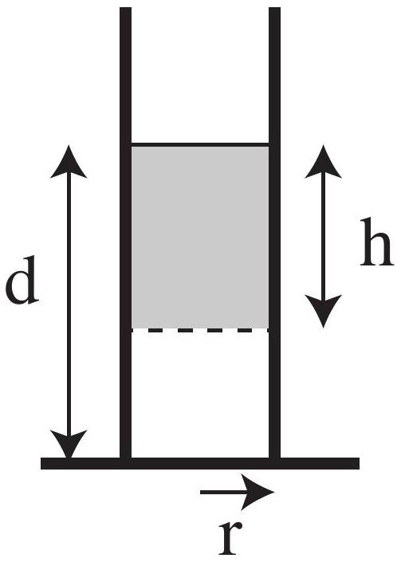
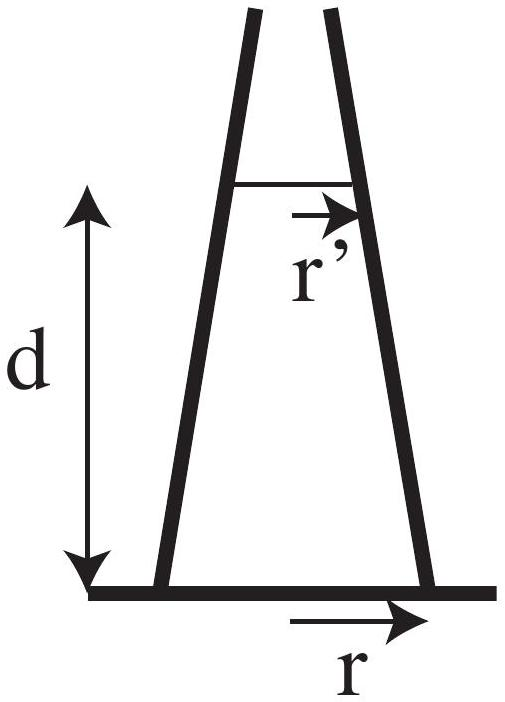

Question 13
Pressure is the force per unit area exerted uniformly in all directions by a small volume of fluid on its surrounds.

Figure 2: A cylinder containing water

Figure 3: A conical flask containing water

a) Draw a free body diagram showing the forces on the shaded volume of water in figure 2 and hence find the pressure at a depth $h$ below the surface of the water.
b) (i) What are the forces exerted by each of the flat bases of the two vessels shown above on the water in that vessel? The circular bases of the two vessels have equal radii, and both vessels are filled to the same depth.
    (ii) For each case, is this force equal to the total force exerted by the vessel on the water it contains? Explain whether or not you expect the force exerted by the base to equal to the total force in each case, giving physical reasoning for your answer. Also explain any differences between the two cases.

Diverting Data:
Air pressure at sea level $p_{0}=1.02 \times 10^{5} \mathrm{~Pa}$
Density of air at sea level $\rho_{a}=1.2 \mathrm{kgm}^{-3}$
Density of water $\rho_{w}=1.0 \times 10^{3} \mathrm{kgm}^{-3}$
Acceleration due to gravity at sea level $g=9.8 \mathrm{~ms}^{-1}$
