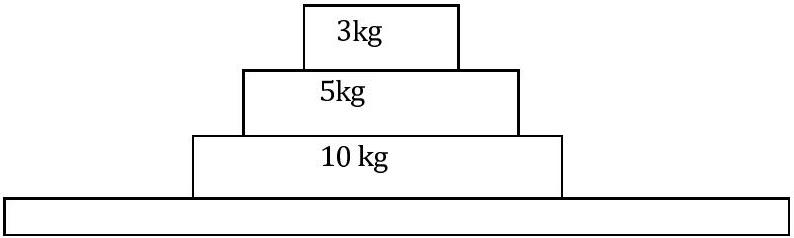

Question 8
The shark, with a sucker-fish still attached, spots a possible meal and accelerates suddenly towards it. Under these conditions:

a. there is zero nett force on both the shark and the sucker-fish.
b. the nett force on the shark is greater than the nett force on the sucker-fish because the shark has a larger mass.
c. the swimming shark experiences a nett force but the sucker-fish does not because it is holding on.
d. the nett force on the shark is always the same as that on the sucker-fish because they always have the same speed.
e. the drag from the sucker-fish on the shark means that the nett force on the shark is less than on the sucker-fish.

The blocks shown in the figure below are on a table. What is the nett force acting on the 5 kg block when the stack is:

