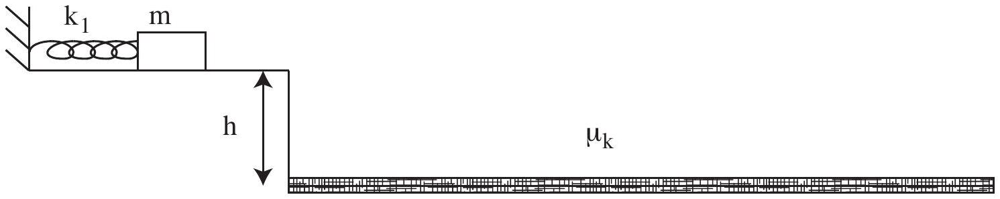
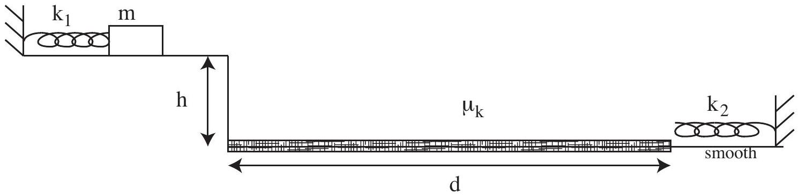

Question 12
Suggested Time: 30 min
A block of mass $m$ sits against an unextended spring with spring constant $k_{1}$ on a frictionless surface as shown below. A short distance beyond the mass, there is a vertical cliff of height $h$ that drops off to a rough surface with kinetic friction coefficient $\mu_{k}$.

When compressed or extended, the spring exerts a restoring force

$$
F=-k x,
$$

where $k$ is the spring constant and $x$ is the change in length of the spring. The elastic potential energy stored in the spring during this deformation is given by

$$
U=\frac{1}{2} k x^{2} .
$$

The block is pushed against the spring with displacement $x_{1}$ and then released at time $t=0$.

a) What is the velocity of the block immediately after it loses contact with the spring?
b) After reaching the cliff, the block continues to move through the air until it hits the rough surface below. Once it hits the rough surface, a frictional force acts against the horizontal motion of the block.
On the axes given on p. 4 of the Answer Booklet sketch as functions of time, starting when the block is released and ending when the block is at rest again, the
    (i) kinetic energy,
    (ii) gravitational potential energy, and
    (iii) elastic potential energy.

Use the same axes for all three sketches and label each line clearly.

c) A section of the rough ground a distance $d$ from the cliff is made smooth (frictionless) and a second spring, with constant $k_{2}=2 k_{1}$ is placed on it, as shown below.

    (i) On the axes on p. 5 of the Answer Booklet, sketch the maximum compression of the new spring as a function of the maximum compression of the launching spring. Only consider compressions causing the block to land before the second spring.
    (ii) Find an expression for the largest possible maximum compression of the second spring that you marked on your sketch for part (c)(i).
