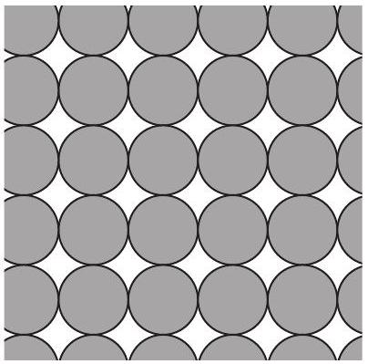
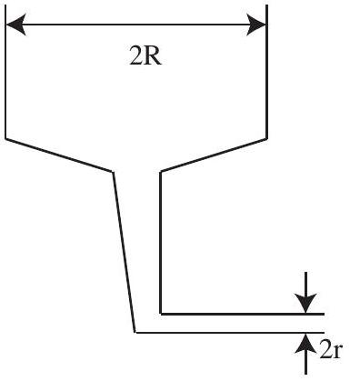

Question 13
Suggested Time: 18 min
A lolly factory produces shiny delicious spherical chocolates of radius $r$. It packs the chocolates in layers arranged as shown in Figure 1; each layer is stacked directly on top of the one below.

Figure 1: Neatly packed chocolates.

The packing fraction is defined to be the ratio of the volume of some objects divided by the total volume of space which they occupy.

When arranged randomly the chocolates have a packing fraction of 0.64.

a) Find the packing fraction of the chocolates when they are neatly packed in stacked layers with the arrangement shown in Figure 1.
b) Do the same number of chocolates occupy more space when neatly packed as in Figure 1 or when randomly arranged?

To sell the chocolates the factory packs them into bags which are filled through funnels like that shown in Figure 2. As the bags are filled chocolates are added into the top of the funnel at an average rate of 5 chocolates per second and the level in of chocolates in the top of the funnel is steady.

c) (i) How many bags of 30 can be filled per minute through each funnel?
    (ii) How fast do the chocolates shoot out of the funnel into a bag?
    (iii) What is the average downwards speed of the chocolates in the top of the funnel?

Figure 2: Funnel for filling bags.
