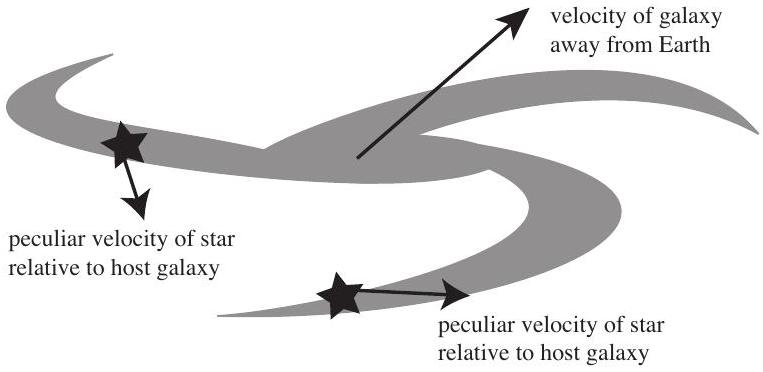
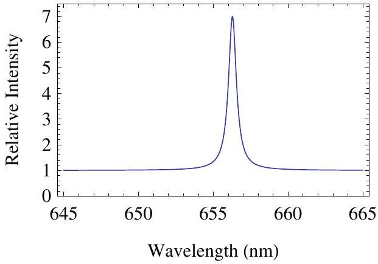

## Question 14

Suggested Time: 18 min
Astrophysical systems such as galaxies (which contain large numbers of stars) are generally very far from the Earth and solar system, and are moving away from us with some relative velocity $v$. Individual stars can be moving with respect to the galaxy; the velocity of this motion is known as the peculiar velocity. Figure 3 shows a galaxy which is moving away from us as a whole; stars in this galaxy orbit its centre and have peculiar velocities.

Figure 3: Peculiar velocities of a stars in a galaxy.

The energy from the peculiar motion within a galaxy, rather than its overall movement, is interesting. One way to measure the typical peculiar speed of a star, is to look at the spread in velocities. The standard deviation of the peculiar speeds is called the velocity dispersion, $\sigma$, and it becomes an estimate of the typical peculiar speed of a star.

a) The virial theorem applied to an astrophysical system with very large mass $M$ gives that
$$
v^{2}=\frac{G M}{R},
$$
where $v$ is the average speed of an object orbiting at a radius $R$, and $G$ is the universal gravitational constant. Use the virial theorem to estimate the mass $M$ of a galaxy, where a population of stars at radius $R$ from the centre of the galaxy are observed to have velocity dispersion $\sigma$.

When the source of a wave is approaching or retreating from an observer the wavelength changes. The size of this change is proportional to the speed of the source. This is known as the Doppler effect and is useful in astrophysics because elements emit light within narrow wavelength regions meaning peaks are observed in objects' spectra.

Figure 4: Hydrogen alpha emission spectrum.

b) (i) Explain, with sketches, how the Doppler effect causes broadening of the Hydrogen alpha emission lines in the fast-rotating broad-line regions of galaxies. On the diagram on p. 8 of the Answer Booklet, draw what the Hydrogen alpha peak in Figure 4 would look like if its source is gas in the broad-line region of a galaxy.
    (ii) Hence, explain how observations of spectra can be used to measure the velocity dispersion of stars in a galaxy.

Most galaxies have supermassive black holes at their centres, which can be a billion times more massive than the Sun. Sometimes a violent event in the supermassive black hole causes changes throughout the fast-rotating region around the centre, called the broad-line region; these changes appear some time later.

A technique called reverberation mapping uses the time it takes light to travel across the broad-line region to estimate its radius. The light travel time $\tau$ is the measured time between observing changes in the front and in the back of the region. The speed of light is $c$ and the velocity dispersion of the broad-line region is $\sigma_{\text {BLR }}$.

c) (i) Find an expression for the radius $R_{\mathrm{BLR}}$ of the broad-line region.
    (ii) Estimate the mass $M_{\mathrm{BH}}$ of a supermassive black hole using reverberation mapping and the virial theorem. You may assume that supermassive black holes are so massive that they account for most of the mass in the centre of a galaxy.

## Integrity of Competition

If there is evidence of collusion or other academic dishonesty, students will be disqualified. Markers' decisions are final.
