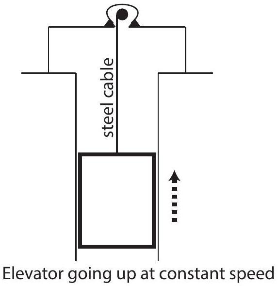

Question 5
An elevator is being lifted up an elevator shaft at a constant speed by a steel cable as shown in the figure below. All frictional effects are negligible. In this situation, the forces on the elevator are such that:

a. the upwards force of the cable is greater than the downward force of gravity.
b. the upward force of the cable is equal to the downward force of gravity.
c. the upward force of the cable is smaller than the downward force of gravity.
d. the upward force of the cable is greater than the sum of the downward force of gravity and a downward force due to air.
e. none of the above. (The elevator goes up because the cable is being shortened, not because an upwards force is exerted on the elevator by the cable.)

Page 3 of 12
2014 Physics Australian Science Olympiads Examination
