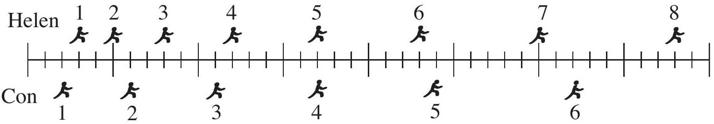

Question 9
The positions of two runners, Helen and Con, are shown below. The runners are shown at successive 0.20 second intervals, and they are moving towards the right.

Which of the following statements best describes how the accelerations of the runners are related.

a. The acceleration of Con in greater than the acceleration of Helen.
b. The acceleration of Helen is greater than the acceleration of Con.
c. The accelerations of Helen and Con are equal. Both accelerations are equal to zero.
d. The accelerations of Helen and Con are equal. Both accelerations are greater than zero.
e. Not enough information is given to answer the question.
